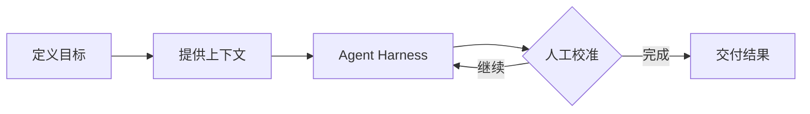

# 大飞随笔

一个使用 Astro 构建的个人 AI 研究花园，用来记录短笔记、长篇思考和每周信号。

## 本地运行

```sh
npm install
npm run dev
```

开发地址默认为 `http://localhost:4321`。

生产构建：

```sh
npm run build
```

构建结果位于 `dist/`。

首次配置外部服务时，复制环境变量模板：

```sh
cp .env.example .env
```

## 添加一篇内容

在 `src/content/writing/` 新建 Markdown 文件，例如 `my-new-note.md`：

```md
---
title: 一篇新笔记
description: 用一句话解释这篇内容。
publishedAt: 2026-08-31
type: note
status: seed
topics:
  - Agent Harness
featured: false
readingTime: 3 min
---

从这里开始写正文。
```

### 内容类型

- `note`：短笔记
- `essay`：长篇文章
- `weekly`：周报或信号整理

### 内容状态

- `seed`：刚形成的想法
- `growing`：仍在持续修订
- `evergreen`：相对稳定的长期内容
- `archived`：已过时但保留的记录

## 目录

```text
src/
├── components/       内容卡片
├── content/writing/  Markdown 内容
├── layouts/          页面公共布局与元数据
├── pages/            路由页面
└── styles/           全局视觉样式
```

部署前设置 `SITE_URL` 环境变量为正式域名，使 canonical 与社交分享图片使用正确的绝对地址：

```sh
SITE_URL=https://ainoteatlas.com npm run build
```

## Markdown 能力

文章支持标题、引用、表格、任务列表、删除线、脚注、图片、折叠内容和带深浅主题的代码高亮。

图片放在 `public/images/`，文章中使用站点绝对路径：

```md

```

Mermaid 图表使用标准代码围栏，无需引入脚本：

````md

````

支持 Mermaid 的流程图、时序图、状态图、类图、ER 图、甘特图和思维导图等语法。图表会自动适配站点深浅主题，并提供源码复制按钮。Mermaid 内容有语法错误时，页面会显示原始源码以便排查。

完整写作方式参见 [`docs/markdown-guide.md`](docs/markdown-guide.md)，其中包含架构图、数据图表、数学公式、图片画廊、Callout 和媒体嵌入示例。

## 分类、最新与热门

- 分类由每篇 Markdown 的 `topics` 自动生成，并显示该主题下的文章数量。
- 最新按照 `updatedAt` 排序；没有填写时使用 `publishedAt`。
- 热门使用 Umami 最近 30 天的真实文章访问量，每次构建时刷新。
- 没有配置 Umami 或尚未产生访问数据时，站点不会生成模拟热度。

## 时间线与写作热力图

访问 `/timeline/` 可以按照时间回看全部文章。页面包含过去 53 周的写作热力图和按月分组的时间线，数据直接来自 `src/content/writing/` 中每篇 Markdown 的 `publishedAt`。

## Umami 访问统计

在 Umami 中添加正式站点，然后把 Tracking code 中的网站 ID 写入 `.env`：

```dotenv
PUBLIC_UMAMI_WEBSITE_ID=your-website-id
PUBLIC_UMAMI_SCRIPT_URL=https://cloud.umami.is/script.js
PUBLIC_UMAMI_DOMAINS=ainoteatlas.com,www.ainoteatlas.com
UMAMI_API_URL=https://api.umami.is
UMAMI_API_TOKEN=your-private-api-key
```

`PUBLIC_UMAMI_WEBSITE_ID` 用于浏览器中的匿名访问统计；`UMAMI_API_TOKEN` 只在构建阶段读取，用于生成热门文章，不能添加 `PUBLIC_` 前缀。开发服务器不会加载统计脚本，避免本地访问污染数据。

如果使用自托管 Umami，把 Script URL 和 API URL 改为自己的实例地址。热门榜的构建逻辑位于 `src/lib/umami.ts`。

## Giscus 评论

1. 将站点代码放入公开 GitHub 仓库并开启 Discussions。
2. 安装 [Giscus GitHub App](https://github.com/apps/giscus)。
3. 在 [Giscus 配置页](https://giscus.app/zh-CN) 选择仓库、Discussion 分类和 `pathname` 映射。
4. 把配置页生成的四个值写入 `.env`：

```dotenv
PUBLIC_GISCUS_REPO=owner/repository
PUBLIC_GISCUS_REPO_ID=your-repository-id
PUBLIC_GISCUS_CATEGORY=Announcements
PUBLIC_GISCUS_CATEGORY_ID=your-category-id
```

评论区位于每篇文章正文之后，支持 GitHub 回复和表情反应，并自动跟随站点深浅主题。首次评论时，访客需要登录 GitHub 并授权 Giscus。

完整部署清单参见 [`docs/community-and-analytics.md`](docs/community-and-analytics.md)。
