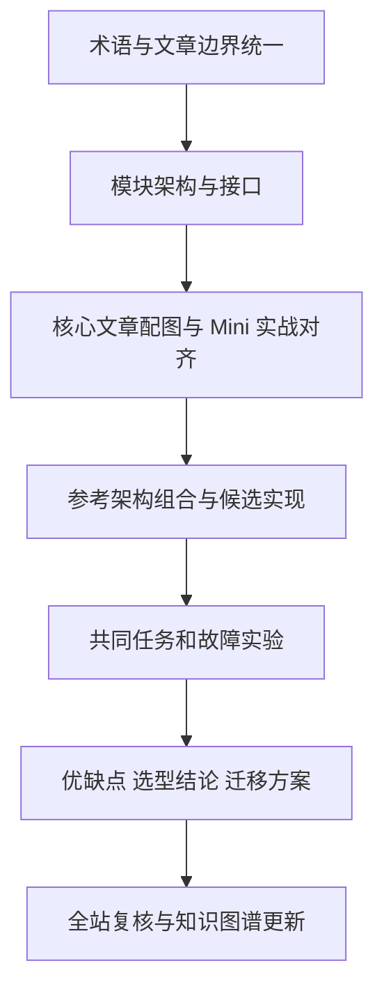

# 全站内容深化与 Agent Harness 架构方案策略

制定日期：2026-09-05。执行更新：2026-09-06。已完成全部 88 篇全文审阅、逐篇编辑卡、章节归并、配图、三种架构对照实现和知识图谱更新，详见[执行结果与验证边界](content-optimization-result.md)。以下保留制定时的基线与验收要求；真实模型质量、生产容灾与规模性能仍需对应环境验证。

## 目标与当前缺口

在现有 4 个知识域、17 个专题、84 篇文章的基础上，让读者能够说明系统如何工作，并根据自己的约束选出可实现的 Agent Harness 架构。下一轮以逻辑与工程深度为主，保持三级目录稳定，不以增加文章数为目标。

本轮制定策略时的检查发现：

- Mini Harness 实战五篇均无 Mermaid 图，模块表与运行代码之间缺少直观的连接。
- 架构与运行循环三篇只有一张 Mermaid 图，尚未形成统一的架构总图和方案比较。
- 状态、并发与恢复三篇只有一张 Mermaid 图；中断、结果未知和重试的区别应通过状态图、时序图展开。
- 项目实现研究已有较多图，但需要统一抽象层级，才能据此比较方案。
- 注册表中“工具、协议与执行边界”的简介仍包含已经移入架构专题的 Prompt / Context 总览，需要修正内容与目录描述的对应关系。
- “产品比较与采用”建议改名为“Agent 竞品分析与选型”，保留 URL，并同步目录与图谱名称。

图数量只用于发现表达缺口，不作为质量分数。没有合适的关系需要解释时，不为凑数加图。

## 一、逻辑标准：每个结论都能追问到依据

### 两条强制写作原则

1. **简洁凝练，严禁废话赘述。** 直接陈述问题、机制和结论，删除空泛铺垫、同义重述、反复预告与无信息增量的总结。每段只推进一个要点；删去一句后若不影响理解和论证，就删去。精简时保留必要定义、前提和推导，不能让读者靠猜测补齐逻辑。
2. **例子清晰完整，并服务于前后论证。** 用最少的必要信息交代谁在什么场景下要完成什么任务、遇到了什么问题、采取了什么动作、产生什么结果。例前明确要解释的问题，例后指出结果支持哪项判断及其边界；人物、字段、状态和数值含义首次出现时说明。例子用于补足情景和解释机制，不能突然引入无关背景、偷换前提，或将教学假设当作实测证据。

逐篇验收时检查：正文是否能进一步删减而不损失信息；读者是否无需猜测就能理解示例；示例的条件、过程、结果是否与前后结论一致。未通过的段落或示例必须改写或删除。

### 论证检查

每篇文章先写一张编辑卡，包含：核心问题、适用读者、必要前提、结论、论据、反例、工程影响、与其他文章的边界。读者应能从正文回答：为什么成立、在什么条件下成立、条件变化后怎么办。

| 检查维度 | 修改要求 | 完成标准 |
| --- | --- | --- |
| 术语 | 固定任务、运行、会话、检查点、事件、业务资源等定义 | 同名同义，发生语义变化时明确说明 |
| 论证 | 按问题 → 前提 → 机制 → 证据 → 限制展开 | 不从演示成功推导可靠性保证，不从相关性推导因果 |
| 事实与建议 | 区分官方文档、源码观察、本地实验和作者建议 | 关键判断有邻近引用或实验记录，不能将推断写成项目承诺 |
| 版本 | 项目能力绑定版本／commit、日期与部署形态 | 开源版、云服务、开发分支和历史实现分别说明 |
| 反例 | 优点与失败条件成对讨论 | 至少回答一个“何时不应这样做”的实际场景 |
| 图文代码一致 | 图中的节点、状态和接口能对应正文与代码 | 未实现能力标注为设计，删除已失效的步骤与指代 |
| 信息增量 | 段落必须新增定义、机制、证据、例子或判断 | 重复导读、泛化结尾和同义重述删除；必要前提保留 |

尤其核查：MCP 连接成功是否被当成业务成功；持久化是否被当成外部写入恰好一次；模型自评是否被当成独立验收；多 Agent 是否被默认视为更可靠；检索相关性是否被当成事实有效性。

## 二、结构标准：把文章分工写清楚

现有三级目录保持为知识域 → 专题 → 文章。同一机制只保留一处完整解释，其余文章简述必要背景并链接。项目研究按项目的具体实现展开；通用原理和跨项目选型集中到架构主线。

不同类型采用不同结构，不再强制统一“总—分—总”：

| 类型 | 建议结构 | 最终产物 |
| --- | --- | --- |
| 原理文章 | 问题与边界 → 模型／机制 → 反例 → 实践影响 | 可复述的机制与接口 |
| 项目研究 | 研究范围 → 组件图 → 一次执行 → 关键实现 → 限制 | 有源码证据的设计观察 |
| 实战教程 | 前置条件 → 文件与依赖 → 分步组装 → 正常运行 → 故障验证 | 可运行代码、输出及解释 |
| 架构选型 | 需求约束 → 可比方案 → 决策矩阵 → 验证 → 推荐与迁移 | 有条件的决策记录 |
| 产品／认知文章 | 核心判断 → 案例或证据 → 替代解释 → 适用边界 | 可用于判断的框架 |

全站各域的深化重点：Harness 解释实现；评测提供验证方法；产品与交付提供需求、成本和选型约束；研究与认知保留观点来源与推演边界。后面三个知识域提供输入与证据，不重复写 Harness 总论。

## 三、图文策略：用图解释关系和变化

优先使用可维护的 Mermaid；实际界面操作使用真实截图；性能和成本使用有数据来源的图表。每张图都有标题、解释目标、图例及与正文对应的说明。逻辑架构与部署架构分开绘制，控制流和数据流标明含义；需要表达权限或信任边界时明确画出。

| 内容 | 优先补充的图 | 必须看清的问题 |
| --- | --- | --- |
| Harness 架构总览 | 系统边界图、模块组件图 | 谁负责什么，哪些依赖是外部系统 |
| 运行循环 | 决策流程图 | 继续、等待、失败、取消和完成怎样产生 |
| 模型／上下文 | 输入装配与消息往返图 | 材料如何进入模型，提案如何被校验 |
| 工具／MCP／策略 | 调用时序图 | 身份与许可在哪检查，谁真正执行副作用 |
| 状态与恢复 | 状态图、响应丢失的故障时序图 | 意图、检查点、业务结果分别存在哪，何时可以重试 |
| Mini Harness 组装 | 文件到模块的映射图、运行时序图 | 图中的步骤怎样落到可运行代码 |
| 多方案比较 | 同尺度部署图、决策表／决策树 | 不同方案实际增加了哪些组件与责任 |
| 项目与竞品研究 | 同维度组件图或对比表 | 比较的是同一职责和同一产品范围 |

Mini Harness 每篇优先补一张承担核心解释任务的图；恢复篇按需要增加异常时序图。复杂图拆分成总图与局部图，不将整篇内容塞进一张图。验证桌面与手机阅读，避免大量交叉线、小字和仅靠颜色区分类别。

## 四、最终交付：一套共同架构、三种参考组合、逐模块选型

### 1. 先统一逻辑架构

延续八项核心职责：任务契约、上下文组装、模型适配、运行控制、工具执行、执行策略、状态存储、结果验收。为每项写清输入输出、调用方、状态所有者、错误分类和替换接口。

调度、可观测性、配置与发布作为横切职责；Skills、长期记忆和多 Agent 作为按需求加入的能力。身份授权与必要的执行隔离贯穿所有方案，不能被推迟到“大型架构”才处理。

### 2. 分开讨论选型维度

流程控制（固定工作流／动态循环／显式图）、持久执行（应用自行管理／编排引擎）、部署（本地／服务／隔离 Worker）、协作（单 Agent／多个受控子任务）是不同维度，可以组合。下面三种是便于讲解与验证的参考组合，不是互斥产品分类，也不是必须逐级升级的路线。

| 参考组合 | 基本组成 | 主要优势 | 主要代价与边界 | 适用条件 |
| --- | --- | --- | --- | --- |
| A：轻量 Mini Harness | 显式循环或状态机、模型适配器、工具适配、策略校验、本地持久状态、验收器 | 依赖少、调用链直观、便于理解和替换模块 | 恢复、并发与运行治理需要自己维护；本地样例不证明多租户可靠性 | 个人工具、单 Worker、短任务与早期验证 |
| B：图式编排 Harness | 显式节点与边、持久检查点、暂停恢复、执行策略、工具与验收 | 分支和人工接管路径容易表达，状态流便于检查 | 节点边界、状态更新和框架语义增加学习成本；图状态不等于业务事实 | 流程分支较多、需要人工暂停或阶段恢复 |
| C：持久工作流 + Agent Worker | 持久编排、任务派发、隔离 Worker、局部 Agent 循环、工具服务、验收 | 长时间等待、跨进程恢复与生命周期管理有明确位置 | 基础设施、重放约束、升级兼容和排障成本更高；外部副作用仍需幂等或对账 | 长任务、跨服务流程、可靠调度需求明确 |

上述优势与代价是设计分析，最终推荐需由实验支持。B 可以位于 C 的 Worker 内，但必须确定谁拥有重试、取消和恢复，避免双重调度与不受控重试。多 Agent 不单独列为“最高级架构”，只有子任务可分离、汇总可验收时才比较其收益。

### 3. 每个模块输出真实的决策表

| 模块 | 必须比较的选择 | 必须交代的取舍 |
| --- | --- | --- |
| 运行控制 | 自写循环、图式编排、持久工作流 | 控制灵活性、可恢复范围、框架约束、维护成本 |
| 模型接入 | 单 Provider 适配、统一网关、多模型路由 | 能力差异、错误分类、观测、延迟与维护代价 |
| 工具接入 | 同进程函数、业务 HTTP API、MCP | 复用范围、传输成本、身份与协议生命周期 |
| 状态 | 本地事务库、服务端数据库、编排历史 | 状态所有权、一致性、并发、迁移和保留策略 |
| 上下文与记忆 | 显式材料装配、检索、长期记忆 | 必要性、来源有效性、权限、删除、预算与实际收益 |
| 执行隔离 | 受限业务工具、容器或其他隔离环境 | 可执行内容、威胁模型、资源限制、运维成本 |
| 验收与观测 | 确定性校验、语义评估、人工复核、运行追踪 | 证据独立性、误判、调试能力与成本 |
| 协作 | 单 Agent、受控子任务、共享状态协作 | 协调开销、冲突、责任归属和最终汇总 |

每条选择统一写：适用场景、必要前提、带来的能力、失去的能力、工程成本、失败模式、替代方案、何时迁移。具体产品作为候选实现，记录核查版本；不得把下载量、知名度或某一次成功当成“最佳”的依据。

### 4. 每套方案的交付内容

必须包括需求约束表、逻辑图、部署图、正常时序、故障恢复路径、模块接口与存储归属、依赖及版本、关键配置、优缺点表、实验结果、迁移方案和决策记录（ADR）。

推荐结论采用“在这些约束下，优先选择 X；代价是 Y；出现 Z 时重新评估”的形式。不能只给架构图、组件清单或一张主观打分表。

## 五、用相同任务验证取舍

固定三类教学任务作为比较载体：

1. **确定性基线**：字段已给定，创建工单并独立核验。用于比较基础开销，防止给不需要决策的任务增加模型循环。
2. **动态资料核验**：读取多份资料，选择工具补证据，识别冲突并生成工单提案。用于验证 Agent 决策和上下文装配。
3. **等待与恢复**：写入前人工批准、长时间等待、Worker 重启和取消。用于验证生命周期控制。

固定任务契约、材料、工具行为与验收标准。评测同一模型和参数配置下的多次运行；框架之间无法保持一致的条件单独记录。架构不支持某场景时标明不支持，不通过改题掩盖差异。

共同故障集：无效模型提案、预算耗尽、工具超时且结果未知、重复派发、进程退出、权限撤回、取消与提交竞争、版本升级后恢复。每项写明预期状态、业务资源断言和残余风险。

记录任务完成率、验收误判、重复副作用、恢复结果、人工介入、端到端延迟、模型与工具调用成本及部署维护步骤。安全与业务约束先作为门槛；通过门槛的方案再比较成本和性能。无实测的数据标注待测，小样本不宣称统计显著性。真实跨平台适配、长期稳定性和规模能力的结论必须由对应实验支持。

## 六、执行顺序与验收门槛

| 阶段 | 主要工作与具体落点 | 阶段交付 | 通过条件 |
| --- | --- | --- | --- |
| P0：定义与分工 | 审查 84 篇核心问题；统一术语；修正目录简介；调整竞品专题名称 | 全站编辑卡、术语表、文章归属与交叉引用清单 | 无同题重复主文、无承诺与正文不符 |
| P1：架构与实战 | 深化 `harness-engineering-map`、`harness-engineering-loop`；补齐 Mini 五篇及恢复机制的核心图 | 统一架构、模块接口、图文一致的教程 | 每个核心节点能对应正文和代码；正常及故障流程可解释 |
| P2：方案与验证 | 编写候选决策；建立 A/B/C 对照实现和共同实验 | 版本清单、实验入口、结果与限制 | 每套参考方案至少有核心路径验证，恢复承诺有故障证据 |
| P3：形成选型结论 | 复用架构总览作为入口；必要时新增一篇 `harness-architecture-selection`；细节放实验和 ADR 附录 | 完整架构方案、选型矩阵、默认建议、迁移条件 | 能依据需求选方案，并明确承担其代价 |
| P4：全站收口 | 将标准推广到项目、评测、产品与认知文章；复核图文和阅读顺序 | 全站修订记录、更新后的目录和图谱 | 无重复节点、失效引用和悬空指代；图表与链接验证通过 |

P0 的全站审查先识别风险，优先处理会改变架构结论的逻辑错误。P1–P3 聚焦 Harness 主线；P4 完成其他文章的表达与配图深化。每阶段修改后立即更新必要链接和图谱，不将失效状态留到最后。

P2 的实验范围按决策需要收敛；验证不充分时保留候选结论，不把“尚未验证”补写成优点。最终以验收条件完成为准，不承诺未经工作量评估的日期。

## 七、图谱与维护

目录归属保持唯一；项目文章通过明确的正文引用连接到相关机制和选型文章。方案通过引用连接到接口、实验与项目证据。只有新增关系能够帮助阅读与判断时才引入新的图谱关系类型，不复制每幅流程图为知识图谱节点。

每批修改执行内容和链接检查、Mermaid 渲染检查及必要的配套实验。结构或交互变化时检查桌面和移动端；只有语句修改时不重复运行无关实验。最终验证完整构建、图谱旧链接、全部文章归属及关键阅读路线。

## 参考依据与使用边界

以下官方资料于 2026-09-05 查阅，用于校准候选架构的职责边界；不是完成全部产品选型的证据：

- LangGraph 将 thread 内图状态的 checkpointer 与跨 thread 信息的 store 区分；后续比较分别核验。[Persistence](https://docs.langchain.com/oss/python/langgraph/persistence)
- Temporal 用事件历史重放恢复 Workflow，并要求确定性；模型和其他外部 I/O 放入 Activity 的职责范围。后续另验证 Activity 重试与业务幂等。[Temporal Workflow](https://docs.temporal.io/workflows)
- MCP 使用 host、client、server 的连接架构。后续将协议接入与应用运行控制分开描述。[MCP Architecture](https://modelcontextprotocol.io/docs/2026-07-28/learn/architecture)

## 全量执行收口（2026-09-06）

| 阶段 | 本轮结果 | 证据 |
| --- | --- | --- |
| P0 | 88 篇八项编辑卡、术语与唯一归属完成 | content-full-review.json、harness-terminology.md |
| P1 | 核心架构、Mini 组装、状态与恢复图文对齐 | 主文、Mini 五篇与实验源码 |
| P2 | 真实 A/B/C 核心路径与共同故障契约通过 | harness-architectures/results.json；真实模型和生产能力仍未测 |
| P3 | 模块候选、正常时序、部署责任、优缺点、迁移与 ADR 完成 | harness-architecture-selection.md、ADR.md |
| P4 | 项目、评测、产品与认知全量修订收口，图谱更新 | content-full-review.md、content-optimization-result.md |

原策略的 84 篇是制定时基线；后续增加三篇相关研究与一篇架构选型，当前审阅覆盖全部 88 篇。保留当前专题结构，合并重复章节，不为减少文件数强行合并不同主问题。
