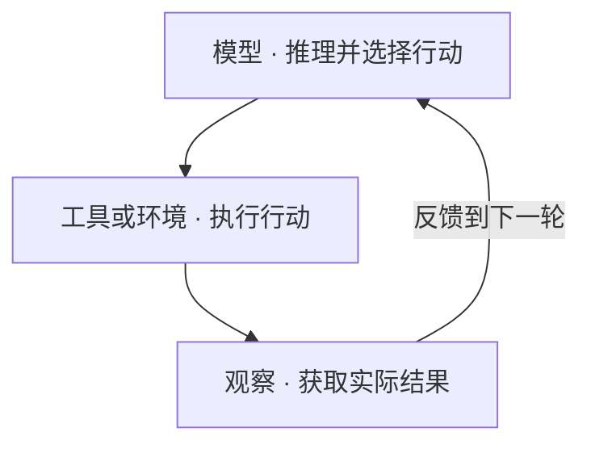

# 回望过去的九年：从 LLM 到 Agent

回望过去，如果从 2017 年 Transformer 论文发表算起，LLM 到 Agent 的这段演进已经走过了九年。2017 年，谷歌研究团队发表《Attention Is All You Need》，提出 Transformer 架构，为后来大语言模型的发展奠定了关键基础。2022 年底，OpenAI 的 ChatGPT 横空出世，大语言模型由此破圈，走入公众视野。

从那以后，人们对 AI 的期待也在变化。起初是让它回答问题、写一段文字、补几行代码；后来是让它查完资料再给出报告，读懂仓库后修复问题，甚至自己操作软件，把一项工作做完。从“问它一个问题”到“交给它一个任务”，LLM 到 Agent 的变化逐渐变得具体。

回头看，这些标志性事件背后，有一条持续积累的技术脉络。ChatGPT 之前，预训练、指令对齐和外部信息获取已经铺垫多年；AutoGPT 让自主执行变得直观，也把循环失控、成本和验收的问题暴露出来；当 Claude Code、Manus 和 Codex 开始承接完整任务，上下文、记忆、工具与运行环境就必须一起工作。曾经分散的技术，逐步汇合成今天的 Agent 系统。

回望这段历史：一起看下哪些产品出现过，理解它们为什么能在那个时刻出现，以及走到下一步、未来还缺什么。

> 覆盖范围：2017 年 6 月至 2026 年 8 月，共 46 个代表性历史节点。日期按论文首次提交、官方发布或工程文章发表时间标注，同月不细分先后。

## 阅读导览

### 时间脉络

| 时期 | 可以记住的事件 | 对应的技术变化 |
| --- | --- | --- |
| 2017—2021｜模型基础与早期应用 | Transformer 论文、GPT 系列、Copilot 技术预览 | 预训练与上下文学习让同一模型适配多种任务，代码生成进入编辑器 |
| 2022｜对话成为入口 | ChatGPT 发布；同年出现 CoT、ReAct | 指令对齐改善对话体验，分步推理与行动反馈分别推进 |
| 2023｜从聊天走向自主尝试 | GPT-4、AutoGPT、斯坦福小镇 | 更强模型与工具、记忆、循环结合，也暴露执行和验收问题 |
| 2024｜展示完整工作过程 | Devin 演示、o1-preview、Claude Computer Use、MCP | 工作环境、推理计算、屏幕操作与连接协议继续补齐 |
| 2025｜把任务交给 Agent | DeepSeek-R1、Deep Research、Claude Code、Manus、Codex | 推理能力更易获取，检索、工具与运行设施汇合为可委派任务的产品 |
| 2026（截至 8 月）｜让执行可持续、可验证 | Managed Agents 架构实践与长程应用开发案例 | 进一步处理状态、执行环境、交接和评测；仍处于持续演进中 |

下面的横轴选取代表性里程碑，每个节点同时标出事件和技术变化，点击可跳到正文。节点按时间顺序等距排列，间距不代表持续时长；完整时间线还包含支撑这些事件的论文、框架与工程实践。

<div id="timeline-overview"></div>

```timeline
{
  "title": "记住事件，再看懂技术",
  "description": "2017—2026 · 代表性里程碑，点击进入正文；节点等距，不代表持续时长。",
  "events": [
    {
      "date": "2017.06",
      "title": "Transformer 论文发表",
      "description": "注意力架构成为后续模型基础",
      "href": "#milestone-transformer"
    },
    {
      "date": "2021.06",
      "title": "Copilot 进入编辑器",
      "description": "代码模型 + 编辑器上下文",
      "href": "#milestone-github-copilot"
    },
    {
      "date": "2022.11",
      "title": "ChatGPT 发布",
      "description": "对话入口 + 指令与反馈训练",
      "href": "#milestone-chatgpt"
    },
    {
      "date": "2023.03",
      "title": "GPT-4 与 AutoGPT",
      "description": "更强模型 + 目标驱动执行循环",
      "href": "#milestone-autogpt"
    },
    {
      "date": "2023.04",
      "title": "斯坦福小镇",
      "description": "25 个 Agent 展示记忆、计划与互动",
      "href": "#milestone-generative-agents"
    },
    {
      "date": "2024.03",
      "title": "Devin 公开演示",
      "description": "终端、编辑器与浏览器组成工作环境",
      "href": "#milestone-devin"
    },
    {
      "date": "2024.09—11",
      "title": "o1、Computer Use、MCP",
      "description": "推理、屏幕操作与工具连接并行推进",
      "href": "#milestone-o1"
    },
    {
      "date": "2025.01",
      "title": "DeepSeek-R1 发布",
      "description": "开放权重、推理训练与蒸馏",
      "href": "#milestone-deepseek-r1"
    },
    {
      "date": "2025.02—03",
      "title": "Deep Research 与 Manus",
      "description": "从即时问答走向委派完整任务",
      "href": "#milestone-deep-research"
    },
    {
      "date": "2025.02—05",
      "title": "Claude Code 与 Codex",
      "description": "编程任务接入执行环境和测试反馈",
      "href": "#milestone-claude-code"
    },
    {
      "date": "2025.07",
      "title": "ChatGPT agent 发布",
      "description": "研究、操作与文件交付进入同一流程",
      "href": "#milestone-chatgpt-agent"
    },
    {
      "date": "2026.04",
      "title": "Managed Agents 架构实践",
      "description": "会话、执行循环与沙箱分离",
      "href": "#milestone-managed-agents"
    }
  ]
}
```

五条路线贯穿全文：**模型与推理、知识与记忆、行动与反馈、编排与连接、运行与评测**。每个节点标注其主要归属；同一个研究或产品也可能影响其他路线。

## 2017—2021｜从专用模型到可提示的通用能力

> 主要问题：能否复用一个模型，并让它获取外部信息？

2017 年回看起来像一个清晰的起点，但当时 Transformer 论文主要讨论的还是机器翻译。后来 GPT 系列沿着生成式预训练继续向前，模型逐渐可以通过提示完成不同任务；到 2021 年，Copilot 已经把代码建议放进编辑器，WebGPT 则尝试先浏览、再回答。

这一阶段留下的基础，是模型能力开始具备复用价值：更换任务，不必总从头训练一个专用模型。但会生成相关内容之后，仍有两个问题没有解决——它是否真正遵循人的意图，以及它凭什么知道答案是对的。

<div id="milestone-transformer"></div>

### 2017.06｜Transformer：新的序列建模架构

**技术路线：** 模型与推理　｜　**节点类型：** 论文

- **发生了什么：** Attention Is All You Need 用注意力机制构建序列模型，原论文主要验证机器翻译任务。
- **带来的变化：** 为后续大规模语言模型提供关键架构基础；这时还没有今天意义上的通用对话 Agent。
- **技术机制：** 注意力处理序列内的关系，架构适合并行训练。后续语言模型在此基础上发展不同的预训练形式。
- **当时的局限：** 架构本身不提供用户目标、工具接口、长期状态或反馈循环。
- **后续联系（归纳）：** 后续重点转向预训练与规模化：能否把大量文本中的模式转成可复用能力？

**一手来源：** [Transformer](https://arxiv.org/abs/1706.03762)

### 2018.06｜GPT：生成式预训练再适配任务

**技术路线：** 模型与推理　｜　**节点类型：** 研究发布

- **发生了什么：** 初代 GPT 先用未标注文本进行语言模型预训练，再对下游任务进行监督微调。
- **带来的变化：** 把“每个任务单独训练”推进为“共享预训练基础，再适配不同任务”。
- **技术机制：** 预训练学习通用表示；微调使这些表示适合分类、推断等具体任务。
- **当时的局限：** 任务适配仍依赖训练过程，尚不是给一段自然语言就能可靠完成任意任务。
- **后续联系（归纳）：** GPT-2、GPT-3 继续探索规模增大后，不微调或少给示例能做到什么。

**一手来源：** [GPT](https://openai.com/index/language-unsupervised/)

### 2019.02｜GPT-2：长文本生成与暂缓完整发布

**技术路线：** 模型与推理　｜　**节点类型：** 研究发布

- **发生了什么：** 2 月，OpenAI 展示 GPT-2 的长文本生成与零样本能力，同时因担忧滥用而暂缓发布完整模型。模型能写什么、应当如何开放，开始在同一次发布中被讨论。
- **带来的变化：** 同一个语言模型可以通过不同文本输入表现出多种能力，提示的价值更加明显。
- **技术机制：** 用大规模文本的下一词预测目标训练，再用不同的输入格式诱导任务行为。
- **当时的局限：** 能续写相关文本，不等于准确理解指令；能力和结果仍不稳定。
- **后续联系（归纳）：** 后续的 GPT-3 更系统地探索 few-shot 提示；指令训练则从训练环节改善任务遵循。

**一手来源：** [GPT-2](https://openai.com/index/better-language-models/)

### 2020.05｜RAG：把外部知识带入生成过程

**技术路线：** 知识与记忆　｜　**节点类型：** 论文

- **发生了什么：** RAG 论文结合检索器与生成模型，让回答使用检索到的文档信息。
- **带来的变化：** 知识来源从模型参数扩展到外部资料；知识更新不必全部依靠重新训练。
- **技术机制：** 按问题检索相关材料，再以材料为条件生成答案。它是检索增强生成的代表性工作。
- **当时的局限：** 检索错误、材料过时或模型误读，仍会导致错误；检索本身也不构成自主 Agent。
- **后续联系（归纳）：** 这条路线后来融入 Agent 的工具检索，以及 Context Engineering 的信息选择。

**一手来源：** [RAG](https://arxiv.org/abs/2005.11401)

### 2020.05｜GPT-3：Few-shot 与上下文学习

**技术路线：** 模型与推理　｜　**节点类型：** 论文

- **发生了什么：** GPT-3 在不更新权重的情况下，通过输入中的任务说明和少量示例完成多类任务。
- **带来的变化：** 应用开发者可以通过提示改变模型行为，Prompt Engineering 的实践空间扩大。
- **技术机制：** 把示例放进当前上下文，模型依据这些文本完成本次任务；这不是修改模型参数。
- **当时的局限：** 示例和措辞敏感；模型仍可能编造事实、忽略意图或无法完成多步任务。
- **后续联系（归纳）：** 指令训练改善“听懂要求”，RAG 改善“拿到资料”，推理提示改善“分步求解”。

**一手来源：** [GPT-3](https://arxiv.org/abs/2005.14165)

<div id="milestone-github-copilot"></div>

### 2021.06｜GitHub Copilot：代码建议出现在编辑器里

**技术路线：** 模型与推理　｜　**节点类型：** 产品技术预览

- **发生了什么：** 6 月 29 日，GitHub 发布 Copilot 技术预览：开发者写代码时，编辑器可以给出整行甚至整个函数的建议。
- **带来的变化：** 代码生成从模型演示进入日常开发界面；“AI 结对编程”有了具体可用的产品形态。
- **技术机制：** 早期 Copilot 由 OpenAI Codex 驱动，根据正在编写的代码上下文生成建议；代码数据训练与编辑器上下文共同支撑这一体验。
- **当时的局限：** 当时主要由开发者选择、修改和验证建议，不能把这一版本理解为会独立接单、改仓库并交付的编程 Agent。
- **后续联系（归纳）：** 从 Copilot 的代码建议，到 Devin、Claude Code 和 2025 年 Codex 的任务执行，变化在于模型之外逐步加入工具循环、工作环境与结果验证。

**一手来源：** [Copilot 发布公告](https://github.blog/news-insights/product-news/introducing-github-copilot-ai-pair-programmer/)

### 2021.09｜FLAN：通过训练学习遵循指令

**技术路线：** 模型与推理　｜　**节点类型：** 论文

- **发生了什么：** FLAN 将多个任务写成自然语言指令进行微调，改善未见任务上的零样本表现。
- **带来的变化：** 不只在使用时调整提示，也在训练时让模型适应“收到指令后完成任务”。
- **技术机制：** Instruction Tuning 用多种带指令的任务样本更新模型参数。
- **当时的局限：** 遵循指令的能力提高，不代表输出就真实、符合偏好或能直接操作环境。
- **后续联系（归纳）：** 与人类反馈对齐等路线共同支持更可用的助手。Prompt 与指令训练属于不同环节。

**一手来源：** [FLAN](https://arxiv.org/abs/2109.01652)

### 2021.12｜WebGPT：先浏览，再带引用回答

**技术路线：** 行动与反馈　｜　**节点类型：** 论文

- **发生了什么：** WebGPT 让模型在文本浏览环境中搜索和导航，收集引用来回答长问题。
- **带来的变化：** 在 ReAct 之前，就已有模型借助外部环境完成多步信息获取的代表性研究。
- **技术机制：** 用人类浏览示范和反馈训练模型，依据浏览结果生成可追溯答案。
- **当时的局限：** 围绕问答的专用环境，并不等于通用工具平台或可靠的长期任务系统。
- **后续联系（归纳）：** 说明“会行动”并非某一天突然出现；后续研究继续探索更通用的推理与行动组织方式。

**一手来源：** [WebGPT](https://arxiv.org/abs/2112.09332)

## 2022｜指令、推理与行动开始结合

> 主要问题：能否从“生成文字”走向“按目标采取行动”？

2022 年最鲜明的记忆，留在了年末的 ChatGPT。一个对话框，把此前需要了解模型和接口才能调用的能力，放到了普通用户面前。写作、问答、代码解释，都可以从一句话开始。

沿时间线往前看，同年的 CoT、InstructGPT 和 ReAct 分别在处理分步求解、指令遵循和行动反馈。它们不是同一项技术，也不能简单理解成 ChatGPT 的全部组成。把这些工作放在一起，恰好能看清那个阶段的分界：对话已经好用了，把建议落实成行动，还需要另一套机制。

### 2022.01｜CoT：把求解过程拆成中间步骤

**技术路线：** 模型与推理　｜　**节点类型：** 论文

- **发生了什么：** Chain-of-Thought 研究通过包含中间推理步骤的示例，改善复杂问题求解。
- **带来的变化：** 从直接输出答案，扩展为先生成一系列中间步骤。
- **技术机制：** 提示中提供分步求解示范，诱导模型按类似方式完成新的问题。
- **当时的局限：** 步骤可能看似合理却错误；生成推理文字本身不等于获得外部验证。
- **后续联系（归纳）：** ReAct 将推理接到行动反馈；Tree of Thoughts 则进一步探索多条候选推理路径。

**一手来源：** [CoT](https://arxiv.org/abs/2201.11903)

### 2022.03｜InstructGPT：人类反馈塑造助手行为

**技术路线：** 模型与推理　｜　**节点类型：** 论文

- **发生了什么：** InstructGPT 论文结合监督示范、偏好排序与 RLHF，让输出更符合用户意图。
- **带来的变化：** 优化目标进一步从“预测文本”转向“生成用户认为有用的响应”。
- **技术机制：** 收集示范和输出偏好，训练奖励模型，再用强化学习优化模型。
- **当时的局限：** 被偏好不等于客观正确，也不等于有权执行工具或能自主完成长期任务。
- **后续联系（归纳）：** 这条对齐路线支撑对话助手的发展；它与 Agent 运行时的工具反馈循环需要分开理解。

**一手来源：** [InstructGPT](https://arxiv.org/abs/2203.02155)

### 2022.10｜ReAct：推理、行动、观察交替执行

**技术路线：** 行动与反馈　｜　**节点类型：** 论文

- **发生了什么：** ReAct 把推理与任务行动交错组织，利用环境观察更新后续行动。
- **带来的变化：** 目标 → 选择行动 → 执行 → 观察 → 再选择，成为典型 Agent Loop。
- **技术机制：** 工具或环境的返回值进入下一轮上下文，让计划能够根据真实结果调整。
- **当时的局限：** 仍可能选错工具、反复失败、误判完成；循环次数多不代表结果更好。
- **后续联系（归纳）：** 这是理解后续 Loop Engineering 的核心前史：后来强化的是反馈质量、控制和验收。

**一手来源：** [ReAct](https://arxiv.org/abs/2210.03629)

下面把 ReAct 的核心交互关系展开：工具或环境返回的观察进入下一轮决策。这里示意推理与行动的交替，不表示每轮都必须调用工具；循环何时结束、任务如何验收，仍需由具体系统定义。



观察结果回到模型的下一轮上下文，使后续行动能够依据实际执行情况调整。

### 2022.10｜LangChain：把模型调用组合成应用

**技术路线：** 编排与连接　｜　**节点类型：** 框架发布

- **发生了什么：** LangChain 首个 Python 包于 10 月 24 日发布，为组合语言模型应用提供框架。
- **带来的变化：** 开发对象从单次模型调用，扩展到多个步骤、数据和工具的组合。
- **技术机制：** 框架逐步提供统一的组件和组合方式，减少每个应用重复编写连接代码。
- **当时的局限：** 仅靠顺序串联不足以表达所有循环、分支和动态状态；这并不意味着早期 LangChain 没有 Agent 循环。
- **后续联系（归纳）：** LangGraph 后来进一步把循环与图式控制流作为明确的工程对象。

**一手来源：** [LangChain](https://www.langchain.com/blog/announcing-our-10m-seed-round-led-by-benchmark)

<div id="milestone-chatgpt"></div>

### 2022.11｜ChatGPT：打开网页，就能与模型连续对话

**技术路线：** 模型与推理　｜　**节点类型：** 产品发布

- **发生了什么：** 11 月 30 日，OpenAI 发布 ChatGPT 研究预览。用户可以直接在网页中提问、追问、要求改写或解释代码；模型能力通过连续对话成为可体验的产品。
- **带来的变化：** 用户可以通过对话表达、补充和修正任务需求，助手式交互变得直观。
- **技术机制：** 发布时基于 GPT-3.5 系列，并使用人类示范与反馈进行对话训练；上下文让它接住追问，指令对齐让回答更接近助手行为。
- **当时的局限：** 对话流畅与自主执行是两种能力；用户仍需把许多建议手动落实到外部系统。
- **后续联系（归纳）：** 对“替我完成工作”的期待，推动工具接口与 Agent 应用进一步发展。

**一手来源：** [ChatGPT](https://openai.com/index/chatgpt/)

## 2023｜Agent 的关键部件密集出现

> 主要问题：怎样使用工具、纠错、记忆、协作，并衡量任务完成？

到了 2023 年，GPT-4、AutoGPT 和斯坦福小镇接连出现，给这一年的技术变化留下了几个具体画面：模型可以处理更复杂的要求，程序可以围绕一个目标连续尝试，模拟小镇里的角色可以记住交谈、安排活动。

这些画面让 Agent 的可能性变得清楚，也留下了新的问题。连续执行怎样避免原地打转，记忆怎样真正影响下一步，多角色之间怎样分工，最后又由谁判断工作已经完成？工具、反思、记忆、协作和评测，正是在这些问题中各自找到位置。

### 2023.02｜Toolformer：研究如何学会调用工具

**技术路线：** 行动与反馈　｜　**节点类型：** 论文

- **发生了什么：** Toolformer 研究模型如何决定调用哪些 API、何时调用、传入什么参数并使用返回值。
- **带来的变化：** 部分计算、查询和外部操作可以交给专门工具完成。
- **技术机制：** 通过训练让模型学习插入工具调用，而不是完全依赖开发者在提示中描述策略。
- **当时的局限：** 工具调用能力仍依赖接口、执行器、权限和错误处理；模型不会自己执行 JSON。
- **后续联系（归纳）：** 与后来的产品化 Function Calling 共同体现模型与外部工具结合的路线。

**一手来源：** [Toolformer](https://arxiv.org/abs/2302.04761)

### 2023.03｜GPT-4：更强的通用模型成为应用基础

**技术路线：** 模型与推理　｜　**节点类型：** 模型与产品发布

- **发生了什么：** 3 月 14 日，OpenAI 发布 GPT-4，展示更强的复杂指令处理和多类任务表现，并介绍图像与文本输入能力；图像输入当时仍为研究预览。
- **带来的变化：** ChatGPT 之后，关注点进一步转向“更强的模型能支撑哪些工作”。GPT-4 也成为随后 AutoGPT 等自主执行实验使用的基础模型。
- **技术机制：** 大规模预训练与后训练改善模型能力和行为；模型能处理复杂输入，为应用组织多步任务提供基础，但执行循环仍要由外部程序实现。
- **当时的局限：** 发布时仍存在幻觉和推理错误，部分能力也未全面开放。基准表现不能直接推导出真实任务的完成率。
- **后续联系（归纳）：** 接下来出现两条并行路线：继续增强模型本身，以及给模型配上工具、记忆和运行控制。AutoGPT 让后一条路线变得更直观。

**一手来源：** [GPT-4 发布公告](https://openai.com/index/gpt-4-research/)

### 2023.03｜Reflexion：把失败反馈带入下一次尝试

**技术路线：** 行动与反馈　｜　**节点类型：** 论文

- **发生了什么：** Reflexion 将任务反馈转成文字反思，并保存到记忆中，影响后续尝试。
- **带来的变化：** 循环从“继续执行”扩展为“记住为什么失败，再调整策略”。
- **技术机制：** 执行、评价和反思组成反馈过程；原方法不通过更新模型权重实现这种改进。
- **当时的局限：** 错误的评价或反思可能放大偏差，需要可信的外部信号与停止条件。
- **后续联系（归纳）：** 它为理解 Loop Engineering 提供具体实例：要设计反馈如何产生、如何影响下一轮。

**一手来源：** [Reflexion](https://arxiv.org/abs/2303.11366)

<div id="milestone-autogpt"></div>

### 2023.03｜AutoGPT：给一个目标，让程序连续尝试

**技术路线：** 行动与反馈　｜　**节点类型：** 开源实验与公开演示

- **发生了什么：** AutoGPT 在 3 月公开展示围绕目标连续运行的 GPT-4 应用；早期仓库保留了 3 月 30 日的演示。它把搜索、文件操作和记忆接到模型调用上。
- **带来的变化：** 读者可以直接看到“给一个目标，程序自己决定下一步”的运行过程。Agent 的自主执行不再只通过论文中的抽象流程来理解。
- **技术机制：** 宿主程序把目标、历史和可用操作交给模型，执行选出的命令，再把结果放回上下文；这是已有模型外部的运行循环。
- **当时的局限：** 早期项目明确定位为实验，可能反复循环、偏离任务并持续消耗调用费用；能连续运行不等于能可靠完成目标。
- **后续联系（归纳）：** 它把停止条件、预算、错误恢复和验收的重要性摆到开发者面前，也解释了为什么后续讨论会从“能否循环”转向 Harness 与 Evals。

**一手来源：** [AutoGPT 早期 README（v0.2.0，含 3 月演示）](https://github.com/Significant-Gravitas/AutoGPT/blob/v0.2.0/README.md)

<div id="milestone-generative-agents"></div>

### 2023.04｜Generative Agents：斯坦福小镇里的 25 个 Agent

**技术路线：** 知识与记忆　｜　**节点类型：** 论文

- **发生了什么：** 4 月的 Generative Agents 论文构建了一个有 25 个 Agent 的模拟小镇。在给定一个角色想举办情人节聚会的初始意图后，研究展示了邀请传播、约会与相约赴会的行为。
- **带来的变化：** “记忆、反思、计划”变成可观察的连续生活场景：角色记住经历与交谈，再据此安排接下来的行动。
- **技术机制：** 保存经历，检索相关记忆，并形成更高层的反思来支持后续行为。
- **当时的局限：** 模拟中的可信行为，不代表真实工作中的准确性、效率或可靠交付。
- **后续联系（归纳）：** 展示记忆是 Agent 系统组件；后续长期记忆与 Context Engineering 继续处理信息选择。

**一手来源：** [Generative Agents](https://arxiv.org/abs/2304.03442)

### 2023.05｜Tree of Thoughts：搜索多条推理路径

**技术路线：** 模型与推理　｜　**节点类型：** 论文

- **发生了什么：** Tree of Thoughts 组织多个候选思路，结合评价、前瞻和回溯进行求解。
- **带来的变化：** 单条推理链扩展为对候选路径的搜索，显式分配更多推理计算。
- **技术机制：** 生成候选中间状态，评估哪些值得继续，并在需要时回退。
- **当时的局限：** 候选越多成本越高；模型自评也可能不准。思维搜索树不等于多智能体任务图。
- **后续联系（归纳）：** 与后续推理模型属于相关但不同的路线：一种设计外部搜索过程，一种增强模型本身。

**一手来源：** [Tree of Thoughts](https://arxiv.org/abs/2305.10601)

### 2023.06｜Function Calling：工具调用进入标准 API

**技术路线：** 行动与反馈　｜　**节点类型：** 产品发布

- **发生了什么：** OpenAI 于 6 月 13 日推出函数调用能力，模型可依据函数定义输出结构化调用参数。
- **带来的变化：** 从解析自由文本指令，转向可由程序消费的结构化调用，提高集成可行性。
- **技术机制：** 模型提出函数名和参数，由宿主程序验证、执行，再把结果交回模型。
- **当时的局限：** 正确格式不保证参数正确、权限合理或工具执行成功。
- **后续联系（归纳）：** 执行器与错误恢复逐渐成为 Harness 的职责；MCP 后来补充工具连接的协议层。

**一手来源：** [Function Calling](https://openai.com/index/function-calling-and-other-api-updates/)

### 2023.08｜AutoGen：将多角色对话组织成协作

**技术路线：** 编排与连接　｜　**节点类型：** 论文

- **发生了什么：** AutoGen 论文展示可定制智能体通过对话协作，并组合模型、人类输入和工具。
- **带来的变化：** 从一个 Agent 包办任务，扩展到执行、审查等多个角色分工。
- **技术机制：** 定义不同角色与交互行为，让消息和执行结果在角色之间传递。
- **当时的局限：** 角色数量增加也可能带来重复工作、信息损失、成本上升和循环争论。
- **后续联系（归纳）：** 多智能体的价值需要协调结构与评测支持；这也是后来 Graph Engineering 讨论的对象。

**一手来源：** [AutoGen](https://arxiv.org/abs/2308.08155)

### 2023.10｜SWE-bench：用真实仓库问题评测能力

**技术路线：** 运行与评测　｜　**节点类型：** 评测论文

- **发生了什么：** SWE-bench 使用真实 GitHub issue 与修复任务，评估模型解决软件工程问题的能力。
- **带来的变化：** 从生成一段像样的代码，推进到在真实仓库中完成可检验的修改。
- **技术机制：** 围绕问题描述、仓库代码和测试判断修复效果。
- **当时的局限：** 基准测试仍有覆盖范围与环境限制；一个分数不能代表所有生产任务。
- **后续联系（归纳）：** 评测对象逐渐包含模型、工具接口和执行环境组成的整个系统。

**一手来源：** [SWE-bench](https://arxiv.org/abs/2310.06770)

### 2023.10｜MemGPT：把上下文当作分层存储来管理

**技术路线：** 知识与记忆　｜　**节点类型：** 论文

- **发生了什么：** MemGPT 借鉴操作系统的分层内存，在有限上下文与外部存储之间移动信息。
- **带来的变化：** 长期信息不必全部塞进当前窗口，可以按需要写入、保留和调取。
- **技术机制：** 用不同记忆层和控制流管理，让模型在当前窗口之外保存可再次使用的信息。
- **当时的局限：** 保存过的信息不一定会被正确检索；读写策略本身也会出错。
- **后续联系（归纳）：** 2025 年 Context Engineering 的总结吸纳了更早的检索、记忆和上下文管理实践。

**一手来源：** [MemGPT](https://arxiv.org/abs/2310.08560)

## 2024｜把运行结构与外部接口做明确

> 主要问题：怎样编排循环、适配环境，并连接更多工具？

2024 年，Devin 展示了一种更完整的工作画面：Agent 有终端、有编辑器、有浏览器，可以修改程序，再运行它。到了 10 月，Claude Computer Use 又把点击和输入带进了公开演示。AI 能否使用人日常工作的环境，开始成为一个可以具体讨论的问题。

这一年也提醒我们，能力增长有不同来源。o1 在增强模型本身的推理，SWE-agent 研究工具界面怎样影响表现，LangGraph 和 MCP 则分别处理控制流与连接。一个 Agent 做得更好，可能来自模型，也可能来自它看到的信息、使用的工具和周围的运行结构。

### 2024.01｜LangGraph：显式表达带循环的运行图

**技术路线：** 编排与连接　｜　**节点类型：** 框架发布

- **发生了什么：** LangGraph 于 1 月 17 日发布，以支持带循环的图和 Agent 运行编排为重点。
- **带来的变化：** 节点、条件分支和回路可以由程序明确表达，不必全部隐含在对话中。
- **技术机制：** 模型调用、工具执行和其他步骤组成图；根据状态选择接下来走哪条边。
- **当时的局限：** 图的结构可以明确，但节点仍会失败，路由条件和验收规则也需要设计。
- **后续联系（归纳）：** 图式 Agent 工程已在 2024 年存在；2026 年的 Graph Engineering 并非图编排的起点。

**一手来源：** [LangGraph](https://www.langchain.com/blog/langgraph)

<div id="milestone-devin"></div>

### 2024.03｜Devin：AI 软件工程师的公开演示

**技术路线：** 运行与评测　｜　**节点类型：** 产品演示

- **发生了什么：** 3 月 12 日，Cognition 介绍 Devin，演示它使用终端、编辑器和浏览器构建应用、修复代码，并展示 SWE-bench 上的结果。
- **带来的变化：** “AI 帮我写几行代码”进一步变成“把一项开发任务交给 AI，再检查交付”。关注对象从代码片段扩展到完整工作过程。
- **技术机制：** 公开介绍中的系统将规划与工具操作接入沙箱工作环境，保留任务上下文，并接收用户反馈；这是模型和运行系统共同承担工作。
- **当时的局限：** 这些是厂商展示与自报评测，不能据此认定系统能够普遍替代工程师；公开材料也不足以还原全部内部架构。
- **后续联系（归纳）：** 与同年的 SWE-agent 一起看，可以理解为什么工具界面、执行环境和测试反馈会成为核心工程问题；后来的 Claude Code 与 Codex 则呈现不同的任务交付形态。

**一手来源：** [Devin 发布与演示](https://cognition.com/blog/introducing-devin)

### 2024.05｜SWE-agent：工具界面设计影响 Agent 表现

**技术路线：** 运行与评测　｜　**节点类型：** 论文

- **发生了什么：** SWE-agent 论文研究 Agent-Computer Interface，为搜索仓库、编辑文件和执行测试设计接口。
- **带来的变化：** 同一个模型能做多好，也取决于它通过什么界面读取环境和采取行动。
- **技术机制：** 为模型提供适合它使用的命令、输出和文件操作方式，减少交互困难。
- **当时的局限：** 接口优化不能消除模型错误；执行环境与任务状态仍需可靠管理。
- **后续联系（归纳）：** 这是 Harness 思路的具体前史：模型周围的软件结构，本身就是性能变量。

**一手来源：** [SWE-agent](https://arxiv.org/abs/2405.15793)

<div id="milestone-o1"></div>

### 2024.09｜o1：回答之前，先花更多计算进行推理

**技术路线：** 模型与推理　｜　**节点类型：** 研究与产品

- **发生了什么：** 9 月，OpenAI 发布 o1-preview。“回答之前先思考”成为产品体验的一部分，官方同时介绍用强化学习提升推理、在回答前使用更多计算的路线。
- **带来的变化：** 系统工程发展时，模型本身也在变强；部分规划和纠错能力可更多地由模型承担。
- **技术机制：** 训练与推理时计算共同影响求解表现，而不只是增加外部提示步骤。
- **当时的局限：** 内部推理增强，不等于外部工具已被执行，也不能替代任务结果验证。
- **后续联系（归纳）：** 模型变化会改变合适的 Harness：以前必须手工编排的步骤，后来可能可以简化。

**一手来源：** [o1](https://openai.com/index/learning-to-reason-with-llms/)

### 2024.10｜Computer Use：Claude 开始看屏幕、点鼠标

**技术路线：** 行动与反馈　｜　**节点类型：** 公开测试发布

- **发生了什么：** Anthropic 于 10 月 22 日推出 computer use 公开测试，支持通过屏幕、鼠标和键盘操作软件。
- **带来的变化：** Agent 的行动不再只依赖预先提供的业务 API，也可以使用面向人的软件界面。
- **技术机制：** 观察屏幕，再选择点击、输入等操作，并继续观察结果。
- **当时的局限：** 界面变化、定位错误和长操作链会累积失败，仍需要边界与恢复机制。
- **后续联系（归纳）：** 环境越接近真实工作，Harness 对隔离、权限、观察和失败处理的需求越明显。

**一手来源：** [Computer Use](https://www.anthropic.com/news/3-5-models-and-computer-use)

### 2024.11｜MCP：Anthropic 发布连接工具与数据的开放协议

**技术路线：** 编排与连接　｜　**节点类型：** 协议发布

- **发生了什么：** Anthropic 于 11 月 25 日发布 Model Context Protocol，提供连接数据源和工具的开放协议。
- **带来的变化：** 减少每个应用与每个外部系统之间重复实现连接的负担。
- **技术机制：** 客户端与服务器按协议交换工具、资源等信息，宿主系统决定如何使用。
- **当时的局限：** 协议解决连接问题，不替你决定任务目标、规划、正确性或全部安全策略。
- **后续联系（归纳）：** Function Calling 是调用表达方式，MCP 是连接协议；它们可一起被 Harness 使用。

**一手来源：** [MCP](https://www.anthropic.com/news/model-context-protocol)

### 2024.12｜Workflow 与 Agent：控制权的区别被讲清

**技术路线：** 编排与连接　｜　**节点类型：** 工程总结

- **发生了什么：** Building Effective Agents 区分预定义工作流与由模型动态决定步骤的 Agent，并总结常见组合模式。
- **带来的变化：** 架构选择更关注“哪些步骤固定、哪些交给模型决定”，而不是一律增加自主性。
- **技术机制：** 可按任务需要使用路由、并行、协调者与执行者、评价与优化等模式。
- **当时的局限：** 预定义结构可能僵硬，完全动态控制可能不稳定，需要按任务权衡。
- **后续联系（归纳）：** 这不是单线替代关系：确定性流程与 Agent 可以共同成为图中的节点。

**一手来源：** [Workflow 与 Agent](https://www.anthropic.com/engineering/building-effective-agents)

## 2025｜走向真实工作与长程执行

> 主要问题：怎样持续工作、复用技能、协调分工，并保留可靠状态？

2025 年初，DeepSeek-R1 将推理模型的开放权重、技术报告和蒸馏路线放到了开发者面前。随后，Deep Research、Claude Code、Manus 和 Codex 以不同的产品形态承接任务：有的负责研究，有的进入本地代码工作区，有的在云端持续执行。用户开始能够把“一段工作”交出去，再回来检查结果。

任务一旦变长，之前容易被忽略的问题就会逐个浮现：资料越来越多，哪些应当留在上下文里；一次会话结束了，下一次如何接着做；工具已经运行，怎样确认实际结果符合要求。Context、Skills 与 Harness 的讨论，正可以放回这些工作场景中理解。

<div id="milestone-deepseek-r1"></div>

### 2025.01｜DeepSeek-R1：开放模型权重与推理技术报告

**技术路线：** 模型与推理　｜　**节点类型：** 论文与模型

- **发生了什么：** 1 月 20 日，DeepSeek 发布 R1，开放模型权重并提供蒸馏模型；随后公开的技术报告解释了 R1 与 R1-Zero 的训练路线。推理模型有了可下载、可部署和可进一步研究的具体对象。
- **带来的变化：** 关注点从在线体验推理能力，扩展到部署、蒸馏与研究训练方法；模型能力如何获得和复用，也成为这一节点的重要变化。
- **技术机制：** R1-Zero 探索不经过监督微调预备阶段的大规模强化学习；R1 结合冷启动数据与多阶段训练，另外以蒸馏把推理能力迁移到较小模型。训练会更新参数，与运行时反思不同。
- **当时的局限：** 推理基准的进步不直接等于长程工具执行的可靠性。
- **后续联系（归纳）：** 需区分训练时学习与 Reflexion 等运行时反馈：后者通常只是更新文本上下文或记忆。

**一手来源：** [R1 发布公告](https://api-docs.deepseek.com/news/news250120/)；[DeepSeek-R1 技术报告](https://arxiv.org/abs/2501.12948)

<div id="milestone-deep-research"></div>

### 2025.02｜Deep Research：一次委托，返回带来源的研究报告

**技术路线：** 行动与反馈　｜　**节点类型：** 产品发布

- **发生了什么：** 2 月 2 日，OpenAI 在 ChatGPT 中推出 deep research：用户提交研究问题后，系统多步浏览、分析资料，再生成带来源的报告。
- **带来的变化：** 交互从连续问答扩展为等待一项研究任务完成。用户委派的是资料收集与综合过程，而不只是要求模型写一段答案。
- **技术机制：** 发布时使用针对浏览与数据分析优化的 o3 版本，依据新发现继续搜索和调整路径，把检索、推理与报告生成接成任务过程。
- **当时的局限：** 引用存在不等于结论可靠；系统仍可能误读来源、混淆事实和推断，最终报告需要核查。
- **后续联系（归纳）：** 它把 WebGPT 与多步检索路线呈现为面向用户的研究产品；同年的多 Agent Research 展示另一种组织研究任务的方式。

**一手来源：** [Deep Research 发布公告](https://openai.com/index/introducing-deep-research/)

<div id="milestone-claude-code"></div>

### 2025.02｜Claude Code：在终端中委派代码工作

**技术路线：** 运行与评测　｜　**节点类型：** 产品研究预览

- **发生了什么：** 2 月 24 日，Claude Code 以命令行工具的有限研究预览发布，可读写代码并运行测试等操作。
- **带来的变化：** 用户可以委派一段工程工作，而不只是在聊天中获取代码片段。
- **技术机制：** 模型在工具执行循环中操作文件和命令行，使用真实执行结果继续工作。
- **当时的局限：** 工作区复杂、任务变长后，权限、上下文、命令状态和用户接管都需要管理。
- **后续联系（归纳）：** Agent 产品把此前分散的工具、循环与运行设施汇合在一起，推动 Harness 工程实践。

**一手来源：** [Claude Code](https://www.anthropic.com/news/claude-3-7-sonnet)

### 2025.03｜Manus：面向完整任务的通用 Agent 产品

**技术路线：** 运行与评测　｜　**节点类型：** 产品公开亮相

- **发生了什么：** 3 月，Manus 公开亮相，以接受任务并交付成果的通用 Agent 产品形态吸引关注。其官方 3 月用户活动记录已包含面向用户的试用与任务实践。
- **带来的变化：** “让 AI 做事”的入口进一步面向非开发者：用户描述想得到的结果，产品组织后续执行，而不要求用户自己编写工具循环。
- **技术机制：** 团队在同年 7 月的工程回顾中说明，选择在前沿模型之上构建 Agent，通过上下文组织、文件系统和错误记录支持执行。这是后续披露的工程经验，不是对 3 月全部内部实现的还原。
- **当时的局限：** 发布和案例展示说明产品方向，不构成任意任务都能可靠完成的证据；任务边界、执行成本与交付验收仍然重要。
- **后续联系（归纳）：** 把 Manus 的产品形态与其工程回顾连起来，就更容易理解 Context Engineering：用户只提交一次任务，系统却必须持续管理每一步看到的信息。

**一手来源：** [Manus 2025 年 3 月用户活动](https://events.manus.im/events/manus-meetup-provo)；[团队 7 月工程回顾](https://manus.im/blog/Context-Engineering-for-AI-Agents-Lessons-from-Building-Manus)

### 2025.03｜Responses API / Agents SDK：通用运行部件

**技术路线：** 运行与评测　｜　**节点类型：** 平台发布

- **发生了什么：** 3 月 11 日，OpenAI 推出 Responses API、内置工具及 Agents SDK，提供 Agent 开发基础部件。
- **带来的变化：** 工具使用、编排与追踪等通用能力逐渐成为可复用的平台设施。
- **技术机制：** 开发者可使用内置工具和 SDK 组织执行及协作，并观察运行轨迹。
- **当时的局限：** SDK 不能替应用定义正确目标、业务验收条件或全部异常处理。
- **后续联系（归纳）：** 把重复的运行代码沉淀为基础设施，让团队更集中地设计任务和反馈。

**一手来源：** [Responses API / Agents SDK](https://openai.com/index/new-tools-for-building-agents/)

### 2025.04｜A2A：不同系统中的 Agent 如何协作

**技术路线：** 编排与连接　｜　**节点类型：** 协议发布

- **发生了什么：** Google 于 4 月 9 日发布 Agent2Agent 协议，推动不同系统与供应商的 Agent 互操作。
- **带来的变化：** 连接对象从工具与数据，进一步扩展到其他 Agent 的能力和任务。
- **技术机制：** 定义发现能力、交流和协调任务的方式；与面向工具连接的 MCP 互补。
- **当时的局限：** 能互相通信，不代表分工合理、结果可信或整体成本可控。
- **后续联系（归纳）：** 连接协议之上，仍需要编排任务依赖、状态流转和成果验收。

**一手来源：** [A2A](https://developers.googleblog.com/a2a-a-new-era-of-agent-interoperability/)

### 2025.05｜Codex：把开发任务交给云端执行

**技术路线：** 运行与评测　｜　**节点类型：** 产品研究预览

- **发生了什么：** 5 月 16 日，OpenAI 发布云端 Codex 研究预览：任务在预装仓库的独立沙箱中运行，可修改代码、执行测试并提出供审查的改动。这里指 2025 年的 Agent 产品，区别于 2021 年驱动早期 Copilot 的 Codex 模型。
- **带来的变化：** 开发者可以同时委派多个任务，随后依据代码改动、终端记录和测试结果审查交付；交互从即时建议扩展到异步执行。
- **技术机制：** 发布时的 codex-1 模型与隔离任务环境、文件和命令行工具结合，围绕实际测试反馈继续工作，并保留可供核验的执行记录。
- **当时的局限：** 初始版本存在环境与联网限制，任务质量依赖仓库配置和测试覆盖；测试通过也不意味着需求全部满足。
- **后续联系（归纳）：** Claude Code 与云端 Codex 展示了不同的工作入口，但都需要解决上下文、执行状态和验收问题；这些问题随后在长程 Harness 中得到集中讨论。

**一手来源：** [Codex 云端研究预览公告](https://openai.com/index/introducing-codex/)

### 2025.06｜多 Agent Research：并行协作的真实工程

**技术路线：** 编排与连接　｜　**节点类型：** 工程实践

- **发生了什么：** Anthropic 介绍 Research 系统：主 Agent 协调任务，多个子 Agent 并行开展研究。
- **带来的变化：** 多智能体的讨论进入实际分工、上下文传递、结果汇合与评测。
- **技术机制：** 协调者分派独立子问题，各执行者检索和分析，再汇总结果。
- **当时的局限：** 并行会增加协调和资源消耗；紧密耦合任务未必适合拆成多个 Agent。
- **后续联系（归纳）：** 实践表明“组织结构”需要根据任务设计，不能只增加角色数量。

**一手来源：** [多 Agent Research](https://www.anthropic.com/engineering/multi-agent-research-system)

<div id="milestone-chatgpt-agent"></div>

### 2025.07｜ChatGPT agent：研究与操作进入同一任务

**技术路线：** 行动与反馈　｜　**节点类型：** 产品发布

- **发生了什么：** 7 月 17 日，OpenAI 推出 ChatGPT agent，将 Operator 的网页操作、deep research 的信息综合与对话能力结合，展示研究后继续制作表格、演示文稿等成果的过程。
- **带来的变化：** 用户不只接收研究结论，也可以让系统继续操作软件、整理资料并产出文件，研究与执行之间的衔接成为产品能力。
- **技术机制：** 系统在虚拟计算机中使用浏览器、代码与其他工具，交替进行推理和操作；用户可以中断或接管，重要操作需要确认。
- **当时的局限：** 更大的行动范围也带来更多失败环节，包括网页状态、工具错误和外部内容干扰；能操作界面不意味着可无条件放手执行。
- **后续联系（归纳）：** 从 2022 年 ChatGPT 的对话入口到 2025 年的 agent mode，可以看到同一个产品入口如何逐步接上行动循环；背后仍是模型、工具、上下文和运行控制的组合。

**一手来源：** [ChatGPT agent 发布公告](https://openai.com/index/introducing-chatgpt-agent/)

### 2025.09｜Context Engineering：管理每一步的信息状态

**技术路线：** 知识与记忆　｜　**节点类型：** 工程总结

- **发生了什么：** 9 月 29 日，Anthropic 系统总结指令、工具、历史、资料与记忆的上下文管理。
- **带来的变化：** 从优化一段提示词，扩展到在整个执行过程中持续选择和维护有效信息。
- **技术机制：** 结合按需检索、上下文压缩、结构化笔记和必要的任务拆分。
- **当时的局限：** 长窗口不保证模型有效利用全部内容；信息也可能过期、重复或冲突。
- **后续联系（归纳）：** 继承 RAG、记忆管理等早期实践，是对工程范围的扩展，不是 2025 年突然发明记忆。

**一手来源：** [Context Engineering](https://www.anthropic.com/engineering/effective-context-engineering-for-ai-agents)

### 2025.10｜Agent Skills：把领域操作知识做成可复用包

**技术路线：** 知识与记忆　｜　**节点类型：** 产品与工程模式

- **发生了什么：** 10 月 16 日，Anthropic 介绍 Agent Skills，用指令、脚本和资源目录提供可按需加载的专业能力。此处记录最初介绍，开放标准的后续发布是在 12 月 18 日。
- **带来的变化：** 常用流程与领域经验可以保存、复用，而不必每次重新写进长提示。
- **技术机制：** Agent 发现相关技能后加载所需内容，必要时使用其中的脚本和材料。
- **当时的局限：** 技能内容仍需维护和验证；有一份操作指南不保证每次执行都正确。
- **后续联系（归纳）：** Skills 提供“怎么做”的知识，MCP 提供连接方式，Harness 负责把执行组织起来。

**一手来源：** [Agent Skills](https://www.anthropic.com/engineering/equipping-agents-for-the-real-world-with-agent-skills)

### 2025.11｜长程 Harness：跨会话持续完成工作

**技术路线：** 运行与评测　｜　**节点类型：** 工程实践

- **发生了什么：** 11 月 26 日，Anthropic 展示初始化、增量实现和结构化交接，支持跨上下文窗口的开发任务。
- **带来的变化：** 运行设施开始系统处理任务进度、状态保存、验证与下一次会话的接续。
- **技术机制：** 用明确任务列表、进度记录和可验证产物，让后续会话从已有成果继续。
- **当时的局限：** 上下文压缩本身不够；Agent 仍可能做太多、丢失进度或错误宣告完成。
- **后续联系（归纳）：** Harness 不是此时才有；这里是长程可靠性受到集中讨论的代表性实践。

**一手来源：** [长程 Harness](https://www.anthropic.com/engineering/effective-harnesses-for-long-running-agents)

## 2026｜围绕评测、闭环与系统结构继续深化

> 主要问题：怎样验证整个系统，并随模型能力变化调整架构？

沿时间线走到 2026 年，本文选取的几个节点更多来自工程实践：怎样评测完整执行过程，怎样让一次工作跨越多个会话，怎样把状态、执行循环和沙箱分开。早期演示让人看到“它能做”，持续使用则要求回答“它能否稳定地做完”。

这里的沉淀，是开始把一次成功拆开审视：模型选对了行动，工具执行成功，状态没有丢失，结果也通过了验收，才构成一次完整交付。下面既有具体架构实践，也有研究提案，需要按各自的证据范围理解。

### 2026.01｜Agent Evals：从答案评分到执行系统评测

**技术路线：** 运行与评测　｜　**节点类型：** 工程总结

- **发生了什么：** 1 月 9 日，Anthropic 总结 Agent 评测方法，关注多轮工具执行、状态变化和任务结果。
- **带来的变化：** 评价重点扩展到是否真的完成任务，以及系统在反复运行中是否稳定。
- **技术机制：** 结合适当的评分器、任务结果和执行轨迹，定位失败发生在哪个环节。
- **当时的局限：** 验收标准不清或评分器不可靠，会让改进方向失真；评测不是这时才出现。
- **后续联系（归纳）：** Evals 为 Harness 和 Loop 的修改提供依据：改变结构后，必须验证是否真有提升。

**一手来源：** [Agent Evals](https://www.anthropic.com/engineering/demystifying-evals-for-ai-agents)

### 2026.03｜生成—评价—改进：闭环设计进一步具体化

**技术路线：** 行动与反馈　｜　**节点类型：** Harness 工程实践

- **发生了什么：** 3 月 24 日，Anthropic 展示规划、生成与评价角色的长程应用开发结构，并讨论可靠评分标准。
- **带来的变化：** 把“循环继续做”具体化为“根据可检验的反馈改进，并判断何时结束”。
- **技术机制：** 将工作拆成可处理部分，保存交接产物，用评价结果指导后续修订。
- **当时的局限：** 模型自评可能失真；评价标准、预算和停止条件决定循环是否有效。
- **后续联系（归纳）：** 可用 Loop Engineering 概括这一设计视角，但不是统一的命名起点；ReAct 与 Reflexion 已提供前史。

**一手来源：** [生成—评价—改进](https://www.anthropic.com/engineering/harness-design-long-running-apps)

<div id="milestone-managed-agents"></div>

### 2026.04｜Managed Agents：拆分会话、执行循环与环境

**技术路线：** 运行与评测　｜　**节点类型：** 架构实践

- **发生了什么：** 4 月 8 日，Anthropic 介绍分离 session、harness 和 sandbox 的托管 Agent 架构。
- **带来的变化：** 运行状态、模型与工具调用循环、代码执行环境，可以作为独立部件演进。
- **技术机制：** 通过稳定接口解耦组件，使 Harness 随模型能力变化而调整。
- **当时的局限：** 运行基础设施变强，仍不能替代任务定义、验收与合理的协作结构。
- **后续联系（归纳）：** 这里 Harness 包含调用模型和路由工具的 Loop，说明两者不是前后两代技术。

**一手来源：** [Managed Agents](https://www.anthropic.com/engineering/managed-agents)

### 2026.08｜Graph Engineering：整理系统协作的研究框架

**技术路线：** 编排与连接　｜　**节点类型：** 综述与研究提案

- **发生了什么：** 8 月 21 日的综述提出，用显式、动态的图表示任务、智能体和系统状态，组织复杂协作。
- **带来的变化：** 把工程关注点扩展到系统如何分工、协调、维护状态和随任务变化调整结构。
- **技术机制：** 任务图描述依赖，智能体关系表达协作，状态结构记录执行过程；各部分可以包含循环。
- **当时的局限：** 这是新兴研究框架，尚非统一行业标准；图结构本身不保证正确性，也不要求所有任务使用多 Agent。
- **后续联系（归纳）：** 汇合更早的多智能体、图编排、状态管理与验证实践；不是到 2026 年才第一次用图构建 Agent。

**一手来源：** [Graph Engineering](https://arxiv.org/abs/2608.21156)

## 这些路线怎样汇合

从 2021 年 Copilot 的代码建议，到 2024 年 Devin 的开发演示，再到 2025 年 Claude Code 和 Codex 承接任务，编程这一条线最容易看出交互方式的变化：人逐步把更多步骤交给系统，同时也需要更明确的审查依据。研究与办公任务发生着相似的变化，Deep Research、Manus 和 ChatGPT agent 让这些变化出现在不同工作场景中。

沿时间线回看，五条路线在不同年份交叉出现。下表选取各路线的代表性节点，便于把相隔较远的内容连起来；同一行表示问题领域的延续，不表示已证实的直接继承关系。

| 技术路线 | 时间线中的代表性节点 | 持续解决的问题 |
| --- | --- | --- |
| 模型与推理 | 2017 Transformer；2020 GPT-3；2021 FLAN；2022 CoT / InstructGPT；2023 GPT-4；2024 o1；2025 DeepSeek-R1 | 如何提升理解、指令遵循与求解能力？ |
| 知识与记忆 | 2020 RAG；2023 Generative Agents / MemGPT；2025 Context Engineering / Skills | 如何获取、保存并选择当前需要的信息与操作知识？ |
| 行动与反馈 | 2021 WebGPT；2022 ReAct；2023 AutoGPT / Toolformer / Reflexion / Function Calling；2024 Computer Use；2025 Deep Research / ChatGPT agent；2026 闭环实践 | 如何执行行动，并根据外部结果调整下一步？ |
| 编排与连接 | 2022 LangChain；2023 AutoGen；2024 LangGraph / MCP；2025 A2A / Research 系统；2026 Graph Engineering 综述 | 如何连接能力，组织控制流、依赖与协作？ |
| 运行与评测 | 2023 SWE-bench；2024 Devin / SWE-agent；2025 Claude Code / Manus / Codex / Agents SDK / 长程 Harness；2026 Agent Evals / Managed Agents | 如何维持执行、保存状态，并验证任务完成？ |

这些路线进入同一个系统后，会形成下面的职责关系。它是工程归纳，不是统一的行业分期。

| 概念 | 在系统中的作用 |
| --- | --- |
| LLM → Agent | 模型能力 + 工具 + 状态 + 行动反馈循环，形成面向目标的执行系统。 |
| Prompt | 表达任务、约束和示例，是当前上下文的一部分。 |
| Context | 决定当前一步看到什么；RAG、记忆和压缩是其中的手段。 |
| Harness | 管理模型调用、工具执行、上下文、权限、状态与恢复；具体边界因实现而异。 |
| Loop | 设计反馈、验证、重试、策略调整和停止；通常由 Harness 实现，并非它的下一代。 |
| Graph | 显式表达任务、角色与状态关系；可包含多个 Loop，也可只编排一个 Agent。 |
| 持续并行 | 模型训练与系统工程同时前进。更强模型可能减少部分外部编排，复杂图也不必然优于简单循环。 |

> LLM 提供基础能力；Agent 把能力变成行动；Context、Harness 和 Loop 支持行动持续推进并接受验证；Graph 在任务和协作复杂时，帮助组织这些能力。模型训练与系统工程始终并行演进。

回望这九年，标志性事件让我们记住变化发生的时刻，技术细节则解释这些变化为什么能够发生。ChatGPT 让对话成为入口，AutoGPT 把连续行动展示出来，后来的产品开始把任务、环境与交付放进同一个过程。走得越深，越能看到早期问题并没有自然消失：事实要核查，工具会失败，记忆要取舍，结果需要验收。

这段历史留给工程实践的一点启发，是把“能力增强”与“工作完成”一起观察。模型进步会改变系统的设计空间，有些过去必须手工安排的步骤可以简化；真正进入工作以后，状态、反馈和验收又会决定这些能力能发挥到什么程度。今天讨论的 Agent，正是在这样的反复尝试与积累中逐步成形。
