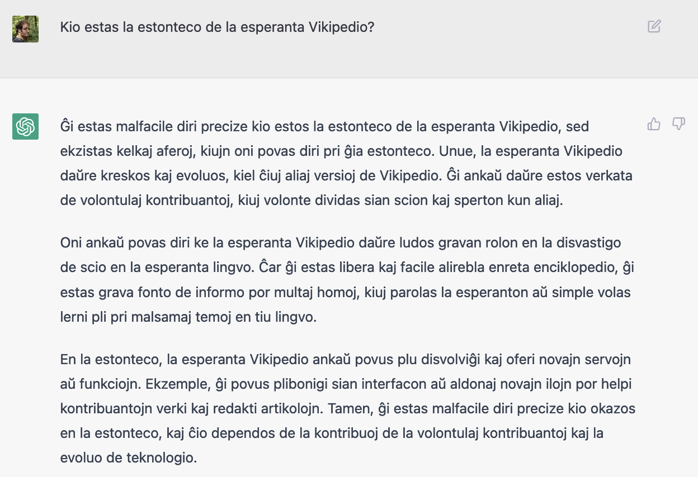
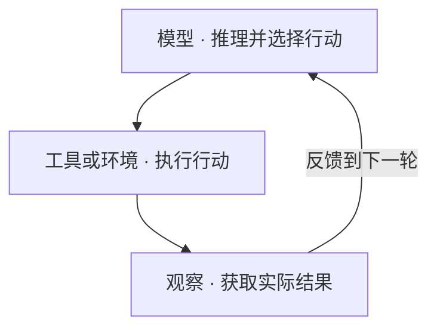
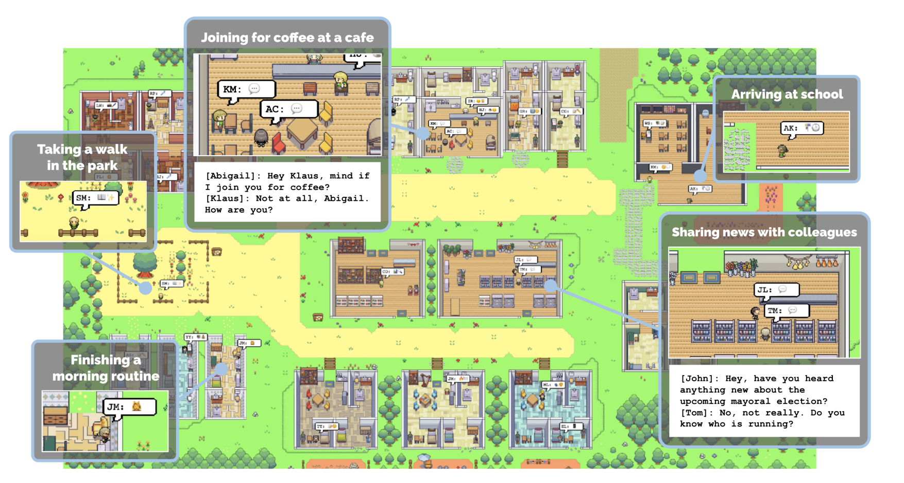
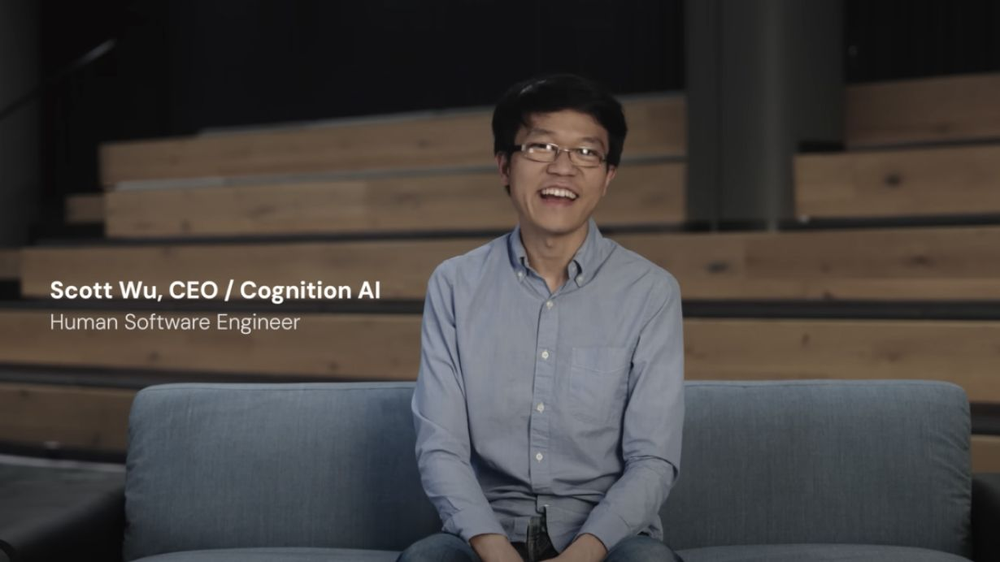
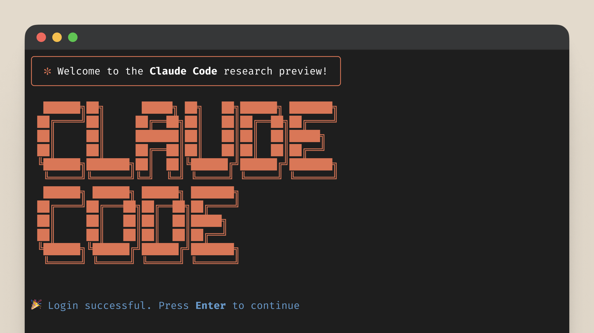

# 从 Transformer 到 Managed Agents：九年，大模型走向自主执行的完整脉络

回望过去，如果从 2017 年 Transformer 论文发表算起，LLM 到 Agent 的这段演进已经走过了九年。2017 年，谷歌研究团队发表《Attention Is All You Need》，提出 Transformer 架构，为后来大语言模型的发展奠定了关键基础。2022 年底，OpenAI 的 ChatGPT 横空出世，大语言模型由此破圈，走入公众视野。

从那以后，人们对 AI 的期待也在变化。起初是让它回答问题、写一段文字、补几行代码；后来是让它查完资料再给出报告，读懂仓库后修复问题，甚至自己操作软件，把一项工作做完。从“问它一个问题”到“交给它一个任务”，LLM 到 Agent 的变化逐渐变得具体。

这些标志性事件背后，有一条持续积累的技术脉络。ChatGPT 之前，预训练、指令对齐和外部信息获取已经铺垫多年；AutoGPT 让自主执行变得直观，也把循环失控、成本和验收的问题暴露出来；当 Claude Code、Manus 和 Codex 开始承接完整任务，上下文、记忆、工具与运行环境就必须一起工作。曾经分散的技术，逐步汇合成今天的 Agent 系统。

回望这段历史，我们一起看看那些标志性的产品与事件，理解它们为什么能在那个时刻出现，又为下一步留下了哪些基础与问题。

> 覆盖范围：2017 年 6 月至 2026 年 8 月，共 46 个代表性历史节点。日期按论文首次提交、官方发布或工程文章发表时间标注，同月不细分先后。

## 阅读导览

### 时间脉络

| 时期                      | 关键事件                                              | 技术变化                                                               |
| ----------------------- | ------------------------------------------------- | ------------------------------------------------------------------ |
| 2017—2021 模型基础与早期应用     | Transformer 论文、GPT 系列、Copilot 技术预览                | 预训练与上下文学习拓展模型的任务适应能力，代码生成开始进入日常开发环境。                               |
| 2022 对话成为入口             | ChatGPT 发布，CoT、ReAct 论文相继出现                       | 指令对齐改善对话体验，分步推理与行动反馈沿不同路线推进。                                       |
| 2023 从聊天走向自主尝试          | GPT-4、AutoGPT、斯坦福小镇                               | 更强的模型与工具、记忆和执行循环结合，自主尝试也暴露出纠错与验收的难题。                               |
| 2024 展示完整工作过程           | Devin 演示、o1-preview、Claude Computer Use、MCP       | 模型推理继续增强，工作环境、屏幕操作与工具连接逐步完善。                                       |
| 2025 把任务交给 Agent        | DeepSeek-R1、Deep Research、Claude Code、Manus、Codex | 推理能力的获取与部署方式更加丰富，检索、工具和运行设施汇合为承接完整任务的产品。                           |
| 2026（截至 8 月）走向持续执行与成本控制 | OpenClaw、Managed Agents 架构实践、长程应用开发案例             | 工程重心从模型能力扩展到 Harness，进一步关注长程执行、多渠道接入、多智能体协作、终端与云端双端演进，以及结果验证与运行成本。 |

下面的横轴选取代表性里程碑，每个节点同时标出事件和技术变化，点击可跳到正文。节点按时间顺序等距排列，间距不代表持续时长；完整时间线还包含支撑这些事件的论文、框架与工程实践。

<div id="timeline-overview"></div>

```timeline
{
  "title": "记住事件，再看懂技术",
  "description": "2017—2026 · 代表性里程碑，点击进入正文；节点等距，不代表持续时长。",
  "events": [
    {
      "date": "2017.06",
      "title": "Transformer 论文发表",
      "description": "注意力架构成为后续模型基础",
      "href": "#milestone-transformer"
    },
    {
      "date": "2021.06",
      "title": "Copilot 进入编辑器",
      "description": "代码模型 + 编辑器上下文",
      "href": "#milestone-github-copilot"
    },
    {
      "date": "2022.11",
      "title": "ChatGPT 发布",
      "description": "对话入口 + 指令与反馈训练",
      "href": "#milestone-chatgpt"
    },
    {
      "date": "2023.03",
      "title": "GPT-4 与 AutoGPT",
      "description": "更强模型 + 目标驱动执行循环",
      "href": "#milestone-autogpt"
    },
    {
      "date": "2023.04",
      "title": "斯坦福小镇",
      "description": "25 个 Agent 展示记忆、计划与互动",
      "href": "#milestone-generative-agents"
    },
    {
      "date": "2024.03",
      "title": "Devin 公开演示",
      "description": "终端、编辑器与浏览器组成工作环境",
      "href": "#milestone-devin"
    },
    {
      "date": "2024.09—11",
      "title": "o1、Computer Use、MCP",
      "description": "推理、屏幕操作与工具连接并行推进",
      "href": "#milestone-o1"
    },
    {
      "date": "2025.01",
      "title": "DeepSeek-R1 发布",
      "description": "开放权重、推理训练与蒸馏",
      "href": "#milestone-deepseek-r1"
    },
    {
      "date": "2025.02—03",
      "title": "Deep Research 与 Manus",
      "description": "从即时问答走向委派完整任务",
      "href": "#milestone-deep-research"
    },
    {
      "date": "2025.02—05",
      "title": "Claude Code 与 Codex",
      "description": "编程任务接入执行环境和测试反馈",
      "href": "#milestone-claude-code"
    },
    {
      "date": "2025.07",
      "title": "ChatGPT agent 发布",
      "description": "研究、操作与文件交付进入同一流程",
      "href": "#milestone-chatgpt-agent"
    },
    {
      "date": "2026.04",
      "title": "Managed Agents 架构实践",
      "description": "会话、执行循环与沙箱分离",
      "href": "#milestone-managed-agents"
    }
  ]
}
```

模型、知识、行动、编排与运行，这几条技术路线会在不同年份交错出现。先沿着事件往前走，文末再把它们放在一起对照。

文中穿插了一些解释机制的简化场景，不是实测记录；论文中的研究场景与厂商演示会分别注明。

## 2017—2021｜从专用模型到可提示的通用能力

后来回望，2017 年像是一个清晰的起点。身处当时，人们面对的仍是翻译、分类、文本生成等具体任务。一个模型能否把在一处学到的东西带到另一处，这个问题会贯穿接下来的几年。

<figure class="article-image timeline-stage-image" style="max-width: 420px; margin-inline: auto;">
  
  <figcaption>2017｜从这张架构图开始。左侧编码输入，右侧逐步生成输出，注意力连接起词语之间的关系。<br />来源：<a href="https://arxiv.org/html/1706.03762v7">Vaswani 等，《Attention Is All You Need》图 1</a>。</figcaption>
</figure>

<div id="milestone-transformer"></div>

### 2017.06｜Transformer：新的序列建模架构

2017 年 6 月，一篇题为《Attention Is All You Need》的论文出现了。今天回头看，Transformer 已经是大语言模型历史中绕不开的名字；把时间拨回当时，论文面前的任务却具体得多：怎样把一种语言，更好地翻译成另一种语言。

不妨从一句话看起：“When does this train leave?”要把它译成德文，机器需要处理词与词之间的关系，并组织出符合目标语言的表达。Transformer 用注意力机制建立这些联系，减少对逐步递归处理的依赖，让序列建模更适合并行训练。这种架构后来成为扩大语言模型训练规模的重要基础。

那时的模型还不会替用户查车次、订车票。目标、工具、记忆与行动反馈，都不包含在这篇架构论文的答案里。不过，一个更基础的问题已经摆到研究者面前：如果用这样的架构学习足够多的文本，得到的能力，能否超出最初训练它的那项任务？

**来源：** [Transformer](https://arxiv.org/abs/1706.03762)

### 2018.06｜GPT：生成式预训练再适配任务

一年后，生成式预训练开始给出自己的回答。2018 年 6 月，初代 GPT 先从未标注文本中学习语言模式，再通过监督微调，把学到的表示用于不同任务。

以影评分类为例，模型先阅读大量文本，随后再用带有好评、差评标签的影评进行训练。同一个预训练基础，可以继续适配分类、推断等工作。每换一道题就重新训练一套专用模型的做法，开始有了另一种选择。

这还不是今天输入一句话、模型便理解要求的体验。任务变了，往往仍要准备数据、调整参数。但预训练已经留下一份可以复用的积累。接下来的 GPT 系列会继续追问：模型变大以后，这些能力能不能在更少的任务训练下显现出来？

**来源：** [GPT](https://openai.com/index/language-unsupervised/)

### 2019.02｜GPT-2：长文本生成与暂缓完整发布

“雨夜里，一位旅客走进车站……”给出这样的开头，接下来的一段故事可以由模型续写。人物和情节未必始终自洽，但生成的文字已经足以让人继续读下去。

2019 年 2 月，OpenAI 发布 GPT-2 的研究成果，展示长文本生成，以及部分无需任务专用训练的问答、翻译和摘要能力。训练仍围绕下一词预测展开；到了使用时，输入的格式和内容开始承担引导任务的作用。提示逐渐成为使用模型的一种方法。

这次发布还有另一个让人记住的细节：出于对滥用的担忧，OpenAI 暂缓开放完整模型。能力如何增长、又应该如何开放，出现在同一次讨论里。与此同时，连贯的文字也暴露出一个容易混淆的地方——模型能顺着开头写下去，却未必准确遵循要求，更未必知道自己写的是否属实。

**来源：** [GPT-2](https://openai.com/index/better-language-models/)

### 2020.05｜RAG：把外部知识带入生成过程

文字写得越来越像样，事实从哪里来，却仍是一个问题。假设用户问起某位作家的出生地，模型可能记得，也可能给出一个听起来合理的地名。它需要一种办法，在作答前找到依据。

2020 年 5 月，RAG 论文把检索器与生成模型结合起来：先从外部文档中寻找相关材料，再以材料为条件生成答案。放到刚才的问题里，就是先找到人物资料，再据此组织回答。部分知识由此可以保存在模型之外，更新资料也不必全部依赖重新训练。

外部材料带来了依据，也带来了新的出错位置。检索可能找到错的人，文档可能过时，生成模型也可能误读原文。后来，无论是 Agent 自行检索，还是上下文工程选择当前所需的信息，都要继续处理这条信息链上的问题。

**来源：** [RAG](https://arxiv.org/abs/2005.11401)

### 2020.05｜GPT-3：Few-shot 与上下文学习

同一个月，GPT-3 展示了另一种适配任务的方式：把示例放进输入里，然后让模型照着做。

用一个简化例子就能看出变化。在上下文里写下“海 → sea、山 → mountain”，接着给出“河 →”，模型可以沿着前面的格式续出“river”。这次使用没有更新模型参数。任务说明和少量示例，成为模型完成当前任务的线索，这就是上下文学习。

对开发者而言，调整模型行为多了一条更直接的路径：先改提示，不必每次都进入训练流程。Prompt Engineering 的实践空间随之扩大。不过，示例换一组、措辞改一点，结果也可能变化。提示能把能力引出来，却还不能让它稳定地听懂要求、遵守事实或完成一连串工作。

**来源：** [GPT-3](https://arxiv.org/abs/2005.14165)

<div id="milestone-github-copilot"></div>

### 2021.06｜GitHub Copilot：代码建议出现在编辑器里

到 2021 年，代码生成有了一个更日常的位置：开发者正在使用的编辑器。6 月 29 日，GitHub 发布 Copilot 技术预览，模型开始在代码旁边给出整行乃至整个函数的建议。

试想正在写一个去重函数：函数名刚写好，再添上一句用途注释，候选实现便出现在编辑器里。支撑早期 Copilot 的是 OpenAI Codex，以及它从代码数据中学到的模式；正在编辑的代码，又为这一次生成提供了上下文。预训练能力与具体工作界面接到了一起。

开发者仍要决定接受哪段代码，亲自运行并检查结果。那时交到人手里的主要还是建议。但从这里再看后来 Devin、Claude Code 与 Codex 的任务执行，就能认出一条逐渐延长的工作链：生成之后，还要编辑文件、调用命令、读取报错，最后交付可以审查的改动。

**来源：** [Copilot 发布公告](https://github.blog/news-insights/product-news/introducing-github-copilot-ai-pair-programmer/)

### 2021.09｜FLAN：通过训练学习遵循指令

给模型看几道示例，能够让它接着完成类似任务。另一种想法是，把“按照要求做事”本身放进训练里。

2021 年 9 月的 FLAN 将多种任务改写成自然语言指令，再用这些数据微调模型，改善未见任务上的零样本表现。例如，面对一段影评，用户可以直接要求判断其情感倾向，而不必先列出几条“影评—标签”的示范。模型在训练阶段接触过多种指令形式，使用时便有机会把这种能力迁移过来。

这与修改提示发生在不同环节：前者更新参数，后者提供当前输入。指令训练使模型更接近一个能接受要求的助手；至于答案是否真实、是否符合人的偏好，以及能否把要求落实到环境里，还要继续往下走。

**来源：** [FLAN](https://arxiv.org/abs/2109.01652)

### 2021.12｜WebGPT：先浏览，再带引用回答

2021 年末，研究者把浏览器放进了模型的工作过程。WebGPT 在一个文本浏览环境中搜索、导航、收集引用，再回答较长的问题。

如果用“为什么海水是咸的”来说明，模型需要先找到资料，阅读相关段落，最后把解释和引用一起交给用户。人类的浏览示范与反馈，被用于训练这套行为。信息获取因而从生成前的一次检索，延伸为由多步操作组成的过程。

它仍围绕问答这一专用场景展开，距离通用工具平台和长期任务系统还有很长一段路。但这项研究已经留下了一个清楚的先例：在 ReAct 出现之前，语言模型就开始通过外部行动，为自己的回答寻找依据。

**来源：** [WebGPT](https://arxiv.org/abs/2112.09332)

## 2022｜指令、推理与行动开始结合

这一年最鲜明的记忆留在了年末：ChatGPT 出现在公众面前。而在它发布之前，关于如何听懂指令、如何展开推理、如何利用行动反馈的探索，已经分别向前推进。沿时间往回看，能辨认出这些并行的工作，也能看清它们各自解决了什么。

<figure class="article-image timeline-stage-image" style="max-width: 740px; margin-inline: auto;">
  
  <figcaption>2022｜一个问题，一段回答。发布数日后的这张截图，留下了早期 ChatGPT 的对话界面。<br />来源：<a href="https://commons.wikimedia.org/wiki/File:ChatGPT_Esperanto.png">Stefangrotz，2022-12-05，Wikimedia Commons</a>；<a href="https://creativecommons.org/licenses/by-sa/4.0/">CC BY-SA 4.0</a>，原图未修改。</figcaption>
</figure>

### 2022.01｜CoT：把求解过程拆成中间步骤

一道简单的算术题，可以让这种变化变得直观：三盒笔，每盒四支，送出五支，还剩多少？直接给出“7”，与先写出“三盒共 12 支，再减去 5 支”，最后得到答案，是两种不同的生成过程。

2022 年 1 月，Chain-of-Thought（CoT）研究发现，在提示示例里加入中间推理步骤，可以改善大模型在一些复杂推理任务上的表现。模型不再立即落到答案，而是先生成一段推导，让后续生成有更多中间信息可用。

这些步骤仍然来自模型内部的生成。它可以算对，也可以沿着错误前提写出一段很有说服力的解释。推理过程被展开了，外部世界却还没有参与检验。几个月后，ReAct 会把工具返回的结果带进这个过程；而沿着推理本身继续探索，则会走向多路径搜索。

**来源：** [CoT](https://arxiv.org/abs/2201.11903)

### 2022.03｜InstructGPT：人类反馈塑造助手行为

另一边，研究者在处理一个更贴近日常使用的问题：模型为什么经常写了很多，却没有做用户真正想让它做的事？

2022 年 3 月，InstructGPT 把人的示范与偏好纳入训练。先用人类示范进行监督微调，再让人比较不同回答，以此训练奖励模型，随后通过强化学习调整模型行为。假设用户要把一则通知改得简短、礼貌，训练希望鼓励的是符合要求的改写，而非继续扩写通知的背景。

“人更喜欢哪个回答”由此成为影响模型的训练信号。它帮助改善指令遵循，却不能自动保证事实正确，也不会给模型授予执行外部操作的权限。这条从人类反馈中学习的路线，很快会进入一个面向公众的对话产品；与之并行的另一条路线，则开始研究行动之后如何利用环境反馈。

**来源：** [InstructGPT](https://arxiv.org/abs/2203.02155)

### 2022.10｜ReAct：推理、行动、观察交替执行

桌上没有杯子，接下来该怎么办？如果任务是在一个文本交互环境中找杯子，模型可以先查看桌面，读到“没有找到”，再转向橱柜。前一次行动的结果，改变了下一次行动。

2022 年 10 月的 ReAct 把这种过程明确组织起来：推理、行动、观察交替进行。模型根据当前信息选择工具或环境操作，执行结果返回上下文，模型再据此决定下一步。与只在文字里展开推导相比，任务开始有机会接受外部信息的修正。

后来常见的 Agent 循环，在这里有了一个清晰的研究表达。不过，接上反馈只是开端。模型可能误读观察，也可能反复尝试同一个动作；什么时候换方法，什么时候停下来，怎样确认杯子真的找到了，都需要系统继续处理。下图中的回路，既是能力增长的入口，也是后来许多工程难题发生的地方。

**来源：** [ReAct](https://arxiv.org/abs/2210.03629)

下面把 ReAct 的核心交互关系展开：工具或环境返回的观察进入下一轮决策。这里示意推理与行动的交替，不表示每轮都必须调用工具；循环何时结束、任务如何验收，仍需由具体系统定义。



观察结果回到模型的下一轮上下文，使后续行动能够依据实际执行情况调整。

### 2022.10｜LangChain：把模型调用组合成应用

论文里的多步过程，到了开发者手中，需要变成可以连接和调试的代码。2022 年 10 月，LangChain 的早期 Python 包发布，模型调用、提示、数据与工具开始被组织进统一的开发抽象。

例如，把长文先送给模型生成摘要，再把摘要交给下一次调用拟定标题，开发者可以把这两步连成一条链。对于需要自主选择行动的任务，早期框架也提供了 Agent 相关能力。重复编写调用与连接代码的负担，因而有所减轻。

但当流程出现重试、回退、人工介入和多个分支，连接几次调用便不再足够。中途保存什么状态，下一步由谁决定，失败后从哪里恢复，会逐渐成为更显眼的问题。这些需求，后来会在 LangGraph 的图与状态抽象中得到进一步表达。

**来源：** [LangChain](https://www.langchain.com/blog/announcing-our-10m-seed-round-led-by-benchmark)

<div id="milestone-chatgpt"></div>

### 2022.11｜ChatGPT：打开网页，就能与模型连续对话

2022 年 11 月 30 日，OpenAI 以研究预览的形式发布 ChatGPT。此前几年积累的模型能力，终于有了一个几乎不需要解释的入口：在对话框里写下问题，然后继续追问。

“解释一下递归。”如果第一遍太难，还可以接着说：“换成小学生也能听懂的说法。”系统带着前文继续回答，用户不必先学会编写一组精巧的示例。基于 GPT-3.5 系列模型，以及人类示范和反馈训练，对话成为普通人接触大语言模型的日常方式。

这次破圈改变了人们感知技术的尺度。一篇论文里的指标，变成了眼前可以反复尝试的交流体验。但对话框外的工作，大多仍由人来完成：复制代码、打开软件、查验答案。越是容易交谈，一个新的期待就越自然——既然能告诉我怎么做，能不能接着帮我做完？

**来源：** [ChatGPT](https://openai.com/index/chatgpt/)

## 2023｜Agent 的关键部件密集出现

ChatGPT 之后，人们开始把更多期待放到对话框之外。2023 年，GPT-4、AutoGPT 与斯坦福小镇接连出现：更复杂的要求、连续行动的程序、有记忆的虚拟居民，给 Agent 留下了几幅鲜明的画面。与这些尝试一起到来的，还有一个越来越难绕过的问题：过程看起来像在工作，怎样确认工作真的完成了？

<figure class="article-image timeline-stage-image" style="max-width: 740px; margin-inline: auto;">
  
  <figcaption>2023｜25 个 Agent 生活的小镇。喝咖啡、上学、交换消息，这些日常场景让记忆、计划与互动变得可见。<br />来源：<a href="https://cs.stanford.edu/~merrie/ai.html">Park 等，Generative Agents；作者研究页</a>。</figcaption>
</figure>

### 2023.02｜Toolformer：研究如何学会调用工具

要让模型动手，首先得解决一个具体问题：它何时应该停止生成文字，转而调用工具？

2023 年 2 月，Toolformer 从训练入手，让模型学习何时调用 API、选择什么调用，以及怎样利用返回结果。用一道乘法题说明，遇到“17 × 23”时，模型可以借助计算器得到 391，再把结果接回生成过程。工具调用的位置与内容，也可以成为模型从数据中学习的行为。

真正执行 API 的仍是外部程序。调用是否被允许、参数是否有效、失败后如何处理，都不能靠模型学会一种输出格式就解决。接下来的 Function Calling 会让调用接口更加规整，而可靠执行还需要接口之外的约束。

**来源：** [Toolformer](https://arxiv.org/abs/2302.04761)

### 2023.03｜GPT-4：更强的通用模型成为应用基础

2023 年 3 月 14 日，GPT-4 发布。对已经习惯 ChatGPT 的用户来说，更强的复杂指令处理能力，使此前需要反复解释的任务，有了进一步交给模型的可能。发布时展示的图像输入能力也拓展了想象空间，不过当时仍处于研究预览阶段。

不妨把任务换成一段带报错的代码，并附上要求：“修复问题，但保持现有接口不变。”模型需要同时理解代码、错误和修改边界。预训练与后训练所形成的能力，为这类复杂任务提供了更强的基础，也成为随后 AutoGPT 等自主执行尝试的重要支撑。

可是在聊天里给出一份看似合理的补丁，距离真实仓库里的修复还隔着几步：文件需要改动，依赖需要安装，测试需要运行。模型仍会出错，基准表现也不能直接换算成工作完成率。更强的模型把可尝试的任务推远了，也让执行环节的缺口更加明显。

**来源：** [GPT-4 发布公告](https://openai.com/index/gpt-4-research/)

### 2023.03｜Reflexion：把失败反馈带入下一次尝试

第一次写出的函数没有通过空列表测试。第二次尝试前，如果能留下一句“上次遗漏了空输入，需要先处理这个分支”，下一轮便不必完全从头摸索。

2023 年 3 月的 Reflexion 用反馈生成文字反思，并把它保存在记忆中，供后续尝试参考。调整发生在运行过程的上下文里，不需要为这次失败更新模型权重。模型开始尝试把一次执行的教训，转成下一次执行能够读取的材料。

问题在于，反思也可能写错。测试若没有覆盖真正的缺陷，模型甚至会把偶然通过的做法记成经验。反馈由谁提供、记忆保留什么、重试到什么时候停止，决定了这套过程是在积累经验，还是在重复强化误判。

**来源：** [Reflexion](https://arxiv.org/abs/2303.11366)

<div id="milestone-autogpt"></div>

### 2023.03｜AutoGPT：给一个目标，让程序连续尝试

同年 3 月，AutoGPT 早期仓库出现。给出一个目标，再让模型自己拆解、调用工具、读取结果、继续行动——这种可以亲眼看到的运行方式，让“自主 Agent”迅速成为人们尝试的新方向。

假设目标是整理三家公司的公开资料，系统就要判断先搜哪一家，把材料写到哪里，还有哪些缺口需要补查。GPT-4 等模型与搜索、文件、记忆和循环控制被接在一起，用户从一轮轮下达指令，转向观察任务自行向前推进。

真正跑起来后，过程未必一直向前。它可能反复搜索相似内容，消耗越来越多的调用，却迟迟不能交付；也可能宣称完成，而文件里仍缺了关键材料。AutoGPT 留下的记忆因此有两面：自主执行的可能性变得直观，目标、成本、停止条件与结果验收的问题也同时浮出水面。

**来源：** [AutoGPT 早期 README（v0.2.0，含 3 月演示）](https://github.com/Significant-Gravitas/AutoGPT/blob/v0.2.0/README.md)

<div id="milestone-generative-agents"></div>

### 2023.04｜Generative Agents：斯坦福小镇里的 25 个 Agent

2023 年 4 月，一座由 25 个 Agent 组成的小镇进入研究视野。让人记住这项工作的，是居民之间看起来连贯的日常：消息会传播，安排会变化，角色会依据过去的经历做出新的行动。

论文中，一个角色被赋予举办派对的意图，随后出现了邀请、约会安排和出席等互动。这些行为背后，观察被写入记忆，相关经历通过检索进入当前情境，反思形成更高层的认识，再参与后续计划。记忆不再只是附在对话后面的记录，而是持续影响行动的组成部分。

“斯坦福小镇”展示了有记忆、有计划的角色如何形成可信的模拟行为。这份可信感令人印象深刻，却不能直接等同于真实工作中的可靠性。把任务交给 Agent，还需要更明确的正确答案、约束和验收方式；社会模拟与工作交付，在这里提出了不同的要求。

**来源：** [Generative Agents](https://arxiv.org/abs/2304.03442)

### 2023.05｜Tree of Thoughts：搜索多条推理路径

一个推理方向走不通，能不能退回来，试另一条路？2023 年 5 月，Tree of Thoughts 将这种搜索思路引入语言模型的解题过程。

以 24 点为例，系统可以先生成若干组运算思路，评估哪些值得继续，再沿候选分支展开；遇到死路则回溯。一次生成由此扩展成多次生成、评价与选择。与 CoT 沿着一条推理链继续相比，系统把一部分推理过程交给了显式搜索。

多尝试几条路需要更多计算，而模型对候选路径的判断也可能有偏差。这种方法没有消除错误，只是提供了组织推理计算的另一种办法。这里的“树”是解题路径的搜索结构，不能直接当作后来多 Agent 组织关系的图。

**来源：** [Tree of Thoughts](https://arxiv.org/abs/2305.10601)

### 2023.06｜Function Calling：工具调用进入标准 API

到了 2023 年 6 月，工具调用开始有了更明确的接口形态。OpenAI 在 API 中推出 Function Calling：开发者声明函数及其参数，模型可以返回对应的函数名和结构化参数。

用户问“北京现在天气怎么样”，模型可以生成一次北京天气查询。应用读取这些参数，调用天气服务，再把结果交回模型组织回答。过去需要从一段自然语言里猜测调用意图的地方，有了更容易被程序处理的表达。

接口规整之后，责任边界也更容易看清。模型提出调用，宿主程序执行调用；参数格式正确，不代表操作被授权，更不代表结果真实。后来 MCP 处理的是工具如何被发现和连接，与这里的调用表达相互补充。

**来源：** [Function Calling](https://openai.com/index/function-calling-and-other-api-updates/)

### 2023.08｜AutoGen：将多角色对话组织成协作

如果一个模型负责写代码，另一个角色负责运行代码并返回报错，任务能否在角色之间往返推进？2023 年 8 月的 AutoGen 把这类协作组织成可编程的多角色对话，让模型、人和工具参与其中。

一段程序在执行端报错后，错误信息可以回到编写端，触发下一次修改。开发者由此能够用角色及其交流规则搭建协作过程，而不必把全部工作挤进一次调用里。

角色增加，协调问题也随之出现：几轮交流之后，是解决了问题，还是只是多写了一些解释？重复工作、意见冲突和调用成本，都可能抵消分工的收益。多 Agent 的价值开始需要通过任务结果来证明，而不能只看参与者的数量。

**来源：** [AutoGen](https://arxiv.org/abs/2308.08155)

### 2023.10｜SWE-bench：用真实仓库问题评测能力

怎样判断一个编程 Agent 真的有用？2023 年 10 月，SWE-bench 把问题落到了真实 GitHub 仓库的 issue、代码修改和测试上。

面对一个历史问题，系统需要读懂仓库、提出补丁，再接受测试。目标问题是否修好，原有功能是否被破坏，都比“这段解释看起来是否专业”更接近开发者关心的结果。评价对象也因此扩展为模型、工具和运行环境共同完成的工作。

这仍是一组有边界的任务与测试，不能覆盖软件生产中的全部要求。但它提供了一个重要的尺度：代码生成之后，可以用执行结果检验承诺。此后的编程 Agent 演示与研究，会不断回到这类可核对的任务上。

**来源：** [SWE-bench](https://arxiv.org/abs/2310.06770)

### 2023.10｜MemGPT：把上下文当作分层存储来管理

同在 2023 年 10 月，MemGPT 关注的是另一种会在长期交互中反复出现的失败：模型并非从未知道，而是此刻已经看不到。

假设用户早先说过不吃花生，多轮对话之后又请系统安排菜单。只把最近的消息送进上下文，那条偏好可能已经消失。MemGPT 借鉴分层存储的思路，在有限上下文与外部存储之间管理信息，让历史材料在需要时重新进入模型可见的范围。

把信息存下来只是第一步。什么时候取回、取回哪一条、旧信息是否仍然有效，都会影响当前判断。后来上下文工程讨论的压缩、记忆与检索，并非凭空出现；在这里，有限窗口与持续任务之间的矛盾已经十分清楚。

**来源：** [MemGPT](https://arxiv.org/abs/2310.08560)

## 2024｜把运行结构与外部接口做明确

到了 2024 年，工作环境逐渐进入主角的位置。终端、编辑器、浏览器，乃至鼠标与键盘，都开始出现在 Agent 的行动范围里。模型还在继续变强，人们也逐渐发现：它面前摆着什么工具、能看到怎样的反馈，同样会改变任务的结果。

<figure class="article-image timeline-stage-image" style="max-width: 740px; margin-inline: auto;">
  
  <figcaption>2024｜Scott Wu 在 Devin 发布视频中介绍产品。随后的演示把终端、编辑器与浏览器放进同一段开发过程；这张图记录的是发布时刻。<br />来源：<a href="https://cognition.com/blog/introducing-devin">Cognition，Devin 官方发布，2024-03-12</a>。</figcaption>
</figure>

### 2024.01｜LangGraph：显式表达带循环的运行图

代码修改之后运行测试，失败就回去重写，通过才结束。这样的回路可以交给模型临时判断，也可以由程序明确规定。2024 年 1 月 17 日发布的 LangGraph，让带循环的运行图成为开发者可以直接表达的结构。

模型调用、工具执行和其他操作被放进节点，当前状态决定接下来走哪条边。分支与回路从对话中的隐含约定，变成能够检查的程序结构。只是，图画得清楚，节点仍可能失败；路由条件是否合理、结束时检查什么，依然需要设计。

这也是回看后续历史时需要记住的一点：图式 Agent 编排在 2024 年已经存在。两年后出现的 Graph Engineering 讨论，是在更广泛的组织与依赖问题上继续展开，并非图第一次进入 Agent 系统。

**来源：** [LangGraph](https://www.langchain.com/blog/langgraph)

<div id="milestone-devin"></div>

### 2024.03｜Devin：AI 软件工程师的公开演示

2024 年 3 月 12 日，Cognition 展示 Devin。演示画面里，终端、编辑器和浏览器共同构成了一处工作环境。AI 写下的代码，可以在这里接着运行。

在官方的一个案例中，Devin 构建“生命游戏”交互网站，根据用户要求增加功能，再将应用部署出去。任务上下文、规划、工具操作与用户反馈被接进同一个过程。相较于在编辑器里接受一段补全，用户现在看到的是一项开发工作从要求走向可访问成果的尝试。

这幅工作画面足以解释它为什么成为里程碑，但厂商演示与自报评测仍有各自的边界，既不能证明普遍替代工程师，也不足以还原全部内部架构。真正值得继续追问的是：模型通过怎样的接口工作，出了错能否发现，又依靠什么完成修正？同年的 SWE-agent 会把研究焦点放到这些交互细节上。

**来源：** [Devin 发布与演示](https://cognition.com/blog/introducing-devin)

### 2024.05｜SWE-agent：工具界面设计影响 Agent 表现

一个函数出了错。模型是一次读入整个文件，还是先搜索函数位置，只看相关代码行？修改失败时，它收到的反馈是否足够清楚？这些看似细小的界面选择，可能改变整个任务的结果。

2024 年 5 月，SWE-agent 围绕 Agent-Computer Interface 研究仓库搜索、文件编辑与测试接口。工具的命令和输出被设计得更适合模型使用，让它能逐步定位、修改，再读取执行反馈。模型本身之外，它与环境交互的方式，也成为可以优化的性能变量。

接口不能消除推理错误，状态与环境仍需妥善管理。但后来被归入 Harness 的许多工作，在这里已经有了具体形状：改善模型周围的软件，可能与更换模型一样值得认真研究。

**来源：** [SWE-agent](https://arxiv.org/abs/2405.15793)

<div id="milestone-o1"></div>

### 2024.09｜o1：回答之前，先花更多计算进行推理

到了 2024 年 9 月，另一种变化发生在回答出现之前。OpenAI 发布 o1-preview，把更多推理计算带进了用户等待的那段时间。

给模型一道有多重约束的分组问题：每组人数有限，有些人不能同组，还要满足其他安排。系统在给出结果前投入更多计算，尝试处理这些相互牵制的条件。官方介绍的路线包括用强化学习提升推理，以及在推理时使用更多计算；它与在外部提示中手工安排几步思考，发生在不同层面。

等待更久，仍不能代替逐条核对约束；模型内部推演过一次操作，也不意味着外部工具真的执行过。不过，当模型能够承担更多规划与纠错，原先必须由程序细致拆分的步骤，就有了重新审视的空间。Harness 的合适形态，会随着模型能力一起变化。

**来源：** [o1](https://openai.com/index/learning-to-reason-with-llms/)

### 2024.10｜Computer Use：Claude 开始看屏幕、点鼠标

一个月后，行动的入口从 API 延伸到了屏幕。10 月 22 日，Anthropic 推出 computer use 公开测试，让 Claude 通过截图观察界面，再选择点击、输入等操作。

假设要把网页上的地址填进另一张表单，Agent 可以先定位地址，再切换到目标界面，点击字段并输入，随后观察填写结果。即使应用没有专门提供业务 API，面向人的软件界面也可能成为它完成任务的通道。

真实界面不会永远停在预期的位置：页面可能变化，按钮可能点偏，一个小错误还可能沿着长操作链继续传递。能看屏幕、能动鼠标之后，恢复、权限与执行隔离的问题变得更加具体。Agent 越接近日常工作环境，就越需要处理日常工作中那些不按计划出现的情况。

**来源：** [Computer Use](https://www.anthropic.com/news/3-5-models-and-computer-use)

### 2024.11｜MCP：Anthropic 发布连接工具与数据的开放协议

工具越来越多，连接它们的重复劳动也越来越多。一个助手要读文件，另一个要查数据库，每换一个应用，相关接入常常又要做一遍。

2024 年 11 月 25 日，Anthropic 发布 Model Context Protocol。客户端与服务器按照开放协议交换工具、资源等信息，为应用连接外部数据和能力提供共同约定。以文件检索为例，桌面助手可以连接提供该能力的服务器，获取工具描述，发起搜索，再使用返回的项目资料。

统一连接方式，并不会同时统一所有权限和业务规则。哪些文件能访问，何时应当搜索，找到内容后如何判断，仍由具体系统承担。把 MCP 与 Function Calling 放在一起看会更清楚：前者帮助接入能力，后者表达模型想进行的调用，而完成任务需要将它们放进更完整的执行过程。

**来源：** [MCP](https://www.anthropic.com/news/model-context-protocol)

### 2024.12｜Workflow 与 Agent：控制权的区别被讲清

2024 年接近尾声时，一个架构选择被说得更清楚了：下一步由程序预先规定，还是交给模型根据当前情况决定？Anthropic 的《Building Effective Agents》围绕这一差别，区分工作流与 Agent，并总结路由、并行、协调执行和评价优化等组合方式。

处理常规订单咨询，“读取订单、查询状态、生成回复”可以走固定流程。遇到原因不明的异常，则可能需要模型决定继续查日志，还是向用户补充提问。前者便于约束，后者保留了应对未知情况的余地，代价是更难预测过程与成本。

沿着这一点回看，架构并不需要在固定流程与自主执行之间二选一。一个任务可以把它们放在不同位置，甚至放进同一张图里。值得设计的，是每一步到底需要多少自主性。

**来源：** [Workflow 与 Agent](https://www.anthropic.com/engineering/building-effective-agents)

## 2025｜走向真实工作与长程执行

2025 年初，推理模型有了更多开放的研究与部署入口，承接完整任务的产品也密集出现。研究、写代码、整理文件，各有不同的工作界面，却开始共享一种体验：交代目标，离开一会儿，再回来检查结果。那段用户没有逐步参与的时间里，系统需要自己维持工作。任务越长，上下文、记忆和交接就越难被忽略。

<figure class="article-image timeline-stage-image" style="max-width: 740px; margin-inline: auto;">
  
  <figcaption>2025｜终端里的新入口。Claude Code 初次发布时的欢迎画面，记录了开发者开始直接在工作区委派任务的产品形态。<br />来源：<a href="https://www.anthropic.com/news/claude-3-7-sonnet">Anthropic，Claude Code 研究预览，2025-02-24</a>。</figcaption>
</figure>

<div id="milestone-deepseek-r1"></div>

### 2025.01｜DeepSeek-R1：开放模型权重与推理技术报告

2025 年 1 月 20 日，DeepSeek-R1 发布，开放权重与蒸馏模型随后成为开发者可以下载、部署和研究的对象。对于推理模型，人们有了在线使用之外的选择。

技术报告展开了两条相关而不同的路线：R1-Zero 探索不经过监督微调预备阶段的大规模强化学习；R1 加入冷启动数据与多阶段训练，并通过蒸馏把推理能力迁移到较小模型。这里的学习会改变参数，与 Reflexion 在任务运行中留下文字反思，属于不同层次的改进。

一支团队可以选取开放的蒸馏模型，在满足硬件条件的环境里部署，再用自己的题集观察表现。这样的研究入口很具体，结论也需要保持具体：小模型的结果不能替代完整 R1 的表现，推理题上的进步也不能直接证明长程工具任务可靠。模型能力更容易被获取之后，如何把它组织成可用系统，依然是下一段工作。

**来源：** [R1 发布公告](https://api-docs.deepseek.com/news/news250120/)；[DeepSeek-R1 技术报告](https://arxiv.org/abs/2501.12948)

<div id="milestone-deep-research"></div>

### 2025.02｜Deep Research：一次委托，返回带来源的研究报告

“比较三种电池技术的适用场景。”这样的要求，往往需要搜集资料、辨认条件、比较差异，最后才轮到写作。2025 年 2 月 2 日，OpenAI 在 ChatGPT 中推出 deep research，把这一整段过程纳入了用户可以委派的任务。

发布时的系统使用针对浏览与数据分析优化的 o3 版本，依据新找到的材料继续搜索、调整路径，再生成带来源的报告。交互节奏由此发生变化：提交问题后，用户可以等待研究过程展开，而不必亲自把每一个搜索问题接下去。

从 WebGPT 的浏览问答回望，这是一条持续扩展的能力路线。不过，一份有引用的报告仍可能误读资料，或把推断写成事实。研究过程可以委派，结论与来源之间的关系仍要核查。同年稍后，多 Agent Research 会展示另一种组织这类工作的办法。

**来源：** [Deep Research 发布公告](https://openai.com/index/introducing-deep-research/)

<div id="milestone-claude-code"></div>

### 2025.02｜Claude Code：在终端中委派代码工作

同一个月，开发者在终端里迎来了新的工作入口。2 月 24 日，Claude Code 以有限研究预览发布，模型可以在代码工作区中读写文件、调用命令并运行测试。

“修复日期解析失败的问题。”收到这样的任务后，系统可以寻找相关实现，修改代码，运行测试，再根据报错继续调整。此前需要开发者在聊天窗口与编辑器之间搬运的内容，开始直接参与实际文件的修改。执行结果，也成为模型下一轮工作能读取的信息。

仓库越复杂，这种连续工作越依赖周围的管理：哪些操作允许执行，当前命令是否结束，还有哪些上下文需要保留，用户又该在何处接管。工具、反馈与工作区汇合到同一个产品后，Harness 的问题便不再抽象。

**来源：** [Claude Code](https://www.anthropic.com/news/claude-3-7-sonnet)

### 2025.03｜Manus：面向完整任务的通用 Agent 产品

2025 年 3 月，Manus 以通用 Agent 产品的形态公开亮相。任务入口进一步面向非开发者：描述希望得到的成果，产品组织后面的执行过程。

比如，要求整理几款产品的公开信息，交付一张比较表。这个目标背后包含检索、字段提取、缺失信息处理和文件整理；用户不需要自己写工具循环，却会在最终交付时直接感受到这些环节是否衔接得好。漂亮的成品展示可以说明方向，能否在不同任务中稳定做到、成本是否合适，还要分别检验。

到了同年 7 月，团队的工程回顾为这种体验补上了一部分技术解释：在前沿模型之上，通过上下文组织、文件系统与错误记录支持 Agent 执行。这是后来披露的经验，不能倒推为 3 月全部内部实现的记录。它让一个问题变得更加清楚：用户只交代了一次目标，系统却要在此后的每一步，持续决定模型应该看到什么。

**来源：** [Manus 2025 年 3 月用户活动](https://events.manus.im/events/manus-meetup-provo)；[团队 7 月工程回顾](https://manus.im/blog/Context-Engineering-for-AI-Agents-Lessons-from-Building-Manus)

### 2025.03｜Responses API / Agents SDK：通用运行部件

产品之外，通用部件也在逐渐齐备。2025 年 3 月 11 日，OpenAI 发布 Responses API、内置工具与 Agents SDK，将工具使用、执行编排和运行追踪提供给开发者。

假设一个咨询 Agent 判断用户的问题涉及订单，它可以把工作交给具备订单查询工具的专门 Agent，再将结果返回。开发者沿着运行轨迹，能够检查交接发生在哪里、调用了什么工具。反复出现的运行逻辑，有了可复用的实现。

业务中最重要的一些决定仍留在应用一侧：怎样算问题解决了，查不到订单时怎么办，哪一步必须停止。SDK 帮助组织过程，任务的正确目标与验收条件还需要团队自己定义。

**来源：** [Responses API / Agents SDK](https://openai.com/index/new-tools-for-building-agents/)

### 2025.04｜A2A：不同系统中的 Agent 如何协作

当不同团队都开始部署自己的 Agent，协作便会跨出单个应用的边界。2025 年 4 月 9 日，Google 发布 Agent2Agent 协议，推动不同系统和供应商的 Agent 互操作。

可以设想，差旅系统把“查询符合条件的酒店”交给另一套系统中的 Agent，接收进度与结果，再继续安排出行。能力发现、任务交流和协调有了协议层的约定。与 MCP 面向工具和数据的连接相比，A2A 关注的是另一个能够承接任务的参与者。

双方能够通信之后，仍要回答谁负责什么、结果能否相信、权限是否足够，以及等待与调用的成本如何控制。协议把消息送到对方，整体工作是否因此更有效，还取决于分工与验收的设计。

**来源：** [A2A](https://developers.googleblog.com/a2a-a-new-era-of-agent-interoperability/)

### 2025.05｜Codex：把开发任务交给云端执行

“Codex”这个名字，在 2025 年 5 月 16 日有了新的产品含义。OpenAI 发布云端 Codex 研究预览，任务可以在预装仓库的独立沙箱里执行。这里的主角，是一个承接开发任务的 Agent 产品，区别于 2021 年支撑早期 Copilot 的同名模型。

开发者可以把“修复导出 CSV 时的编码问题”交出去，先去处理其他工作，再回来审查文件改动、终端记录和测试结果。发布时的 codex-1 模型与文件、命令行工具及隔离环境配合，围绕实际反馈继续完成任务。建议代码的即时互动，延伸出了异步委派与验收的工作方式。

初始版本仍受环境与联网条件限制，仓库配置和测试覆盖也会影响任务质量。即使测试全部通过，还要确认真正的需求是否满足。与终端中的 Claude Code 放在一起看，两种入口各有侧重，却都绕不开上下文、执行状态和交付检查。

**来源：** [Codex 云端研究预览公告](https://openai.com/index/introducing-codex/)

### 2025.06｜多 Agent Research：并行协作的真实工程

研究工作里，有些问题可以同时展开。了解一个行业时，政策、产品和市场的资料搜集往往具有一定独立性，没必要始终挤在一条串行路径上。

2025 年 6 月，Anthropic 介绍其 Research 系统：主 Agent 分派工作，多个子 Agent 并行检索与分析，再汇合结果。多角色协作由此进入具体的工程细节——子任务怎样划分，携带哪些上下文，找到的材料如何交回。

并行带来的收益，需要与额外调用和协调开销一起衡量。两个子任务若高度依赖彼此，拆开反而可能增加反复交流；找到相互矛盾的来源，也不能靠简单拼接解决。有效的组织结构来自任务特点，而非角色越多越好。

**来源：** [多 Agent Research](https://www.anthropic.com/engineering/multi-agent-research-system)

<div id="milestone-chatgpt-agent"></div>

### 2025.07｜ChatGPT agent：研究与操作进入同一任务

2025 年 7 月 17 日，ChatGPT agent 发布。回到那个让大语言模型破圈的对话入口，用户现在可以委派一项需要研究、操作软件并生成文件的工作。

官方发布中的一个例子，是分析三家竞争对手，再制作演示文稿。Operator 的网页操作、deep research 的信息综合与对话能力被结合起来，系统在虚拟计算机中使用浏览器、代码和其他工具，交替推理与行动。用户可以中断或接管，重要操作需要确认。

从 2022 年的一问一答走到这里，变化已经能够用交付物来辨认。但行动范围扩大，也意味着网页状态、工具错误与外部内容干扰都可能进入任务。一个熟悉的对话框背后，需要管理的过程，比三年前复杂得多。

**来源：** [ChatGPT agent 发布公告](https://openai.com/index/introducing-chatgpt-agent/)

### 2025.09｜Context Engineering：管理每一步的信息状态

任务做到一半，上下文里已经堆满搜索结果、代码片段、报错与历史对话。下一次模型调用，到底应该带上什么？

2025 年 9 月 29 日，Anthropic 系统总结 Context Engineering，把指令、工具、历史、资料与记忆放到持续管理信息的视角下。对于一个正在修改代码的任务，当前目标、相关文件和最近的测试失败可能需要保留；已完成步骤可以压成摘要，详细记录则留下可查找的位置。按需检索、压缩、结构化笔记和必要的任务拆分，共同服务于下一步决策。

这项工程工作有比名称更长的前史，RAG 和 MemGPT 已经分别处理过外部知识与有限窗口的问题。窗口变长之后，过期、重复和冲突的信息依然存在。能放进去多少内容，与当前一步真正需要看到什么，是两个需要分别处理的问题。

**来源：** [Context Engineering](https://www.anthropic.com/engineering/effective-context-engineering-for-ai-agents)

### 2025.10｜Agent Skills：把领域操作知识做成可复用包

团队做了很多次月报，已经沉淀了字段口径、汇总脚本与输出模板。每接到一次任务，都重新把这些内容解释给 Agent，既费力，也容易遗漏。

2025 年 10 月 16 日，Anthropic 介绍 Agent Skills，将指令、脚本与资源组织成可按需加载的目录。Agent 遇到相关工作时，先发现技能，再读取所需材料，必要时执行其中的脚本。已有的操作方法由此可以保存和复用。这里记录的是最初介绍，后续开放标准的发布在 12 月 18 日。

这些材料仍需要维护，也要接受实际执行的检验。一份过时的指南可能稳定地带来错误。把 Skills 放回系统里看，它保存“怎么做”的知识，MCP 提供连接能力的方式，Harness 则组织执行与反馈。它们在任务里相遇，承担的职责各不相同。

**来源：** [Agent Skills](https://www.anthropic.com/engineering/equipping-agents-for-the-real-world-with-agent-skills)

### 2025.11｜长程 Harness：跨会话持续完成工作

登录功能刚做好，会话却接近上下文上限。下一轮打开时，模型怎样知道哪些代码已经可用，哪些只是尝试过，接下来又该做什么？当开发任务跨越多个窗口，交接本身就成为一项工作。

2025 年 11 月 26 日，Anthropic 展示初始化、增量实现与结构化交接的长程开发实践。明确的功能清单、进度记录和经过验证的产物，让下一轮可以读取当前状态，从尚未完成的搜索功能继续，而不必依靠上一轮的一段口头总结猜测进展。

仅仅压缩上下文还不够。Agent 可能一次展开太多工作，也可能在功能未完成时提前收尾。Harness 在这里集中处理的是持续执行的可靠性；它并非此时才出现，而是随着任务变长，原本散落在运行过程中的责任被进一步明确下来。

**来源：** [长程 Harness](https://www.anthropic.com/engineering/effective-harnesses-for-long-running-agents)

## 2026｜走向持续执行、系统评测与成本控制

沿时间线走到 2026 年，关注点进一步落到 Agent 怎样持续工作。任务可能从聊天渠道发起，在云端或本地计算机中执行，跨越多个会话，必要时交给其他 Agent 接续或分工。早期演示让人看到“它能做”，持续使用则要求回答：能否稳定做完，结果能否验证，时间和成本是否值得。

<figure class="article-image timeline-stage-image" style="max-width: 560px; margin-inline: auto;">
  
  <figcaption>2026｜持续工作背后的分工。会话记录、执行循环、沙箱、工具与调度被拆成独立部件，为状态保存、接续和运行管理提供结构。<br />来源：<a href="https://www.anthropic.com/engineering/managed-agents">Anthropic，Managed Agents，2026-04-08</a>。</figcaption>
</figure>

OpenClaw 提供了一个具体观察窗口：其 2026.8.1 版本将消息渠道、会话存储、记忆、自动化、原生应用与云端或配对计算机上的会话纳入同一套产品。把它与 Managed Agents 的会话、执行循环和沙箱拆分放在一起看，可以理解云端运行与本地执行、多渠道入口为何需要配套的状态与运行管理。[OpenClaw 2026.8.1 发布说明](https://docs.openclaw.ai/releases/2026.8.1)

这时，工程重心从单次模型调用扩展到 Harness：单个 Agent 需要管理上下文、状态、工具和失败恢复；长程任务需要交接与验收，多 Agent 协作还要处理分工与信息传递。执行轮次越多、参与角色越多，时间和调用成本也越需要被记录和评估。持续执行、可验证、可评测与成本可控，因而成为相互关联的工程目标。

这里的沉淀，是开始把一次成功拆开审视：模型选对了行动，工具执行成功，状态没有丢失，结果也通过了验收，才构成一次完整交付。下面既有具体架构实践，也有研究提案，需要按各自的证据范围理解。

### 2026.01｜Agent Evals：从答案评分到执行系统评测

“文件已导出。”这句话之后，任务真的完成了吗？文件可能不存在，也可能少了列、漏了行。对 Agent 的评价，需要继续走进它操作过的环境。

2026 年 1 月 9 日，Anthropic 总结 Agent 评测方法，将多轮工具使用、状态变化、实际结果与执行轨迹一起纳入观察。沿用导出文件的例子，评分器可以检查文件是否存在、列名和行数是否符合要求，同时记录调用成本；重复运行，还能观察结果是否稳定。

评测并非到这时才出现，SWE-bench 等工作早已提供了先例。随着任务类型增多，难题更多地落在怎样写出可靠的验收标准。如果评分器把错误当成功，系统就可能沿着错误方向持续优化。每一次 Harness 或循环结构的修改，最终都需要回到这些具体结果上。

**来源：** [Agent Evals](https://www.anthropic.com/engineering/demystifying-evals-for-ai-agents)

### 2026.03｜生成—评价—改进：闭环设计进一步具体化

一个任务看板已经有了页面，按钮也都摆在合适的位置。可真正点击“删除”时，卡片没有消失。如果评价只看页面截图，这项任务就可能被过早宣布完成。

2026 年 3 月 24 日，Anthropic 展示由规划、生成和评价角色组成的长程应用开发结构。以这个简化场景理解，生成者实现页面，评价者按事先明确的标准检查新增与删除，把失败步骤交回修订。可处理的任务、交接产物与具体反馈，使下一轮改进有了落点。

模型自评也会误判，因此评价标准、预算和停止条件必须一同设计。用 Loop Engineering 概括这种视角是有帮助的，但它并不意味着反馈循环刚刚诞生。从 ReAct 到 Reflexion，再到这些开发实践，人们一直在追问：怎样让下一轮比上一轮更接近完成？

**来源：** [生成—评价—改进](https://www.anthropic.com/engineering/harness-design-long-running-apps)

<div id="milestone-managed-agents"></div>

### 2026.04｜Managed Agents：拆分会话、执行循环与环境

执行任务的进程突然退出，工作是否也跟着丢了？到了持续运行的系统里，这不再只是模型能力的问题。

2026 年 4 月 8 日，Anthropic 介绍 Managed Agents 架构，将 session、harness 与 sandbox 分离：会话事件独立保存，Harness 负责调用模型与路由工具，沙箱承接代码执行。不同部件可以分别演进，执行循环也能够随着模型变化调整。

假设一个 Harness 实例崩溃，新实例可以读取独立保存的会话事件，从已有记录接续任务。不过，日志留下了调用记录，不代表外部操作一定成功，也不能自动保证重试不会重复执行；恢复时仍需核对实际状态。运行设施为持续工作提供基础，目标和验收则决定这份持续是否有价值。这里的 Harness 本身包含 Loop，两者承担相互嵌套的职责。

**来源：** [Managed Agents](https://www.anthropic.com/engineering/managed-agents)

### 2026.08｜Graph Engineering：整理系统协作的研究框架

沿着时间线走到 2026 年 8 月，问题进一步延伸到整个系统怎样组织工作。任务之间有依赖，参与者之间有分工，执行状态还会不断改变。8 月 21 日的一篇综述提出 Graph Engineering，用显式、动态的图整理这些关系。

可以把研究方案写成“搜集资料、分析、写报告、审核”的依赖图；审核发现证据不足，就补入检索节点，再把新材料送回分析。任务图表达前后依赖，Agent 之间的关系表达协作，状态结构记录已经走到哪里，各个环节又可以包含自己的循环。

这是一种研究框架与提案，尚不能当作统一行业标准，更不能据此认定复杂图适合所有任务。从 2024 年 LangGraph 回望至此，图编排、协作与状态管理一直在积累。后来出现的名称，帮助人们重新整理这些问题；真正的进步，仍要看它是否让具体任务做得更好。

**来源：** [Graph Engineering](https://arxiv.org/abs/2608.21156)

## 这些路线怎样汇合

从 2021 年 Copilot 的代码建议，到 2024 年 Devin 的开发演示，再到 2025 年 Claude Code 和 Codex 承接任务，编程这一条线最容易看出交互方式的变化：人逐步把更多步骤交给系统，同时也需要更明确的审查依据。研究与办公任务发生着相似的变化，Deep Research、Manus 和 ChatGPT agent 让这些变化出现在不同工作场景中。

沿时间线回看，五条路线在不同年份交叉出现。下表选取各路线的代表性节点，便于把相隔较远的内容连起来；同一行表示问题领域的延续，不表示已证实的直接继承关系。

| 技术路线 | 时间线中的代表性节点 | 持续解决的问题 |
| --- | --- | --- |
| 模型与推理 | 2017 Transformer；2020 GPT-3；2021 FLAN；2022 CoT / InstructGPT；2023 GPT-4；2024 o1；2025 DeepSeek-R1 | 如何提升理解、指令遵循与求解能力？ |
| 知识与记忆 | 2020 RAG；2023 Generative Agents / MemGPT；2025 Context Engineering / Skills | 如何获取、保存并选择当前需要的信息与操作知识？ |
| 行动与反馈 | 2021 WebGPT；2022 ReAct；2023 AutoGPT / Toolformer / Reflexion / Function Calling；2024 Computer Use；2025 Deep Research / ChatGPT agent；2026 闭环实践 | 如何执行行动，并根据外部结果调整下一步？ |
| 编排与连接 | 2022 LangChain；2023 AutoGen；2024 LangGraph / MCP；2025 A2A / Research 系统；2026 Graph Engineering 综述 | 如何连接能力，组织控制流、依赖与协作？ |
| 运行与评测 | 2023 SWE-bench；2024 Devin / SWE-agent；2025 Claude Code / Manus / Codex / Agents SDK / 长程 Harness；2026 Agent Evals / Managed Agents | 如何维持执行、保存状态，并验证任务完成？ |

这些路线进入同一个系统后，会形成下面的职责关系。它是工程归纳，不是统一的行业分期。

| 概念 | 在系统中的作用 |
| --- | --- |
| LLM → Agent | 模型能力 + 工具 + 状态 + 行动反馈循环，形成面向目标的执行系统。 |
| Prompt | 表达任务、约束和示例，是当前上下文的一部分。 |
| Context | 决定当前一步看到什么；RAG、记忆和压缩是其中的手段。 |
| Harness | 管理模型调用、工具执行、上下文、权限、状态与恢复；具体边界因实现而异。 |
| Loop | 设计反馈、验证、重试、策略调整和停止；通常由 Harness 实现，并非它的下一代。 |
| Graph | 显式表达任务、角色与状态关系；可包含多个 Loop，也可只编排一个 Agent。 |
| 持续并行 | 模型训练与系统工程同时前进。更强模型可能减少部分外部编排，复杂图也不必然优于简单循环。 |

九年前，论文里的任务是把一句话译成另一种语言。几年后，同一个工作界面里，人们开始要求系统读资料、写代码、操作软件，再交回可以检查的成果。记住 ChatGPT、AutoGPT、Devin 或 Codex，是因为这些事件让变化变得可见；走进它们背后，又会发现，许多能力来自更早的研究与反复的工程尝试。

这里最值得留意的，也许是人的角色怎样随之改变。起初，人给模型一道题；后来，人陪着它完成每一步；现在，人开始交代目标、划定边界，再依据产物和记录验收。交出去的步骤越多，目标就越需要清楚，反馈就越需要可信。模型进步会让一些旧结构变得多余，真实任务又会带来新的要求。

从 LLM 到 Agent 的九年，就在这样的往返中逐渐展开。新的名字还会出现，但每当一次演示结束，工作回到日常，那个朴素的问题仍然在：这件事，究竟做成了吗？
