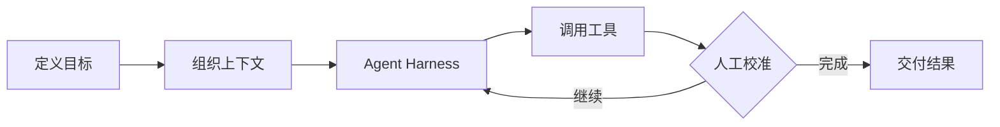
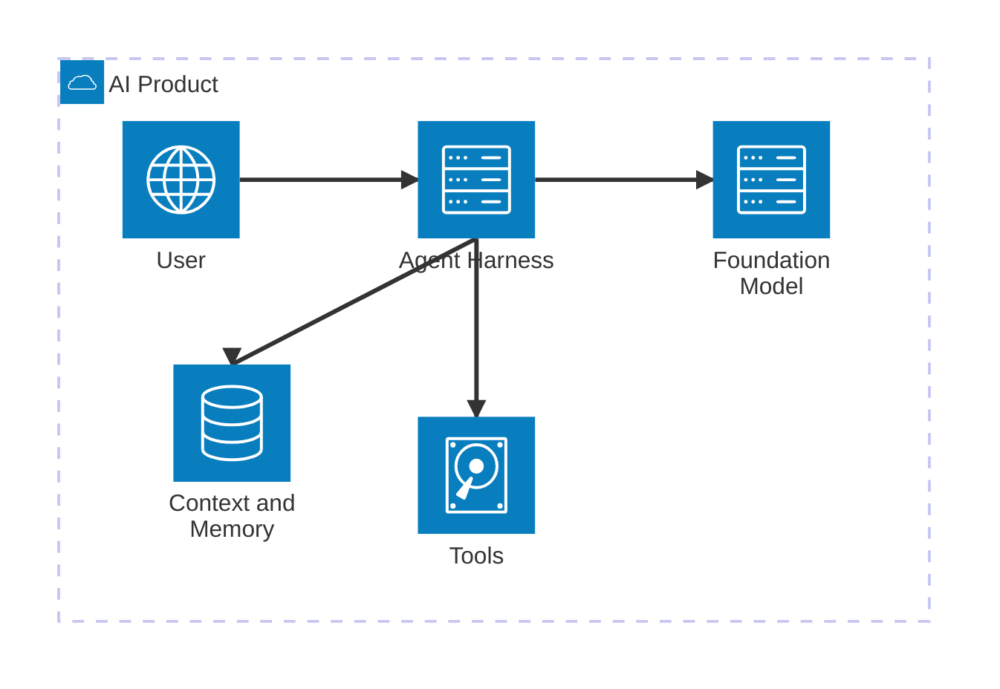

# Markdown 深度写作指南

站点文章统一放在 `src/content/writing/`。当前写作方向以 [Blog 写作规范](blog-rewrite/README.md) 为准；正文使用模型可直接理解的语言，Markdown 保持可移植。

## 1. 不使用图片，直接表达信息

Blog 文章不使用截图、课件图片、装饰插图或图片形式的图表。原有图片和画廊能力不再作为写作方式。

- 概念用文字定义，术语保持一致，指代明确。
- 架构用文字或 Markdown 表格说明模块责任、接口与依赖。
- 流程用有序步骤说明执行主体、输入、输出、分支、失败与恢复条件。
- 数据用 Markdown 表格保留数值、单位、口径和来源，并用文字解释结论。
- 原始资料中的图片信息应融入连续正文，保留来源链接，区分事实与推演。

以下 Mermaid 与 ECharts 章节记录现有技术能力。写作优先采用上述文本表达，核心信息必须能在不渲染图形的情况下完整理解，不将图形导出为图片插入文章。

## 2. 横向时间线

文章中的历史节点、发展阶段和事件年表，统一优先使用 `timeline` 代码块。组件以一条横轴按输入顺序排列节点；保持正文可读字号，超出宽度时横向滚动，不把整张图缩小。普通流程与反馈循环继续使用 Mermaid。

````md
```timeline
{
  "title": "从模型能力到 Agent 系统",
  "description": "按时间顺序等距排列，节点间距不代表时长。",
  "events": [
    {
      "date": "2017—2021",
      "title": "通用能力与外部信息",
      "description": "Transformer、GPT、RAG 与指令训练。"
    },
    {
      "date": "2022",
      "title": "指令、推理与行动",
      "description": "CoT、InstructGPT 与 ReAct。",
      "href": "https://arxiv.org/abs/2210.03629"
    }
  ]
}
```
````

`events` 至少包含一个节点，节点的 `date` 和 `title` 必填；`description` 与 `href` 可选。顶层 `title` 默认为“时间线”，`description` 可补充时间口径。日期作为文本展示，支持年份、月份和范围；组件不自动排序，也不按时长计算距离。链接支持 http(s)、站内路径和章节锚点。所有内容按纯文本处理，不在字段中写 HTML 或 Markdown。

每个节点宜使用短标题和一两句说明，细节继续写在原有正文中。组件支持触摸滚动、前后按钮；聚焦滚动区后可用左右键逐节点浏览，Home / End 到首尾。浅深色主题自动适配，减少动态效果的系统偏好会关闭平滑滚动。禁用 JavaScript 后，节点文字和原生滚动仍然可用；打印时展开全部节点。

Astro 页面可直接复用同一组件：

```astro
---
import Timeline from '../components/Timeline.astro';
const events = [
  { date: '2022', title: '行动反馈', description: '根据环境观察调整下一步。' },
  { date: '2023', title: '工具与记忆', description: '让执行结果与历史信息参与任务。' },
];
---
<Timeline title="Agent 技术节点" events={events} />
```

实现位于 `src/components/Timeline.astro`；Markdown 与 Astro 组件共用渲染逻辑和样式。完整文章预览在开发服务的 `/preview/timeline/`，该路由不会输出到生产构建。整理源稿保存在 `docs/llm-to-agent-evolution.md`；本次明确授权发布后，正式文章为 `src/content/writing/llm-to-agent-evolution.md`。单独创建组件预览不会自动发布文档。

组件修改后运行 `node --test scripts/timeline.test.mjs` 与 `npm run build`。浏览器回归检查使用 `scripts/timeline-browser-check.mjs`，沿用项目其他浏览器检查的 `BLOG_PLAYWRIGHT_ROOT`（包含 `playwright` 的 node_modules 目录）与 `BLOG_BASE_URL` 配置，截图默认保存到 `/tmp/aidea-timeline/`。

## 3. Mermaid 流程图

````md

````

## 4. Mermaid 架构图

````md

````

同样支持 `sequenceDiagram`、`stateDiagram-v2`、`classDiagram`、`erDiagram`、`gantt`、`mindmap`、`C4Context` 等 Mermaid 图形。页面提供缩放、复位、全屏、复制源码和 SVG 导出。

## 5. ECharts 数据图表

`echarts` 围栏内必须是合法 JSON，不能包含 JavaScript 函数：

````md
```echarts
{
  "tooltip": { "trigger": "axis" },
  "legend": { "data": ["完成率", "返工率"] },
  "grid": { "left": 42, "right": 20, "top": 58, "bottom": 34 },
  "xAxis": {
    "type": "category",
    "data": ["对话", "工具", "工作流", "自治"]
  },
  "yAxis": { "type": "value", "max": 100 },
  "series": [
    {
      "name": "完成率",
      "type": "line",
      "smooth": true,
      "data": [32, 51, 68, 76]
    },
    {
      "name": "返工率",
      "type": "bar",
      "data": [42, 31, 22, 18]
    }
  ]
}
```
````

支持折线、柱状、饼图、散点、雷达、仪表盘、漏斗、热力、关系图、树图、矩形树图、桑基图和旭日图。页面提供全屏查看、配置复制和 PNG 导出。

## 6. 数学公式

行内公式：

```md
单次执行的期望价值可以写成 $V = P(s)R - C$。
```

独立公式：

```md
$$
P(s) = \prod_{i=1}^{n} p_i
$$
```

公式由 KaTeX 在构建阶段生成，不需要浏览器端计算。

## 7. Callout

```md
> [!NOTE]
> 用于补充背景信息。

> [!TIP]
> 用于给出实践建议。

> [!IMPORTANT]
> 用于指出核心判断。

> [!WARNING]
> 用于说明风险。

> [!CAUTION]
> 用于提醒不可逆或高风险操作。
```

## 8. 代码块

````md
```ts
const result = await harness.run({ goal, context, tools });
```
````

代码块自动获得深浅主题语法高亮、自动换行开关和复制按钮。

## 9. 视频、音频与网页嵌入

Markdown 允许直接写 HTML：

```html
<video controls>
  <source src="/media/demo.mp4" type="video/mp4" />
</video>

<audio controls src="/media/podcast.mp3"></audio>

<iframe
  src="https://www.youtube-nocookie.com/embed/VIDEO_ID"
  title="演示视频"
  loading="lazy"
  allowfullscreen>
</iframe>
```

本地视频和音频分别放在 `public/media/`。嵌入第三方网页前，应确认其允许 iframe 展示并填写准确的 `title`。

## 10. 表格、任务列表与折叠内容

```md
| 能力 | 当前状态 | 下一步 |
| --- | --- | --- |
| 工具调用 | 可用 | 增加恢复机制 |
| 长程任务 | 受限 | 优化状态管理 |

- [x] 定义目标
- [x] 提供上下文
- [ ] 校准结果
```

折叠内容使用标准 HTML：

```html
<details>
  <summary>查看实现细节</summary>
  <p>这里使用 HTML 编写折叠区域内的内容。</p>
</details>
```

## 11. 写作与检查

发布前运行：

```sh
npm run build
```

如果 Mermaid 或 ECharts 语法有误，页面会保留原始源码并显示错误信息。构建成功并不代表客户端图表语法一定正确，因此新图表建议同时在本地文章页面中检查一次。
