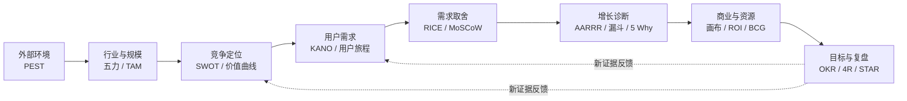

> 案例说明：MeetFlow 是虚构的 AI 会议助手，服务中小销售团队。以下市场变化、用户数据、财务数字与目标均为教学假设，不是市场调查、法律判断或收益承诺。

MeetFlow 面向中小销售团队，计划将会议结论同步到 CRM。团队需要分别决定是否进入市场、先服务谁、本轮做哪些功能，以及怎样验证采用与收益。

先明确待做决定，再选择框架。PEST 分析外部环境，旅程图识别任务阻碍，RICE 比较候选投入，OKR 跟踪结果；它们不能互相替代。

## 先把框架放回产品工作的完整链路

常用框架可以按照产品决策顺序分成八组：

| 产品问题 | 优先使用的框架 | 期望得到的结果 |
| --- | --- | --- |
| 外部环境是否有利 | PEST | 趋势、约束与关键假设 |
| 行业是否值得进入 | 波特五力 | 竞争强度与利润来源 |
| 机会到底有多大 | TAM / SAM / SOM | 分层市场规模与测算依据 |
| 应该占据什么位置 | SWOT、价值曲线 | 差异化定位与能力缺口 |
| 用户真正需要什么 | KANO、用户旅程地图 | 需求层次、痛点与机会点 |
| 下一步先做什么 | RICE、MoSCoW、价值四象限 | 可解释的版本优先级 |
| 增长为什么受阻 | AARRR、漏斗、5 Why、MECE | 流失环节与根因假设 |
| 如何管理商业结果 | 商业模式画布、ROI、BCG、OKR、复盘 | 商业闭环、资源选择与迭代行动 |



*图 1｜从战略到执行，证据如何反向修正判断。*

这不是一条只能从左到右走一次的瀑布流程。成熟产品经常从漏斗异常出发，回到用户旅程重新理解问题；新政策出现时，也要重新检查 PEST 和商业模式。框架之间真正的关系是：**前面的框架帮助选择方向，后面的框架帮助验证和修正方向。**

## 四篇主文分别形成什么决定

例如，观察发现销售经理仍在手工更新 CRM，只能先支持“会后录入可能值得解决”；还需试用验证节省时间，再单独验证支付意愿。一个反馈不能直接证明需求、定位和价格都成立。

| 篇章 | 核心决定 | 产物 |
| --- | --- | --- |
| [市场与定位](/writing/product-frameworks-market/) | 为谁进入什么市场 | 市场假设与差异化选择 |
| [需求与取舍](/writing/product-frameworks-prioritization/) | 本次解决哪个问题 | 用户证据与发布范围 |
| [增长与商业](/writing/product-frameworks-growth/) | 价值能否支撑持续经营 | 漏斗诊断与成本口径 |
| [执行与复盘](/writing/product-frameworks-delivery/) | 如何验证并修正选择 | 目标、验收与重审条件 |

## 开始之前，写下六句话

```text
这次要决定：是否做销售会议后的 CRM 同步
目标用户：已经使用标准 CRM 的中小销售团队
已有证据：待填真实访谈与行为记录，不用想象代替
最大未知：用户是否愿意确认并持续使用同步结果
本轮不做：自动外发邮件、支持所有 CRM
重新判断的条件：关键假设被试用数据否定
```

这不是复杂模板，而是防止团队在不同问题上互相争论。若市场负责人想讨论赛道，研发负责人想讨论两周发布范围，RICE 表算得再精确也无法解决错位。

不用先背每一个缩写，先把决定、证据、责任人与下一步动作放在同一页。
