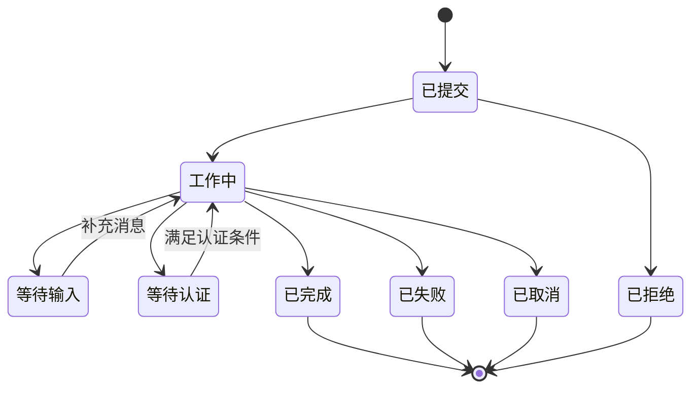
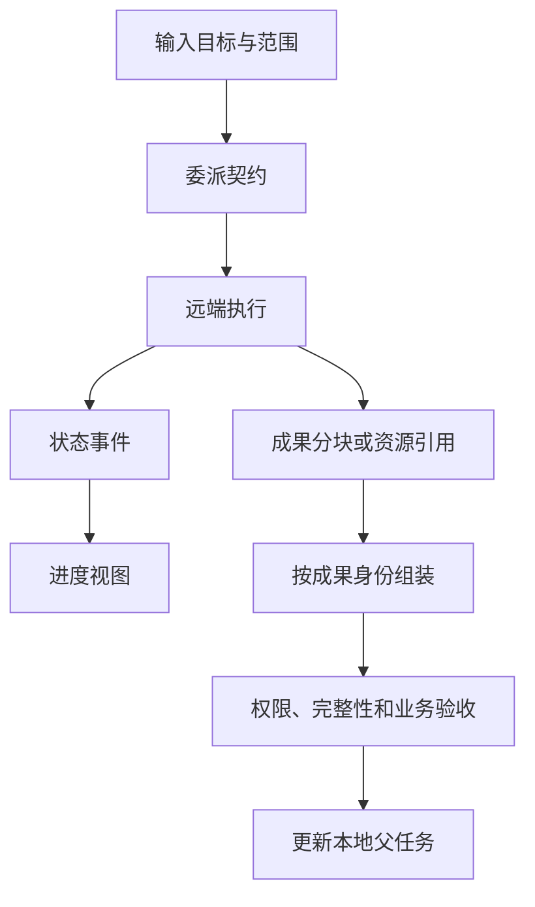

A2A（Agent2Agent）让独立 Agent 系统交换能力、任务和成果。调用者可以委派“调查这次构建失败”，而不必知道对方内部用了哪些模型、工具或工作流。协议统一交互边界；任务拆分质量、组织协作方式和结论可信度仍由应用负责。

本文以 **A2A 1.0.0 规范**为基线，核对日期为 2026-09-07。示例是作者构造的协议片段和设计模型，没有声称完成两家产品的互通测试。旧版文章常见的字段和方法名不能直接复制进 1.0 客户端。[版本规范](https://a2a-protocol.org/v1.0.0/specification/)

## 架构：委派跨越一个独立运行边界

```mermaid
flowchart TB
%% title: 系统架构图
    U[用户任务] --> H[调用方 Harness]
    H --> C[A2A Client]
    C <-->|能力与任务协议| S[A2A Server]
    S --> R[远端 Agent Runtime]
    R --> M[模型]
    R --> T[内部工具与工作流]
    R --> A[成果存储]
    H --> V[调用方独立验收]
```

Server 是对外协议角色，内部可以是单 Agent、图工作流或人工服务。A2A 不要求对方公开提示词与推理过程，也不保证内部真的存在多个模型。

单进程里创建多个逻辑 Agent 并不需要 A2A。只有跨团队、跨部署或跨供应商的委派边界值得长期维持时，标准化远端任务接口的价值才明显。

## 四类对象不能合并成聊天记录

| 对象 | 回答的问题 | Harness 应保存什么 |
| --- | --- | --- |
| Agent Card | 对方提供什么能力、在哪访问、支持什么绑定与认证 | 来源、版本、接口、能力和缓存期限 |
| Message | 这次传递什么意图或信息 | 消息 ID、角色、Part、关联上下文 |
| Task | 这项工作执行到哪里 | Task ID、状态、远端归属和本地父任务 |
| Artifact | 对方交付了什么 | 成果 ID、内容或引用、版本及校验信息 |

Part 是消息或成果中的内容单元，可以承载不同形式的数据。Message 可以是沟通，Artifact 才是明确的交付对象；不能把聊天窗口最后一句话当成唯一成果。`contextId` 用于把相关交互组织在一起，不应当作权限令牌或租户 ID。[任务与成果关系](https://a2a-protocol.org/latest/topics/life-of-a-task/)

Agent Card 的 `skills` 描述该 Agent 对外声称具备的能力，不等同于本地 `SKILL.md` 文件包。即使名称都是“代码审查”，一个是服务发现元数据，一个是可加载的方法资产。

## 先发现和验证服务，再发送消息

1. 从可信配置、目录或 `/.well-known/agent-card.json` 获取 Agent Card。
2. 选择双方都支持的协议版本和绑定，检查流式、推送等可选能力。
3. 按目标服务的认证要求取得凭据；不要由 Card 内任意地址触发无限制外连。
4. 发送 Message；响应可能直接是 Message，也可能是可跟踪的 Task。
5. 对 Task 持续读取状态与成果；需要补充信息时提交相关消息。
6. 根据成果和独立验收决定本地父任务是否完成。

A2A 1.0 把抽象操作与 JSON-RPC、gRPC、HTTP+JSON 绑定分开。实现应固定一种绑定及其字段序列化，不能把 gRPC 方法名、旧 JSON-RPC 路径和新枚举拼在一个请求里。[协议绑定与发现](https://a2a-protocol.org/v1.0.0/specification/)

```mermaid
sequenceDiagram
%% title: 委派任务时序图
    participant C as 调用方
    participant S as 远端 Agent
    C->>S: 获取并校验 Agent Card
    C->>S: SendMessage（任务意图）
    S-->>C: Task（工作中）
    S-->>C: 状态更新：需要补充输入
    C->>S: 关联原任务的补充 Message
    S-->>C: Artifact 更新
    S-->>C: Task 完成
    C->>C: 检查成果并验收父任务
```

这里使用 1.0 抽象操作名表达流程，不是可直接发送的完整 JSON-RPC transcript。能力不支持推送时，应使用对应的查询路径。

## 一个消息如何关联回已有任务

下面是 1.0 Message 的作者构造片段，省略外层 SendMessage 信封和认证；假设上下文与任务已由远端创建：

```json
{
  "messageId":"msg-followup-2",
  "contextId":"ctx-7",
  "taskId":"task-12",
  "role":"ROLE_USER",
  "parts":[{"text":"仅分析最近一次失败的构建，输出可复现步骤。"}]
}
```

三个 ID 不能互相代替：消息标识这次补充，任务标识被继续的工作，上下文组织相关交互。服务端必须同时验证调用者能访问该任务，不能只要知道 `taskId` 就接受补充或取消。

如果用户在原任务完成后要求“增加另一个项目的分析”，应建立新的执行记录，并按需引用旧成果；不能把旧 Task 的成功记录改成工作中。这使审计能区分追加需求与原任务未完成。

## 状态机中最重要的是等待与终态



这是常见路径的语义投影，不是所有合法状态转换的完整列表。1.0 JSON 序列化采用如 `TASK_STATE_WORKING`、`TASK_STATE_INPUT_REQUIRED` 的枚举名称；图中中文便于阅读，不能作为线上字段值。

“等待输入”仍是可继续的任务；已经进入完成、失败、取消或拒绝等终态的任务，不应被当作可任意复活的工作槽。后续修改需求可以关联原上下文和成果，但需按协议与应用约定创建新任务。这样才能解释哪个成果属于哪次执行，而不是永远覆盖一个 Task。[任务生命周期](https://a2a-protocol.org/latest/topics/life-of-a-task/)

调用方请求取消时，远端可能已经完成。取消成功也不代表此前所有外部操作都已回滚。设计中应分开记录“停止继续工作”和“撤销已提交成果”。

## 流式消息只是交付通道



状态用于观察，成果用于验收，两者不能互相代替。流式接口可以更早呈现结果，但不会天然成为持久事件日志。断线后客户端应重新查询权威任务状态，并按服务的订阅／恢复能力继续观察；不能假设所有 SSE 都支持任意位置重放。

接收大文件引用还需要独立策略：限制下载目标与体积，核验访问权限和有效期，记录内容摘要。URL 可访问只说明此刻能获取数据，并不证明内容符合任务。增量成果按 Artifact 身份和协议的追加／结束语义组装，重复块不能直接重复追加。

## 委派边界决定了安全与成本

调用方至少要区分三个主体：提出任务的用户、发起委派的服务、执行远端工作的 Agent 服务。远端拿到一份文档，并不自动获得继续转发给其他 Agent 的许可。任务契约应明确可使用的数据、允许的动作、成果格式、截止时间和总预算。

这些预算与业务去重键是应用设计，不是给 A2A 随意添加几个字段就获得的跨厂商保证。扩展必须说明语义、双方支持条件以及不支持时的处理方式。

例如“远端已创建工单但最终响应丢失”：重发相同自然语言可能再创建一次。正确的恢复依赖业务操作键、既有 Task 查询和资源对账。A2A 提供可追踪的任务对象，仍不能替外部工单 API 实现幂等。

## 技术选型与接入验收

| 场景 | 优先考虑 | 原因 |
| --- | --- | --- |
| 同一运行时的几个函数 | 本地函数或普通工具 | 无需独立任务服务 |
| 接入外部检索或数据库操作 | MCP 或业务 API | 主要契约是能力调用 |
| 委派给独立团队的长任务 | A2A | 需要能力发现、状态与成果 |
| 固定业务步骤要求可靠执行 | 工作流引擎，必要时外接 A2A | 工作流持久性与互通分属两层 |

一套有意义的互通验收应包含：直接 Message 响应、需要补充输入的 Task、并行成果、失败和拒绝、取消竞态、身份变化后的访问拒绝，以及断流后的状态重建。采用条件不是“两个 SDK 都能跑 hello”，而是对关键异常具有一致解释。

与[MCP](/writing/harness-foundations-mcp-lifecycle/)组合时，远端 Agent 可以通过 MCP 使用工具；与[AG-UI](/writing/ag-ui-protocol/)组合时，调用方把 A2A 任务状态映射为用户前端事件。Multi-Agent 拓扑和框架取舍仍应回到[Multi-Agent 选型](/writing/multi-agent-architecture-selection/)。
