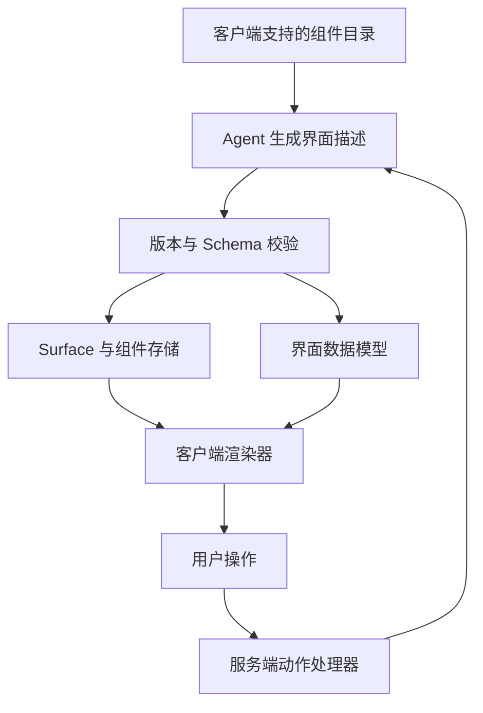
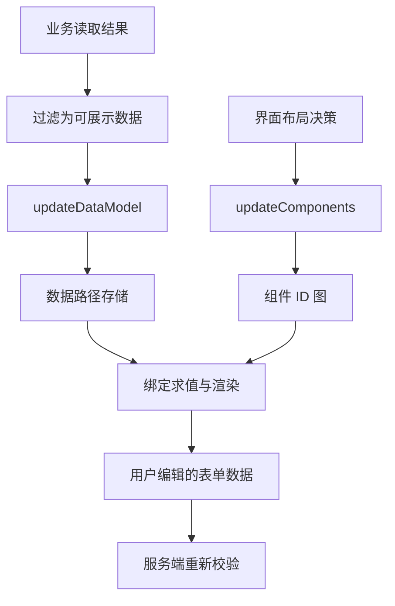
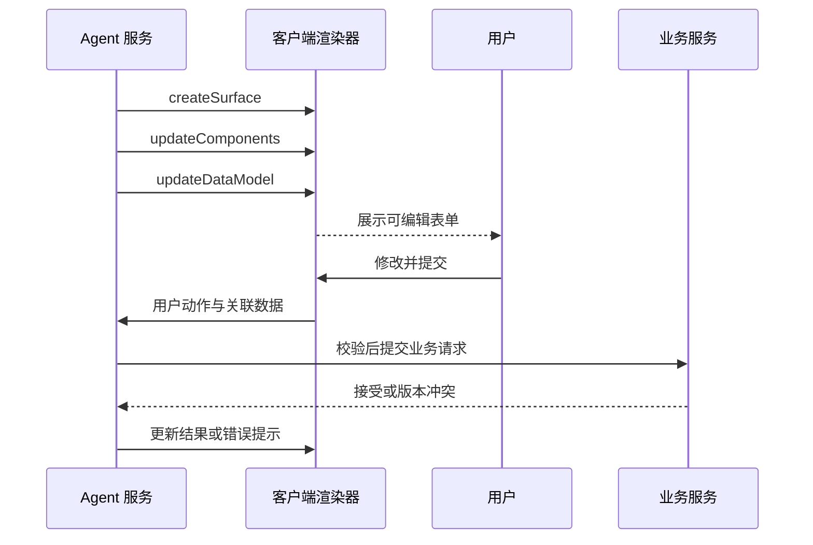
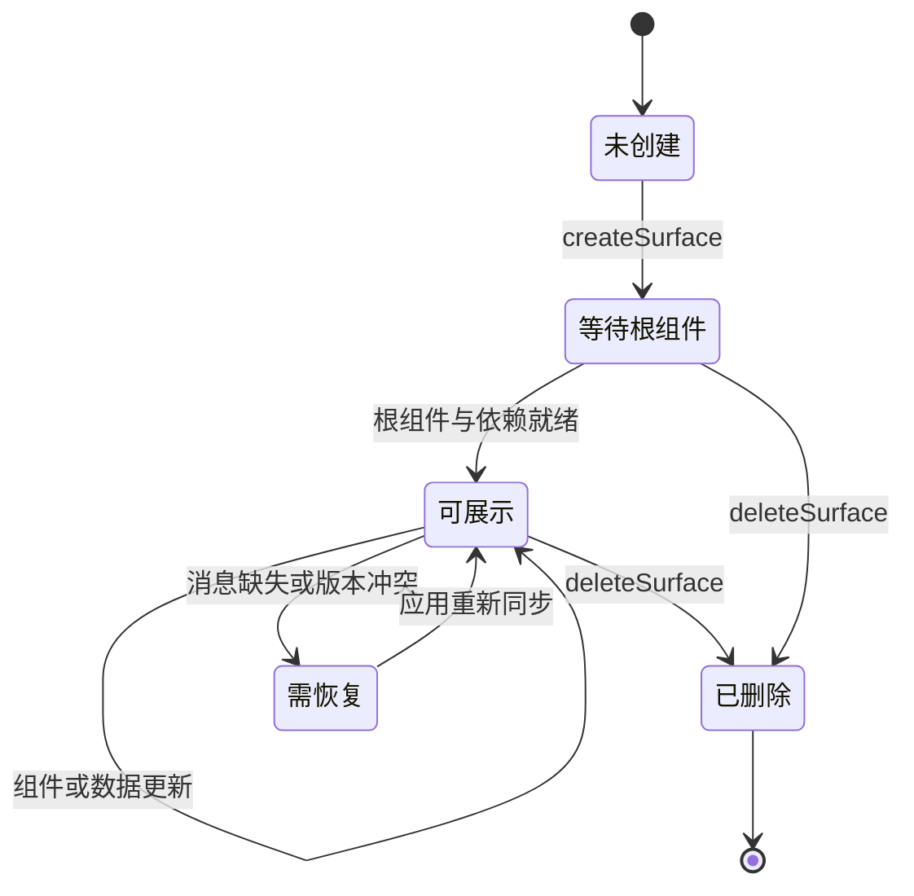

A2UI（Agent to UI）让 Agent 输出结构化界面描述，由客户端映射为实际组件。例如用户需要选择会议时间，Agent 可以给出日期、时段和确认按钮，而不必逐项追问或生成任意前端代码。

本文固定 **v0.9 消息格式**，核对日期为 2026-09-07；官方站点另列 v0.9.1 和 v1.0 文档，接入时必须按目标版本重新核验。本文不混用 v0.8 的 `beginRendering`、`surfaceUpdate` 与 v0.9 的消息名。示例为构造数据，未宣称跨多个渲染器实测一致。[v0.9 规范](https://a2ui.org/specification/v0.9-a2ui/)

## 架构：模型描述界面，客户端控制实现



客户端持有组件的实现、样式与能力边界。模型只选择目录允许的组件和属性，不应把“能描述一个 URL”理解为“能执行任何脚本”。界面结构、界面数据与业务权限必须分开。[A2UI 设计定位](https://a2ui.org/introduction/what-is-a2ui/)

A2UI 降低了任意代码生成带来的执行面，但不能保证内容天然可信。一个正常的 Text 组件仍可能展示错误信息；一个允许的链接组件仍可能指向不合适的地址。目录控制执行能力，业务校验控制动作真实性。

## 四个对象组成界面

| 对象 | 责任 | 稳定身份 |
| --- | --- | --- |
| Surface | 一块可独立创建与删除的界面区域 | `surfaceId` |
| Component | 文本、输入框、容器或按钮等组件 | 组件 `id` |
| Data Model | 组件绑定的界面数据 | 数据路径 |
| Catalog | 客户端认可的组件与函数契约 | `catalogId` |

Surface 可以是侧栏、表单或结果卡片，不等于整个网页。组件采用扁平列表，用 ID 引用组成树；这使 Agent 可以局部添加和修正组件，而不必每次输出整棵深层嵌套树。

组件身份必须在更新中稳定。例如相同 `field-start-time` 表达同一输入框，更新标签无需丢失用户已输入的时间。由后端重新生成一批随机 ID，会使“局部修改”变成“替换整个表单”，破坏焦点和草稿。

## v0.9 的四种消息

| 消息 | 修改什么 | 接收端重点检查 |
| --- | --- | --- |
| `createSurface` | 创建区域并绑定目录 | 区域身份、目录是否可用 |
| `updateComponents` | 添加或更新组件定义 | 组件类型、属性、引用关系 |
| `updateDataModel` | 替换指定路径的数据 | 路径和数据类型、更新基线 |
| `deleteSurface` | 删除区域 | 后续迟到更新如何处理 |

同一个信封中只能包含一种主要消息；版本字段用于选择正确的解释器。创建之后才能更新区域，根组件使用 `root`。引用的子组件可以稍后到达，渲染器需支持逐步补齐，而不是立即把所有缺失引用判为永久错误。[消息与组件模型](https://a2ui.org/specification/v0.9-a2ui/)

下面是作者构造的最小文本区域。Catalog ID 使用选定 v0.9 基础目录的标识；这是报文形状示例，不是已经运行的产品界面。

```json
[
  {"version":"v0.9","createSurface":{"surfaceId":"report-7","catalogId":"https://a2ui.org/specification/v0_9/catalogs/basic/catalog.json"}},
  {"version":"v0.9","updateComponents":{"surfaceId":"report-7","components":[{"id":"root","component":"Text","text":"请核对报告后再保存。"}]}}
]
```

`catalogId` 是约定的字符串标识，不要求可从网络解析；实现需要将它与实际支持的目录契约匹配，不应在收到未知 URI 后自动从网络下载并执行新组件。目录升级是客户端能力升级，不是模型说一句话就可以完成的升级。

## 数据绑定为什么独立于组件结构



分离结构与数据后，更新“处理进度”无需重发整个结果卡片。反过来，切换卡片布局也无需复制全部业务数据。图中的数据过滤和服务端复核是应用责任。

但界面数据不是权威业务数据。用户修改表单值是一项待验证的意图；后台数据库是否接受变更，要检查身份、字段约束、资源版本与业务状态。特别是金额、权限和审批结论，不能从客户端 Data Model 直接写回。

多端编辑还会产生版本冲突。协议能表达更新，不能替应用决定最后写入优先、乐观锁或合并策略。最简单的产品方案往往是：一个明确的编辑者、保存时携带版本、冲突时重新加载。

## 用户动作形成下一轮交互



界面下行消息与用户动作上行不是同一种数据。动作名、关联区域和参数需要按选定版本及传输绑定处理；具体业务端点仍由宿主定义。使用 A2A 或 AG-UI 承载时，应同时记录外层会话与内层 Surface 的对应关系。

用户点击“确认”只能表示对当时展示内容的意图。若模型随后把相同按钮关联到另一项操作，旧点击不应继续有效。建议为高影响操作建立服务端意图记录，绑定资源版本、动作与过期时间，再由动作 ID 引用它。

## 增量渲染需要一个受控生命周期



这是渲染器实现建议，不是标准枚举。需要区分“子组件尚未到达”和“引用形成循环”，也要限制节点数、嵌套深度与单条消息体积，避免一个形式合法的界面耗尽客户端资源。

协议要求传输保持消息边界与顺序；它不绑定某一种网络通道。重连时若只收到数据更新却没有 Surface 基线，客户端无法凭空重建界面。应用需要重放足够消息或重新生成完整区域。[传输与版本说明](https://a2ui.org/specification/v0.9-a2ui/)

## A2UI、AG-UI 与 MCP Apps 怎么选

| 需求 | 更相关的机制 | 代价 |
| --- | --- | --- |
| 展示运行状态、文字和工具进度 | AG-UI | 需要事件适配和状态恢复 |
| 让 Agent 生成受控表单与原生组件 | A2UI | 需要维护 Catalog 和渲染器 |
| 在宿主里运行完整交互式工具页面 | MCP Apps | 需要沙箱、宿主桥接和应用资源 |
| 页面布局固定，仅数据变化 | 普通前端组件与 API | 不必引入动态界面协议 |

[MCP Apps](https://modelcontextprotocol.io/extensions/apps/overview) 的核心是宿主内的交互应用；A2UI 的核心是由客户端组件实现承接声明式描述。选择取决于扩展作者需要多大自由，以及宿主愿意维护多严格的组件边界。

验收应覆盖：未知 Catalog、重复 Surface、先数据后组件、缺失根组件、循环引用、删除后的迟到消息，以及用户提交旧版本表单。本文提供接入设计，未验证所有渲染器的视觉一致性、无障碍支持或安全隔离能力。
