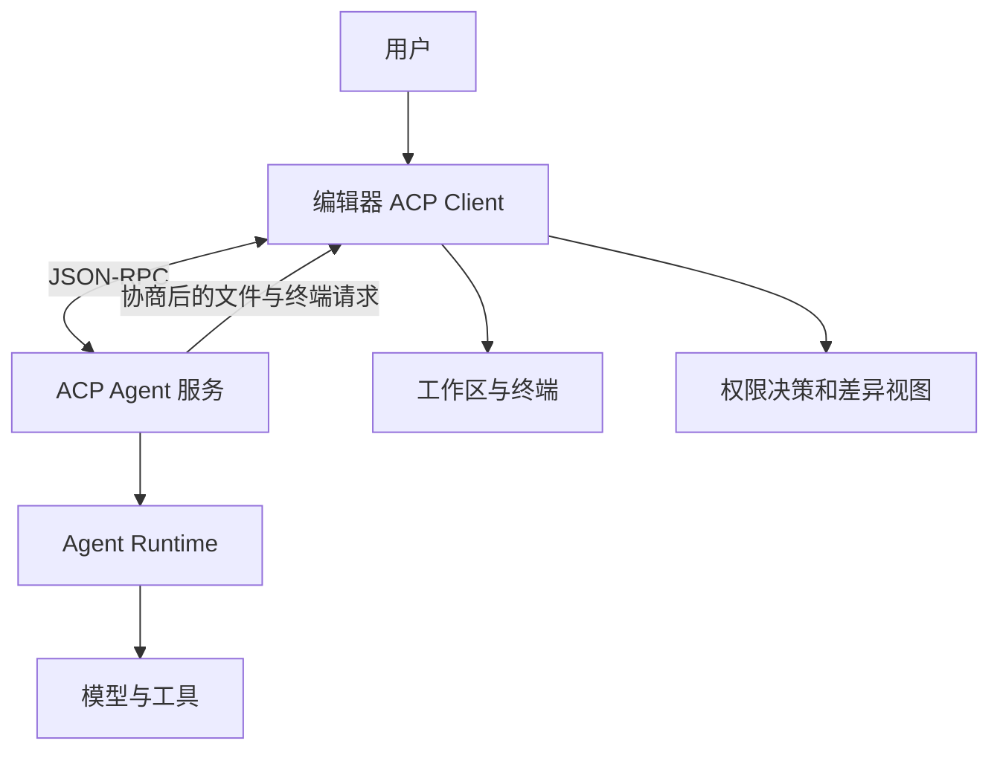
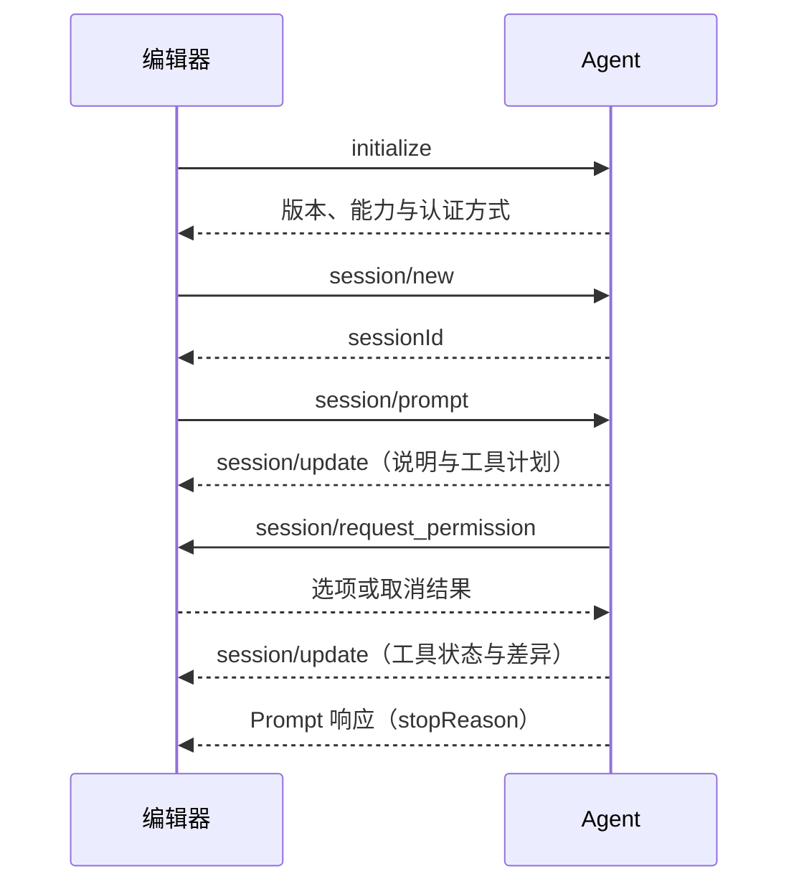
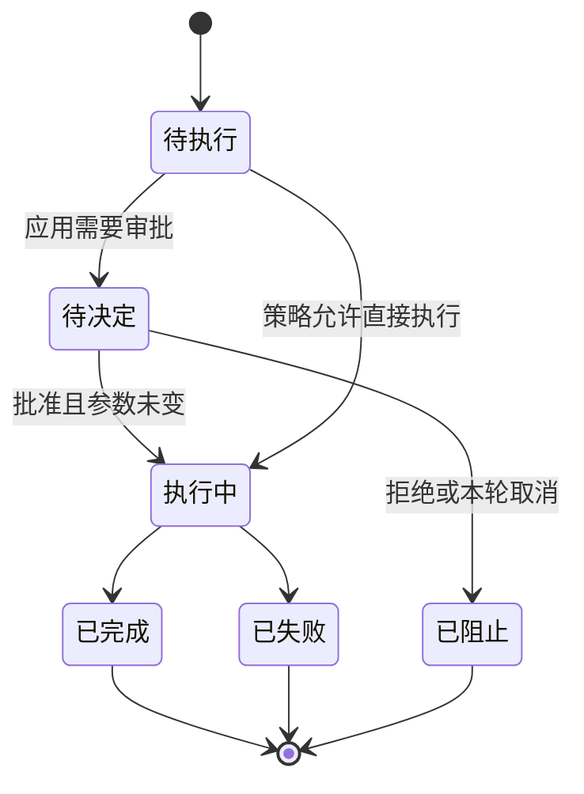
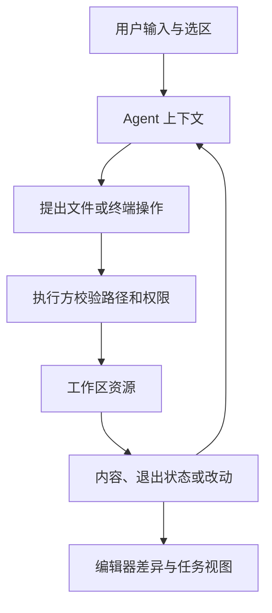

ACP 在本文中特指 **Agent Client Protocol**：它标准化代码编辑器与 Coding Agent 的通信，让编辑器不必为每个 Agent 单独实现一套会话、进度和工具交互。它不是 A2A，也不是所有名为 ACP 的协议的统称。

本文固定 **protocolVersion 1**，核对 2026-09-07 官方 v1 文档及 [v1 Schema](https://github.com/agentclientprotocol/agent-client-protocol/blob/96099538155403c090c2df3524a4aa2abd725982/schema/v1/schema.json)。仓库也包含其他版本，本文不声称 v1 覆盖全部演进。流程与报文是教学示例，没有启动真实编辑器互通测试。

## 架构：编辑器提供工作环境，Agent 提供执行能力



Client 在这里通常是编辑器；Agent 是协议对端，不是一个模型对象。Agent 既可以管理自己的工具，也可以请求编辑器提供文件或终端能力。谁真正执行操作，要结合双方能力和部署方式判断。[ACP 定位](https://agentclientprotocol.com/get-started/introduction)

ACP 的收益类似编辑器插件接口的标准化：前端不再绑定某家 Agent 的私有输出格式。但同一个协议版本不代表同样的工具能力，也不代表文件编辑与终端执行具有相同隔离强度。

## 初始化确定本次连接能做什么

初始化交换整数形式的主要协议版本与双方能力。客户端可以声明文件读写、终端等能力；Agent 可以声明加载会话、提示输入类型等能力。握手结果决定后续允许使用的功能，而不是让客户端盲目发送所有方法。[初始化规范](https://agentclientprotocol.com/protocol/v1/initialization)

作者构造的最小请求如下：

```json
{"jsonrpc":"2.0","id":1,"method":"initialize","params":{"protocolVersion":1,"clientCapabilities":{}}}
```

空能力对象是一项具体选择：Agent 不能据此假定编辑器提供文件或终端委托接口。真实接入还要处理协商失败、认证方法和进程退出。

stdio 场景下，协议输出与日志需分离；本地启动子进程不意味着可以继承编辑器的全部秘密环境。远端部署则还增加连接认证和网络故障问题，不能从一个本地演示直接推断云端能力已经完整实现。

## Session、Prompt Turn 与 Tool Call 分别管理什么

| 对象 | 范围 | 保留的信息 |
| --- | --- | --- |
| Session | 可持续的工作会话 | Session ID、工作目录、配置和历史 |
| Prompt Turn | 一次 `session/prompt` 的处理过程 | 输入、更新流、最终停止原因 |
| Tool Call | 本轮中的一次操作 | 工具身份、参数、状态、结果与审批关联 |

`session/new` 建立会话；支持时可以使用加载能力恢复会话。工作目录和配置属于会话环境，不能假设换一个目录后旧操作的授权仍然适用。[会话建立](https://agentclientprotocol.com/protocol/v1/session-setup)

Prompt Turn 期间，Agent 通过 `session/update` 发送文字或工具更新，最终以 Prompt 响应结束本轮。它不是“每到一个通知就完成一个请求”。JSON-RPC 请求 ID 负责信封关联；Session ID 和 Tool Call ID 负责业务对象关联。

## 主流程从提示输入走到可审查的改动



权限请求只在实现策略需要时出现，不能把它写成所有工具调用必经的规范步骤。Agent 还可能在协商允许时请求编辑器执行文件与终端方法。[Prompt Turn](https://agentclientprotocol.com/protocol/v1/prompt-turn)

用户看到的 diff 是审查材料，实际文件是否已经修改要由执行语义决定。产品必须清楚标注“拟议改动”和“已落盘改动”；同一张差异视图不能同时承担这两个含义而不加区分。

## 工具状态与审批需要绑定同一个动作

工具状态包括 `pending`、`in_progress`、`completed`、`failed`。等待参数生成和等待批准都可能表现为尚未开始执行，前端可以提供更细的解释，但不能虚构协议状态。[工具调用与权限](https://agentclientprotocol.com/protocol/v1/tool-calls)



“待决定／已阻止”是本文为解释审批增加的本地状态，不是新增 ACP 枚举。客户端返回被选中的 optionId；选项的 `kind` 表达允许一次、记住允许、拒绝一次等意图，实际记忆范围仍需实现定义。

一份“允许修改文件”的决策应绑定工具、目标文件与参数。若批准后 Agent 换了文件路径，旧决定不应继续生效。工具展示名称和人类可读说明仅用于理解，执行门禁需要结构化身份与路径校验。

取消当前 Prompt Turn 时，尚未解决的权限请求要按协议返回取消结果。已开始执行的命令则需要停止和资源回收；即便最终 `stopReason` 是 cancelled，先前完成的文件写入也不会自动恢复。

## 文件和终端不是普通文字附件



路径校验应处理符号链接、工作区切换和文件版本变化。不能只检查字符串是否以工作目录开头。终端还需要明确输出截断、进程 ID、退出码、等待与释放行为，不能把收到了部分 stdout 当作命令完成。

一旦编辑器缓存的文件和磁盘实际版本不同，Agent 基于旧内容生成的 patch 就可能覆盖用户刚刚写入的改动。本文建议使用版本或内容摘要做提交前检查；这是编辑器与执行层设计，不是 ACP 自动赋予的事务能力。

## 方法边界与返回方向

| 操作 | 典型方向 | 与普通工具输出的区别 |
| --- | --- | --- |
| `session/prompt` | Client → Agent | 发起一轮处理，最终有响应 |
| `session/update` | Agent → Client | 通知运行进度，不是另一次用户请求 |
| `session/cancel` | Client → Agent | 请求停止当前轮次，不是撤销所有文件 |
| `session/request_permission` | Agent → Client | 需要返回一个明确的权限决定 |
| `fs/read_text_file`、`fs/write_text_file` | Agent → Client | 使用客户端工作环境中的文件能力 |
| `terminal/create`、`terminal/wait_for_exit`、`terminal/release` | Agent → Client | 分别建立、等待和释放终端资源 |

方法名依据固定 v1 Schema，使用前仍须检查具体能力。`terminal/release` 与“命令已成功退出”不是同一事实；会话结束时遗留的终端也需要按实现策略回收。

这解释了为什么 ACP 连接需要处理双向请求：Client 等待 prompt 结果时，Agent 可能同时等待 Client 的文件读取或权限响应。若客户端实现为“发请求后只等最终响应”，双方就可能互相等待。

## ACP 与其他协议的分工

ACP 对接编辑器；[MCP](/writing/harness-foundations-mcp-lifecycle/) 对接工具与上下文服务。一个 ACP Agent 可以使用多个 MCP Server；二者的初始化和会话仍是独立协议，不能复用同一套字段。

[AG-UI](/writing/ag-ui-protocol/) 面向通用产品前端的事件与状态，ACP 更关注编码环境中的会话、文件、终端和工具交互。[A2A](/writing/a2a-protocol/) 面向独立 Agent 系统的任务互通，不能代替编辑器对工作区的控制。

选择 ACP 前应验证：能力缺失时是否正确降级、会话能否按承诺恢复、权限取消是否收敛、进程退出后请求是否结束、旧文件版本是否被拒绝，以及部分工具失败时是否仍生成准确的结果说明。支持 ACP 是互通起点，不能作为代码修改正确或执行隔离充分的证明。
