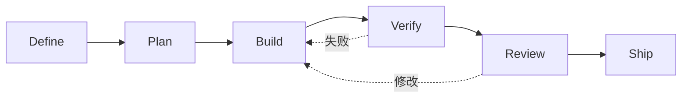

[`addyosmani/agent-skills`](https://github.com/addyosmani/agent-skills)不是 Agent Runtime，而是一套面向生产工程的流程资产。它把工作从定义、计划、构建、验证、审查一路组织到发布，并用命令、Skills、专业 Agent、Hook 和参考清单连接各阶段。

*图 1｜仓库的核心不是技能数量，而是让验证反馈持续回到实现。*

## 围绕工程生命周期组织 Skill

仓库使用少量命令作为用户入口，再由元 Skill 判断当前阶段需要哪些能力。`/spec`负责把模糊需求变成边界，`/plan`拆成可验收任务，`/build`按切片实现，`/test`与`/review`提供反馈，`/ship`处理发布证据。入口稳定，内部 Skill 可以独立演进。

这种结构解决万级能力路由中的一个实际问题：用户不应该记住所有 Skill 名称，而应表达当前工作阶段。路由依据不是词面相似度，而是任务状态与所需产物。

| 阶段 | 主要产物 | 退出条件 |
| --- | --- | --- |
| Define | 问题与约束 | 目标可复述 |
| Plan | 原子任务 | 每项可验证 |
| Build | 小批变更 | 局部检查通过 |
| Verify | 测试证据 | 必需检查通过，例外由负责人明确接受 |
| Review | 风险清单 | 关键问题关闭 |
| Ship | 发布与回滚计划 | 已获发布授权，结果可观察 |

流程仍需允许跳转和回退。真正的工程工作不是瀑布线，失败会把任务送回计划或实现；Skill 编排的价值，是让回退带着证据，而不是重新开始一段无状态对话。

以“修复登录请求超时，但不改登录协议”为教学例子：定义阶段固定允许修改的行为，计划阶段列出复现与回归，构建阶段修改超时处理，验证阶段运行这两类测试。测试失败时回到对应变更，而不是继续发布。阶段的意义由交付物和退出条件决定。

## 验证门槛与可执行证据

这个仓库最鲜明的 Skill 结构不是长篇知识，而是流程、检查点、常见借口与证据要求。它预先写下模型可能用来跳过测试或审查的理由，再给出停止条件，把“应该严谨”变成更具体的决策路径。

但 Markdown 无法强制测试真的运行。可靠门槛需要工具输出、CI、Hook 或人工审查配合：Skill 负责提醒何时验证，运行环境负责产生可核对的执行结果。若 Agent 也能修改测试和日志，还需要受保护的 CI、独立验收或人工审查，不能把工具输出直接称为不可伪造。仓库中的 Evals 方向因此很重要，Skill 的质量最终应由触发准确率、任务成功率和回归表现判断。

跨 Agent 分发也存在语义差异。Claude Code Plugin、Codex Plugin、OpenCode 目录和通用 `skills` 安装器的发现、命令、Hook 与资源路径并不相同。官方 README 甚至记录了单 Skill 安装时共享 references 可能缺失的可移植问题。安装成功不等于能力完整。
