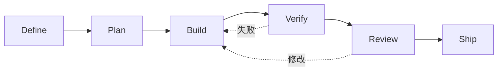

> 系列：[1. 全景](/writing/addy-agent-skills-overview/)｜[2. 生命周期](/writing/addy-agent-skills-lifecycle/)｜[3. 验证与分发](/writing/addy-agent-skills-verification/)｜[4. 整体判断](/writing/addy-agent-skills-synthesis/)

[`addyosmani/agent-skills`](https://github.com/addyosmani/agent-skills)不是 Agent Runtime，而是一套面向生产工程的流程资产。它把工作从定义、计划、构建、验证、审查一路组织到发布，并用命令、Skills、专业 Agent、Hook 和参考清单连接各阶段。

*图 1｜仓库的核心不是技能数量，而是让验证反馈持续回到实现。*

第二篇研究命令如何路由到 Skills，第三篇检查验证门槛、反合理化设计与跨 Agent 分发。终篇回答：工程流程写进 Markdown 后，哪些纪律真正更容易执行，哪些仍需运行时保证。

---

下一篇：[生命周期](/writing/addy-agent-skills-lifecycle/)。

下一篇沿一次功能开发，看多个 Skill 怎样形成连续而非堆叠的工作流。
