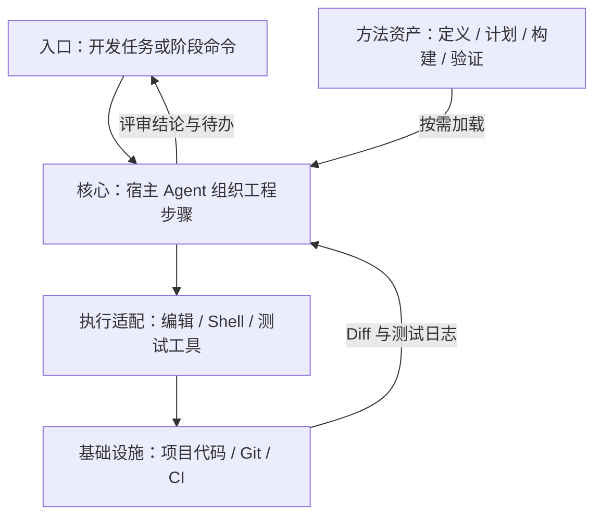
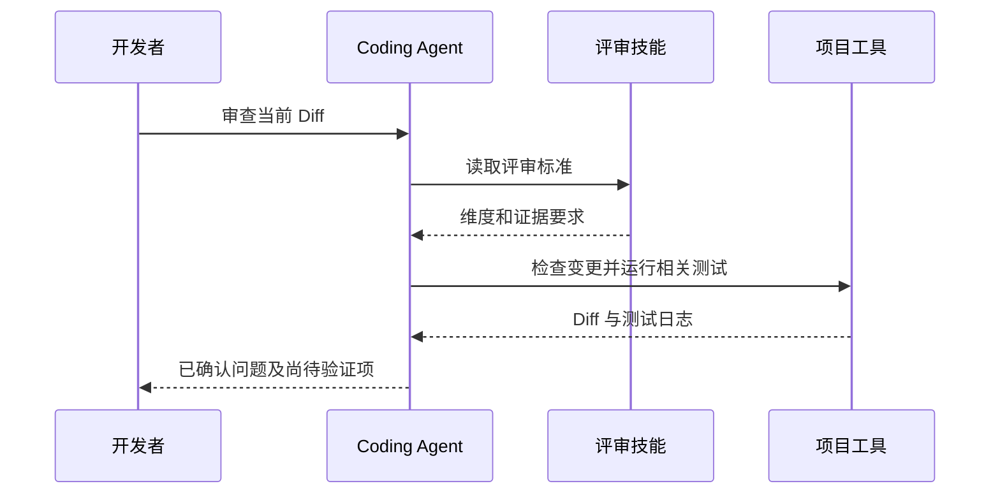

## 定位与价值

Addy Agent Skills 是覆盖定义、计划、构建和验证的软件工程技能库；相较每个任务重写评审提示，它把检查顺序与产物要求保存为可版本化方法。

适合已有 Coding Agent 的工程团队；Skill 里的“必须验证”不等同于 CI 强制门禁。

研究基线：[addyosmani/agent-skills @ 469d00f](https://github.com/addyosmani/agent-skills/blob/469d00f4e67ff4a21eb6e6e467a086c9a1f1deb8/README.md)；源码与社区核对日期为 2026-09-06。

## 技术架构



*图 1｜按职责归纳的调用地图；箭头表示请求与结果，不表示四个独立部署服务。*

## 核心机制



*图 2｜本篇关键流程的职责示意；部署者提出的验收要求与框架内建行为需按正文区分。*

### 工程阶段怎样交接

仓库使用少量命令作为用户入口，再由元 Skill 判断当前阶段需要哪些能力。`/spec`负责把模糊需求变成边界，`/plan`拆成可验收任务，`/build`按切片实现，`/test`与`/review`提供反馈，`/ship`处理发布证据。入口稳定，内部 Skill 可以独立演进。

这种结构解决万级能力路由中的一个实际问题：用户不应该记住所有 Skill 名称，而应表达当前工作阶段。路由依据不是词面相似度，而是任务状态与所需产物。

| 阶段 | 主要产物 | 退出条件 |
| --- | --- | --- |
| Define | 问题与约束 | 目标可复述 |
| Plan | 原子任务 | 每项可验证 |
| Build | 小批变更 | 局部检查通过 |
| Verify | 测试证据 | 必需检查通过，例外由负责人明确接受 |
| Review | 风险清单 | 关键问题关闭 |
| Ship | 发布与回滚计划 | 已获发布授权，结果可观察 |

流程仍需允许跳转和回退。真正的工程工作不是瀑布线，失败会把任务送回计划或实现；Skill 编排的价值，是让回退带着证据，而不是重新开始一段无状态对话。

以“修复登录请求超时，但不改登录协议”为教学例子：定义阶段固定允许修改的行为，计划阶段列出复现与回归，构建阶段修改超时处理，验证阶段运行这两类测试。测试失败时回到对应变更，而不是继续发布。阶段的意义由交付物和退出条件决定。


### 验证门槛怎样形成证据

这个仓库最鲜明的 Skill 结构不是长篇知识，而是流程、检查点、常见借口与证据要求。它预先写下模型可能用来跳过测试或审查的理由，再给出停止条件，把“应该严谨”变成更具体的决策路径。

但 Markdown 无法强制测试真的运行。可靠门槛需要工具输出、CI、Hook 或人工审查配合：Skill 负责提醒何时验证，运行环境负责产生可核对的执行结果。若 Agent 也能修改测试和日志，还需要受保护的 CI、独立验收或人工审查，不能把工具输出直接称为不可伪造。仓库中的 Evals 方向因此很重要，Skill 的质量最终应由触发准确率、任务成功率和回归表现判断。

跨 Agent 分发也存在语义差异。Claude Code Plugin、Codex Plugin、OpenCode 目录和通用 `skills` 安装器的发现、命令、Hook 与资源路径并不相同。官方 README 甚至记录了单 Skill 安装时共享 references 可能缺失的可移植问题。安装成功不等于能力完整。

## 快速上手

需要 Node/npm 与支持 Skills 的宿主；先列出技能，再只安装评审技能。

```bash
npx skills add addyosmani/agent-skills --list
npx skills add addyosmani/agent-skills --skill code-review-and-quality
```

三个常用配置：

| 配置或安装选项 | 作用 |
| --- | --- |
| `name` | 一个工程动作一个清晰标识 |
| `description` | 说明触发阶段和输入 |
| `--skill` | 安装时只选本次需要的技能 |

其余选项见 [配置参考](https://github.com/addyosmani/agent-skills/blob/469d00f4e67ff4a21eb6e6e467a086c9a1f1deb8/README.md)。

常见坑：技能安装器是外部工具；安装后在宿主中明确要求“用 code-review-and-quality 审查当前 diff，并指出测试证据”。

验证范围：已核对固定源码的入口、参数与依赖；未以本文示例调用真实模型或部署外部服务。

## 生态与社区

截至 2026-09-06，2026-08-08 至 09-06 UTC 的抽样取得 至少 30 条默认分支提交（上限 30 条）。见 [提交记录](https://github.com/addyosmani/agent-skills/commits/main/)。

Issue 取 08-08 至 08-30 UTC 创建的最近最多 3 条非 PR 条目，排除机器人和提问者自答；3 条中 0 条观察到维护者文字回复。 样本：[#530](https://github.com/addyosmani/agent-skills/issues/530)、[#529](https://github.com/addyosmani/agent-skills/issues/529)、[#528](https://github.com/addyosmani/agent-skills/issues/528)。小样本不代表 SLA，“未观察到”也不代表其他渠道无人处理。

固定快照许可证：[MIT](https://github.com/addyosmani/agent-skills/blob/469d00f4e67ff4a21eb6e6e467a086c9a1f1deb8/LICENSE)。允许商业使用，但分发时仍须保留版权与许可声明。

作者仓库提供 Claude 插件入口、跨宿主资源及 evals；skills 安装器和其他 Agent 宿主由各自项目维护。

## 源码阅读路径

按下面顺序阅读固定提交：先找包或命令入口，再进入核心抽象、具体实现和测试。

| 顺序 | 目录 → 文件 | 函数、对象或检查重点 |
| --- | --- | --- |
| 1 | [.claude-plugin/marketplace.json](https://github.com/addyosmani/agent-skills/blob/469d00f4e67ff4a21eb6e6e467a086c9a1f1deb8/.claude-plugin/marketplace.json) | 插件资产声明 |
| 2 | [skills/code-review-and-quality/SKILL.md](https://github.com/addyosmani/agent-skills/blob/469d00f4e67ff4a21eb6e6e467a086c9a1f1deb8/skills/code-review-and-quality/SKILL.md) | 评审步骤与输出要求 |
| 3 | [evals/cases/test-driven-development.json](https://github.com/addyosmani/agent-skills/blob/469d00f4e67ff4a21eb6e6e467a086c9a1f1deb8/evals/cases/test-driven-development.json) | 评测案例定义 |
| 4 | [evals/fixtures/test-driven-development/test/split.test.js](https://github.com/addyosmani/agent-skills/blob/469d00f4e67ff4a21eb6e6e467a086c9a1f1deb8/evals/fixtures/test-driven-development/test/split.test.js) | 具体测试夹具；不能代表所有技能已通过评测 |
