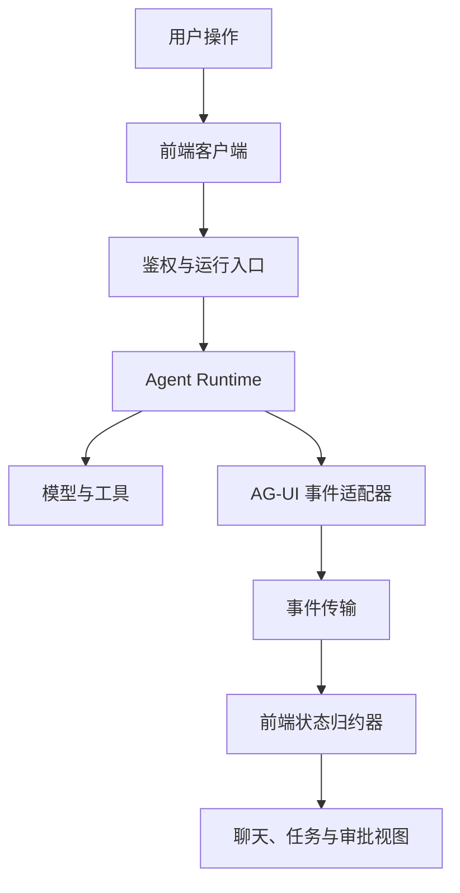
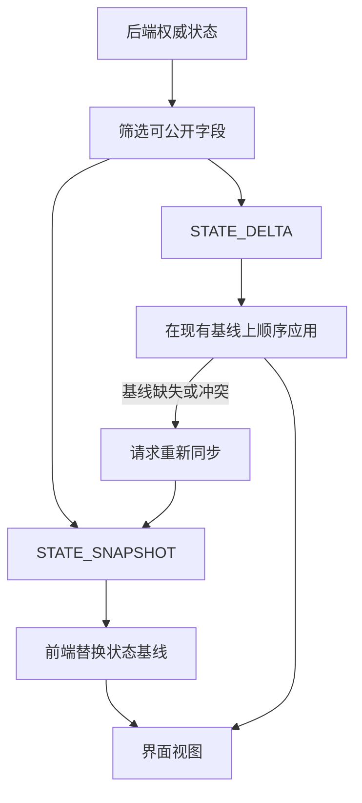
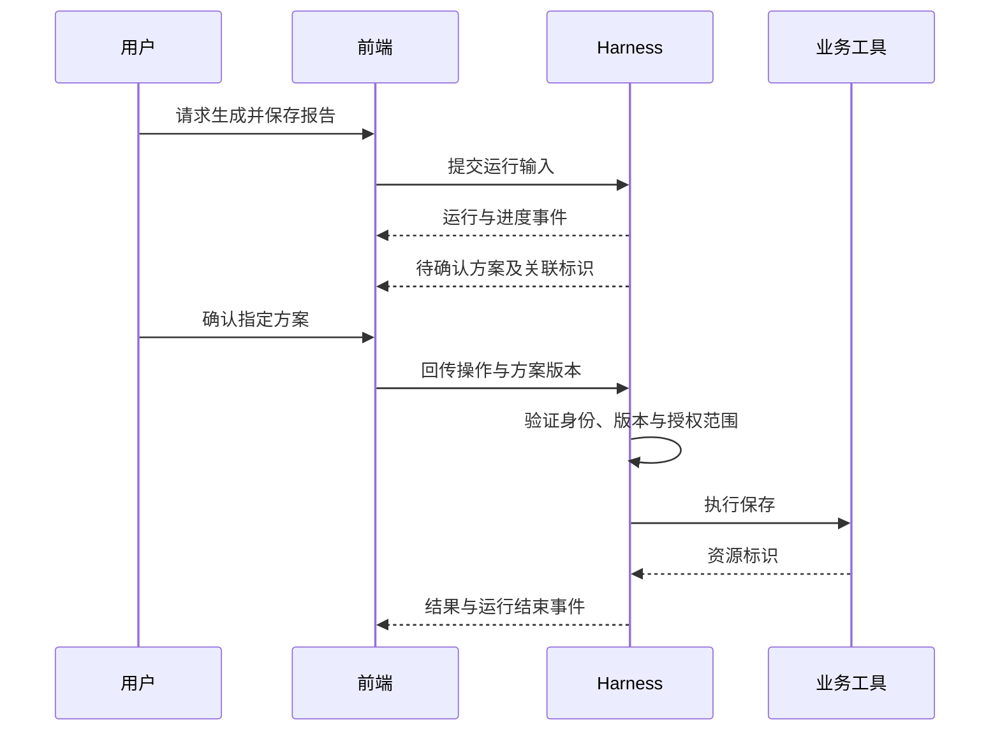
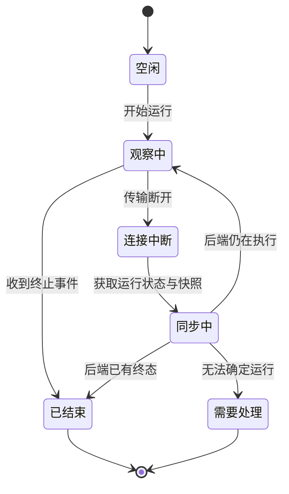

AG-UI（Agent User Interaction Protocol）统一 Agent 后端与用户前端之间的运行交互。它让前端知道一轮任务何时开始、文字如何生成、工具执行到哪里，以及共享状态怎样变化。前端无需把某家模型的原始响应格式当作自己的产品数据模型。

本文核对 2026-09-07 官方文档与 [core 事件源码](https://github.com/ag-ui-protocol/ag-ui/blob/ce1bdef573dbab4ad15be62a788e6c8891aa9d48/sdks/typescript/packages/core/src/events.ts)。只讨论基础 Run、Message、Tool 和 State 事件，不把 draft 事件当成普遍支持的稳定契约。报文和恢复方案是教学设计，未接入真实 Agent 服务。

## 架构：在 Runtime 与界面之间建立事件适配层



适配器把运行事实投影为产品事件；不应把所有内部日志直接发给浏览器。模型上下文、工具凭据、调试堆栈和面向用户的进度拥有不同可见范围。协议中允许表达某种事件，不等于所有用户都有权查看它。[协议定位](https://docs.ag-ui.com/introduction)

前端框架可以变化，后端也可以从普通循环换成图执行。保持稳定的是事件的身份、生命周期和状态语义。这比仅约定“接口返回一个字符串”多了一层运行契约。

## 四种身份对应四个生命周期

| 标识 | 作用 | 典型错误 |
| --- | --- | --- |
| `threadId` | 组织同一会话中的交互 | 当作用户身份直接授权 |
| `runId` | 标识一次运行 | 重试时覆盖前一次运行记录 |
| `messageId` | 关联消息片段 | 把两个并行消息拼接到一起 |
| `toolCallId` | 关联工具参数和结果 | 按到达顺序匹配并行工具 |

客户端应把这些身份保留在自己的状态结构中。不同 ID 的事件可以交错；同一个消息的增量才允许追加到同一缓冲区。[消息与工具关联](https://docs.ag-ui.com/concepts/messages)

一个 Run 的结束也不必等于整个业务任务完成：当前轮次可能只是生成方案或等待下一次用户输入。若产品有跨多轮的任务，需要自己的 Task 对象，不应强迫 `runId` 同时承担会话、任务和执行尝试三种职责。

## 运行输入与输出事件是两份契约

运行输入通常包含 `threadId`、`runId`、`messages`、`tools`、`context` 和应用需要的 state；具体字段以固定 [core 类型](https://github.com/ag-ui-protocol/ag-ui/blob/ce1bdef573dbab4ad15be62a788e6c8891aa9d48/sdks/typescript/packages/core/src/types.ts)为准。输入是一次运行的起点，事件是运行后的观察记录，两者不应共享一个无类型的 JSON 对象。

尤其要检查客户端传入的 tools 和高优先级消息。浏览器说“我有一个管理员工具”，不能使后端凭空获得或授予该能力；后端应从自己的注册表与授权配置形成真实可执行集合。前端传来的上下文也应保留来源标签，不能因为转换成统一格式就升级为可信指令。

例如后台运行 R1 尚未结束，用户又发起 R2。前端应选择显式并行、排队或取消策略，而不是让两个事件流同时修改一个全局 `currentMessage`。协议提供 ID，产品需要规定并发时如何展示与合并。

## 事件协议描述运行过程

| 事件族 | 代表事件 | 解释 |
| --- | --- | --- |
| 运行 | `RUN_STARTED`、`RUN_FINISHED`、`RUN_ERROR` | 本次运行边界 |
| 文本 | `TEXT_MESSAGE_START`、`TEXT_MESSAGE_CONTENT`、`TEXT_MESSAGE_END` | 某条消息逐步形成 |
| 工具 | `TOOL_CALL_START`、`TOOL_CALL_ARGS`、`TOOL_CALL_END`、`TOOL_CALL_RESULT` | 参数形成与工具结果 |
| 状态 | `STATE_SNAPSHOT`、`STATE_DELTA` | 完整状态与局部修改 |
| 历史 | `MESSAGES_SNAPSHOT` | 重建消息视图 |

特别注意：`TOOL_CALL_END` 表示工具调用信息的流式生成结束，不能据此认定业务执行已经成功。执行结果和任务验收仍是后续事实。[事件定义](https://docs.ag-ui.com/concepts/events)

下面的作者示例只表达一条文本消息，不包含鉴权和完整运行输入：

```json
[
  {"type":"RUN_STARTED","threadId":"thread-7","runId":"run-3"},
  {"type":"TEXT_MESSAGE_START","messageId":"msg-8","role":"assistant"},
  {"type":"TEXT_MESSAGE_CONTENT","messageId":"msg-8","delta":"已找到相关文档。"},
  {"type":"TEXT_MESSAGE_END","messageId":"msg-8"},
  {"type":"RUN_FINISHED","threadId":"thread-7","runId":"run-3"}
]
```

JSON 数组是便于阅读的事件记录；实际线路怎样分帧由选定传输实现决定。不能把每个网络数据块都假设为完整 JSON 事件。

## 状态快照与增量必须有共同基线



Snapshot 用于重建完整状态，Delta 使用 JSON Patch 表达修改。局部更新依赖原状态；它不是脱离基线的完整对象。[状态管理](https://docs.ag-ui.com/concepts/state)

例如两个补丁依次为“插入列表第 0 项”和“替换第 1 项”。乱序执行可能改错对象，而不一定报错。因此接收端需要按所选传输和持久层维护顺序。若应用增加 revision、事件序号或去重表，应明确它们是应用契约，不能宣称 AG-UI 自动提供了全部恢复保证。

服务器也不能无条件接受浏览器回传的 State。用户修改筛选条件可以直接成为输入；用户修改 `approved: true` 或租户字段，必须由服务器重新校验。共享状态不等于共享信任。

## 人机协作如何接入



待确认方案的结构、恢复入口和审批凭证是产品与 Runtime 的约定。AG-UI 为呈现和回传提供交互基础，并不定义一套通用业务审批系统。

如果确认按钮停留了十分钟，而后台计划已经改变，后端应拒绝旧版本批准或要求重新确认；不能因为界面显示过一个按钮就允许执行新计划。授权应绑定确定的动作和输入，而不是仅绑定一个自然语言标题。

## 断流不等于运行失败



这是客户端恢复设计，不是 AG-UI 标准状态枚举。连接中断时，后端工具可能仍在运行；重新发送原始任务可能启动第二次写入。

可靠产品需要明确运行所有权、持久快照、重复请求处理和重连入口。若后端本来是随 HTTP 连接消亡的进程，也应将该限制告诉前端，不能显示一个永久“后台运行中”的任务。

## 与其他协议的取舍

AG-UI 适合通用 Agent 应用的实时交互。IDE 里的文件、终端和代码差异能力通常还应研究[ACP](/writing/acp-protocol/)；动态表单的组件描述可以使用[A2UI](/writing/a2ui-protocol/)。前者主要规定事件与共享状态，后者规定可渲染的界面结构，两者可以通过适配组合。

模型 API 的流通常只描述一次模型响应；AG-UI 应表达应用层运行。例如模型工具请求转换为参数事件，实际工具结果到达后再转换为结果事件。把模型流直接改名为 AG-UI，会漏掉工具等待、授权和恢复阶段。

接入时应验证交错消息不会串内容、工具参数结束不会被显示为执行成功、无基线补丁会触发恢复、断线重连不会重复创建业务任务、旧运行事件不会污染新运行。这些是验收场景，本文未报告真实前后端互通的完成率。
