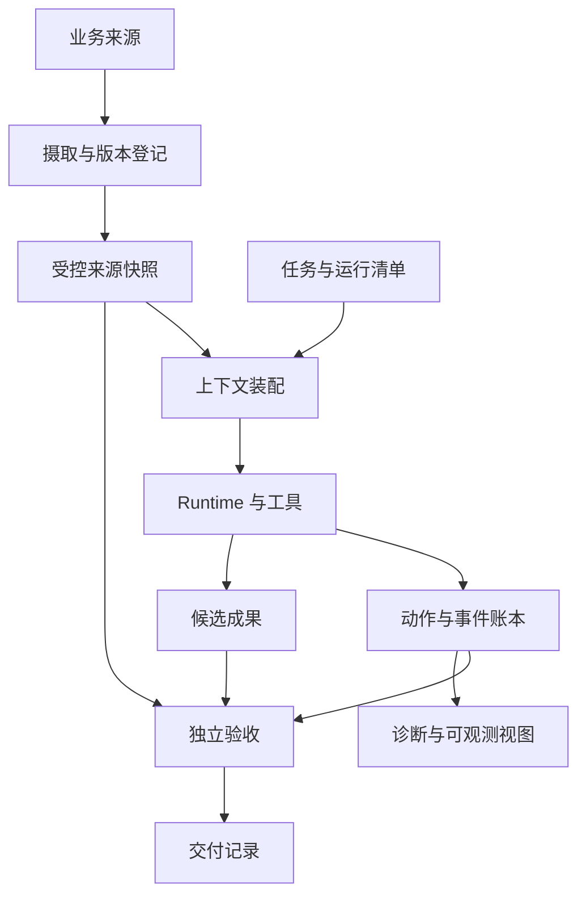
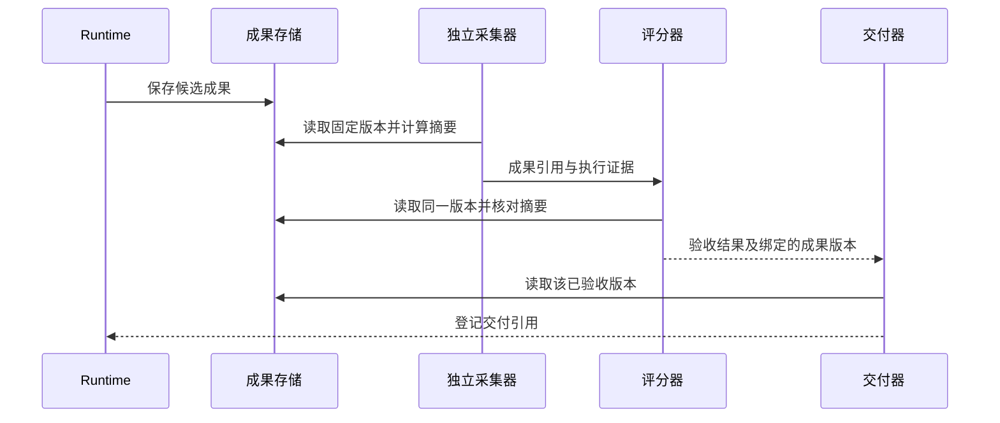
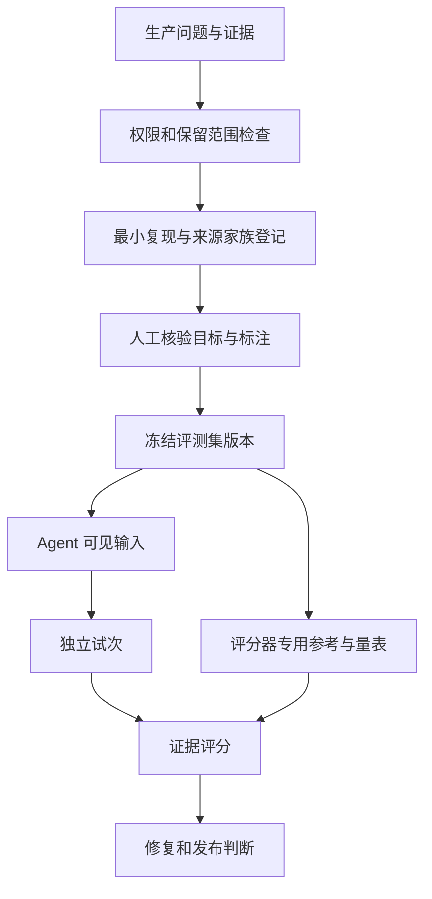
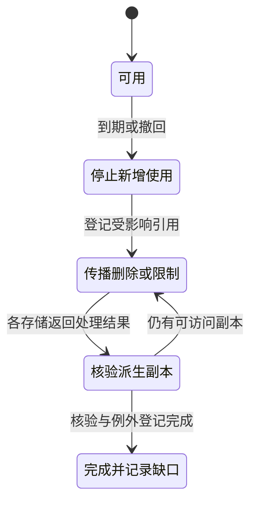

Agent 数据架构要让一次交付回答四个问题：用了什么资料，运行中发生了什么，最终交付的是哪份成果，凭什么认为它正确。消息历史、向量库和 Trace 分别解决一部分问题；把它们接起来，还需要稳定的身份、版本、读写权限和生命周期。

设任务是“根据三份销售表制作八月月报，保存草稿，不外发”。第一次运行金额算错，第二次更正成功；第二天财务又修正源表。此时“最新报告”“成功运行”“正确金额”已经不是一个字段可以表达的事实。系统必须区分当时交付依据、后来业务事实和今天的访问许可。

下面是一套应用参考设计，字段和状态均由本文定义，不是 MCP、A2A 或某个框架的标准类型。配套实验只运行固定文件、Python 检查器和本地 SQLite，未运行模型、训练任务或真实业务系统。

## 先划清数据的六种职责

| 数据对象 | 主要内容 | 权威写入者 | 最容易混淆的对象 |
| --- | --- | --- | --- |
| 来源快照 | 原始字节、来源标识、观测时间、业务有效时间、访问范围 | 摄取器或受信业务连接器 | 检索切片与摘要只是派生物 |
| 任务与运行清单 | 目标、验收条件、输入引用、配置版本、预算 | 任务服务与运行协调器 | 一次任务可以有多个 Run |
| 动作与事件 | 意图、尝试、实际观察、操作键、事件身份 | 调度器、工具适配器、结果采集器 | 模型拟议动作不等于已完成动作 |
| 成果与交付记录 | 文件内容、摘要、生成运行、源版本、交付对象 | 工作空间产生成果；交付器登记已交付版本 | 工作文件不等于已验收成品 |
| 评测样本与结果 | 输入、参考答案、量表、试次清单、判定证据 | 数据策展与独立评分流程 | 参考答案不能成为 Agent 默认输入 |
| 可观测数据 | Span、延迟、错误、资源消耗、关联键 | 遥测系统 | 采样后的诊断记录不能充当完整运行账本 |

“权威写入者”是职责，不要求部署六个服务。单进程也能通过接口和存储权限维护这些边界；一开始更该避免让任何模块随意覆盖所有表。

[Agent Runtime](/writing/agent-runtime/)解释运行如何推进，[RAG](/writing/rag/)解释资料如何被检索，[Memory 治理](/writing/agent-memory-governance/)解释长期知识如何纠正和撤回。这里关心的是这些模块交换数据后，哪些关系必须仍然成立。

<!-- diagram:agent-data-architecture-1 -->



来源快照供上下文装配和验收分别读取；Runtime 提交候选成果，独立验收结合来源与执行证据决定是否交付。事件账本向诊断视图供数，诊断视图不反向改写已经观察到的业务事实。

<!-- /diagram -->

## 身份先于存储选型

月报的 `task_id` 指用户目标；`run_id` 指一次有边界的执行；`action_id` 指业务动作；`attempt_id` 指该动作的一次尝试。工具请求超时后重试，可能保留业务操作键，但必须有新的尝试身份。重新开始整项任务则创建新 Run，并保留与旧 Run 的关系。

`trace_id` 用于追踪调用，`event_id` 用于识别观察记录，`artifact_id` 用于识别成果。它们不能互换：一次长任务可能跨进程、跨多条 Trace；同一产物可能被多个任务引用。OpenTelemetry 允许通过 Span Link 关联不同 Trace 的 Span，这适合解释异步调用关系；业务身份仍由应用维护。[OpenTelemetry Traces](https://opentelemetry.io/docs/concepts/signals/traces/)

最小关系可以写成：

```text
Task -> Run -> Action -> Attempt
            -> InputManifest -> SourceSnapshot
            -> Artifact -> Delivery
            -> Event -> EvidenceReference
Experiment -> PlannedTrial -> Run + DatasetVersion + GraderVersion
```

这里的箭头表示引用，不表示数据库级联删除。删除一个任务是否同时删除交付成果，需要按所有权、保留要求和引用关系决定。产物也可以引用多个来源快照，而不是只保存一个“来源 URL”。

内容哈希回答“这些字节是否与登记时相同”，不能证明来源真实、计算正确或用户有权读取。URL 不足以固定内容；只保存哈希又不足以重算。可复核通常需要内容、摘要、来源说明和可访问的存储位置共同存在。

## 来源有两个时间，派生数据有自己的版本

财务九月九日上传一张更正表，修正八月的销售数据。`observed_at` 是系统看到更正的时间，`effective_at` 是业务声明其开始有效的时间。前者不能代替后者；业务时间也可能是一段区间。旧报告应保留“按旧版本生成”的事实，新任务按照明确规则选择更正版本。

同一来源进入检索时，会产生解析文本、切片、嵌入和摘要。它们各自受解析器、切片策略、嵌入模型、摘要配置影响。只给源文件编号，无法解释为什么重建索引后检索结果不同。派生记录至少引用源版本和变换版本；检索集合还要说明当前包含哪些派生版本。

| 变更 | 需要更新什么 | 不应悄悄发生什么 |
| --- | --- | --- |
| 源表金额更正 | 新来源版本、受影响派生物、后续报告 | 把旧报告的来源指针改成新表 |
| 切片策略更新 | 新派生版本、索引集合版本 | 将检索差异归因于模型升级 |
| 来源撤权 | 当前访问判断、缓存与派生物可见性 | 用旧授权快照继续放行 |
| 参考答案修订 | 新评测集或标注版本、必要的重新评分 | 覆盖旧实验分数而不留依据 |

版本固定也不保证模型输出完全复现。外部服务、运行时依赖和模型本身可能变化。清单的作用首先是界定差异；只有所需环境与数据仍然可获得时，才能进一步重跑。

## 事件记录事实，状态视图服务查询

若报告已经保存，但完成事件重复投递，状态服务不应多算一次交付。事件写入先检查身份：相同 `event_id`、相同内容可以去重；相同身份、不同内容应报冲突。直接用后来的内容覆盖，会把数据损坏伪装成正常更新。

当前运行状态可以从事件更新，但必须定义迁移条件。迟到的“开始执行”事件不能把“已验收”回退到“执行中”；执行器失去租约后提交的完成事件，也不能绕过当前执行权检查。复杂系统需要版本条件、隔离令牌或按操作对账，详见[任务服务](/writing/harness-operations-production/)。

数据库事务与外部文件写入不是一个原子事务。写完文件后进程崩溃，可能尚未登记产物；先登记后崩溃，又可能只有悬空记录。一个参考方案是把文件写入临时位置，校验并发布固定内容，再登记待交付记录，由对账程序发现孤立文件和悬空引用。多服务通知可考虑事务内 Outbox 配合消费去重，但仍需处理外部副作用；它不天然提供端到端“恰好一次”。[故障恢复](/writing/harness-engineering-recovery/)展开这些提交边界。

本地实验只验证 SQLite 内事件去重与冲突拒绝，没有实现 Outbox、跨进程并发、分布式投递或上述文件发布流程。把教学实现扩成生产系统，需要另测崩溃位置、乱序与执行权切换。

## 交付与评分必须绑定同一份成果

假设报告 A 通过验收，用户下载时拿到的却是后来覆盖的报告 B。即使评分算法完全正确，交付仍然失去了依据。因此验收记录至少绑定 `run_id`、任务契约版本、输入清单摘要、成品摘要和评分器版本；交付器再引用这次已验收的成品版本。

<!-- diagram:agent-data-architecture-2 -->



采集、评分和交付引用同一个固定成果版本。若读到的字节摘要与验收记录不符，应暂停交付并重新采集，不能把旧结论套在新文件上。图中未展开鉴权与并发控制，摘要校验只是完整性检查的一部分。

<!-- /diagram -->

同样，“没有外发”不能由报告里的 `sent: false` 自证。执行工具的独立审计记录、连接器实际状态和采集完整性共同决定证据够不够。已观察到禁止外发属于失败；没有完整审计只能说明未知，不能推导没有发生。可信采集器本身需要边界与测试。

## 从生产数据到评测集，需要一次有意的转换

生产记录围绕服务用户组织；评测样本围绕验证一个可复现问题组织。两者的差异包括敏感数据、初始环境、可用凭据、参考答案和可重复的目标状态。因此，不能简单地把所有聊天和 Trace 导出后称为评测集。

一个月报失败样本至少要经过四步：确认错误和有效目标，保留足够重现的源数据，移除或替换不需要的个人与业务信息，建立独立参考答案及量表。脱敏替换不能破坏待测试机制，例如把所有空值填满就会消灭空值处理的失败。

<!-- diagram:agent-data-architecture-3 -->



经过筛选的证据先变成有来源关系的样本，再固定成数据集版本。运行器只提供 Agent 应见的输入，评分器另外读取参考答案和量表；这种数据路径分离需要执行环境的访问控制落实。

<!-- /diagram -->

LangSmith 的 Examples 明确区分 inputs、可选 reference outputs 和 metadata，参考输出供评委使用而不传给应用。本文据此采用两份读取清单；这并不意味着把文件放进两个目录就自动形成了安全隔离。[Evaluation concepts](https://docs.langchain.com/langsmith/evaluation-concepts)

评测集需要两种组织信息：按月份、缺失值、权限等属性划分的**分析切片**可以重叠；开发集、回归集和最终留出集的**用途边界**必须按实验规则维护。同一份原表生成的不同措辞题目，应继承来源家族，不能仅因文本哈希不同就随机分到开发与留出两边。

scikit-learn 的 GroupKFold 用组身份避免同组样本同时进入训练和测试折。将这一原则用于 Agent 任务，是本文的设计迁移：可按原始工作簿、客户案例或缺陷家族分组，具体取决于想检验哪种泛化。[分组交叉验证](https://scikit-learn.org/stable/modules/cross_validation.html#cross-validation-iterators-for-grouped-data)

分组仍不能消除所有泄漏。时间泛化需另外设置时间切点；相互转载的数据源可能需要归并家族；开发者看过的留出题应记录暴露并重新安排用途。选错组粒度也可能使评测不再代表目标业务，而不是“组越大越科学”。

## 训练回流不是把成功轨迹全量喂回去

一份成功报告可能经历过错误检索、无效重试和人工修正。训练若不区分这些步骤，会同时学习错误动作和修复结果。候选训练记录要说明目标能力、输入可见范围、正确输出来源、人工干预和允许的数据用途；最终交付成功只是候选筛选信号。

监督微调可以使用经审核的输入与目标输出；偏好数据需要在可比条件下标注候选优劣；工具行为数据还需保留动作发生时的状态与许可。不能把最终才获得的答案拼回早期上下文，让模型学习一条在线根本拿不到信息的路径。

运行记录进入长期 Memory 与进入模型训练也是两个决定。前者可以按来源撤回、改写和重新检索；训练参数中信息的移除需要另行处理，删除原始文件不能证明已训练模型不再保留相关信息。因此先管理“允许形成何种派生资产”，再讨论训练收益。本文未执行任何训练，也没有验证数据回流带来的模型效果。

## 保留与删除必须沿血缘传播

默认永久保存全部 Prompt、工具结果和用户文件，会增加暴露面，也可能违背数据使用约定。运行清单可以长期保留结构化摘要和审计依据，原始内容按用途采用不同保留周期；具体周期要由业务与适用要求确定。

删除或撤权需要追踪来源、副本、切片、向量、摘要、Memory、缓存、评测样本和训练候选等派生关系。共享派生物不能只凭一个来源撤回就无差别删除其他用户独立拥有的数据；反过来，也不能因为内容被摘要过就当作没有来源限制。

<!-- diagram:agent-data-architecture-4 -->



这是应用的数据撤回流程。先阻止新增使用，再向受影响存储传播，最后核验副本与例外。存在保留要求的审计记录或不可立即删除的备份时，要记录范围和到期处理条件，不能把“已发删除消息”等同于所有副本已经清除。

<!-- /diagram -->

历史运行保留当时的授权依据，恢复读取却仍需检查当前权限。否则旧 Run 会成为绕过撤权的入口。若来源已按保留规则销毁，该运行可以保留历史验收记录，但重新核验应返回“证据不可用”；不能用今天的近似资料冒充原始快照。

## 最小实现如何选择，何时再拆分

| 需求 | 可以先做什么 | 推动升级的真实条件 |
| --- | --- | --- |
| 单机少量任务、文件产物 | 清晰目录、结构化清单、SQLite 元数据 | 并发写入、共享执行、恢复要求超出单机边界 |
| 大量或较大成果 | 内容存储与元数据分离，登记固定版本和引用 | 跨工作节点读写、容量与生命周期管理需求 |
| 语义检索 | 在来源与权限清单上增加检索索引 | 确实需要语义召回，而非所有对象都进向量库 |
| 长任务故障恢复 | 持久状态、动作身份、对账流程 | 多服务故障与长时间等待要求更完整编排 |
| 多人维护评测 | 数据集版本、样本家族、标注与变更记录 | 并发策展、访问控制、评委管理与审计需求 |

选择数据库不能替代这些语义：关系库不自动知道哪个版本该交付，对象存储不自动知道谁有权读，向量索引不自动知道哪个事实已经失效。把这些规则先写成接口约束，后续迁移存储时才有可以验证的不变量。[Harness 架构设计](/writing/prompt-context-harness-engineering/)进一步解释职责与部署边界的取舍。

## 固定样例验证了什么

[下载数据与评测实验](/labs/agent-data-evaluation.zip)，解压后运行：

```sh
python3 -m unittest discover -s . -p 'test_*.py' -v
python3 lab.py
```

2026-09-09 的本地执行通过 16 项检查，覆盖参考答案不进入 Agent 输入清单、来源变化、跨试次产物、成品采集后被改写、已知外发与缺失证据的判定优先级、事件和试次去重、来源家族跨集泄漏，以及漏记试次的分母处理。

四个固定候选成品得到两个通过、一个失败、一个未知。汇总保留四个计划试次，已验收比例为 50%；人为设置的成本共 5 个单位，除以两个通过成品为 2.5 单位。它们演示数据口径，不是实测模型费用或 Agent 成功率。[Agent 评测系统](/writing/agent-system-evaluation-research/)继续解释如何把这些记录用于版本比较。

实验中的参考答案与审计证据由测试程序构造；目录分离不是操作系统权限隔离，SQLite 去重不证明分布式恰好一次。删除传播、训练回流、对象存储并发、真实鉴权和真实模型泛化均未执行。读者可以用这些检查约束下一层实现，但不能把教学样例的通过当作生产系统已经完成。
