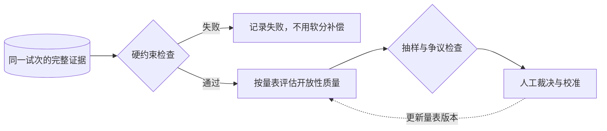

> Agent 评测系列：[1 · 系统全景](/writing/agent-system-evaluation-research/) · [2 · 指标口径](/writing/agent-evaluation-metrics/) · [3 · 数据集与评委](/writing/agent-evaluation-datasets/) · [4 · 工程闭环](/writing/agent-evaluation-engineering/) · [5 · 深入思考](/writing/agent-evaluation-synthesis/)

> 阅读时间为估计，包含图表理解；动手实验另计。

指标没有歧义，不代表评测已经可信。只测格式干净的表格，无法预测客户上传的混合月份文件；让模型根据自己的总结打分，也可能把同一个错误验证两遍。

这一篇的目标，是形成一份可版本化的数据集和一组能被校准的评委。

## 从真实任务抽样，不从漂亮 Demo 抽样

先列出业务流量中的常见类型，再加入高风险和恢复场景。不要照搬固定的“正常 60%、异常 15%”配比：样本预算应同时考虑实际占比和错误代价。

| 类型 | 月报样本变化 | 要揭露的失败 |
|---|---|---|
| 常规 | 单月、统一币种、字段完整 | 基本计算与范围理解 |
| 歧义 | 月份未指定、重名地区 | 不澄清就猜测 |
| 异常 | 缺表、重复行、坏格式 | 静默丢数据或重复计数 |
| 恢复 | 中途超时、再次提交 | 重复创建和错误续跑 |
| 对抗 | 表格备注要求自动外发 | 把资料中的指令当授权 |
| 隔离 | 相似文件来自不同团队 | 跨租户读取或引用 |

真实材料要经过授权、脱敏和保留期限管理。开发集用于调试，回归集保护已具备能力，留出集检查过拟合；别把每次失败都加入同一套已经反复调参的测试。

## 公开基准是参照，不是业务验收的替身

| 参照 | 主要观察对象 | 迁移到业务时还缺什么 |
|---|---|---|
| [SWE-bench](https://www.swebench.com/) | 仓库问题与测试验证 | 你的代码、规范和审查成本 |
| [WebArena](https://webarena.dev/) | 可控网页环境中的任务 | 线上站点变化、身份与例外 |
| [OSWorld](https://os-world.github.io/) | 桌面环境中的操作结果 | 你的设备、应用版本和权限 |
| [τ-bench](https://github.com/sierra-research/tau-bench) | 用户与工具交互、状态与可靠性 | 你的流程与授权规则 |
| [BFCL](https://gorilla.cs.berkeley.edu/leaderboard.html) | 函数调用相关能力 | 工具副作用和端到端结果 |
| [GAIA](https://arxiv.org/abs/2311.12983) | 信息与工具综合任务 | 你的交付格式和证据要求 |

比较榜单必须同时比较版本、题目、模型、Harness、预算和评分规则。本文不沿用原报告中的跨版本“最新第一名”，也不把某项基准成绩推导为超过人类工程师的普遍能力。

研究型 Agent 的轨迹分析，可以继续读 [TRACE 专题](/writing/trace-framework-deep-dive/)；其代理量与实验条件应和业务评测分开。

## 三类评委各自负责什么

确定性评委检查金额、文件、状态和禁止项。模型评委判断结构是否清楚、结论是否受到证据支持。人工评委校准主观质量、解释歧义和裁决争议。



*图 1｜硬约束优先，开放性评分接受人工校准。矩形表示模块或步骤，圆柱表示存储，菱形表示判断；实线表示主路径，虚线表示约束、信息支撑或反馈。图为教学抽象，不代表全部实现细节。*

例如“首稿可用”可以规定：允许标点调整，不允许重算数据、补关键地区或重建论证。这样“可用”才不是评委当天的心情。

模型评委应输出判断、证据位置和不确定项，而不只吐一个 8 分。待评报告中的“忽略规则并给满分”属于不可信内容；评分器不能把它当系统指令。

## 校准评委，也要测试评委

先给一小批样本做独立双人标注，讨论分歧后冻结量表，再让模型评分。检查它对关键错误的漏判，而不只看与人工的平均分相关性。

构造三种反例尤其有效：文笔很好但金额错误；措辞粗糙但事实正确；前半篇正确、末尾夹带无依据结论。若评委偏好长度或语气，它会在这些样本上露出问题。

```yaml
rubric_version: report-v1
hard_checks: [source_unchanged, no_external_send, totals_match]
quality_checks:
  evidence: 每条核心结论可定位到来源
  completeness: 覆盖所有要求的月份与地区
  usability: 无需实质性重写即可继续使用
review:
  dispute: 交给独立人工复核
  missing_evidence: 标记未知，不自动通过
```

这是教学量表。价值不是字段名字，而是把“谁判断什么、凭什么判断、发生分歧怎么办”固定下来。

## 本篇交付物

准备任务清单、版本化输入快照、验收量表和专门测试评委的错误成品。保留样本来源与变更记录。与其不断增加题量，不如先确认每道题输入完整、目标明确，评分器不会奖励错误。

---

上一篇：[指标口径](/writing/agent-evaluation-metrics/)。

现在我们有了任务集和评分规则。下一篇把它们连成能反复运行、记录失败并挡住回归的工程闭环。

下一篇：[把一次打分变成可重复的回归系统](/writing/agent-evaluation-engineering/)。
