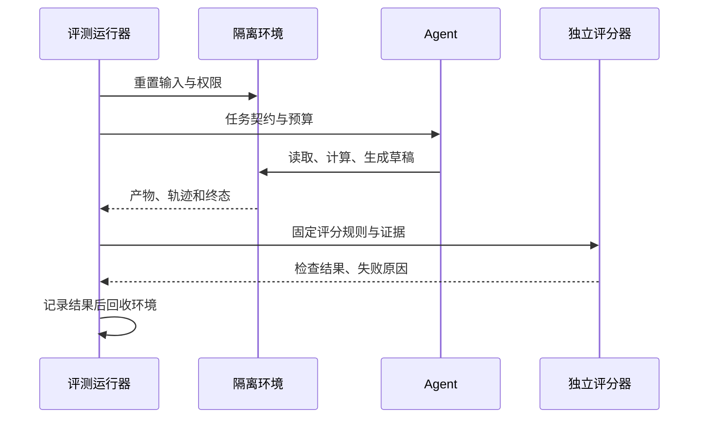

前述讨论解决了量尺和题目，现在需要一个每次都能按相同口径工作的流程。把一份输入、两份成品和独立检查跑通，比先画满仪表盘更有价值。

## 运行器与 Agent 不应共享全部权力

评测运行器负责重置环境、传入任务、收集证据和评分；Agent 在授权环境中完成任务。验收文件与标准答案不应默认出现在 Agent 可写目录，否则它可能修改测试来“修复失败”。

每个试次分配独立目录或沙箱、输入快照和运行标识。日志记录版本、调用、外部状态、费用与人工干预。失败时保留证据，再清理环境；不要只保留成功案例。



*图 1｜运行器、执行环境与独立评分器的交接。*

重置不是删除客户数据，重试也不是重复执行真实外发。教学和回归先使用隔离环境与模拟连接器。

## 先跑一个不需要模型的实验

配套源码在仓库的 `docs/editorial-labs/`，说明文件为 `README.md`。在仓库根目录运行：

```sh
python3 -m unittest discover -s docs/editorial-labs -p 'test_*.py' -v
python3 docs/editorial-labs/evaluation_lab.py
```

示例用固定销售记录和候选报告检查金额、月份、源表保护、禁止外发与证据完整性。它不调用模型，不连接业务服务，不产生真实外部写入。

先运行正常成品，再看错误月份、金额错误、外发和缺失证据等反例为什么被拒绝。**该实验验证的是评分契约，不是某个 Agent 的成功率，也不是生产级沙箱实现。**

要接入真实 Agent，再补上执行适配器、独立终态采集、状态重置、超时处理和凭据隔离。不能把候选报告里自称的“没有外发”当成唯一审计证据。

## 平台负责工程能力，不负责替你定义正确

| 可参考项目 | 在闭环中的位置 | 选型时实际检查 |
|---|---|---|
| [Langfuse](https://github.com/langfuse/langfuse) | Trace、数据集与评测工作流 | 部署边界、版本、许可及所需功能 |
| [Phoenix](https://github.com/Arize-ai/phoenix) | 可观测与评估 | Trace 接入、数据导出与校准 |
| [DeepEval](https://github.com/confident-ai/deepeval) | 测试与指标框架 | 指标定义是否符合业务契约 |
| [LangSmith](https://docs.langchain.com/langsmith/evaluation) | 实验与 Agent 开发工作流 | 部署方式与合同约束 |
| [Braintrust](https://www.braintrust.dev/docs) | 评测实验与迭代 | 数据驻留、评分规则与版本比较 |

开源仓库不代表全部功能采用同一许可，自托管不自动等于合规。不要沿用“完全免费”“某地区首选”“满足所有驻留要求”等未经部署和合同核查的结论。

## 从回归到发布，而不是从分数到庆功

| 阶段 | 做什么 | 未通过时 |
|---|---|---|
| 每次变更 | 快速契约测试、重要失败样本 | 阻止相关变更进入下一阶段 |
| 候选版本 | 固定任务集、多试次与切片比较 | 分析退化，不能只看平均提升 |
| 限定试用 | 小范围真实流量与人工兜底 | 停止扩量，恢复旧版或人工流程 |
| 持续运行 | 监测新失败和漂移 | 形成新样本并检查旧回归 |

流量比例和通过阈值由风险与样本量决定，没有通用的“5% 灰度就安全”。安全禁止项可以作为硬门槛；性能比较要考虑随机波动与业务容忍度。

## 把失败变成下一次可检查的事实

记录错误时回答：预期是什么，实际是什么，证据在哪，影响多大，怀疑哪一层，如何复现。修复后先重跑原始失败，再跑相邻场景，最后检查无关能力是否退化。

例如修正月份过滤后，还应测试跨年月份、空月份和时区边界；仅让原题通过，可能只是把错误改成另一种特殊情况。

工程闭环的最小成果是：任何人拿到相同输入、版本和评分规则，都能解释本次通过或失败。它不要求先拥有最复杂的平台。

## 过程证据帮助定位，却不自动证明因果

新版本使用更少工具且成功率更高，可能是检索更好，也可能是题目更简单、缓存命中更多或环境更稳定。轨迹相关性只提供假设。

验证检索策略的收益，应尽量固定模型、题集、权限和预算，改变检索因素，再观察结果与成本。结论只覆盖实验条件；不能从一次 PoC 推导所有部署的收益。

这也解释了为什么本文没有给平台和模型做统一总分：加权会隐藏决策者必须理解的冲突。

## 零次事故不等于风险为零

若每次事故概率独立且相同，在 n 次试验中观察到零事故，单侧 95% 上界可由下面的简化关系求得：

$$
(1-p)^n=0.05
$$

例如 n=100 时，上界约为 2.95%。这个推导只说明有限样本无法证明零风险；真实任务存在相关性和分布变化，不能把它当安全认证方法。

对高代价动作还需要最小权限、限额、独立验证、人工审批与可恢复流程。评测提供证据，运行时边界限制损失，两者不可互换。
