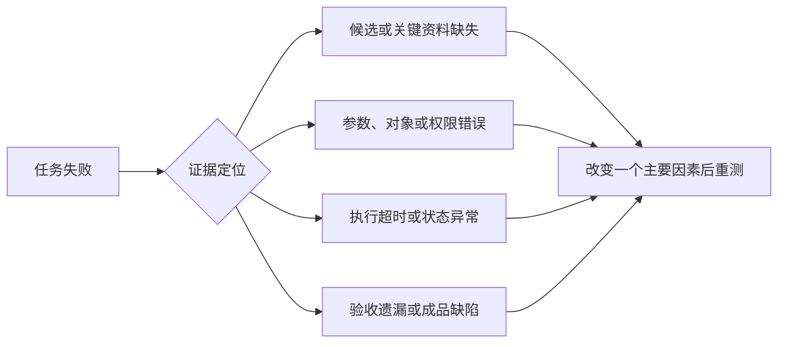

> Agent 评测系列：[1 · 系统全景](/writing/agent-system-evaluation-research/) · [2 · 指标口径](/writing/agent-evaluation-metrics/) · [3 · 数据集与评委](/writing/agent-evaluation-datasets/) · [4 · 工程闭环](/writing/agent-evaluation-engineering/) · [5 · 深入思考](/writing/agent-evaluation-synthesis/)

> 阅读时间为估计，包含图表理解；动手实验另计。

上一篇给月报任务写了契约。现在假设它运行三次：第一次成功，第二次月份错误，第三次成功。你可以说“三次至少成功一次”，却不能说“每次都可靠”。这两句话的差别，决定产品应该提供草稿辅助还是无人值守执行。

## 成功率先守住分母

任务成功率是通过既定验收的任务数除以纳入评测的任务数。超时、预算耗尽和工具失败不能悄悄退出分母。任务确实超出产品声明范围时，另报支持覆盖率；不能筛到只剩简单题，再宣称成功率很高。

月报成功需要内容、范围、成品和禁止项共同通过。若金额正确但发生外发，任务仍然失败。安全门槛不适合被排版美观等软指标补偿。

也要明确“第一次交付”：允许 Agent 在同一预算内自行测试、修复；不允许把用户追加纠错后的结果算进无人补救成功率。

## pass@k 与 pass^k

| 指标 | 问题 | 适用解释 |
|---|---|---|
| pass@1 | 一次机会能否成功？ | 单次运行水平 |
| pass@k | k 次机会至少成功一次？ | 有选择与验证机制时的尝试能力 |
| pass^k | k 次是否全部成功？ | 重复运行的一致性 |

HumanEval 常用的 pass@k 估计式，在某个任务已有 n 个样本、其中 c 个成功、且 n ≥ k 时为：

$$
\widehat{pass@k}=1-\frac{\binom{n-c}{k}}{\binom{n}{k}}
$$

从 n 个结果中选 k 个，全部落入失败集合的比例就是分式；用 1 减去它得到至少一次成功的估计。计算后再按约定聚合到任务集。实现与适用条件见 [HumanEval](https://github.com/openai/human-eval)。

“有一个正确答案”仍不等于产品能识别并交付它。多次生成带来的额外费用、挑选机制和误选风险应计入系统评测。

τ-bench 用 pass^k 强调重复成功。[τ-bench](https://github.com/sierra-research/tau-bench) 实际报告应从各任务的重复试次计算，并说明是否使用组合估计。不要把全体任务平均成功率直接取 k 次方：任务难度不同，试次还可能共享环境故障和缓存。

举个反例：90% 的任务每次都成功，10% 的任务每次都失败。平均单次成功率是 90%，三次全部成功的任务比例仍是 90%，不是 72.9%。

## 轨迹指标用于解释，不负责代替结果



*图 1｜由失败证据定位待验证的改进因素。矩形表示模块或步骤，圆柱表示存储，菱形表示判断；实线表示主路径，虚线表示约束、信息支撑或反馈。图为教学抽象，不代表全部实现细节。*

| 诊断面 | 应记录 | 不应直接推导 |
|---|---|---|
| 工具选择 | 候选、被选工具、拒绝原因 | 工具越少必然越准 |
| 参数与结果 | 实际参数、状态、结果利用 | 调用返回成功就完成任务 |
| 恢复 | 故障类型、重试和接管 | 重试次数越少越好 |
| 记忆 | 来源、有效期、引用位置 | 召回多就更懂用户 |
| 规划 | 显式计划、中间产物、依赖 | 合理说明证明内部推理正确 |

增加探索可能更贵，也可能避免高代价错误。结合结果与风险，才能判断某一步是否“无效”；不应以最短路径作为所有任务的唯一标准。

## 成本要包含失败

$$
C_{accepted}=\frac{\text{全部试次的模型、工具与基础设施费用}}{\text{验收成功的交付数}}
$$

人工时间建议先单列；需要折算货币时，再公开工时单价和包含范围。没有成功交付时报告“无成功样本”，不是成本为零。

两个方案做相同的 100 项任务，A 花 100 元成功 50 项，B 花 160 元成功 80 项，两者都是每个成功交付 2 元。但若 A 消耗 500 分钟人工、B 消耗 240 分钟，体验显然不同。这组数字只是教学假设。

## 交付一张指标卡

```text
范围：相同月报任务集与预算；任务数和试次数分别列出
硬门槛：金额、范围、源文件保护、禁止外发
结果：成功率、支持覆盖率、人工补救率
稳定性：每任务多次运行结果，不只全局平均
过程：错误类别、重试、恢复与拒绝
成本：全部费用、人工分钟、P50/P95 完成时延
版本：模型、工具、环境、评分器与数据快照
```

样本较少时，不必报很多位小数制造精确感。比较版本时按相同任务配对，报告样本量和差值不确定性；重采样也应考虑同一任务多试次的相关性，不能把它们当成大量全新题目。

---

上一篇：[系统全景](/writing/agent-system-evaluation-research/)。

指标口径明确之后，新的问题出现了：题目是否代表真实工作，打分者是否可靠？下一篇从样本和评委入手。

下一篇：[先把题目和裁判做对，再谈排行榜](/writing/agent-evaluation-datasets/)。
