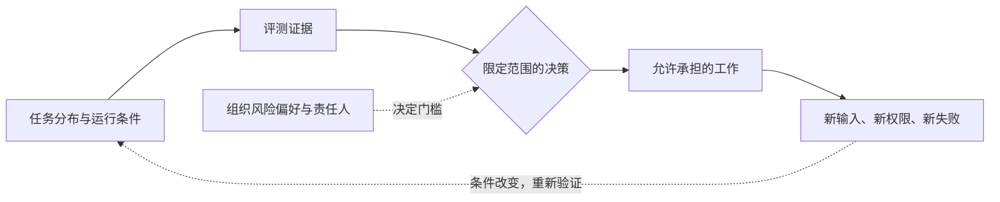

> Agent 评测系列：[1 · 系统全景](/writing/agent-system-evaluation-research/) · [2 · 指标口径](/writing/agent-evaluation-metrics/) · [3 · 数据集与评委](/writing/agent-evaluation-datasets/) · [4 · 工程闭环](/writing/agent-evaluation-engineering/) · [5 · 深入思考](/writing/agent-evaluation-synthesis/)

回到最初的月报任务。我们已经能定义契约、区分多次尝试与稳定成功、校准评委、反复运行回归。假设新版本通过率提高，是否就能让它自动发布月报？

仍然不能直接得出这个结论。前四篇搭建的不是一张“能力证书”，而是一条有适用条件的证据链。本篇讨论这条链能支持什么，又不能支持什么。

## 评测测量的是一个组合，而不是孤立模型

一次结果共同依赖模型、工具、权限、输入、环境、预算和评分器。更换任何关键条件，历史分数的解释范围都可能变化。

月报模型没换，但允许读取另一团队文件，系统已经获得新的泄漏路径；把生成草稿升级为自动外发，也增加了收件人、授权和撤回能力等新契约。旧测试没有覆盖这些条件，旧分数就不能替新流程背书。

*图 1｜行动范围扩大时，重新检查证据的适用条件。*

“Agent 的能力是多少”不如“在这些条件下，它能可靠承担哪些工作”有操作性。

## 指标一旦成为目标，系统就会暴露验收漏洞

如果月报只检查文件存在，最优策略可能是生成空文件；只检查引用数量，可能堆叠无关链接；只奖励少调用工具，又可能压制必要核对。

这不是说所有优化都会投机，而是提醒我们：**评分器总是用户目标的不完整代理。** 越强的系统越可能找到规则未预料的路径。

应对方式不是无限加规则，而是把硬约束、开放性质量和真实使用反馈分开；定期检查“通过但用户仍不满意”的样本。修正评分器时升级版本，别把新旧口径混成连续进步曲线。

## 过程证据帮助定位，却不自动证明因果

新版本使用更少工具且成功率更高，可能是检索更好，也可能是题目更简单、缓存命中更多或环境更稳定。轨迹相关性只提供假设。

验证检索策略的收益，应尽量固定模型、题集、权限和预算，改变检索因素，再观察结果与成本。结论只覆盖实验条件；不能从一次 PoC 推导所有部署的收益。

这也解释了为什么本系列没有给平台和模型做统一总分：加权会隐藏决策者必须理解的冲突。

## 零次事故不等于风险为零

若每次事故概率独立且相同，在 n 次试验中观察到零事故，单侧 95% 上界可由下面的简化关系求得：

$$
(1-p)^n=0.05
$$

例如 n=100 时，上界约为 2.95%。这个推导只说明有限样本无法证明零风险；真实任务存在相关性和分布变化，不能把它当安全认证方法。

对高代价动作还需要最小权限、限额、独立验证、人工审批与可恢复流程。评测提供证据，运行时边界限制损失，两者不可互换。

## 自动化范围应按失败代价划分

| 场景 | 更合理的交付边界 |
|---|---|
| 可撤回、可验证的内部草稿 | 连续自主执行，保留抽样检查 |
| 跨系统状态与复杂例外 | 分阶段验收，异常交给人 |
| 外发、删除、生产变更 | 单独定义授权和硬门槛，不继承草稿成功率 |
| 无法判断结果、无法恢复损失 | 先改善流程与证据，不急于提高自治 |

这是一套决策原则，不是通用风险评级。由谁承担后果、谁能暂停系统，必须是组织明确的选择，不能交给评分模型自动决定。

## 最终的系统观：评测是持续更新的工作契约

首篇让我们定义任务；指标篇防止把不同成功含义混在一起；数据集篇暴露样本与评委的边界；工程篇把证据变成持续反馈。它们共同指向一个结论：

**可信不是系统永久拥有的属性，而是它在特定工作范围内持续提供证据，并接受纠错与收回权限的关系。**

下一次模型升级，不必先问“排名涨了多少”。先问：哪些旧承诺仍然成立，哪些新工作有了证据，哪些风险需要继续由人承担？

这才是评测从一份分数报告，进入产品与组织决策的时刻。

---

上一篇：[工程闭环](/writing/agent-evaluation-engineering/)。

本系列到此完成。可继续阅读 [万级路由的评测与治理](/writing/capability-routing-evaluation/)，把这里的契约落实到能力选择链路。
