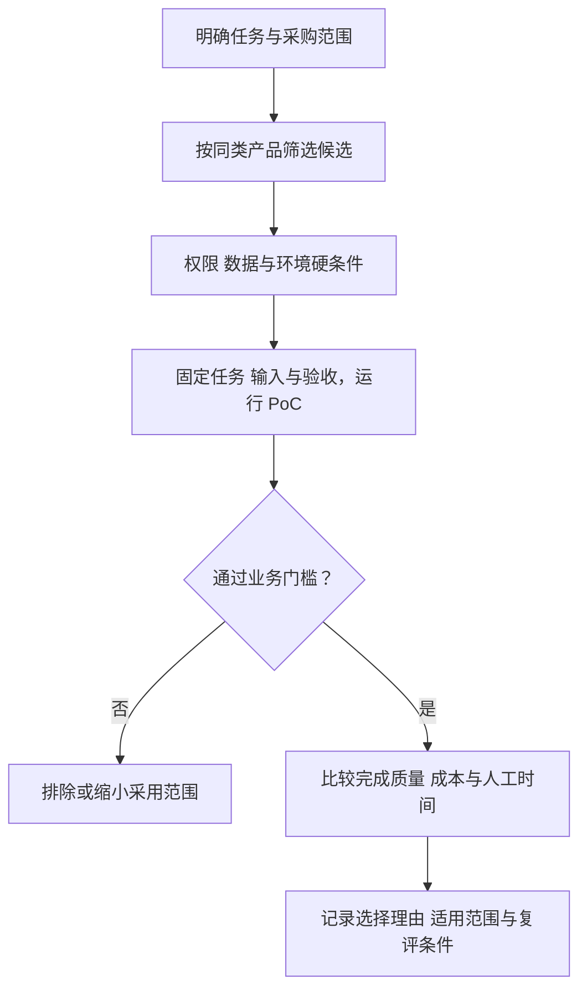

同一张功能清单无法公平比较 Coding Agent、办公 Agent 与开源 Harness。真正有用的比较，必须先声明决策对象，再让不同框架各自回答一个问题。



*图 1｜竞品分析先建立可比范围，再用业务任务验证。未通过硬条件的产品，不用其他高分抵消。*

## 三个分析工具各自回答什么

体验分层、证据记录和策略分析承担不同职责：

| 框架 | 回答的问题 | 使用方法 | 不负责什么 |
| --- | --- | --- | --- |
| 用户体验五要素 | 用户究竟经历了怎样的产品？ | 从战略层、范围层、结构层、框架层到表现层逐层比较 | 不直接判断企业外部机会 |
| 价值要素表 | 产品公开强调哪些价值？ | 记录功能、来源与待验证差异 | 不由文档推算研发投入或性能分数 |
| SWOT | 产品下一步应该利用什么、补什么、避开什么？ | 逐个产品区分内部优劣势与外部机会威胁 | 不把功能清单重复放进四格 |

可先用五要素看清“产品为谁、以什么方式工作”，再用证据表记录差异，最后用 SWOT 把观察转成行动；并不要求所有分析都机械遵循同一顺序。如果一上来就做 SWOT，常见结果只是“品牌强、竞争激烈、市场广阔”这类无法决策的套话。

### 用户体验五要素如何适配 Agent

经典五要素从抽象到具体依次是战略层、范围层、结构层、框架层和表现层。用于 Agent 时，每一层都需要重新解释：

| 层级 | 传统问题 | Agent 产品中的关键问题 |
| --- | --- | --- |
| 战略层 | 用户需求与产品目标是什么？ | 用户交付的是一个问题、一项任务，还是持续责任？ |
| 范围层 | 提供哪些功能和内容？ | Agent 能读什么、做什么、明确不能做什么？ |
| 结构层 | 功能如何组织成流程？ | 如何规划、调用工具、并行、失败重试和请求人工介入？ |
| 框架层 | 界面与信息如何排布？ | 计划、进度、权限、证据、Diff 和制品在哪里被看见？ |
| 表现层 | 视觉与感知体验如何？ | 状态反馈是否可信，风险与结果是否一眼可辨？ |

这套框架能解释一个常见现象：两个产品的功能范围几乎相同，用户感受到的完成度仍然悬殊。差距可能出在结构层的中断恢复，也可能出在框架层没有清楚呈现权限和证据。

### 用证据表代替未经校准的价值分数

产品文档可以证明“公开提供了什么机制”，不能直接证明团队投入多少，也不能证明真实任务效果。没有统一评分规则时，把这些观察编码成 1–5 分，曲线只是把编辑印象变成了数字。

| 要比较的机制 | 先记录的事实 | 必须补的任务证据 |
| --- | --- | --- |
| 工程闭环 | 是否提供 Diff、测试入口与审查路径 | 修改通过验收的比例及人工修正时间 |
| 办公交付 | 支持的文件格式、连接器和写回方式 | 文件可用性、字段正确率与最终系统状态 |
| 长任务 | 是否提供保存、暂停、恢复与调度 | 中断后恢复率、重复副作用和总成本 |
| 扩展 | 允许替换模型、工具、流程中的哪些部分 | 扩展后回归、升级兼容与维护成本 |
| 治理 | 权限、隔离、日志和撤权的具体作用范围 | 当前租户与配置下的越界、撤权和恢复测试 |

为每一条观察记录产品版本、来源日期、证据类型和未验证项。未知就记“未核验”，不能自动变成低分；官方演示就记“厂商示例”，不能自动变成实测通过。

### 候选产品按研究对象分组

| 研究对象 | 候选示例 | 比较前需要控制的差异 |
| --- | --- | --- |
| 产品化工程任务 | Claude Code、Codex、Kimi Code | 模型、套餐、本地或云端环境、工具权限 |
| 办公任务交付 | Kimi Work、WorkBuddy、豆包工作 | 文件格式、企业版本、连接器与地区可用性 |
| 自建运行系统 | Hermes、Pi、DeepSeek Harness | 内置能力与自建扩展的边界、部署和维护投入 |

Kimi Code 和 Kimi Work 分属不同研究对象，不能把 Work 公布的并发规模直接记到 Code 名下。同样，某企业子系统的安全功能也不能外推到个人版的全部工作模式。

产品机制与采用假设分别见[Coding Agent 比较](/writing/coding-agent-harness-showdown/)和[办公 Agent 比较](/writing/china-work-agent-showdown/)；本篇统一任务、证据和决策方法，不再重复逐产品介绍。

## 把候选假设变成可执行比较

先选一组真实任务，固定输入、允许动作与完成标准，再让候选产品分别运行。工程任务检查 Diff 和测试；研究任务检查来源与论证；业务写入检查对象、字段和重复操作。

结果先分开报告：可验收完成率、人工修正时间、包含失败与重试的总成本、权限违规、恢复时间。高风险动作的权限要求设为独立门槛，不用其他维度高分抵消。

如果团队确实需要加权决策，应先约定每项指标的单位、归一化方法、方向和权重理由，并检查权重小幅变化是否就改变选择。未经校准的“强、中、弱”也不是证据。

## Agent 选型其实是责任分配

传统软件选型常问功能、价格和集成。Agent 还要多问三件事：谁定义完成，谁批准不可逆动作，谁在证据不足时接管。因为 Agent 不只展示信息，它开始代表人行动。

| 系统选择 | 组织得到什么 | 同时接过什么责任 |
| --- | --- | --- |
| 产品化 Coding Agent | 成熟默认值、代码闭环与审查入口 | 接受平台边界，并管理账号、数据和配额 |
| 开源 Harness | 模型、Loop 与工具的可塑性 | 自建安全基线、版本治理和运行保障 |
| 办公 Agent | 更低门槛的跨文档与多模态执行 | 定义业务验收、数据流与外部发送边界 |
| 自研 Agent 平台 | 与内部系统深度结合 | 长期承担评测、运维和责任追踪 |

如果系统默认自治，却把验证成本全部留给使用者，它只是把操作负担换成监督负担。如果系统层层确认，却没有提供足够证据，确认也只是把责任推回给人。成熟的工作系统应让权限、证据和恢复能力一起增长。

## 先定义 PoC 要决定什么

PoC 不是把公开资料里的价值曲线再画一遍，而是回答一个具体决定：**哪套系统能在我们的任务、权限和成本边界内稳定交付？** 因此，开始前要冻结四项内容：候选产品、任务范围、允许动作和通过门槛。

同一产品可以有多种配置。Claude Code 的权限模式、Codex 的执行环境、Kimi Code 的模型与并发设置都要记录；不能让一个候选使用团队精心准备的项目说明，另一个只拿到一句临时提示。公平不是配置完全相同，而是每个候选都获得完成任务所需、且能在生产中持续维护的配置。

## 两周 PoC 的示例安排

| 时间 | 目标 | 产物 |
| --- | --- | --- |
| 第 1—2 天 | 固定仓库快照、任务契约与基线 | 任务清单、权限表、人工基线 |
| 第 3—6 天 | 每个候选完成同一批任务，多次独立运行 | 产物、Trace、费用、接管与失败记录 |
| 第 7—8 天 | 将代表性失败变成回归样本 | 失败分类、复现步骤、恢复测试 |
| 第 9—10 天 | 复测改进并做选型复盘 | 决策记录、适用范围、退出条件 |

第一轮不要调到“终于通过”为止。先记录默认状态的真实摩擦，再允许一次有边界的配置改进；否则测到的是评测人员的调参能力，而不是团队未来可以复用的系统能力。

## 任务契约必须先于评分表

每项任务至少写清输入快照、目标状态、禁止动作、预算和验收证据。例如“修复登录超时”不能只写成一句需求，而要说明允许修改的目录、必须通过的测试、是否允许联网、交付 Diff 由谁审查，以及超时后怎样停止。

```yaml
task: fix-login-timeout
snapshot: repo@known-commit
allowed: [read_repo, edit_workspace, run_tests]
forbidden: [push_remote, read_secrets, deploy]
budget: { minutes: 30, retries: 1 }
evidence: [targeted_test, regression_suite, diff_review]
```

这份 YAML 是教学格式，不属于任何候选产品。它的意义是让评测运行器与人类审查者使用同一份完成定义。

## 任务样本按真实用途分层

面向 Coding Agent 的样本可包含四类任务；办公系统应替换为同等复杂度的材料处理、写回和接管任务：

1. **定位型任务**：理解陌生代码、追踪跨模块调用、解释故障；
2. **修改型任务**：实现中型功能，必须通过已有测试和静态检查；
3. **长程任务**：需要多轮探索、重启、压缩或交接的迁移；
4. **高风险任务**：包含外部网络、密钥边界、数据库或发布步骤，但设置明确禁止线。

每个任务记录六个数字：一次完成率、测试通过率、人工接管次数、权限例外数、总模型成本、从失败到恢复的时间。并保留完整 Trace，抽样判断“通过”是否来自正确过程，而不是偶然绕过测试。

这里的任务契约、样本分层和回归方法，可以直接复用 [评测体系设计](/writing/agent-system-evaluation-research/)；PoC 不应建立另一套只服务于采购演示的评分语言。

对于并行能力，再单独测量：任务是否真正独立、冲突率、重复工作率、汇总遗漏率和人类最终审查时间。Agent 数量不是产出指标；**单位人类审查分钟换来的合格变更量**才是。
