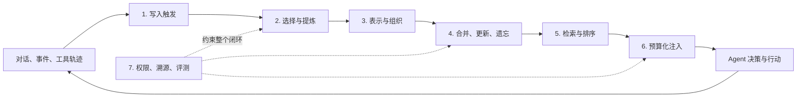
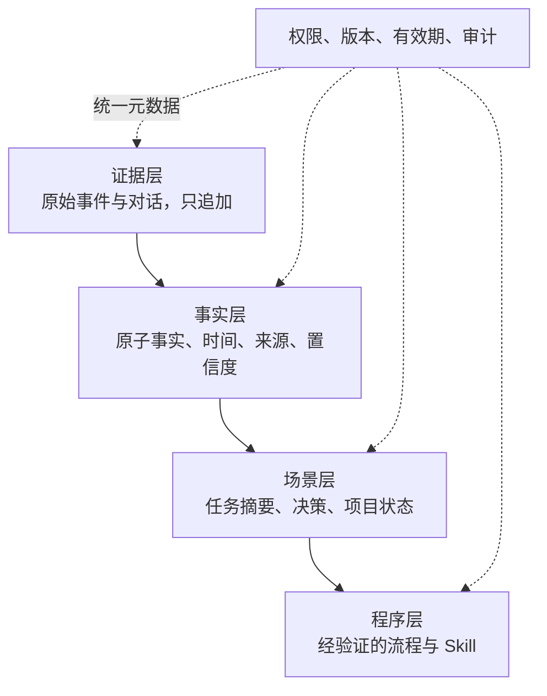

Agent 的记忆问题，常被简化成一句话：把历史对话向量化，下次再检索回来。

这句话只描述了最容易实现的一段。真正的记忆系统还要回答：什么值得记？事实改变了怎么办？一次成功操作能否沉淀成经验？召回多少才不会挤占当前任务？谁可以看到这段记忆？当 Agent 因错误记忆做错事时，能否追溯来源？

因此，记忆不是一个向量库功能，而是一套持续运行的数据系统。

> [!IMPORTANT]
> **结论先行：**Mem0、OpenViking 与 TencentDB Agent Memory 不是三种相同产品的不同实现。Mem0 把记忆做成易嵌入应用的“事实层”；OpenViking 把 Memory、Resource、Skill 统一为可浏览、可分层读取的“上下文文件系统”；TencentDB Agent Memory 则把对话、场景、画像、Skill、Wiki 与 CodeGraph 组织成可治理、可装配给团队 Agent 的“记忆资产平台”。

如果只比较“是否支持向量检索”，三者会显得高度同质；如果沿完整记忆生命周期比较，它们优化的是三种不同问题。

本文基于截至 **2026 年 9 月 4 日**的公开实现与文档：Mem0、OpenViking 取 `main`，TencentDB Agent Memory 依照题设链接取 `feat/server_team` 分支。后者明确处于 Team Memory Beta 快速迭代阶段，因此本文讨论的是当前设计方向，而非稳定版承诺。

## 一、先定义竞品框架：记忆系统要完成七件事

一套 Agent 记忆系统可以被画成一个闭环：



由此得到本文的七维竞品框架。

| 维度 | 核心问题 | 常见失败 |
| --- | --- | --- |
| 1. 写入触发 | 每轮写、会话结束写，还是显式提交？同步还是异步？ | 高频写入拖慢主链路；会话结束前崩溃导致记忆丢失 |
| 2. 选择与提炼 | 原文全存、抽取事实，还是总结场景与经验？ | 把寒暄当事实；遗漏 Agent 已完成的动作；生成错误记忆 |
| 3. 表示与组织 | 记忆是事实卡、文档树、画像，还是可执行 Skill？ | 所有对象被压成同一种向量切片，失去结构和用途 |
| 4. 演化策略 | 新旧事实是追加、覆盖、合并、衰减还是删除？ | 覆盖历史导致时间关系丢失；只追加又让冲突越来越多 |
| 5. 召回策略 | 用语义、关键词、实体、时间、层级还是图关系？ | “语义相近”不等于“现在正确”；多跳信息被拆散 |
| 6. 上下文注入 | 召回结果如何压缩、排序、限额并交给模型？ | 记忆召回正确，却因注入过多或位置不当降低答案质量 |
| 7. 治理与评测 | 如何隔离租户、控制共享、编辑删除、审计来源并验证效果？ | 跨用户泄漏；错误无法纠正；只有一次漂亮的 Demo 分数 |

这个框架刻意把“检索”放在第五位。因为召回质量的上限，往往在写入和演化阶段就已经被决定了：没有保存的事实无法召回，被错误覆盖的历史也无法靠更强 Embedding 恢复。

## 二、一张总表：三种产品原型

| 比较项 | Mem0 | OpenViking | TencentDB Agent Memory |
| --- | --- | --- | --- |
| 产品原型 | 应用可嵌入的记忆层 | 面向 Agent 的上下文数据库 | 团队记忆资产与控制面 |
| 核心对象 | 原子化 Memory 记录 | Resource / Memory / Skill | Chat Memory / Skill / Wiki / CodeGraph |
| 主要入口 | `add()` / `search()` API、SDK、托管平台 | 文件系统 API、SDK、CLI、HTTP Server | Proxy、Gateway、SDK、Memory Hub |
| 写入触发 | 应用在对话后调用 `add()`；平台处理默认异步 | `session.commit()` 后归档并异步抽取 | Proxy / Adapter 捕获 L0，后台逐层生成 L1–L3 |
| 组织方式 | 事实记录 + metadata/category + 身份 scope | `viking://` 目录树 + L0/L1/L2 语义侧写 | L0 对话 → L1 原子 → L2 场景 → L3 画像，加资产登记与绑定 |
| 自动演化 | 当前 v3 自动抽取为 ADD-only；精确去重，保留时间序列 | 候选记忆与相似记忆比较后 skip/create/merge/delete | 分层归纳；Skill/Wiki/CodeGraph 有状态、版本与人工管理 |
| 召回主线 | 语义 + BM25 + 实体匹配融合，可选 rerank | 意图拆解 → 按类型路由 → 目录递归检索 → rerank | L2/L3 恢复语境，L1/L0 用 BM25、向量与 RRF 回查；知识资产按需工具读取 |
| 隔离模型 | user / agent / run；平台另有 app 等维度 | account / user / peer 与 URI namespace | service / team / user / agent / session，资产另有 Owner、可见性与 ACL |
| 最强能力 | 最短集成路径与事实型个性化 | 结构化上下文、渐进加载与检索可观察性 | 团队共享、角色装配、知识与经验资产化 |
| 主要代价 | 结构表达较弱；托管能力与 OSS 能力需分清 | 写入与检索链更重，目录摘要存在一致性成本 | 系统面最宽、部署组件更多，自动路由仍在迭代 |

三者共同证明了一件事：主流方案已经从“存聊天记录”走向“选择性持久化 + 分层读取 + 身份隔离”。分歧在于，它们认为记忆的基本单位究竟是什么。

## 三、Mem0：把记忆压缩成稳定的开发者接口

[Mem0](https://github.com/mem0ai/mem0) 的设计优势首先不是某个检索算法，而是把复杂性藏在非常短的应用循环里：

```text
用户输入 → search 相关记忆 → 注入 Prompt → 模型回答 → add 新对话
```

开发者只需维护 `add` 与 `search` 两个关键动作。LLM 负责从自然对话提炼离散事实，向量存储负责语义索引，身份字段负责隔离用户、Agent 与运行会话。对于客服、陪伴、教育、健康管理和个人助理，这种“事实卡”模型很自然：喜欢什么、做过什么、当前目标是什么，都可以作为独立记录被召回。

### 1. v3 的关键转向：不再自动改写旧事实

Mem0 的旧算法会在写入时判断 `ADD / UPDATE / DELETE`，新算法改成单次 LLM 调用的 **ADD-only extraction**。自动管线只追加新事实，不覆盖或删除旧事实；显式的 update/delete API 仍然存在，由调用方主动使用。官方的 [OSS v2 → v3 迁移指南](https://docs.mem0.ai/migration/oss-v2-to-v3)明确列出了这一变化。

这个选择解决的是“历史不可逆”问题。比如：

```text
1 月：用户住在上海
6 月：用户搬到杭州
```

如果第二条直接覆盖第一条，系统能回答“现在住哪里”，却很难回答“何时搬家”“之前住哪里”。ADD-only 保存事件序列，再把“哪一条对当前问题有效”的责任交给时间属性和检索排序。

它的代价也很明确：矛盾没有消失，只是从写入阶段移动到了读取阶段。时间识别错误、排序不稳或查询缺乏时间意图时，新旧事实仍可能同时进入上下文。换言之，Mem0 选择了“保留证据，再解决冲突”，而不是“尽早形成唯一真相”。

### 2. 从单一向量召回到多信号融合

当前 Mem0 使用三类信号并行评分：

- 语义相似度负责“意思相近”；
- BM25 负责专有名词、编号与精确措辞；
- 实体匹配把跨记忆出现的人、地点和概念关联起来。

需要注意，v3 的 entity linking 不是把关系图直接暴露给应用的旧式 Graph Memory。实体关系主要成为排序增强信号。这个设计减少了图数据库作为独立产品面的复杂度，却也意味着应用若要浏览、解释或查询显式知识图谱，仍需另建一层。

### 3. Mem0 的产品判断

Mem0 的核心价值是“低摩擦”。它适合作为业务应用中的独立记忆服务：接入成本低，Provider 与向量库选择多，托管版又补齐异步处理、反馈、导出和运营能力。

但评估时必须区分三个表面相似、实际不同的东西：开源 Library、自托管 Server 与 Cloud Platform。Mem0 仓库的[当前说明](https://github.com/mem0ai/mem0#readme)明确提示，托管平台包含开源 SDK 没有的专有优化，公开 Benchmark 的平台成绩不能原样视为 OSS 部署承诺。

**一句话评价：**Mem0 最像“记忆领域的 API 产品”——把事实型长期记忆做得足够简单，代价是把复杂的知识结构、团队资产编排和治理留给上层应用。

## 四、OpenViking：把记忆问题重写成上下文文件系统

[OpenViking](https://github.com/volcengine/OpenViking) 不把 Memory 单独做成一张表，而是把 Agent 需要的上下文分成三类：

- **Resource**：用户提供、相对静态的文档和代码；
- **Memory**：从交互与任务执行中动态学习的认知；
- **Skill**：声明 Agent 如何完成某类工作的能力配置。

三类内容都进入 `viking://` 虚拟文件系统。Agent 不只可以向量搜索，还可以像浏览项目目录一样 `ls`、`tree`、`grep`、`read`，并通过稳定 URI 精确引用内容。这个选择把传统 RAG 的“无名切片集合”变成了可理解、可导航的上下文空间。

### 1. L0/L1/L2 是读取分辨率，不是记忆成熟度

OpenViking 为目录生成三层内容：

| 层 | 含义 | 典型用途 |
| --- | --- | --- |
| L0 Abstract | 极短摘要 | 全局初筛、向量召回 |
| L1 Overview | 目录概览与导航 | rerank、判断是否继续下钻 |
| L2 Detail | 原始文件与子目录 | 确认相关后完整读取 |

按照[上下文分层文档](https://github.com/volcengine/OpenViking/blob/main/docs/en/concepts/03-context-layers.md)，L0/L1 是目录级语义侧写，而不是每个文件各生成一份对应副本；父目录的 Overview 又由子目录摘要自底向上聚合。这使 Agent 可以先看地图，再决定进入哪间房，而不是把整栋楼搬进 Prompt。

这里有一个很容易误读的术语冲突：OpenViking 的 L0/L1/L2 表示**同一上下文的读取精度**；TencentDB Agent Memory 的 L0/L1/L2/L3 表示**对话被提炼后的抽象层级**。名字相近，但不可横向对齐。

### 2. 召回不是一次 Top-K，而是一段可观察的导航

OpenViking 的复杂查询会先结合 Session 摘要、最近消息与当前问题，生成 0–5 个带类型和优先级的 Typed Query，再分别路由到 Memory、Resource 或 Skill。随后系统从全局高分目录起步，用优先队列递归搜索子目录，并在过程中 rerank。完整流程见[检索机制](https://github.com/volcengine/OpenViking/blob/main/docs/en/concepts/07-retrieval.md)。

这种“先定位目录，再逐层下钻”的路线比平铺向量检索更适合复杂知识库：局部语境不会因为切片相似度较低而彻底丢失，检索轨迹也可以解释 Agent 为什么找到了这份内容。

代价是更长的在线链路。意图分析、递归搜索和 rerank 都可能增加延迟；目录摘要还要随子节点变化向上刷新。OpenViking 文档甚至直接记录了热门深层目录可能产生向上写放大的 TODO。这种坦诚很重要：层级不是免费的，它用生成与一致性成本换取导航能力。

### 3. Session Commit 是它的记忆生长点

会话先保存消息、上下文引用和工具调用，`session.commit()` 同步归档原始消息，再在后台生成摘要和长期记忆。候选记忆会先经过向量预筛，再由 LLM 对相似项做 `skip / create / merge / delete` 决策；每次提交还写入 `memory_diff.json`，保留新增、更新与删除的前后差异。详见[Session Management](https://github.com/volcengine/OpenViking/blob/main/docs/en/concepts/08-session.md)。

内置记忆类型已经超出用户偏好，覆盖 profile、preferences、entities、events、identity、soul、cases、trajectories 与 experiences。这说明 OpenViking 想记住的不只是“用户是谁”，还包括“Agent 做过什么、哪条轨迹有效、以后应怎样做”。

**一句话评价：**OpenViking 最像“Agent 的上下文操作系统”——结构表达与渐进读取最强，代价是引入更重的语义生成、层级维护和在线检索链。

## 五、TencentDB Agent Memory：从个人记忆走向团队资产

[TencentDB Agent Memory](https://github.com/TencentCloud/TencentDB-Agent-Memory/blob/feat/server_team/README_CN.md) 从另一个问题出发：一个 Agent 学会的东西，如何被下一次 Session、另一个 Agent，甚至整个团队复用？

它的回答不是扩大同一个记忆库，而是把记忆变成有 Owner、版本、状态、可见性和绑定关系的资产。

### 1. L0–L3 是一条提炼流水线

| 层 | 保存内容 | 解决的问题 |
| --- | --- | --- |
| L0 Conversation | 原始对话与上下文 | 保留证据与来源 |
| L1 Atom | 事实、偏好、约束、事件 | 精确召回可执行信息 |
| L2 Scenario | 按项目或场景组织的知识块 | 快速恢复任务语境 |
| L3 Core / Persona | 稳定画像、长期模式与高层认知 | 让 Agent 快速理解用户与团队 |

这套结构同时保留“原话”和“高层认识”：L3 用较小体积恢复整体语境，L2 给出场景导航，遇到具体问题再通过 BM25、向量检索与 RRF 回到 L1/L0。条数、字符与超时预算则约束最终注入。

分层的风险是摘要漂移：L3 如果基于错误 L2 继续归纳，错误会被放大成“稳定人格”；反过来，如果高层画像更新太保守，又会长期保留过期认识。因此，L0 的来源保留、L1–L3 的生成日志和人工可编辑面板不是附属功能，而是分层体系能够成立的校正机制。

### 2. 它把“记忆”扩展成四类团队资产

除 Chat Memory 外，系统还管理：

- **Skill**：带版本、资源、触发边界、步骤与验证规则的经验；
- **Wiki**：把文档整理为结构化页面与链接关系；
- **CodeGraph**：索引代码符号、文件、调用关系与影响路径；
- **Asset metadata**：记录归属、状态、版本、可见性、使用关系与 Agent 绑定。

这四类对象没有被强行塞进一种检索模式。Chat Memory 用于恢复人物和事件，Skill 用于复用做法，Wiki 用于理解文档，CodeGraph 用于代码影响分析。Agent 先发现可用工具，再按需读取知识内容，而不是默认把整套资产放进 System Prompt。

### 3. Loadout 与 ACL 是最有辨识度的设计

腾讯方案把 Agent 获得的记忆称为一种 Loadout：先依据 Team、User、Agent、Owner 和可见性确定“允许带走什么”，再在授权集合内召回。当前分支定义了 `private`、`team`、`restricted` 等共享语义，并支持面向 User、Role、Agent 的 ACL。

这与 Mem0 的多租户 scope 不同。scope 主要回答“这条记录属于哪个身份空间”，Loadout 则进一步回答“团队里哪个角色应该获得哪类经验”。对于 Builder、Reviewer、Scout 等职责不同的 Agent，这种显式装配可以减少无关记忆和权限外溢。

Proxy 路线也体现了产品取舍：把 Claude Code、Codex、Hermes 等客户端的模型 Base URL 指向代理，就可以在协议层完成身份识别、记忆注入与 L0 捕获，降低逐个 Harness 编写 Hook 的成本。但代价是 Proxy、Memory Core、Memory Hub / Knowledge 等组件形成更宽的运行面，鉴权、降级、版本迁移和可观测性都要一起维护。

当前 README 也明确给出了边界：Team Memory 仍为 Beta，Wiki 与 CodeGraph 异步构建，私有仓库支持尚在完善，全自动记忆路由仍在迭代。对它最公平的评价不是“是否已经比单一记忆 SDK 更成熟”，而是“团队记忆控制面这条路线是否值得投入”。

**一句话评价：**TencentDB Agent Memory 最像“Agent 团队的经验资产平台”——治理与角色装配最有野心，代价是产品和部署复杂度最高，且部分自动化仍处于形成期。

## 六、真正的差异：三者如何回答七个设计问题

### 1. 到底记什么

- Mem0 优先记**可检索的离散事实**。
- OpenViking 同时记**事实、任务经验、外部资源和能力定义**。
- TencentDB Agent Memory 进一步把它们变成**可归属、可审核、可分享、可装配的团队资产**。

对象边界越宽，Agent 能继承的能力越多，系统也越难保持一致。事实卡容易评估真假；一条 Skill 还要评估适用条件、执行效果和工具兼容性；一份团队画像甚至涉及权限与组织责任。

### 2. 什么时候形成记忆

Mem0 把触发权交给应用，最灵活，也最依赖接入方正确编排。OpenViking 用显式 `commit()` 形成清楚的会话边界。腾讯方案通过 Proxy / Adapter 捕获，让未原生支持记忆的 Agent 也能接入，并在后台层层归纳。

不存在绝对最优的触发点：

- 实时写入降低丢失风险，但增加成本并容易记住尚未确认的信息；
- 会话结束写入能看到完整结果，但长会话可能迟迟不提交；
- 后台写入保护交互延迟，却必须处理任务状态、重试与最终一致性。

### 3. 冲突是写时解决，还是读时解决

这是三者最关键的架构分叉。

| 策略 | 代表 | 优点 | 风险 |
| --- | --- | --- | --- |
| 追加历史，读取时判定 | Mem0 v3 自动抽取 | 不丢时间序列，写入简单 | 冲突累积，依赖时间排序与查询理解 |
| 写入时合并、更新或删除 | OpenViking | 当前知识更紧凑，可直接浏览 | LLM 误判可能不可逆地改变记忆 |
| 原始层保留，高层逐级归纳 | TencentDB Agent Memory | 兼顾证据与快速画像 | 层间漂移、更新策略和回溯链更复杂 |

一个成熟系统通常不会只选一边。更稳妥的组合是：原始事件 append-only；派生画像可更新；任何高层结论都保留来源、有效时间和生成版本。

### 4. 召回是“搜索”，还是“上下文装配”

Mem0 强化单次搜索的准确率；OpenViking 强化检索过程中的路由与导航；腾讯方案强化权限过滤后，把不同资产装配给不同角色。

因此，真实的读取公式不应只是：

```text
TopK(vector_similarity)
```

而更接近：

```text
候选 = 权限范围 ∩ 类型路由 ∩ 时间有效性
得分 = 语义 + 关键词 + 实体/关系 + 新鲜度 + 任务相关度
注入 = 在 Token、延迟与来源多样性预算下选择候选
```

这也是“Memory”逐渐与“Context Engineering”合流的原因：数据库返回什么只是中间结果，真正影响 Agent 的是最终装进模型窗口的那一组上下文。

### 5. 谁能改、谁能看、谁来纠错

Mem0 的身份 scope 适合应用级隔离；OpenViking 的 URI namespace 让内容归属可见；腾讯方案把团队角色、资产所有权、共享状态和 Agent 绑定提升为一等概念。

当记忆只服务一个用户时，CRUD 可能足够。当记忆开始跨 Agent 和团队流动，以下能力会从“后台功能”变成核心数据契约：

- 来源与生成时间；
- Owner 与责任人；
- 有效期、置信度和当前状态；
- 版本、变更 Diff 与回退依据；
- 私有、团队与定向授权；
- 被哪些 Agent、在哪些回答中使用过。

## 七、Benchmark 不能直接做排行榜

三家都公布了积极结果，但测试对象、模型、检索预算和集成方式不同。

| 项目 | 公开结果示例 | 能说明什么 | 不能说明什么 |
| --- | --- | --- | --- |
| Mem0 | 托管平台报告 LoCoMo 92.5、LongMemEval 94.4，并公布 BEAM 1M/10M 结果 | 事实抽取、时间推理和多信号召回在固定预算下有效 | 不能直接代表 OSS 部署，也不能与不同模型配置横比 |
| OpenViking | 官方 README 报告多种 Agent + OpenViking 在 LoCoMo 达到约 80–83%，并公开复现脚本 | 同一 Harness 加入结构化记忆后，准确率、延迟和 Token 可同时改善 | 不同 Agent 链路的总 Token 与耗时不是纯数据库指标 |
| TencentDB Agent Memory | 当前分支报告 PersonaMem 48% → 76% | 分层画像对长期用户理解有潜力 | 单项结果不足以判断检索、团队隔离和资产路由的整体质量 |

Mem0 的[公开研究页](https://mem0.ai/research)同时强调准确率、平均检索 Token 与延迟；OpenViking 提供了[LoCoMo 复现目录](https://github.com/volcengine/OpenViking/tree/main/benchmark/locomo)；TencentDB Agent Memory 仓库则仍有[社区 Issue](https://github.com/TencentCloud/TencentDB-Agent-Memory/issues/106)请求补充更完整的可复现评测。这些透明度差异本身就是竞品分析的一部分。

如果要做内部选型，至少应补齐六类测试：

1. **写入精度**：应该记的是否记住，不该记的是否过滤；
2. **时间与冲突**：偏好变化、事实失效和事件先后能否正确回答；
3. **跨会话召回**：近、中、远期记忆的 Recall@K 与答案正确率；
4. **上下文经济性**：端到端 Token、P50/P95 延迟和后台生成成本；
5. **隔离与安全**：并发多用户、多团队、多 Agent 下是否有越权与串记；
6. **可修复性**：错误记忆能否定位来源、编辑、删除、重建并验证不再生效。

准确率只是结果指标。生产级记忆系统还必须量化“错误是在哪一段链路产生的”。

## 八、选型建议：按主矛盾选择，不按功能数量选择

### 选择 Mem0，如果你的主矛盾是产品个性化

适合客服、陪伴、教育、健康、消费推荐等应用，需要快速获得跨会话事实记忆，希望用最少 API 改造现有产品。优先验证时间冲突、敏感信息过滤，以及 OSS 与 Platform 的能力差异。

### 选择 OpenViking，如果你的主矛盾是上下文规模与结构

适合需要同时管理文档、代码、记忆和 Skill 的通用 Agent，尤其当可浏览目录、渐进加载、稳定 URI 和检索轨迹比极简 API 更重要。优先验证目录更新频率、摘要新鲜度、在线链路延迟和多租户部署。

### 选择 TencentDB Agent Memory，如果你的主矛盾是团队经验复用

适合多个角色 Agent 协作、需要人工审核和权限边界、希望把项目经验沉淀成 Skill/Wiki/CodeGraph 的团队。优先验证 Beta 分支稳定性、跨框架接入一致性、资产自动路由与整套服务的运维成本。

### 如果自研，建议先复制“分层责任”，不要复制三套产品

一个足够稳健的最小架构可以只有四层：



其中只有证据层必须不可变；事实与场景可以重新生成；Skill 只有在成功轨迹被验证后才晋升。每条派生记忆至少保留：`source_refs`、`event_time`、`valid_time`、`scope`、`confidence`、`version` 与 `status`。召回先做权限和类型过滤，再做混合排序，最后由独立的 Context Assembler 执行 Token 预算与去冗余。

这套最小原则分别吸收了三家的长处：Mem0 的简单接口，OpenViking 的分层读取，TencentDB Agent Memory 的资产治理；但没有把三套完整运行时叠在一起。

## 九、结论：主流记忆体系正在形成五个共识

第一，**记忆不等于历史消息**。历史是证据，记忆是从证据中选择、组织并持续修正的派生状态。

第二，**不同用途需要不同对象**。用户偏好、项目文档、任务轨迹和可执行 Skill 不应被压成同一种无类型切片。

第三，**写入策略决定系统性格**。Mem0 倾向保留历史，OpenViking 倾向在写入时维护结构，腾讯方案倾向保留底层证据并向上归纳。每种策略都在“可逆性、紧凑性与复杂度”之间做交换。

第四，**召回正在升级为上下文装配**。语义搜索只是候选生成，类型、实体、时间、层级、权限、预算与注入位置共同决定最终效果。

第五，**治理会成为下一阶段的竞争中心**。当一个 Agent 的记忆能影响另一个 Agent，仅有 Recall@K 已经不够；Owner、ACL、版本、来源、人工纠错与使用审计会像数据库事务一样重要。

因此，这三套体系没有一个抽象意义上的总冠军：

- Mem0 赢在把事实记忆变成易用基础设施；
- OpenViking 赢在把复杂上下文变成可导航空间；
- TencentDB Agent Memory 赢在把记忆提升为可治理的团队资产。

真正值得带走的，不是某个项目的名词，而是一条设计纪律：**原始证据可追溯，派生记忆可修正，召回过程有预算，跨人跨 Agent 的流动必须有边界。**

---

## 主要资料

- [Mem0 GitHub](https://github.com/mem0ai/mem0)、[新算法迁移说明](https://docs.mem0.ai/migration/oss-v2-to-v3)、[Memory Evaluation](https://docs.mem0.ai/core-concepts/memory-evaluation)、[Mem0 论文](https://arxiv.org/abs/2504.19413)
- [OpenViking GitHub](https://github.com/volcengine/OpenViking)、[架构](https://github.com/volcengine/OpenViking/blob/main/docs/en/concepts/01-architecture.md)、[上下文类型](https://github.com/volcengine/OpenViking/blob/main/docs/en/concepts/02-context-types.md)、[上下文分层](https://github.com/volcengine/OpenViking/blob/main/docs/en/concepts/03-context-layers.md)、[检索](https://github.com/volcengine/OpenViking/blob/main/docs/en/concepts/07-retrieval.md)、[Session](https://github.com/volcengine/OpenViking/blob/main/docs/en/concepts/08-session.md)
- [TencentDB Agent Memory `feat/server_team` 中文说明](https://github.com/TencentCloud/TencentDB-Agent-Memory/blob/feat/server_team/README_CN.md)
