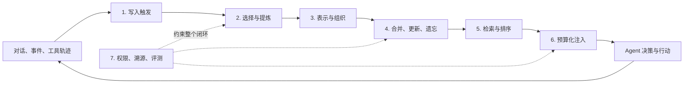

> Agent 记忆设计系列：[1 · 系统全景](/writing/agent-memory-design-competitive-analysis/) · [2 · 写入与纠错](/writing/agent-memory-writing/) · [3 · 检索与装配](/writing/agent-memory-retrieval/) · [4 · 治理与验证](/writing/agent-memory-governance/) · [5 · 深入思考](/writing/agent-memory-synthesis/)

> 阅读时间为估计，包含图表理解；动手实验另计。

> 版本范围：2026-09-05 核查的 Mem0 v3 迁移文档、OpenViking main 文档和 TencentDB Agent Memory 的 feat/server_team 分支。云服务、开源库与开发分支分别看待；Team Memory 仍是 Beta，本文不作统一性能排名。

假设用户一月说“我住在上海”，六月说“搬到杭州了”。Agent 在九月被问到“现在住哪里”，检索到了两条语义都很相关的消息。哪条应该进入回答？如果同名用户属于另一个团队，又该怎样排除？

向量相似度只能解释其中一小段。真正的记忆系统还要决定什么值得记、何时生效、怎样纠错、谁能读取以及多少内容值得进入上下文。

本系列用“搬家事实”和“团队项目经验”两个连续案例，比较 Mem0、OpenViking 与 TencentDB Agent Memory 的设计选择，最后回到一个问题：**记忆是在储存事实，还是在维护可被修正的认识？**

## 先定义竞品框架：记忆系统要完成七件事

一套 Agent 记忆系统可以被画成一个闭环：

*图 1｜从写入触发到使用反馈的记忆生命周期。矩形表示模块或步骤，圆柱表示存储，菱形表示判断；实线表示主路径，虚线表示约束、信息支撑或反馈。图为教学抽象，不代表全部实现细节。*

由此得到本文的七维竞品框架。

| 维度 | 核心问题 | 常见失败 |
| --- | --- | --- |
| 1. 写入触发 | 每轮写、会话结束写，还是显式提交？同步还是异步？ | 高频写入拖慢主链路；会话结束前崩溃导致记忆丢失 |
| 2. 选择与提炼 | 原文全存、抽取事实，还是总结场景与经验？ | 把寒暄当事实；遗漏 Agent 已完成的动作；生成错误记忆 |
| 3. 表示与组织 | 记忆是事实卡、文档树、画像，还是可执行 Skill？ | 所有对象被压成同一种向量切片，失去结构和用途 |
| 4. 演化策略 | 新旧事实是追加、覆盖、合并、衰减还是删除？ | 覆盖历史导致时间关系丢失；只追加又让冲突越来越多 |
| 5. 召回策略 | 用语义、关键词、实体、时间、层级还是图关系？ | “语义相近”不等于“现在正确”；多跳信息被拆散 |
| 6. 上下文注入 | 召回结果如何压缩、排序、限额并交给模型？ | 记忆召回正确，却因注入过多或位置不当降低答案质量 |
| 7. 治理与评测 | 如何隔离租户、控制共享、编辑删除、审计来源并验证效果？ | 跨用户泄漏；错误无法纠正；只有一次漂亮的 Demo 分数 |

这个框架刻意把“检索”放在第五位。因为召回质量的上限，往往在写入和演化阶段就已经被决定了：没有保存的事实无法召回，被错误覆盖的历史也无法靠更强 Embedding 恢复。

## 三类产品，先看对象，不急着看算法

| 参考项目 | 主要对象与入口 | 更值得观察的设计问题 |
|---|---|---|
| [Mem0](https://github.com/mem0ai/mem0) | 事实型记忆，add/search 接口 | 怎样降低应用集成成本，怎样处理时间冲突 |
| [OpenViking](https://github.com/volcengine/OpenViking) | Resource、Memory、Skill 与可导航目录 | 怎样先读地图再读细节，怎样维护摘要一致性 |
| [TencentDB Agent Memory](https://github.com/TencentCloud/TencentDB-Agent-Memory/blob/2ee22397f6091b8cd3ea847bc1edb04d3bec0c94/README_CN.md) | 对话与团队知识资产、身份和装配 | 哪个角色能继承什么经验，如何纠错与审计 |

这些是根据公开设计归纳的原型，不是互斥分类，更不是成熟度排名。短 API 可能把复杂度留给应用，分层目录增加维护成本，团队控制面则增加部署与治理责任。

## 先区分历史、记忆与能力

历史是“用户说过什么、Agent 做过什么”的证据。记忆是系统认为以后有用的派生信息。Skill 则包含一套可复用做法，可能影响未来行动。

从历史抽取出一句事实，不等于它永远正确；从成功轨迹生成 Skill，也不等于以后所有相似任务都可以照做。跨越这几层时，需要来源、时间、适用条件与验证。

OpenViking 的 L0/L1/L2 是读取精度；腾讯分支的 L0–L3 是从原始对话到高层画像的提炼层级。数字相同不能直接对齐，后文会分别展开。

## 实践前先画边界

写下三件事：哪些原始数据可以保存；哪些内容允许进入长期记忆；哪些身份能够跨会话读取。然后添加纠错和删除的验收条件。

如果这三件事没有答案，先别把聊天记录全量写入向量库。一个更强的检索器，可能只是更稳定地把不该使用的信息召回。

第二篇处理写入与演化，第三篇处理读取与预算，第四篇处理团队治理与验证；终篇把这些选择合起来讨论可追溯、可修正的长期协作。

---

全景说明了记忆不只是搜索。下一篇先处理一个更早的问题：新事实到来时，旧事实究竟应该被覆盖、追加还是重新解释？

下一篇：[保留历史，还是维护当前事实](/writing/agent-memory-writing/)。
