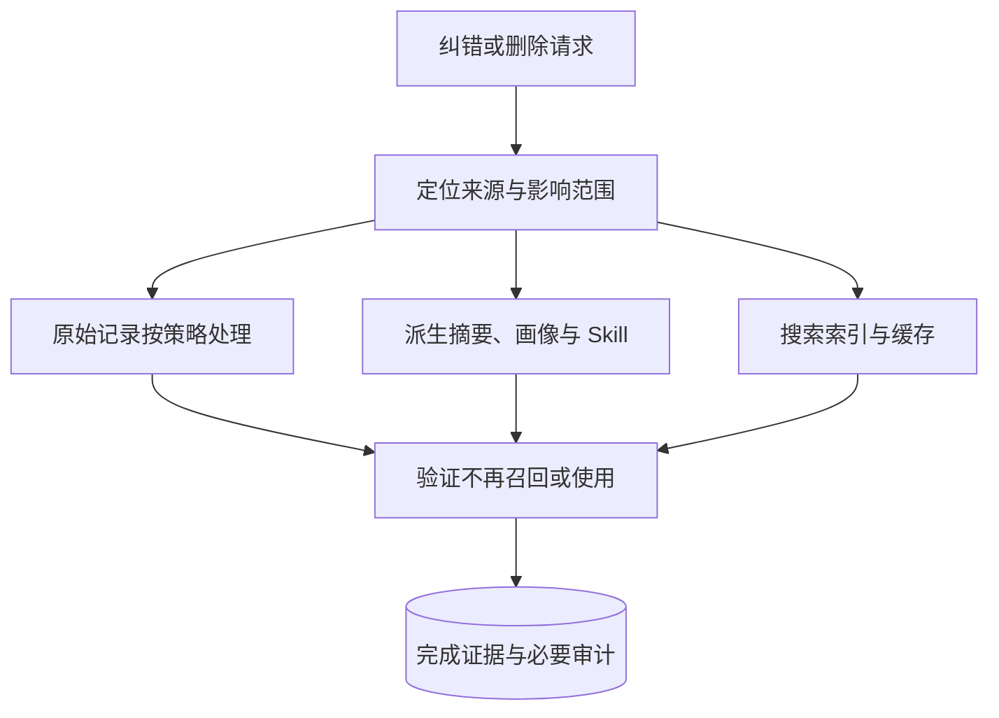
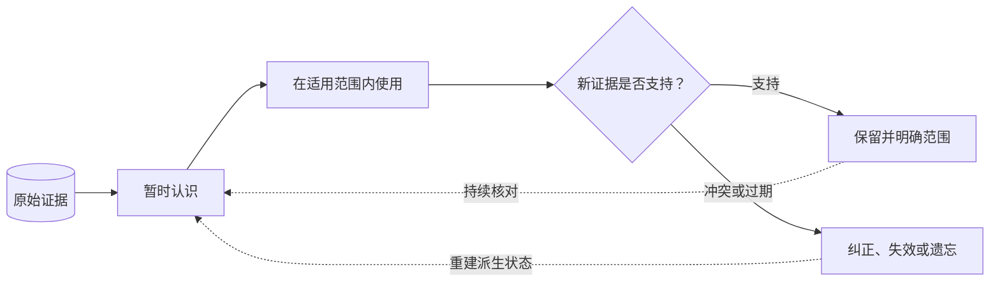

> 版本范围：2026-09-05 核查的 Mem0 v3 迁移文档、OpenViking main 文档和 TencentDB Agent Memory 的 feat/server_team 分支。云服务、开源库与开发分支分别看待；Team Memory 仍是 Beta，本文不作统一性能排名。

> 单项目纵向阅读：[Mem0 生产边界](/writing/mem0-production-boundaries/) · [OpenViking Session 与权限](/writing/openviking-session-governance/) · [TencentDB 团队治理](/writing/tencentdb-agent-memory-governance/)

一位 Agent 把解决登录故障的方法写成 Skill，另一位 Agent 下次自动使用。这看起来像组织学习，也可能把一次错误推广成默认行为。

团队记忆的核心不是共享一个大库，而是决定哪一条经验在什么条件下、可以被谁继承。

## 共享资产要绑定用途与读取主体

以“解决登录超时”为例：原始对话记录故障和操作，事实记忆保存环境与已确认原因，Skill 保存可复用步骤。三者的验证要求不同：用户说“可能是缓存”可留在历史中，不能未经检查变成所有 Agent 默认执行的“清空缓存”步骤。

| 对象 | 复用前检查 | 失败时处理 |
| --- | --- | --- |
| 事实记忆 | 来源、有效时间、查询者权限 | 排除或标明未知 |
| 摘要与画像 | 来源是否仍有效，是否过度概括 | 使派生结果失效并重建 |
| Skill | 适用环境、动作权限与回归结果 | 限制触发或撤回版本 |
| Wiki、代码索引 | 原始资料版本与可见范围 | 重建索引并停止使用旧结果 |

归属与授权必须分别表达。`user_id` 或 URI 可以标识记录属于谁，不能单独证明当前调用方有权读取。服务端先绑定可信身份，再判断资源、动作与当前 ACL；注入前还要处理权限撤回。

腾讯开发分支的 Loadout、Owner 和定向 ACL 是一种团队资产装配方案，具体组件与 Beta 边界见[TencentDB 团队治理](/writing/tencentdb-agent-memory-governance/)。Mem0 scope 与 OpenViking namespace 的实现分别见对应项目文章；这里不将三者名称当成同等级的安全保证。

为每条可共享经验记录来源、责任人、有效期、版本、可见范围和使用记录。这样撤回某条经验时，才能定位需要重建的摘要、Skill 和缓存。

## Benchmark 为什么不能直接排冠军

公开研究可以帮助理解设计，但三家的模型、部署形态、题集、注入预算和评分方式不同。托管平台结果不能直接当作开源库部署承诺，画像任务也不能替代跨团队隔离测试。

比较时固定任务、模型、输入范围与预算，分别验证以下性质：

| 验证面 | 测什么 | 证据 |
|---|---|---|
| 写入 | 该记的保留，不该记的过滤 | 原始来源与抽取差异 |
| 时间冲突 | 过去与现在的回答各自正确 | 时间化查询集 |
| 使用 | 召回内容真正支持答案 | 来源、注入上下文与回答 |
| 成本 | 在线检索与后台提炼总开销 | Token、耗时、计算与存储 |
| 隔离 | 同名用户、跨团队、权限撤回 | 允许与拒绝的对照样本 |
| 修复 | 错误不再影响未来任务 | 删除、重建和回归证据 |

可参考 [Mem0 研究](https://mem0.ai/research)和 [OpenViking 的复现目录](https://github.com/volcengine/OpenViking/tree/0c5147cae26aec8d6d93445ec6ad86d5faff4035/benchmark/locomo)了解各自实验条件；不要把厂商实验直接称为本站实测。

## 删除不是只删一行

*图 1｜纠错与删除需要覆盖来源、派生物、索引和缓存。*

若原始消息删除了，画像仍保留结论，下一次摘要又可能把它写回来。需要追踪来源依赖、使派生物失效，并处理索引、缓存、备份恢复与保留策略。

“原始证据可追溯”不等于“原始数据永不删除”。实现应按业务和适用要求定义保留周期；对敏感原文，必要的审计可以记录处理动作与标识，而不是继续保留全部内容。

## 实践：两团队、两用户、一次撤权

准备两个团队各一位同名用户，写入相似但不同的项目事实。验证查询只返回授权对象；随后撤回某个 Agent 的共享权限，再测试普通查询、缓存命中和已有会话注入路径。

接着纠正其中一条错误事实，检查画像、Skill 和摘要是否失效重建。模拟后台任务失败，确认界面没有把“已受理”展示为“已完成”。

这组实验比单一问答分数更接近团队系统的风险。如果读权限只依赖调用方传来的 user_id，而服务端没有可信身份绑定，就还没有形成安全隔离。

## 怎样决定是否值得引入记忆

先用无记忆基线完成同一组跨会话任务，再比较记忆加入后减少了哪些重复解释、增加了哪些错误和维护成本。把模型、工具与预算尽量固定，记录正确性、延迟、人工纠错与隔离结果。

如果任务每次都由最新外部系统状态决定，查权威数据可能比查旧对话更合适。如果一次任务没有复用价值，强行长期保存只会扩大治理面。

## 遗忘不是失败，而是一种控制能力

*图 2｜新证据如何触发保留、纠正与遗忘。*

一个能删除、回溯、失效和重建的记忆系统，比一个只会不断追加的系统更接近长期协作者。保留足够证据与减少不必要持有之间也存在张力，应按数据类别管理，而不是用“长期记忆”统一解释。
