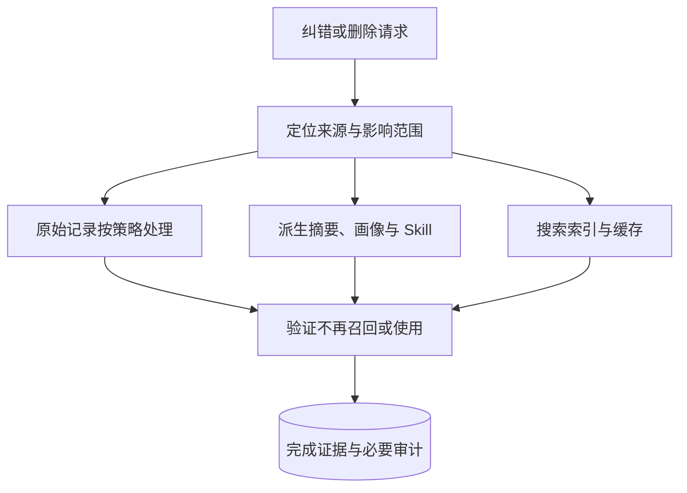

> Agent 记忆设计系列：[1 · 系统全景](/writing/agent-memory-design-competitive-analysis/) · [2 · 写入与纠错](/writing/agent-memory-writing/) · [3 · 检索与装配](/writing/agent-memory-retrieval/) · [4 · 治理与验证](/writing/agent-memory-governance/) · [5 · 深入思考](/writing/agent-memory-synthesis/)

> 版本范围：2026-09-05 核查的 Mem0 v3 迁移文档、OpenViking main 文档和 TencentDB Agent Memory 的 feat/server_team 分支。云服务、开源库与开发分支分别看待；Team Memory 仍是 Beta，本文不作统一性能排名。

> 单项目纵向阅读：[Mem0 生产边界](/writing/mem0-production-boundaries/) · [OpenViking Session 与权限](/writing/openviking-session-governance/) · [TencentDB 团队治理](/writing/tencentdb-agent-memory-governance/)

一位 Agent 把解决登录故障的方法写成 Skill，另一位 Agent 下次自动使用。这看起来像组织学习，也可能把一次错误推广成默认行为。

团队记忆的核心不是共享一个大库，而是决定哪一条经验在什么条件下、可以被谁继承。

## 从聊天记录到有类型的团队资产

除 Chat Memory 外，系统还管理：

- **Skill**：带版本、资源、触发边界、步骤与验证规则的经验；
- **Wiki**：把文档整理为结构化页面与链接关系；
- **CodeGraph**：索引代码符号、文件、调用关系与影响路径；
- **Asset metadata**：记录归属、状态、版本、可见性、使用关系与 Agent 绑定。

这四类对象没有被强行塞进一种检索模式。Chat Memory 用于恢复人物和事件，Skill 用于复用做法，Wiki 用于理解文档，CodeGraph 用于代码影响分析。Agent 先发现可用工具，再按需读取知识内容，而不是默认把整套资产放进 System Prompt。

## Loadout 与 ACL：先决定允许带走什么

腾讯方案把 Agent 获得的记忆称为一种 Loadout：先依据 Team、User、Agent、Owner 和可见性确定“允许带走什么”，再在授权集合内召回。当前分支定义了 `private`、`team`、`restricted` 等共享语义，并支持面向 User、Role、Agent 的 ACL。

这与 Mem0 的多租户 scope 不同。scope 主要回答“这条记录属于哪个身份空间”，Loadout 则进一步回答“团队里哪个角色应该获得哪类经验”。对于 Builder、Reviewer、Scout 等职责不同的 Agent，这种显式装配可以减少无关记忆和权限外溢。

Proxy 路线也体现了产品取舍：把 Claude Code、Codex、Hermes 等客户端的模型 Base URL 指向代理，就可以在协议层完成身份识别、记忆注入与 L0 捕获，降低逐个 Harness 编写 Hook 的成本。但代价是 Proxy、Memory Core、Memory Hub / Knowledge 等组件形成更宽的运行面，鉴权、降级、版本迁移和可观测性都要一起维护。

当前 README 也明确给出了边界：Team Memory 仍为 Beta，Wiki 与 CodeGraph 异步构建，私有仓库支持尚在完善，全自动记忆路由仍在迭代。对它最公平的评价不是“是否已经比单一记忆 SDK 更成熟”，而是“团队记忆控制面这条路线是否值得投入”。

## 谁能看、谁能改、谁负责纠错

Mem0 的身份 scope 适合应用级隔离；OpenViking 的 URI namespace 让内容归属可见；腾讯方案把团队角色、资产所有权、共享状态和 Agent 绑定提升为一等概念。

当记忆只服务一个用户时，CRUD 可能足够。当记忆开始跨 Agent 和团队流动，以下能力会从“后台功能”变成核心数据契约：

- 来源与生成时间；
- Owner 与责任人；
- 有效期、置信度和当前状态；
- 版本、变更 Diff 与回退依据；
- 私有、团队与定向授权；
- 被哪些 Agent、在哪些回答中使用过。

## Benchmark 为什么不能直接排冠军

公开研究可以帮助理解设计，但三家的模型、部署形态、题集、注入预算和评分方式不同。托管平台结果不能直接当作开源库部署承诺，画像任务也不能替代跨团队隔离测试。

这里撤下原文的横向成绩表，保留更有用的验证框架：

| 验证面 | 测什么 | 证据 |
|---|---|---|
| 写入 | 该记的保留，不该记的过滤 | 原始来源与抽取差异 |
| 时间冲突 | 过去与现在的回答各自正确 | 时间化查询集 |
| 使用 | 召回内容真正支持答案 | 来源、注入上下文与回答 |
| 成本 | 在线检索与后台提炼总开销 | Token、耗时、计算与存储 |
| 隔离 | 同名用户、跨团队、权限撤回 | 允许与拒绝的对照样本 |
| 修复 | 错误不再影响未来任务 | 删除、重建和回归证据 |

可参考 [Mem0 研究](https://mem0.ai/research)和 [OpenViking 的复现目录](https://github.com/volcengine/OpenViking/tree/0c5147cae26aec8d6d93445ec6ad86d5faff4035/benchmark/locomo)了解各自实验条件；不要把厂商实验直接称为本站实测。

## 删除不是只删一行

*图 1｜纠错与删除需要覆盖来源、派生物、索引和缓存。*

若原始消息删除了，画像仍保留结论，下一次摘要又可能把它写回来。需要追踪来源依赖、使派生物失效，并处理索引、缓存、备份恢复与保留策略。

“原始证据可追溯”不等于“原始数据永不删除”。实现应按业务和适用要求定义保留周期；对敏感原文，必要的审计可以记录处理动作与标识，而不是继续保留全部内容。

## 实践：两团队、两用户、一次撤权

准备两个团队各一位同名用户，写入相似但不同的项目事实。验证查询只返回授权对象；随后撤回某个 Agent 的共享权限，再测试普通查询、缓存命中和已有会话注入路径。

接着纠正其中一条错误事实，检查画像、Skill 和摘要是否失效重建。模拟后台任务失败，确认界面没有把“已受理”展示为“已完成”。

这组实验比单一问答分数更接近团队系统的风险。如果读权限只依赖调用方传来的 user_id，而服务端没有可信身份绑定，就还没有形成安全隔离。

---

上一篇：[检索与装配](/writing/agent-memory-retrieval/)。

到这里，记忆已经像一个有身份、时间、版本和纠错机制的数据系统。终篇追问：为什么“记得更多”并不是它的最终目标？

下一篇：[长期记忆的价值，在于能够改变认识](/writing/agent-memory-synthesis/)。
