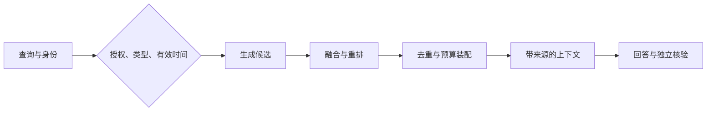

> Agent 记忆设计系列：[1 · 系统全景](/writing/agent-memory-design-competitive-analysis/) · [2 · 写入与纠错](/writing/agent-memory-writing/) · [3 · 检索与装配](/writing/agent-memory-retrieval/) · [4 · 治理与验证](/writing/agent-memory-governance/) · [5 · 深入思考](/writing/agent-memory-synthesis/)

> 版本范围：2026-09-05 核查的 Mem0 v3 迁移文档、OpenViking main 文档和 TencentDB Agent Memory 的 feat/server_team 分支。云服务、开源库与开发分支分别看待；Team Memory 仍是 Beta，本文不作统一性能排名。

> 单项目纵向阅读：[Mem0 多信号检索](/writing/mem0-hybrid-retrieval/) · [OpenViking 分层检索](/writing/openviking-hierarchical-retrieval/) · [TencentDB 分层记忆](/writing/tencentdb-agent-memory-layers/)


上一页保存了上海和杭州两条记录。现在查询“给我推荐附近的办公地点”，语义检索可能同时命中两座城市。候选相关，不代表当前有效；当前有效，也不代表查询者有权看到。

## Mem0：语义、关键词与实体信号互补

当前 Mem0 使用三类信号并行评分：

- 语义相似度负责“意思相近”；
- BM25 负责专有名词、编号与精确措辞；
- 实体匹配把跨记忆出现的人、地点和概念关联起来。

需要注意，v3 的 entity linking 不是把关系图直接暴露给应用的旧式 Graph Memory。实体关系主要成为排序增强信号。这个设计减少了图数据库作为独立产品面的复杂度，却也意味着应用若要浏览、解释或查询显式知识图谱，仍需另建一层。

## OpenViking：分层读取，不把整座资料库搬进上下文

OpenViking 为目录生成三层内容：

| 层 | 含义 | 典型用途 |
| --- | --- | --- |
| L0 Abstract | 极短摘要 | 全局初筛、向量召回 |
| L1 Overview | 目录概览与导航 | rerank、判断是否继续下钻 |
| L2 Detail | 原始文件与子目录 | 确认相关后完整读取 |

按照[上下文分层文档](https://github.com/volcengine/OpenViking/blob/0c5147cae26aec8d6d93445ec6ad86d5faff4035/docs/en/concepts/03-context-layers.md)，L0/L1 是目录级语义侧写，而不是每个文件各生成一份对应副本；父目录的 Overview 又由子目录摘要自底向上聚合。这使 Agent 可以先看地图，再决定进入哪间房，而不是把整栋楼搬进 Prompt。

这里有一个很容易误读的术语冲突：OpenViking 的 L0/L1/L2 表示**同一上下文的读取精度**；TencentDB Agent Memory 的 L0/L1/L2/L3 表示**对话被提炼后的抽象层级**。名字相近，但不可横向对齐。

## OpenViking：从目录导航到具体证据

OpenViking 的复杂查询会先结合 Session 摘要、最近消息与当前问题，生成 0–5 个带类型和优先级的 Typed Query，再分别路由到 Memory、Resource 或 Skill。随后系统从全局高分目录起步，用优先队列递归搜索子目录，并在过程中 rerank。完整流程见[检索机制](https://github.com/volcengine/OpenViking/blob/0c5147cae26aec8d6d93445ec6ad86d5faff4035/docs/en/concepts/07-retrieval.md)。

这种“先定位目录，再逐层下钻”的路线比平铺向量检索更适合复杂知识库：局部语境不会因为切片相似度较低而彻底丢失，检索轨迹也可以解释 Agent 为什么找到了这份内容。

代价是更长的在线链路。意图分析、递归搜索和 rerank 都可能增加延迟；目录摘要还要随子节点变化向上刷新。对更新频繁的深层目录，应额外验证摘要刷新和写放大成本。层级不是免费的，它用生成与一致性成本换取导航能力。

## 从 Top-K 到上下文装配

Mem0 强化单次搜索的准确率；OpenViking 强化检索过程中的路由与导航；腾讯方案强化权限过滤后，把不同资产装配给不同角色。

因此，真实的读取公式不应只是：

```text
TopK(vector_similarity)
```

而更接近：

```text
候选 = 权限范围 ∩ 类型路由 ∩ 时间有效性
得分 = 语义 + 关键词 + 实体/关系 + 新鲜度 + 任务相关度
注入 = 在 Token、延迟与来源多样性预算下选择候选
```

这也是“Memory”逐渐与“Context Engineering”合流的原因：数据库返回什么只是中间结果，真正影响 Agent 的是最终装进模型窗口的那一组上下文。


## 把硬条件和软排序分开

语义、关键词和实体匹配产生的分数通常不是同一量纲，不能未经处理直接相加。实践可以使用排名融合或经验证的归一化与重排；权重必须通过任务集验证。

身份权限不是相关性特征，不能通过更高相似度抵消。检索可见性过滤应发生在候选内容暴露给模型之前；注入和执行时还需检查权限是否已经变化。



*图 1｜先过滤硬条件，再排序并装配上下文。*

## 预算不是简单截断字符串

给上下文设 Token 上限，只是第一步。还要保留支持结论的证据，避免摘要被截成相反意思；多个近似记忆应去重，而不是挤走少量关键反例。

OpenViking 用目录概览决定是否下钻，TencentDB 分层设计用高层恢复语境、再回到细粒度材料；两者都说明“先给地图，再读证据”的价值，但抽象层级和实现不能混称。

缓存键也要包含授权范围和记忆版本。权限撤回后继续命中旧缓存，检索算法再准确也没有意义。

## 实践：一组不用模型的契约测试

仓库 `docs/editorial-labs/memory_lab.py` 用固定事实演示身份范围、有效时间、删除状态与预算检查：

```sh
python3 docs/editorial-labs/memory_lab.py
python3 -m unittest discover -s docs/editorial-labs -p 'test_*.py' -v
```

它不是向量数据库，也不模拟三家产品的检索性能；预算采用示例字符数而非真实 tokenizer。用途是让“错误身份不能读、过期事实不能当现在、删除记录不再注入”等约束成为可执行测试。

将来接入真实存储后，保留这些测试，同时增加同义词、实体歧义、多跳信息与长历史任务。候选召回率衡量检索，最终答案正确率衡量使用，二者分别报告。

本篇最重要的分界线是：搜索返回候选，Context Assembler 决定模型最终看见什么。正确记忆如果被错误装配，同样会产生错误行动。

---

上一篇：[写入与纠错](/writing/agent-memory-writing/)。

读取链路已经有了，但团队共享会让一条记忆影响更多人。下一篇检查权限、删除传播和可复现的验证办法。

下一篇：[一条记忆开始跨团队流动之后](/writing/agent-memory-governance/)。
