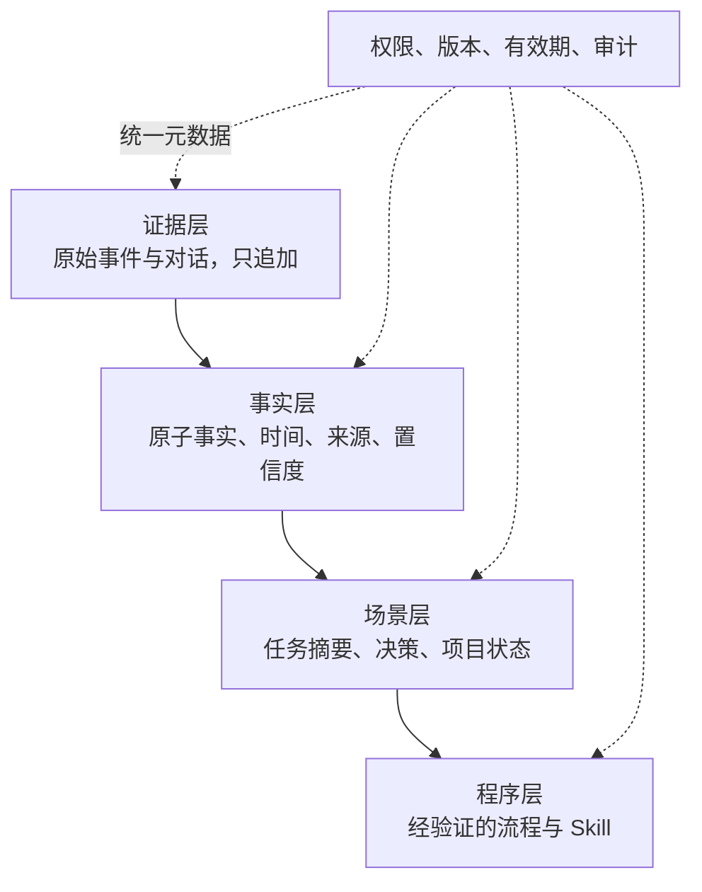
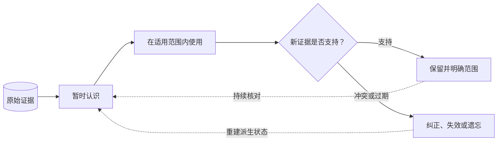

> Agent 记忆设计系列：[1 · 系统全景](/writing/agent-memory-design-competitive-analysis/) · [2 · 写入与纠错](/writing/agent-memory-writing/) · [3 · 检索与装配](/writing/agent-memory-retrieval/) · [4 · 治理与验证](/writing/agent-memory-governance/) · [5 · 深入思考](/writing/agent-memory-synthesis/)

> 阅读时间为估计，包含图表理解；动手实验另计。

> 版本范围：2026-09-05 核查的 Mem0 v3 迁移文档、OpenViking main 文档和 TencentDB Agent Memory 的 feat/server_team 分支。云服务、开源库与开发分支分别看待；Team Memory 仍是 Beta，本文不作统一性能排名。

首篇里，上海和杭州看起来只是两条相似消息。经过写入、读取和治理之后，我们发现它们还包含身份、生效时间、来源、权限、版本与纠错状态。

这说明记忆系统维护的不是一个“越大越好”的文本集合，而是 Agent 用来理解世界的一组暂时认识。系统越依赖长期积累，越需要允许这些认识被修改。

## 选型建议：按主矛盾选择，不按功能数量选择

### 选择 Mem0，如果你的主矛盾是产品个性化

适合客服、陪伴、教育、健康、消费推荐等应用，需要快速获得跨会话事实记忆，希望用最少 API 改造现有产品。优先验证时间冲突、敏感信息过滤，以及 OSS 与 Platform 的能力差异。

### 选择 OpenViking，如果你的主矛盾是上下文规模与结构

适合需要同时管理文档、代码、记忆和 Skill 的通用 Agent，尤其当可浏览目录、渐进加载、稳定 URI 和检索轨迹比极简 API 更重要。优先验证目录更新频率、摘要新鲜度、在线链路延迟和多租户部署。

### 选择 TencentDB Agent Memory，如果你的主矛盾是团队经验复用

适合多个角色 Agent 协作、需要人工审核和权限边界、希望把项目经验沉淀成 Skill/Wiki/CodeGraph 的团队。优先验证 Beta 分支稳定性、跨框架接入一致性、资产自动路由与整套服务的运维成本。

### 如果自研，建议先复制“分层责任”，不要复制三套产品

一个足够稳健的参考架构可以分为四层：

*图 1｜证据、事实、场景与程序性经验的分层责任。矩形表示模块或步骤，圆柱表示存储，菱形表示判断；实线表示主路径，虚线表示约束、信息支撑或反馈。图为教学抽象，不代表全部实现细节。*

其中证据层在有效保留周期内应保持可追溯，正常更新采用追加记录；依法依约的删除和到期清理需另行覆盖原始与派生数据。事实与场景是可重新生成的派生状态；Skill 应在成功轨迹经过验证后才晋升。每条派生记忆建议保留：`source_refs`、`event_time`、`valid_time`、`scope`、`confidence`、`version` 与 `status`。召回先做权限和类型过滤，再做混合排序，最后由独立的 Context Assembler 执行 Token 预算与去冗余。

这套最小原则分别吸收了三家的长处：Mem0 的简单接口，OpenViking 的分层读取，TencentDB Agent Memory 的资产治理；但没有把三套完整运行时叠在一起。

## 写入、检索和治理其实是同一个一致性问题

只追加把冲突留给读时解决；写时合并把判断提前；多层提炼把成本换成更快的语境恢复。没有一种选择消灭错误，它们只是改变错误停留的位置和扩散方式。

因此，比较三家方案时，与其问“谁功能更多”，不如追问：错误被发现后，需要修正多少个对象？多久能停止使用？能否解释哪些回答已经受影响？

这是比单次 Recall@K 更长的一条时间轴。

## 记忆的正反馈，也可能变成污染放大器

一次未经验证的修复被总结成经验，经验被多个 Agent 使用，随后更多轨迹重复同一做法，系统可能把重复误认成可靠。它“记得越来越多”，却离真实世界越来越远。

Skill 晋升应要求来源、适用条件、反例和回归验证；新的模型或工具版本到来时，也应重新检查旧做法。使用频率不是正确性的证明，模型自评的置信度也不能替代外部证据。

## 遗忘不是失败，而是一种控制能力

*图 2｜新证据如何触发保留、纠正与遗忘。矩形表示模块或步骤，圆柱表示存储，菱形表示判断；实线表示主路径，虚线表示约束、信息支撑或反馈。图为教学抽象，不代表全部实现细节。*

一个能删除、回溯、失效和重建的记忆系统，比一个只会不断追加的系统更接近长期协作者。保留足够证据与减少不必要持有之间也存在张力，应按数据类别管理，而不是用“长期记忆”统一解释。

## 怎样决定是否值得引入记忆

先用无记忆基线完成同一组跨会话任务，再比较记忆加入后减少了哪些重复解释、增加了哪些错误和维护成本。把模型、工具与预算尽量固定，记录正确性、延迟、人工纠错与隔离结果。

如果任务每次都由最新外部系统状态决定，查权威数据可能比查旧对话更合适。如果一次任务没有复用价值，强行长期保存只会扩大治理面。

这不是反对记忆，而是要求它证明自己在特定工作中的收益。

## 最终判断：记住的是证据，维护的是可被推翻的结论

Mem0 提醒我们集成成本很重要；OpenViking 提醒我们上下文需要结构与导航；TencentDB 的团队分支提醒我们经验流动需要身份与治理。三条路线共同把问题从“如何存聊天”推向“如何管理未来判断的依据”。

因此，前四篇最终不是为了推荐一个总冠军，而是引出一条系统纪律：

**原始证据可追溯，派生记忆可修正，读取有预算，流动有边界，未来行为有独立验证。**

长期价值不来自从不忘记，而来自在世界变化后仍然愿意、也有能力改变认识。

---

上一篇：[治理与验证](/writing/agent-memory-governance/)。

本系列到此完成。记忆进入模型之前仍需要能力选择与执行边界，可继续对照 [万级能力路由系列](/writing/capability-routing-at-scale/)。
