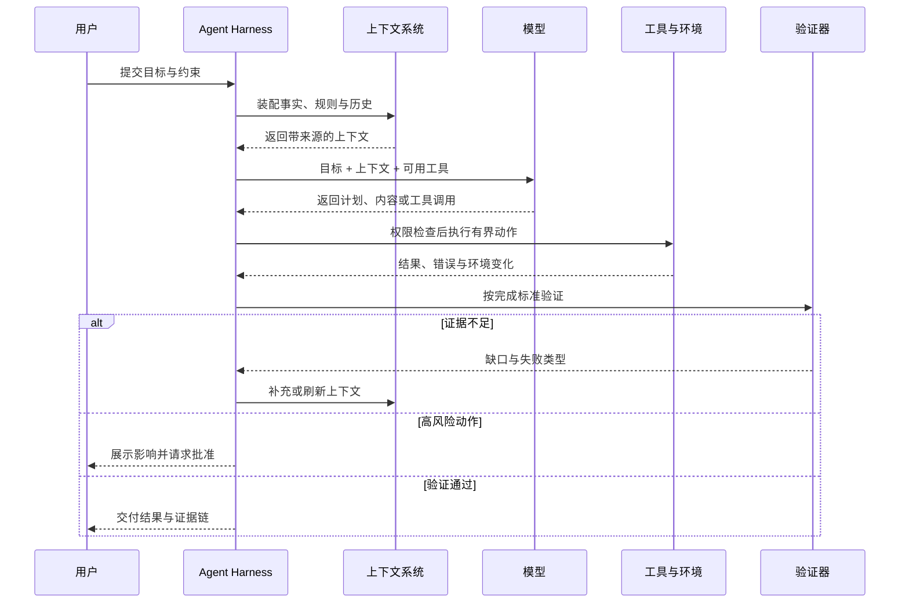

> 系列：[1. 工作系统](/writing/product-work-methodology/)｜[2. 结果契约](/writing/agent-product-contracts-context/)｜[3. 产品节奏](/writing/agent-product-evaluation-rhythm/)｜[4. 组织未知](/writing/lu-qi-researcher-founder/)｜[5. 思维与行动](/writing/researcher-founder-thinking/)｜[6. 学习边界](/writing/learning-organization-boundaries/)｜[7. 整体思考](/writing/ai-product-work-synthesis/)

功能清单描述系统拥有什么，却没有定义一次委托怎样结束。Agent 产品需要把完成标准、行动范围、上下文来源和失败恢复写进同一份结果契约。

## 从“需求文档”转向“结果契约”

Agent 产品最常见的误区，是把传统 PRD 里的功能描述换成一句更开放的自然语言。例如“让 Agent 自动分析客户反馈并输出结论”。这听起来很智能，但没有定义产品。

更有效的起点是一份**结果契约（Outcome Contract）**：

```yaml
job: 分析最近 7 天的客户反馈，并给出下一迭代建议

outcome:
  deliverable: 一页结论、证据链接、建议优先级
  done_when:
    - 覆盖所有有效反馈来源
    - 每个结论至少有两条原始证据
    - 建议能映射到明确用户问题

boundaries:
  may_read: [客服工单, 访谈记录, 产品埋点]
  may_write: [分析草稿]
  requires_approval: [创建需求, 修改路线图, 通知外部用户]
  must_not: [删除原始数据, 推断用户敏感属性]

recovery:
  missing_data: 标记缺口，不补造结论
  conflicting_evidence: 并列展示并请求人工判断
  tool_failure: 重试一次，随后降级为可继续的草稿
```

这份契约把“聪明”改写成了可检验的产品行为。它也让产品、设计、工程、安全和业务第一次能够讨论同一个对象：交付物是什么，系统可以触碰什么，什么情况下必须停下来。

我会用五个问题检查一项 Agent 需求是否已经成形：

1. **委托对象是什么？** 用户交出去的是一个动作、一个阶段，还是一个完整结果？
2. **完成证据是什么？** 除了 Agent 自己声称完成，还有什么可独立检查的产物或状态？
3. **最坏副作用是什么？** 错一次只是多花几秒，还是会误发消息、覆盖数据、损害客户关系？
4. **人在何处介入最有价值？** 是提供目标、消除歧义、批准动作，还是验收最终结果？
5. **失败后如何继续？** 系统能否保留已完成工作，让人从故障点接管，而不是从头再来？

如果这五个问题没有答案，继续调提示词通常只是在优化演示。

## 用“自治阶梯”决定人机边界

人机协同不是在“全自动”和“全人工”之间二选一。更现实的做法，是按风险和可验证性逐级释放自治权。

| 层级 | Agent 的权限 | 人的角色 | 适用条件 |
| --- | --- | --- | --- |
| L0 辅助 | 解释、检索、建议 | 全程执行 | 结果难验证或责任极高 |
| L1 草拟 | 生成计划与产物草稿 | 修改并提交 | 质量可快速人工判断 |
| L2 预执行 | 填好参数并展示影响 | 单点批准 | 动作可逆、边界明确 |
| L3 有界执行 | 在预算和范围内连续行动 | 处理例外、最终验收 | 有可靠验证与回滚 |
| L4 持续委托 | 监测、决策并定期执行 | 制定政策、抽样审计 | 稳定数据、成熟治理 |

自治程度不应由市场叙事决定，而应由三个变量共同决定：**错误代价、验证成本、恢复能力**。一个动作即使模型成功率很高，只要失败不可逆且难以及时发现，就不适合直接自动执行。相反，某些准确率并不惊艳的任务，只要容易验证、能够撤销，反而可以更早进入有界自治。

可以用一个简单的期望价值模型帮助讨论：

$$
V = P_s \cdot U - C_m - C_h - P_f \cdot L
$$

其中 $P_s$ 是任务成功概率，$U$ 是成功带来的价值，$C_m$ 是模型与工具成本，$C_h$ 是人工介入成本，$P_f$ 是产生有害失败的概率，$L$ 是失败损失。产品优化的目标不是单独提高 $P_s$，而是提升整个系统的 $V$。

这解释了一个常见现象：增加一次关键确认可能让流程多十秒，却显著降低 $P_f \cdot L$；增加一个结果校验器可能提高计算成本，却减少人工返工。局部看是“更慢”，整体看却是更好的产品。

## 把上下文当作产品供应链

模型输出依赖上下文，就像实体产品依赖供应链。提示词只是最后的装配说明，真正决定质量的是信息能否被正确取得、筛选、排序、更新和追溯。

一套可维护的上下文设计至少回答四件事：

- **事实层**：当前任务必须知道哪些用户、业务与环境事实？
- **规则层**：有哪些政策、约束、团队规范与审批要求？
- **历史层**：哪些过去决策会影响当前任务，保留多久，谁可以修改？
- **现场层**：执行时必须重新查询什么，避免把过期信息当成事实？



*图 1｜上下文系统在每次行动前提供带来源的事实，并把执行结果送入验证与下一轮决策。*

产品经理在这里最重要的工作，不是决定向量数据库选哪一种，而是制定**上下文规格**：来源、所有者、时效、可信度、冲突处理和隐私范围。缺少这些定义，再先进的检索也只会更快地把噪声送给模型。

> [!WARNING]
> “记住得更多”不等于“理解得更好”。无限累积历史会引入过期事实、目标漂移和隐私风险。好的记忆系统不仅会写入，也必须会过期、纠错、引用来源和被用户看见。

---

上一篇：[工作系统](/writing/product-work-methodology/)。

结果契约定义了产品要兑现什么。下一篇把任务评测、过程可见与 90 天节奏连起来，让契约能够持续被验证和修正。

下一篇：[产品节奏](/writing/agent-product-evaluation-rhythm/)。
