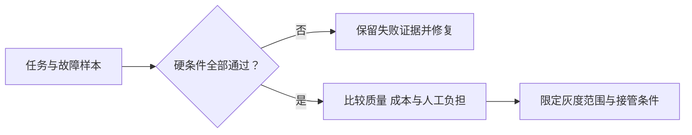

一份结果契约如果只在立项时出现，很快会退化成新的文档模板。产品团队需要把它变成样本、指标、失败记录和每一阶段的授权条件。

## 评估的单位必须是任务，而不是回答

Agent 产品不能只用“回答是否正确”来评估，因为大量失败发生在答案之外：选错工具、漏掉步骤、重复执行、超出权限、产物正确但没有保存、保存成功却没有告诉用户在哪里。

我倾向于建立一套面向任务的失败分类：

| 类别 | 典型问题 | 产品手段 |
| --- | --- | --- |
| 意图失败 | 解决了错误的问题 | 目标回显、歧义确认 |
| 上下文失败 | 缺失、过期或冲突信息 | 来源标记、刷新策略、缺口提示 |
| 规划失败 | 步骤顺序错误或遗漏依赖 | 检查点、计划审阅、任务模板 |
| 工具失败 | 参数错误、接口异常、重复调用 | 类型约束、幂等、重试上限 |
| 边界失败 | 未经批准执行高风险动作 | 最小权限、审批闸门、Hook |
| 验证失败 | 把“已执行”误认为“已完成” | 独立验证器、结果证据 |
| 恢复失败 | 出错后丢失进度或循环重试 | 状态快照、回滚、人工接管 |

评估集也不应只收集“正常问题”。真正有价值的样本通常来自生产中的边缘情况：输入不完整、权限不足、工具超时、两个事实冲突、用户中途改目标、任务被打断后恢复。每一次失败都应该变成一个可重复运行的案例，而不是只修当次提示词。

以下是虚构的发布评审例子，采用固定任务与故障集，不能据此估计线上风险：

| 检查 | 本次结果 | 本次预设门槛 | 决定 |
| --- | --- | --- | --- |
| 正常任务验收 | 50 个任务中 42 个通过 | 至少 40 个通过 | 达标 |
| 未授权写入 | 20 个拒绝场景中发生 1 次写入 | 不允许发生写入 | 阻止发布 |
| 写入后恢复 | 10 个中断场景中 7 个恢复正确 | 10 个均通过 | 阻止发布 |
| 成功任务成本 | 本次全部费用 / 42 | 在业务预算内 | 单独核算 |

完成率达标不能抵消越权或重复副作用。先修复两个硬条件失败，再用同一套样本回归；通过也只说明覆盖范围内成立。统计方法见[评测指标](/writing/agent-evaluation-metrics/)。

*图 1｜发布决定先检查不可交换的约束，再比较质量和成本；样本通过不等于无限制放权。*

## 过程可见，才可能建立信任

多步骤任务的路径可能变化，也可能中途需要用户判断。如果界面只剩一个旋转图标，用户既不知道系统在做什么，也不知道什么时候应该介入。

真正有用的过程反馈应回答：

1. 当前在完成哪个子目标；
2. 已经读取或改变了什么；
3. 为什么选择这一步；
4. 哪里存在不确定性；
5. 用户现在可以批准、修改、撤销还是接管什么。

这里的原则不是暴露模型的全部思维过程，而是提供**可行动的状态**。例如“正在分析”没有行动价值；“已读取 42 条反馈，发现 7 条缺少产品版本，是否忽略后继续？”才有。

信任也不是靠拟人化语气建立的。稳定的信任来自四件事：行为边界一致、重要动作可预期、结果有证据、失败可恢复。产品经理应把这四件事当成交互系统，而不是一句“AI 可能犯错”的免责声明。

## 一套可执行的产品工作节奏

下面用 0—90 天演示三个推进阶段；日期和 30—50 个初始样本是计划示例，能否进入下一阶段取决于验收证据。

### 0—30 天：找到值得委托的窄任务

- 观察真实工作，不从模型能力清单倒推需求；
- 收集 30—50 个真实任务，保留输入、过程、结果和返工原因；
- 写出结果契约和人工基线：现在由谁完成，多久，哪里最耗判断；
- 只做一个可闭环的任务，不急于搭建通用平台。

### 31—60 天：建立边界和评估闭环

- 明确上下文规格、工具输入输出和权限矩阵；
- 把高风险动作放在批准闸门之后；
- 将真实失败整理成评估集和失败分类；
- 记录每次执行的状态、工具结果、人工介入点和最终证据。

### 61—90 天：从可用走向可托付

- 根据失败类型改系统，不只改提示词；
- 为中断、超时和部分成功设计恢复；
- 逐级提高自治，不一次性移除人工；
- 同时观察成功率、人工介入、恢复率、时延、成本与用户复用。

每周评审时，我会要求团队带来的不是“这个版本回答更好了”，而是三样东西：**新增了哪些真实失败样本，哪一类失败显著下降，系统因此可以安全地多承担哪一段工作。**

## 将评测结果落实到授权范围

沿用客户反馈任务：先允许生成有来源的分析草稿；证据完整性与误判达到约定门槛后，再开放“用户确认后创建需求”。通知外部用户属于另一种副作用，需要单独授权和验证，不能随草稿质量提升一并开放。

每周记录新增失败、对应修复、回归结果及允许扩展的动作范围。若关键切片退化，缩回相应范围，并保留已有任务和外部写入的处理责任。

---

  
一页式 Agent 产品评审清单

  <ul>
    <li>任务：用户究竟委托了什么结果？</li>
    <li>证据：系统如何证明自己完成了？</li>
    <li>上下文：事实来自哪里，何时过期？</li>
    <li>工具：每个工具的输入、输出、错误与幂等性是否清楚？</li>
    <li>权限：什么可以自动做，什么必须批准，什么永远禁止？</li>
    <li>评估：正常、边缘、对抗与恢复样本是否都被覆盖？</li>
    <li>介入：用户何时能看见、暂停、修改、撤销与接管？</li>
    <li>指标：成功是否以真实任务和最终状态计算？</li>
  </ul>

## 参考资料

- [OpenAI：Model guidance](https://developers.openai.com/api/docs/guides/latest-model)
- [Anthropic：How Claude Code works](https://code.claude.com/docs/en/how-claude-code-works)
- [Anthropic：Configure permissions](https://code.claude.com/docs/en/permissions)
- [Anthropic：Automate workflows with hooks](https://code.claude.com/docs/en/hooks-guide)
- [Anthropic：Create custom subagents](https://code.claude.com/docs/en/subagents)
