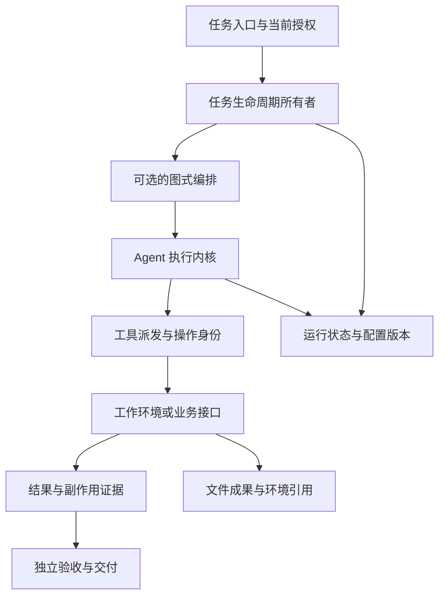
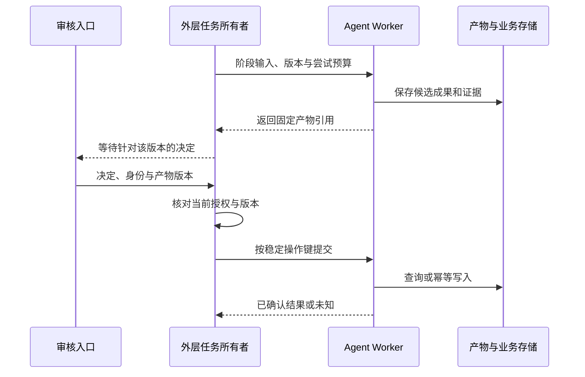
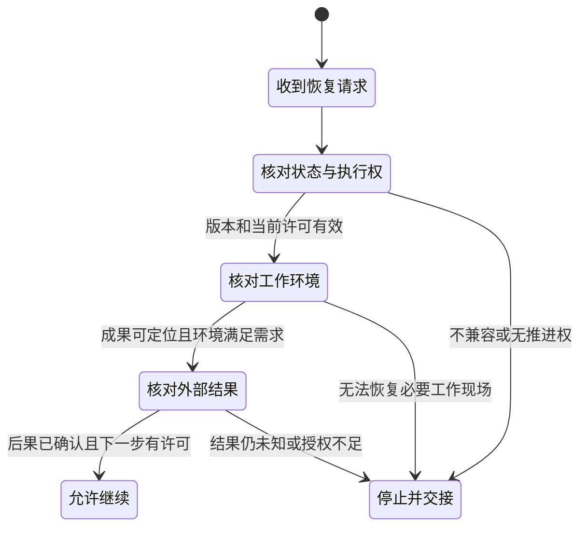
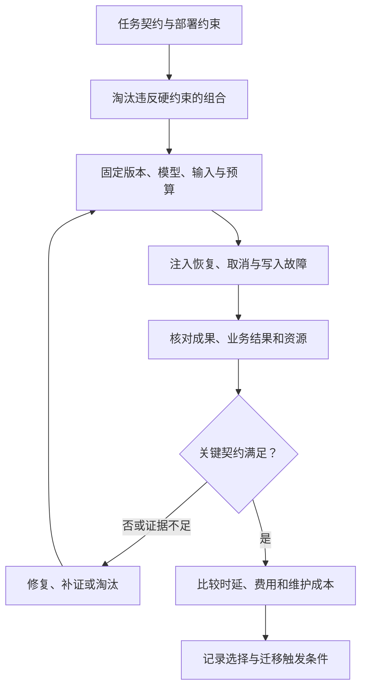

Agent Runtime 技术选型的产物，应是一套能够解释执行、等待、恢复与交付的运行组合，以及采用它需要承担的责任。只选一个框架名字，无法决定任务重启后谁来接管、工具写入是否重复、文件是否还在，以及权限撤销后能不能继续运行。

[Agent Runtime](/writing/agent-runtime/)解释运行时的基本对象与机制；[Harness 架构选型](/writing/harness-architecture-selection/)比较显式循环、图式编排和持久工作流。本文进一步落到具体技术：哪些组件位于同一选择层，哪些应组合；怎样用约束淘汰候选；上线前还要验证哪些缺口。

核对日期为 2026-09-09。LangGraph、Temporal 与 OpenHands 的深入机制引用本站锁定版本的项目研究；OpenAI Agents SDK、Docker 和 E2B 的补充依据是当日官方文档，未安装或实测这些新候选。以下组合是条件化设计建议，不是性能榜单，也不是所有产品能力的穷尽清单。

## 先把 Runtime 拆成四个选择层

| 选择层 | 要决定的问题 | 本文候选 | 不能据此推导的保证 |
| --- | --- | --- | --- |
| Agent 执行内核 | 谁管理模型、工具、会话与下一步动作 | 自建循环、OpenAI Agents SDK、OpenHands SDK | 会话可续接不代表宿主崩溃后任务会自动接管 |
| 控制流与状态编排 | 分支、汇合、人工暂停如何表达 | 应用代码、LangGraph | 检查点不能替代工具副作用和工作目录 |
| 持久任务执行 | 谁保存长期执行进度、等待并派发给 Worker | 应用任务服务、Temporal | 自动重试不等于业务动作只发生一次 |
| 执行环境 | 命令在哪里运行，文件、进程、网络和凭据如何管理 | 受控本地进程、Docker、E2B 等沙箱 | 沙箱恢复不代表任务被授权继续，也不撤销外部写入 |

同一个项目可能覆盖多层。这里按需要解决的问题分层，并非声称每个项目只具备一类能力。例如 OpenHands 同时提供会话内核和 Workspace 接线；OpenAI Agents SDK 的官方文档也包含 SandboxAgent；LangGraph 库与包含运行基础设施的部署产品应分别评估。

<!-- diagram:agent-runtime-selection-1 -->



任务服务拥有外层生命周期，图负责需要显式表达的阶段，执行内核推进局部模型与工具循环，工作环境承载真实执行。状态和成果分别保留，验收读取证据决定交付。小系统可以合并部署，但仍需说明这些职责由谁负责。

<!-- /diagram -->

因此，“LangGraph 还是 E2B”不是完整问题：前者可以组织任务状态，后者可以承载其中的代码执行。“Temporal 还是 Agent SDK”也可能最终选择组合；真正需要避免的是两层都认为自己有权重试、取消或重新创建同一业务动作。

## 用同一个任务提出硬约束

设团队需要一个月报 Agent：读取三份销售表，计算指定月份的金额，生成草稿，等待负责人确认后写入业务系统。这里的批准后写入是本文新增的任务设定，不改变已有评测文章中“只保存草稿、不外发”的实验契约。

先回答以下问题，再打开产品功能表：

| 约束 | 对选择的影响 | 可以直接淘汰什么 |
| --- | --- | --- |
| 所有输入和步骤是否已确定 | 完全确定的流程可以用普通任务代码 | 只增加随机性的模型循环 |
| 是否需要跨重启等待确认 | 需要持久状态、待办入口和重新授权 | 仅进程内消息与游标的组合 |
| 是否执行模型生成的代码 | 需要明确环境隔离、网络和凭据策略 | 直接继承服务进程全部权限的 Shell |
| 业务写入能否查询与去重 | 决定未知结果如何恢复 | 无法说明提交窗口处理的自动重试方案 |
| 源数据是否允许进入外部运行服务 | 决定可用部署与数据路径 | 不满足实际数据使用约束的托管组合 |
| 团队是否承担得起持续运维 | 决定服务数量、备份、升级与值守 | 没有人员维护的复杂部署 |

硬约束先于加权分数。不能让“开发体验更好”抵消无法满足的数据边界，也不能用“支持 resume”掩盖恢复时工作目录已经消失。未验证的能力应记为待核验，不直接写成支持或不支持。

## 执行内核：自建循环、通用 SDK 与代码工作空间

### 自建循环适合控制路径短、契约明确的任务

如果月报只需要调用固定的解析、计算和文件生成工具，模型仅选择下一项读取，自建小循环能把预算、错误分类和验收写得很直接。它不是“没有 Runtime”，而是应用自己实现 Runtime。

代价随着恢复入口、流式工具事件、人工接管和多种模型接口增加而上升。采用 SDK 的理由应是减少这类重复维护，并能保留真实错误语义；如果为了适配 SDK 不断把业务状态塞进聊天文本，就应重新检查接口是否合适。[工具契约](/writing/harness-engineering-tools/)与[模型网关](/writing/harness-operations-model-gateway/)分别说明这两类边界。

### OpenAI Agents SDK：复用执行循环，同时明确应用责任

官方文档将 Agents SDK 定位为由 SDK 管理 Agent 循环和工具调用的代码路径，部署、工具实现、存储与批准决定仍由应用承接。其会话、追踪和可恢复批准能力，使它成为通用工具型 Agent 的候选。[Agents SDK](https://developers.openai.com/api/docs/guides/agents)

会话管理不能笼统理解为“自动恢复任何任务”。官方运行文档展示 Session 续接，并区分应用管理历史与服务端管理续接；结果文档又把待批准调用和可恢复状态与最终输出分开。选型时需明确具体使用哪种存储、保存什么状态、由谁触发恢复。[运行与会话](https://developers.openai.com/api/docs/guides/agents/running-agents)、[结果与状态](https://developers.openai.com/api/docs/guides/agents/results)

这意味着可以采用 SDK 处理交互循环，同时把任务身份、批准版本、业务操作键和产物引用留在应用的数据契约中。这里没有断言 SDK 缺乏某种集成；本轮未验证其 Worker 接管、完整故障恢复和目标部署，因此不能把这些项目直接勾成通过。Python 与 TypeScript 的接口和发布版本也要分别固定。

### OpenHands SDK：当工作目录与终端成为核心对象

代码任务的主要复杂度往往是源码、测试进程、会话事件与工具资源同时存在。OpenHands SDK 围绕 Conversation、Agent、工具执行器和 Workspace 组织这条路径，适合作为代码或文件工作空间任务的候选，而不只是一个通用消息循环。

本站研究锁定 `aa84db8216192568c4436d0dcc36f4caf8516c5b`，分析了事件日志与当前视图、并行工具资源锁，以及本地与远程会话。LocalWorkspace 的工作目录不是隔离边界，切换事件分支也不会自动回滚文件。[OpenHands SDK 源码研究](/writing/openhands-sdk-architecture/)

采用它可以复用工作空间与会话接线，但任务调度、产物留存、当前授权和跨服务恢复仍要逐项确定。本站尚未运行完整 SDK、容器或真实模型，所以这个候选的依据是源码机制匹配，不能声称它在月报或修复任务中比其他方案更成功。

## 控制与持久执行：LangGraph 和 Temporal 怎样组合

LangGraph 适合需要显式状态更新、分支汇合与人工暂停的控制流程。检查点持久化 thread 内的图状态，Store 用于跨 thread 的应用数据；部署时还要区分嵌入式库与 Agent Server 的责任。[持久化文档](https://docs.langchain.com/oss/python/langgraph/persistence)

一个关键选型成本是节点的重执行语义。`interrupt()` 恢复会从所在节点开头重跑；中断前的副作用需要幂等，或拆到具有清楚执行边界的步骤。不能把“暂停的位置”理解成保存了任意 Python 栈帧。[中断规则](https://docs.langchain.com/oss/python/langgraph/interrupts)

Temporal 则将 Workflow 历史与 Worker 执行解耦，适合需要长期等待、调度和接管的外层任务。模型、工具和其他非确定性 I/O 可放进 Activity；Workflow 的确定性重放与 Activity 重试应分开理解。[Workflow 执行](https://docs.temporal.io/workflow-execution)、[Activity 执行](https://docs.temporal.io/activity-execution)

| 比较维度 | 应用循环／SDK | LangGraph 库与持久 checkpointer | Temporal 与 Agent Worker |
| --- | --- | --- | --- |
| 状态表达 | 应用对象、会话和 SDK 状态；边界由采用方式决定 | 图状态、节点更新、检查点 | Workflow 历史、Activity 结果与应用资源 |
| 人工等待 | 保存待批准状态并建立恢复入口 | interrupt 与恢复输入，应用核对批准身份 | 外层等待消息，恢复时启动或推进工作 |
| 执行者退出 | 取决于保存点和外层任务服务 | 恢复检查点，还需有人重新调用与取得执行权 | 服务保留执行历史，Worker 承接任务 |
| 外部写入 | 工具负责操作身份、查询与去重 | 节点可能重执行，副作用仍需业务契约 | Activity 可能重试，副作用仍需业务契约 |
| 升级成本 | SDK 状态与应用 Schema 的兼容 | 图拓扑、节点、状态与中断路径兼容 | 历史重放与 Worker 代码兼容 |
| 运维成本 | 可从少量进程开始，缺失的服务能力自己维护 | 增加检查点存储与运行管理；服务产品另算 | 增加任务服务、Worker、队列及历史管理 |

该表比较本文候选部署，不代表 LangGraph 服务产品只能做到库的能力。候选从库变成托管平台时，应重新核对运行管理、权限、持久化责任和费用，不能沿用原表推断全部产品边界。

若月报只是“读取—生成—审核—提交”，已有一个持久任务服务就能表达外层阶段，不一定还需要图。若每个阶段内部有复杂分支，再考虑局部 LangGraph；若阶段内主要是自由探索，可以运行 SDK 循环。两层组合时，外层负责任务期限与跨阶段重试，内层负责当前尝试的局部决策。

<!-- diagram:agent-runtime-selection-2 -->



长期等待由外层所有者记录，Agent Worker 返回产物后可以释放资源。批准绑定明确版本，提交复用业务操作身份。响应丢失时要查询或保留未知，不允许外层重试和内层重试分别生成不同的创建键。这是参考设计，本轮未运行该组合。

<!-- /diagram -->

## 执行环境：本地进程、Docker 与 E2B

运行环境选择与控制引擎可以分开。纯业务 API 工具可能不需要任意代码沙箱；需要处理不可信脚本、安装依赖或运行测试时，环境就成为一项独立的选型。

| 方案 | 本文考虑它的条件 | 获得什么 | 仍需承担什么 |
| --- | --- | --- | --- |
| 受控本地进程 | 可信固定工具、单机或开发阶段 | 接线少、容易查看工作文件 | 宿主权限、进程清理、资源限制；cwd 不提供安全隔离 |
| 自管 Docker 环境 | 团队能管理主机、镜像、挂载与网络 | 可复用镜像与显式环境配置 | 宿主安全、守护进程权限、补丁、卷与凭据边界 |
| E2B 沙箱 | 需要 API 管理远程环境，并接受该部署的数据路径 | 创建、连接、暂停、恢复与终止接口 | 实际区域、访问与网络策略、可用性、生命周期和完整费用核验 |

Docker 官方说明 Rootless 模式可以让 daemon 与容器以非 root 用户运行，用于降低相关漏洞风险。这是一项具体配置能力，不是“容器内任意代码对宿主绝对无害”的证明；挂载范围和凭据注入仍会改变真实权限。[Docker Rootless](https://docs.docker.com/engine/security/rootless/)

E2B 文档将运行环境作为具有生命周期的沙箱，并说明暂停恢复可保留文件系统与内存，也有仅文件系统的模式。采用时要区分配置、超时动作和实际恢复结果；文件恢复、进程恢复和外部连接重新建立不应被合并成一个“恢复成功”。本文未调用该服务，不报告其冷启动、隔离或稳定性结果。[生命周期](https://docs.e2b.dev/sandbox)、[持久化](https://docs.e2b.dev/sandbox/persistence)

OpenAI Sandbox Agents 文档也将 workspace manifest、live session、序列化状态和 snapshot 分开描述，并提醒挂载的远程存储不随工作空间快照一同复制。因此选用 SDK 的沙箱接口之后，仍须核对具体后端和数据持久化语义。[Sandbox Agents](https://developers.openai.com/api/docs/guides/agents/sandboxes)

如果一个候选方案只能保存工作文件，业务却要求保留正在运行的解释器，就要改变需求、增加应用级检查点，或换用经验证能恢复所需进程状态的方案。反过来，按步骤重建环境已经足够时，不必为所有任务保留整份运行内存。

## “恢复”至少需要核对三组对象

| 恢复对象 | 常见保存方式 | 恢复后仍要核对 |
| --- | --- | --- |
| 控制与对话状态 | SDK 会话、图检查点、Workflow 历史 | 版本、执行权、待批准项、预算 |
| 执行环境 | 文件成果、镜像、持久卷、环境快照 | 输入版本、文件完整性、进程与挂载是否可用 |
| 外部业务结果 | 操作键、资源标识、审计与查询接口 | 是否已提交、参数是否相同、当前权限 |

这三组对象可能有不同的持久化时间。不能只拿最新会话和最新工作目录拼成一份看似完整的状态；它们必须通过 Run、输入清单和产物版本关联。数据结构见 [Agent 数据架构](/writing/agent-data-architecture/)。

<!-- diagram:agent-runtime-selection-3 -->



这是应用验收状态，不是任何候选框架的枚举。检查点加载成功只是第一段；必要环境缺失或业务结果仍未知时，应停止并交接，或进入另有契约的重建流程，不能继续盲目执行写入。

<!-- /diagram -->

## 四类场景怎样形成具体组合

以下是从约束推出的候选起点，均需在目标版本与环境中验证。

| 场景 | 可评审的起点 | 为什么这样组合 | 何时换方案 |
| --- | --- | --- | --- |
| 交互式资料助手 | 自建循环或 OpenAI Agents SDK；应用会话存储；受控检索与业务工具 | 核心是请求内探索和会话续接，先保持部署简单 | 人工等待跨重启、复杂分支或任务必须脱离请求运行 |
| 后台长任务月报 | Temporal 管任务生命周期；Activity 内运行固定处理或 SDK；持久来源与产物存储 | 长等待与 Worker 生命周期解耦；业务写入仍可对账 | 实际任务短且已有队列足够，运维代价超过恢复收益时简化 |
| 代码修复助手 | OpenHands SDK 加受控 Workspace，或经验证的 SDK 沙箱接线；独立成果与测试采集 | 工作目录、终端和环境生命周期是主复杂度 | 无需自由执行代码时改为窄业务工具；需要长期接管时补外层任务服务 |
| 多租户任务平台 | 选定内核，加任务服务、租户身份与配额、按信任域隔离的执行环境；复杂阶段可用 LangGraph | 多租户首先要求授权、容量、公平与数据归属，无法由一个内核解决 | 只有出现明确的调度、隔离或控制流缺口，才增加对应层 |

多租户组合没有指定唯一胜者，因为租户间信任、数据驻留、峰值任务与团队运维能力尚未给定。这里可以给出责任结构，不能凭文章样例替团队签署具体部署决定。[执行安全](/writing/harness-engineering-security/)和[任务服务](/writing/harness-operations-production/)提供对应核验项。

模型能力也要独立比较。换模型可能减少工具调用，换 Runtime 可能减少重复派发，两种收益的证据不同。不要把同时更换模型、框架、提示与工具的总提升全部归因于 Runtime。

## 用淘汰条件推进 PoC

<!-- diagram:agent-runtime-selection-4 -->



先检查硬约束与故障契约，再比较成本。未测项不会因为其他分数高而自动通过；修复候选后，应重跑相关反例并确认没有改变任务契约。

<!-- /diagram -->

| 注入位置 | 必须采集什么 | 不满足时的决定 |
| --- | --- | --- |
| 等待批准时结束 Worker | 待批准产物、状态版本、接管身份 | 无法明确恢复范围，不采用该长任务组合 |
| 业务写入后丢失响应 | 操作键、参数摘要、资源数量与终态 | 重试重复写入，先修工具与恢复契约 |
| 取消时有活跃子任务 | 取消请求、实际停止时间、后台进程和残留资源 | 不能把已请求取消当成全部停止 |
| 审批后、提交前撤权 | 批准版本与提交时当前许可 | 旧批准继续放行，阻止开放写入能力 |
| 替换或丢失工作环境 | 产物摘要、环境引用、可重建输入 | 不得只凭会话“已完成”交付 |
| 旧任务遇到新代码 | 状态 Schema、图或历史兼容结果 | 不兼容则排空、显式迁移或结束交接 |
| 两租户同时高负载 | 各自排队、并发、额度与拒绝记录 | 不满足公平或隔离要求，调整任务服务 |
| 证据采集故障 | 全部计划试次与缺失项 | 标记未知，保留分母，补证后再下结论 |

这些是待运行的跨候选验收计划，本轮没有新做八项端到端实验。测量时将用户等待与活跃执行时间分开，报告完成任务的端到端耗时、取消收尾时间、重复副作用、残留环境、人工接管时间和每个验收成果分摊成本。仅比较函数调用耗时，解释不了长任务的交付代价。

对于多层重试，先记清谁拥有哪个预算。若三层各允许最多三次尝试，某条故障路径最多可能放大到 `3 × 3 × 3 = 27` 次底层调用；这是条件化算术反例，不是任何候选的默认策略或实测结果。把外层期限、Activity 尝试与内层模型／工具预算合并核算后，才能比较真实成本。

## 已有证据怎样支持选择，哪里仍是空白

| 证据 | 可以支持什么 | 不能支持什么 |
| --- | --- | --- |
| 显式循环、LangGraph、Temporal 的历史对照 | 同一工单中，三种控制引擎按固定响应完成暂停、恢复与资源契约 | 真实模型完成率、生产吞吐或灾难恢复排名 |
| LangGraph 锁定版本的实验 | 汇合、动态派发、SQLite 检查点与跨进程继续的局部行为 | 所有部署后端的并发与多租户保证 |
| Temporal 锁定 SDK 的本地实验 | Worker 更换后继续、Activity 重试与历史重放的区别 | 服务端宕机、跨主机灾难恢复和自动历史迁移 |
| OpenHands 与 Codex 源码研究 | 会话、事件、工具和工作环境的真实职责边界 | 本轮没有运行的完整 SDK、模型和容器表现 |
| OpenAI Agents SDK、Docker、E2B 官方文档 | 列入候选的接口与能力依据 | 目标账户、版本、部署和业务上的验收结论 |

原 [Harness 对照实验](/writing/harness-architecture-selection/)是八场景、每引擎三次、共 72 次契约检查；模型决策为固定响应，数据与引擎真实运行。后续八组配对反例是独立 Python／SQLite 实验，没有重新运行三引擎。两份记录不能合并成真实 Agent 成功率。

[LangGraph](/writing/langgraph-runtime-architecture/)与 [Temporal](/writing/temporal-durable-execution/)保留版本与实验限制，[Codex](/writing/codex-system-overview/)保留固定源码与静态边界。本篇未追加这些项目的性能结论。正式比较前，还要固定选中 SDK、checkpointer、Worker、服务端和环境镜像版本；当日文档核对不能代替依赖锁定。

## 把选择写成可以被推翻的决定

一份最小决策记录可以是：

```yaml
# 参考决策格式；下列候选尚未在本篇执行生产 PoC。
workload: monthly-report-with-approval
lifecycle_owner: temporal-workflow
agent_kernel: sdk-or-fixed-business-step-to-validate
control_graph: omitted-until-branching-requires-it
workspace: controlled-tools-no-arbitrary-shell
business_effects: stable-operation-key-and-query
approval_binding: artifact-version-and-current-permission
open_checks:
  - worker-replacement-and-service-recovery
  - old-run-code-compatibility
  - cancellation-and-resource-cleanup
  - target-deployment-cost-and-access-boundaries
reconsider_when:
  - existing-task-service-satisfies-the-same-contract-at-lower-maintenance-cost
  - workload-requires-untrusted-code-or-more-complex-branching
```

这里保留了未定项，避免把一句“采用 Temporal”伪装成全部选型已经完成。迁移时优先稳定 Task、Run、业务操作键、输入清单和产物引用，让框架状态留在适配层。旧任务应由旧版本排空，或经过显式转换交给新版本；两个运行器不能同时拥有写入权。[版本发布](/writing/harness-operations-release/)展开在途任务与回退。

对短交互任务，先比较简单内核与 SDK 的维护成本；对复杂阶段，评估图带来的状态可读性；对长期接管，评估持久任务服务；对代码执行，独立评估工作环境。最终采用的组合，应能同时说清楚“正常时怎样交付”和“失败后哪些事实仍然成立”，并把尚未验证的部分留在决定里。
