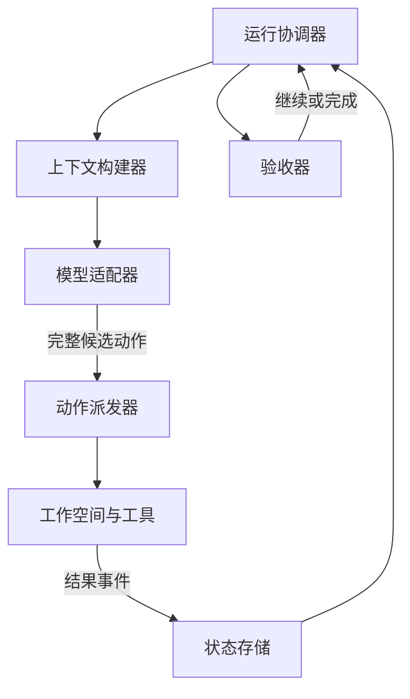
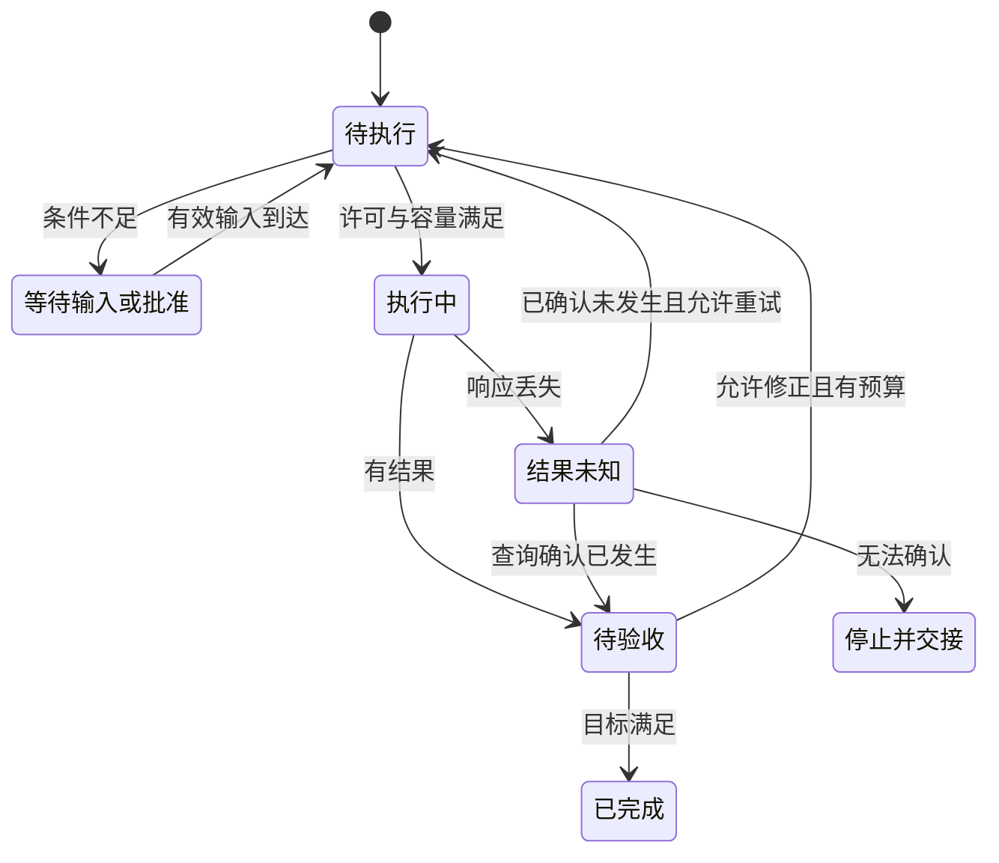
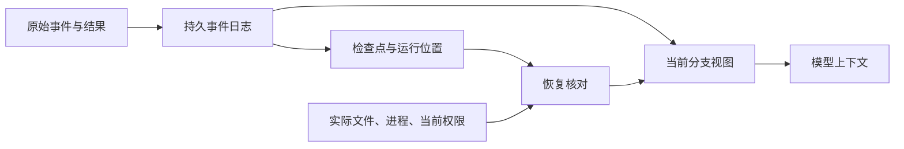
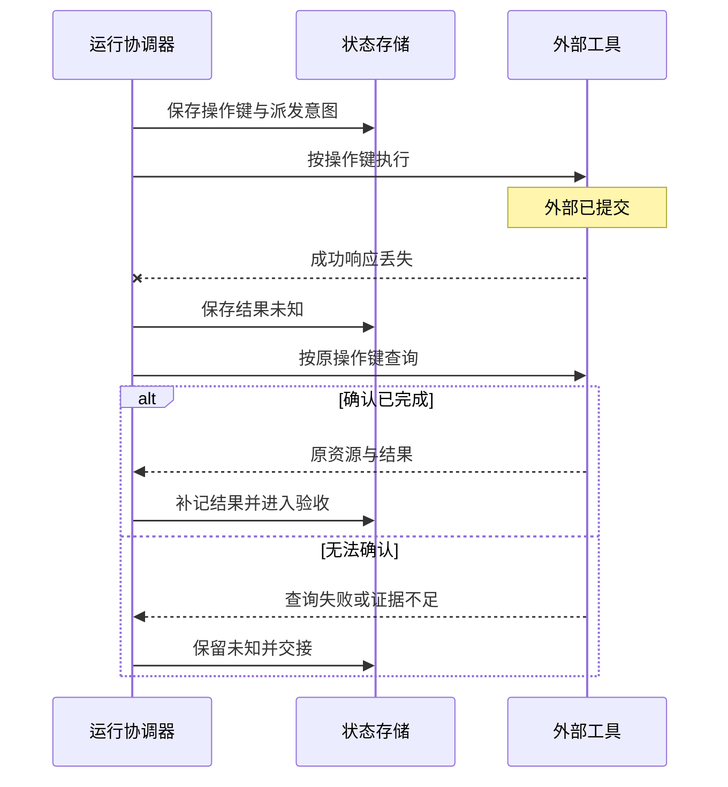

Agent Runtime 是让 Agent 实际运行的软件层：接收任务，维护运行状态，组织模型与工具调用，处理等待、中断和恢复，并交付有依据的结果。

本文用 [Harness](/writing/prompt-context-harness-engineering/)指更完整的工作系统，包括上下文、执行环境、约束与验收；Runtime 侧重任务执行过程。厂商对这两个词的使用并不统一，应以实际职责和接口判断。Loop 决定下一步做什么，Graph 表达任务依赖，Runtime 负责让被选中的步骤真正执行并记录后果。

## 核心对象：任务、运行、动作与事件

设用户要求修复一个代码错误，测试后交付修改。为了说明运行机制，本文采用以下对象；这是教学划分，不是所有框架共有的类型名称。

| 对象 | 保存什么 | 为什么需要单独身份 |
| --- | --- | --- |
| Task | 用户目标、范围、验收条件 | 同一目标可能经过多次运行 |
| Run | 本次执行状态、预算、配置版本 | 暂停恢复与重新开始需要区分 |
| Action | 一次读写或外部调用的意图与参数 | 关联结果、审批和重复执行 |
| Attempt | 某个动作的一次执行尝试 | 重试增加尝试，不应自动改变业务身份 |
| Event | 已观察到的状态变化与结果 | 支持回查、重建和故障定位 |
| Workspace | 文件、进程与其他执行资源 | 聊天记录无法代替实际工作现场 |

Session 可以组织对话和多次任务，但不必与 Run 一一对应。把所有状态塞进消息列表，会让“模型说准备写文件”和“文件已经写入”难以区分。

## 模块如何接成主流程

<!-- diagram:agent-runtime-1 -->

Runtime 参考架构是本文的职责划分。工作空间承载真实文件与进程；状态存储记录运行事实，二者不能互相替代。

<!-- /diagram -->

下面按职责描述一套运行时设计。模块可以位于同一进程，边界清楚比服务数量更重要。

| 模块 | 接收 | 产出与责任 |
| --- | --- | --- |
| 运行协调器 | 任务、恢复请求、用户事件 | 推进状态，管理停止条件 |
| 上下文构建器 | 当前状态、消息、证据 | 本次模型输入及装配记录 |
| 模型适配器 | 输入、模型配置 | 文本、工具调用或协议错误 |
| 动作派发器 | 完整动作与当前执行许可 | 工具结果、错误或结果未知 |
| 状态存储 | 事件、动作与版本 | 可恢复记录与当前视图 |
| 工作空间管理器 | 资源需求与生命周期事件 | 文件环境、进程句柄与清理结果 |
| 验收器 | 候选成果、任务契约与证据 | 是否满足交付条件 |

正常路径是：登记任务，构建输入，请求模型，校验候选动作，执行工具，记录结果，再决定继续或验收。模型输出结束语只是一种信号；是否完成还需检查任务约定的成果。

流式响应尤其需要分阶段：收到部分工具参数时不能提前执行；只有协议表明调用完整、参数校验通过并满足当前执行条件后，才交给派发器。展示一段进度文本，也不能把任务状态改成成功。模型协议差异由 [LLM Gateway](/writing/harness-operations-model-gateway/)及适配器保留和处理。

## 状态机要表达“未知”

<!-- diagram:agent-runtime-2 -->

状态机来自本文教学设计。超时并不证明未执行；未知结果先查询实际资源。取消、审批与预算可以打断推进，图只聚焦一次动作及其核验。

<!-- /diagram -->

正常、失败之外，还有暂停、等待和无法确认结果。以文件写入为例：

| 当前情况 | 应记录的状态 | 下一步 |
| --- | --- | --- |
| 动作已确定，尚未派发 | 待执行 | 检查许可、版本与容量 |
| 需要用户输入或批准 | 等待 | 保存必要状态后释放占用资源 |
| 工具已开始，结果尚未返回 | 执行中 | 等待、超时检查或发起取消 |
| 写入可能完成，但响应丢失 | 结果未知 | 回读或按业务操作键查询 |
| 工具返回成功 | 待验收 | 检查文件和测试证据 |
| 成果满足任务约定 | 已完成 | 保存证据并交付 |

“结果未知”不能直接转换为“未执行”。否则一次网络超时就可能导致重复创建工单、重复提交修改等后果。相反，明确的参数校验失败通常说明动作没有进入工具执行，应修正参数，而不是查询外部副作用。

错误分类决定恢复路径。运行状态迁移需要检查预期版本，避免迟到响应覆盖已经发生的取消或新一轮修改；并发控制的具体机制见[版本、锁与背压](/writing/harness-foundations-concurrency/)。

## 日志、当前视图与检查点

<!-- diagram:agent-runtime-4 -->

状态数据流是本文建议的分工：历史可投影为当前视图，也可形成检查点；恢复还要核对工作空间与当前权限，不能仅加载摘要。

<!-- /diagram -->

事件日志记录发生过什么；当前视图组织本次需要使用的事实；检查点保存某个位置的恢复信息。摘要属于信息投影，不能代替工具执行证据或工作目录。

OpenHands SDK 的固定源码中，事件通过 EventLog 保存，ConversationState 维护当前分支的视图。分支变化时，视图可以重新构建。这种分离使历史保留与输入压缩各自有明确对象。[事件存储](https://github.com/OpenHands/software-agent-sdk/blob/aa84db8216192568c4436d0dcc36f4caf8516c5b/openhands-sdk/openhands/sdk/conversation/event_store.py)、[会话状态](https://github.com/OpenHands/software-agent-sdk/blob/aa84db8216192568c4436d0dcc36f4caf8516c5b/openhands-sdk/openhands/sdk/conversation/state.py)

从这一设计可以推导一项恢复要求：恢复时不仅加载对话，还要核对动作终态、剩余预算、配置版本、当前权限与工作空间。恢复前权限被撤销，旧检查点不能重新授予它；工作目录已丢失，消息里写着“修改完成”也无法恢复文件。

单进程可以用串行协调器维护状态。多个 Worker 参与时，需要进一步明确谁拥有推进权，如何拒绝陈旧执行者，以及状态与动作派发之间的提交边界。数据库表里有一列 status 并不足以解决这些问题。

## 持久执行不自动保证外部动作只发生一次

<!-- diagram:agent-runtime-3 -->

这是设计反例时序：外部已提交、本地未记录形成不确定窗口。查询与幂等能力需资源系统配合，不是日志保存即可提供的保证。

<!-- /diagram -->

一种常见设计是先保存动作意图，再执行外部调用，最后记录结果。它能保留恢复线索，却仍存在“外部已提交，本地未记下”的窗口。无法跨两个系统建立同一事务时，需要业务幂等键、结果查询和必要的补偿。

Temporal 提供了可研究的持久工作流实现：历史重放可以重建控制流程，Activity 则可能因失败或超时重试。[固定 SDK 的确定性约束](https://github.com/temporalio/sdk-python/blob/22a9e41fd857261ee0a9bb5ce57f439d93e7f88d/README.md#asyncio-and-determinism)

本站 [Temporal 实验](/writing/temporal-durable-execution/)中，写入函数提交 SQLite 后人为抛错，实际进入两次；数据库借助唯一业务键只保留一行。这里的去重来自业务数据库，不能归功于“历史重放天然只执行一次”。实验更换了 Worker 对象，服务端始终存活，没有验证服务端宕机恢复。

因此，框架选型应检查“恢复什么、重做什么、谁负责去重”，不能只比较是否有 checkpoint 或 resume 接口。详细的写入边界见[故障恢复](/writing/harness-engineering-recovery/)。

## 并行、取消与资源清理

并行工具需要同时满足数据依赖、资源兼容和容量限制。两个只读搜索可能可以并行；两个修改同一文件的工具则需要序列化，或在合并前检测冲突。线程池大小只控制活跃数量，不理解文件之间的业务关系。

OpenHands SDK 的并行执行器读取工具声明的资源，再通过资源锁协调。资源声明遗漏时，运行时无法凭工具名称推断冲突。完整实现与限制见 [OpenHands SDK](/writing/openhands-sdk-architecture/)。该项目研究未运行完整 SDK 或容器实验，不能把源码机制写成生产保证。

取消也至少分为三件事：请求停止后续调度，停止正在运行的计算，处理已经发生的副作用。它们可能在不同时间完成。Haystack 的受控实验展示了一个反例：取消等待同步线程结果的异步任务后，线程仍能继续写入。[线程取消实验](/writing/haystack-pipeline-architecture/)

运行时因此需要记录取消请求、工具的停止确认和资源清理结果。无法立即停止时，应呈现仍在收尾或结果未知；补偿操作又是一项新的动作，也可能失败。暂停进程、销毁容器与恢复文件快照分别改变不同对象。

## 怎样选择运行时设计

短任务、单用户、失败后可从头开始，可以采用单进程循环与明确的事件记录。需要跨重启等待用户、恢复长任务时，应增加持久状态与接管机制。外部写入较多时，优先完善操作身份、查询和幂等，而不是先增加 Agent 数量。

图编排解决依赖和汇合，持久工作流解决长期执行与恢复，它们可以组合。选择时用同一任务设置故障点：工具执行前退出，提交后丢响应，等待中重启，取消时仍有子任务，再检查结果、状态和资源是否一致。这些是待执行的验收方案，不是本文新增的实验结果。

运行时的质量最终体现在可解释的行为：正常时知道下一步由谁推进，异常时知道哪些事实已经成立，恢复后不会把旧意图、未知结果和真实成果混为一谈。
