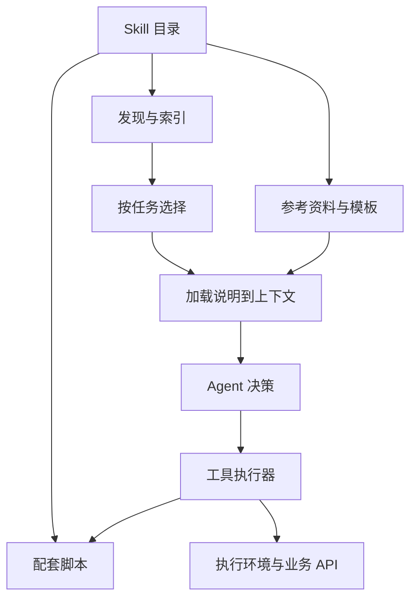
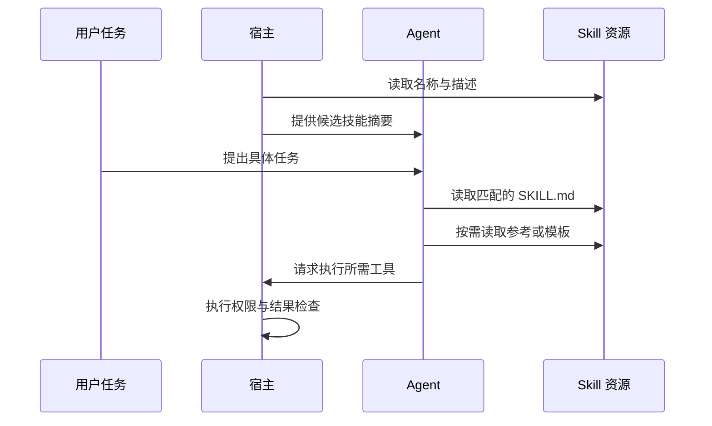
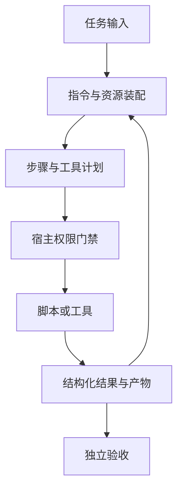
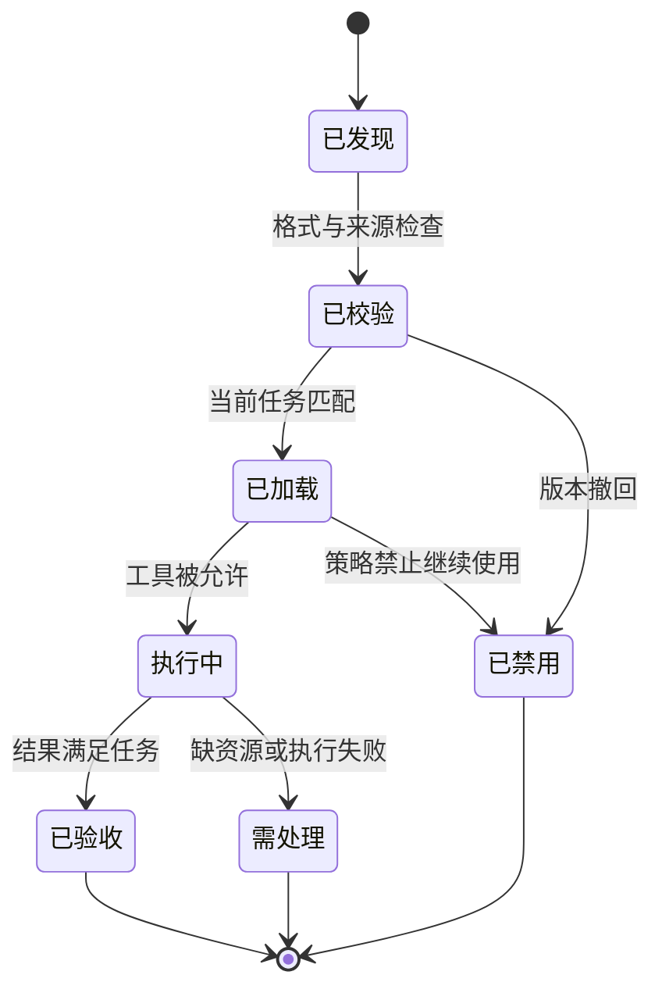

Agent Skills 把完成某类任务的方法封装为可发现、可按需加载的资产。它通常包含 `SKILL.md`，以及可选的脚本、参考资料和模板。这里讨论开放格式规范，而不是某个产品中的同名按钮或一个特定技能仓库。

严格地说，Agent Skills 是**能力包与内容组织规范**，不是 MCP 那样的网络请求协议。没有统一的连接握手，也没有“加载后一定执行”的保证。本文以 2026-09-07 核对的[格式规范](https://agentskills.io/specification)及[固定源码](https://github.com/agentskills/agentskills/blob/69ef37e9424c0a7ea9dd2293b559e43ec8176379/docs/specification.mdx)为依据；任务示例是设计示例，未做真实模型效果评测。

## 架构：技能进入上下文，动作经过工具执行



Skill 指导 Agent 怎样完成工作，Tool 提供执行某一步的接口。脚本能自动化确定性的处理，但运行脚本仍需工具和执行环境。一个只有写作规范的 Skill 可以不调用工具；一个分析表格的 Skill 可能使用多个工具。

由此可见，安装更多 Skill 不会自动增加操作系统权限，也不会自动让模型获得所有资源。宿主必须决定发现范围、加载时机、上下文预算和执行权限。

## 文件契约与最小示例

```text
report-review/
  SKILL.md
  scripts/check_links.py
  references/evidence-rules.md
  assets/report-template.md
```

`SKILL.md` 使用 YAML frontmatter 和 Markdown 正文。`name` 与 `description` 是核心必需信息；`license`、`compatibility`、`metadata` 等提供补充描述。`allowed-tools` 在规范中标记为实验性，支持程度取决于宿主。[字段规范](https://agentskills.io/specification)

以下为作者构造的技能文件内容：

```markdown
---
name: report-review
description: 检查研究报告的证据、结论与引用；适用于发布前审查。
---
先列出文章的核心结论，再检查每条结论的证据。
区分已验证事实、推断、设计建议和未运行实验。
报告缺失证据的位置，不替作者补造实验结果。
需要时读取 references/evidence-rules.md。
```

描述应说明适用任务，而不只是“非常强大的助手”。否则选择器很容易在不相干任务上加载它。正文则应明确输入、工作步骤、输出和失败处理，避免把全部背景知识堆成一份无法导航的长文件。

## 渐进加载解决什么问题



开放格式采用渐进披露：先提供发现所需的少量信息，再加载具体指令，最后按需读取资源。[渐进披露说明](https://agentskills.io/what-are-skills)

这把上下文成本从“所有技能的全文之和”变为“索引成本＋当前任务需要的内容”。但索引本身也会增长；上千个模糊描述仍可能造成选择困难。宿主可以增加分组检索、人工显式选择或候选上限，这些属于选择策略，不是格式规范规定的唯一算法。

加载文件也不是训练模型：知识只在相关上下文和调用环境中起作用。换一个宿主，若其加载顺序、工具集合或脚本运行环境不同，同一 Skill 的行为也可能不同。

## 兼容性应分三层判断

格式兼容只说明宿主能读取文件：名称需满足规范限制并与目录名对应，描述需可用于发现。执行兼容还取决于脚本语言、依赖、文件系统和工具名称。行为兼容则取决于模型是否正确选择技能并遵守方法。

例如技能要求运行 Python 和读取 PDF，但目标宿主只提供浏览器操作。文件格式完全合法，任务仍无法按原方法完成。`compatibility` 可以记录这些环境要求，宿主需要在加载或执行前判断，而不是让模型反复尝试不存在的工具。

同名技能来自两个来源时，本文建议宿主按“来源＋名称＋版本”管理资产身份，再确定用户可见别名。来源优先级和同名覆盖策略应可解释；一次依赖更新不能悄悄把用户熟悉的方法替换成另一套内容。

## 一个 Skill 应定义任务契约

| 维度 | 应写清的问题 | 报告审查示例 |
| --- | --- | --- |
| 触发条件 | 什么时候用，什么时候不用 | 发布前审查，不代替原始研究 |
| 输入 | 缺什么信息就无法完成 | 报告正文、来源与实验记录 |
| 方法 | 先后步骤和判断依据 | 抽取结论，再逐条追溯证据 |
| 输出 | 什么结果能被下游消费 | 问题位置、证据缺口、修改建议 |
| 失败 | 不确定时怎样处理 | 标记无法核验，不补造结论 |
| 工具 | 哪些步骤需要外部执行 | 链接检查与本地文件读取 |

这些是本文建议的编写维度，不是新增的标准 frontmatter 字段。把可靠、可重复的规则放进脚本，把需要语义判断的部分留给模型，可以减少每轮重新推导的工作；但脚本本身也应有版本和可审查的输入输出。

## 数据流与信任边界



格式合法不能说明脚本可信。来自外部的 Skill 可能要求读取敏感文件或发送数据；这些要求不能覆盖用户授权或宿主策略。`allowed-tools` 描述支持的工具使用约定，也不能被当作操作系统强制隔离。

相对路径需要固定在技能资产上下文中解释；实际读取与执行仍应校验越界路径、链接目标和依赖。将 API Key 写入 `SKILL.md` 会把凭据混入可加载文本；凭据应由执行环境的安全配置提供，模型通常只需知道能力是否可用。

## 生命周期是宿主需要补上的设计



这是建议的宿主状态机，Skill 规范没有定义这些运行枚举。升级资产时，应能回答某次结果使用了哪个版本的说明、脚本和模板。只保存 Skill 名称会丢失可复现性，因为同名文件可能被原地修改。

建议把资产摘要、工具版本、模型配置与任务输入关联到运行记录中。回归时既检查“应触发的任务是否触发”，也检查“不该触发的任务是否被误加载”。任务完成率以外，还要看额外上下文、工具调用次数和错误修复成本；更多步骤不必然带来更好结果。

## 与 Prompt、MCP 和 A2A 的关系

Prompt 是一次具体交互中的指令载体；Skill 把一类方法组织成可复用资产。[Context Engineering](/writing/harness-operations-context/) 决定什么时候加载多少内容。[MCP](/writing/harness-foundations-mcp-lifecycle/) 让执行环境发现与调用外部能力。[A2A](/writing/a2a-protocol/) 让独立 Agent 服务交付任务。

A2A Card 中的 skill 条目与此处的技能包不能直接互换。一个远程服务可以宣称“生成报告”，却不公开其方法文件；一个本地 Skill 可以告诉 Agent 怎样生成报告，却不提供任何远程服务端点。

需要团队共享一套方法、模板和脚本时，Agent Skills 很合适。需要稳定机器接口或业务强制约束时，应把关键逻辑落到 API、类型校验和执行门禁。已有[Anthropic Skills 项目研究](/writing/anthropic-skills-overview/)讨论具体资产实现，本文解释其格式与接入边界，二者不替代。
