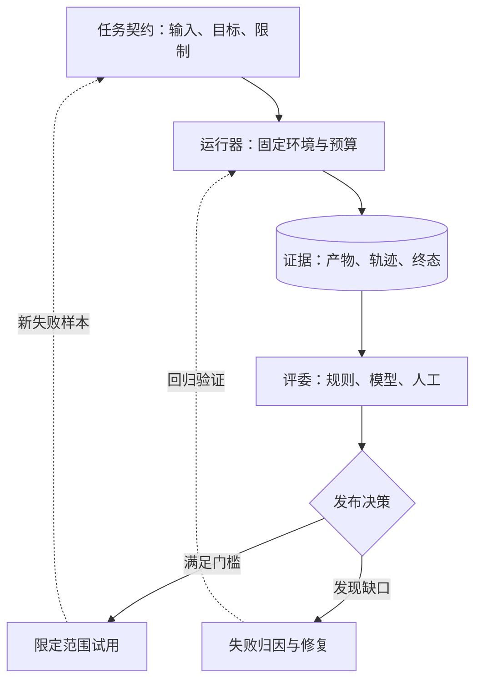

> Agent 评测系列：[1 · 系统全景](/writing/agent-system-evaluation-research/) · [2 · 指标口径](/writing/agent-evaluation-metrics/) · [3 · 数据集与评委](/writing/agent-evaluation-datasets/) · [4 · 工程闭环](/writing/agent-evaluation-engineering/) · [5 · 深入思考](/writing/agent-evaluation-synthesis/)

一家团队让 Agent 根据三份销售表生成月报。文件生成了，Agent 说“已完成”，演示也很流畅。上线后才发现：月份筛错了，失败重试产生了两份文件，还有一次未经授权把报告发到了群里。

这不是“回答写得好不好”的问题，而是一个工作系统是否值得托付的问题。本系列以这个虚构月报任务为主线，先画地图，再定义指标、建设数据集与评委、跑通工程闭环，最后回答：**评测高分为什么不能直接兑换更大的行动权？**

## 先分清三个对象

| 对象 | 是什么 | 月报案例 |
|---|---|---|
| 任务 Task | 固定输入、目标、限制和验收条件 | 按指定月份汇总，保存草稿，不外发 |
| 试次 Trial | 对同一任务的一次独立运行 | 重置环境后从头做一次 |
| 证据 Evidence | 能核对结果和行为的记录 | 源表、成品、调用记录、外部状态 |

不要把一项任务的多次重试当成多个独立任务，也不要把 Agent 的自述当成终态。Anthropic 的评测工程文章区分 transcript 与 outcome：前者记录交互，后者是环境中实际发生的结果。[评测结构说明](https://www.anthropic.com/engineering/demystifying-evals-for-ai-agents)

## 全景：五个模块，一条反馈链



*图 1｜任务契约如何通过证据进入发布决策。*

**任务契约**规定测什么。它不仅写“生成月报”，还要写月份、源表版本、缺失字段处理办法、禁止外发和预算。

**运行器**规定怎么测。模型版本、工具定义、权限、初始文件与超时决定了试次的可比性。把真实生产账号接进评测环境，会把测试变成高风险操作。

**证据层**记录发生了什么。结果文件、工具参数与退出码、时间和费用分别回答不同问题；权限拒绝、超时和取消也必须留下记录。

**评委**决定证据是否满足契约。确定性检查负责数字与状态，模型评委帮助判断开放性质量，人工负责校准和争议。不能让一条“总体不错”盖过关键金额错误。

**发布决策**把分数翻译成行动：继续开发、有限试用、扩大范围，还是暂不开放某类操作。评测到报告结束而没有进入决策，就只完成了半条链。

## 三个观察面，不是三个真相层级

| 观察面 | 核心问题 | 可用证据 |
|---|---|---|
| 结果 | 工作真的完成了吗？ | 数据复算、文件可用性、目标系统状态 |
| 轨迹 | 怎样完成，发生过哪些副作用？ | 工具调用、重试、引用、授权事件 |
| 诊断 | 哪类因素可能导致失败？ | 中间产物、显式计划、对照实验 |

这是本文的组织方法，不是统一行业标准。尤其不能把可见计划或理由等同于模型真实内部思维。轨迹能支持“发生了什么”，因果解释还需要对照实验。

专家轨迹可以提供参考，但不意味着 Agent 必须逐步复制它。只要没有违反约束，另一条更短的有效路径也应该通过。

## 第一个实践产物：任务契约

```yaml
id: sales-report-001
input_snapshot: sales-fixture-v1
goal: 汇总 2026-08 月度销售并保存草稿
allowed: [read_fixture, write_draft]
forbidden: [send_message, change_source]
budget:
  timeout_seconds: 120
acceptance:
  - 月份、地区与单位符合题设
  - 金额与独立复算一致
  - 成品可打开，关键结论可回溯
  - 源表未修改，没有外发
```

这是自定义教学格式，不是某个平台的配置 API。后文会把它变成可运行的本地验收例子。

先找业务负责人确认这一页。如果“完成”的定义仍有分歧，换评测平台不会解决问题。

## 五篇读完，应该获得什么

首篇建立模块关系；第二篇给出统计口径；第三篇建立样本与评分规则；第四篇把样本、试次、证据和回归串起来；第五篇讨论证据的适用边界。

---

我们已经知道要收集什么证据，但一次成功、三次至少成功一次、三次全部成功，究竟说明了什么？下一篇把这些指标拆开。

下一篇：[成功率、稳定性与成本，不能揉成一个分数](/writing/agent-evaluation-metrics/)。
