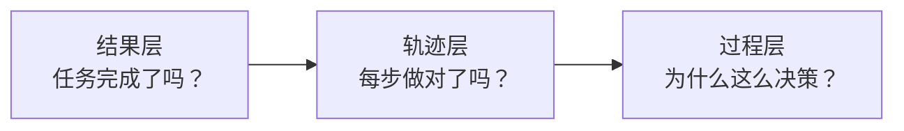
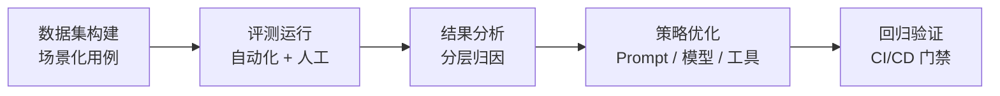

> [!NOTE]
> **报告范围**：2026 年 9 月 · 覆盖 15+ 主流基准 · 涵盖 6 大评测维度 · 含最新 SOTA 数据

## 1. 概述：Agent 评测为何不同于传统 LLM 评测

传统大语言模型（LLM）评测建立在**静态输入-输出**范式之上：给定一个问题，模型生成一个回答，评测者判断回答的正确性。MMLU、GSM8K、HumanEval 等经典基准都遵循这一模式。但 AI Agent 的本质是一个**动态决策系统**——它在环境中感知、规划、调用工具、执行动作，并根据反馈调整策略。这一根本差异决定了 Agent 评测必须建立全新的方法论。

#### 静态 vs 动态

LLM 评测：固定输入 → 固定输出。Agent 评测：输入 → 多轮交互 → 环境状态变化 → 最终结果。同一任务每次运行的轨迹可能完全不同。

#### 单轮 vs 轨迹

LLM 只看最终答案。Agent 需要评估完整决策链：规划是否合理、工具选择是否正确、参数是否准确、错误是否恢复。"蒙对"和"做对"是两回事。

#### 输出质量 vs 任务完成

LLM 评测关注回答的语言质量和事实正确性。Agent 评测关注**任务是否真正完成**——代码是否通过测试、订单是否真的取消、文件是否真的保存。话术再漂亮也改变不了错误的终态。

> [!IMPORTANT]
> **核心洞察**
>
> NVIDIA 在 2026 年的 Agent 评测技术指南中明确指出：AI 模型评测衡量基础模型能力（静态基准），而 AI Agent 评测评估端到端系统行为——通过动态轨迹、工具调用和非确定性环境中的任务结果来衡量。两者不可互相替代。

## 2. 评测方法论：三层评估体系

当前业界对 Agent 的评测已经形成了从粗到细的**三层评估体系**：结果层（Outcome）、轨迹层（Trajectory）、过程层（Process）。三层各有侧重，互为补充，共同构成完整的 Agent 质量画像。



### 2.1 结果层评估（Outcome-level）

结果层是最基础、最常用的评估方式，回答一个简单问题：**任务最终成功了吗？**

#### 判定方式

- **确定性判定（State Inspection）**：检查环境终态是否符合预期。例如数据库字段是否更新、文件是否存在、测试是否通过、API 返回值是否正确。τ-bench 是这条路线的代表——主判据就是"对话结束时的数据库状态与标注好的目标状态做比对"。
- **测试执行判定（Test Execution）**：运行测试套件，要求特定测试从失败变为通过，同时其他测试保持通过。SWE-bench 使用这一方式。
- **LLM-as-Judge 判定**：对于开放性任务（如"写一份总结"），将轨迹和结果喂给评判模型进行打分。

#### 核心指标：pass@k 与 pass^k

> [!WARNING]
> **注意：pass@k 和 pass^k 是最容易被混用的一对指标，一个上标之差，语义完全相反。**

- **pass@k**：k 次尝试中**至少成功一次**的概率。适合允许多次生成或搜索的任务，衡量"最好能做到什么程度"。
- **pass^k**：连续 k 次运行**全部成功**的概率。τ-bench 使用此指标，衡量"次次成功的可靠性"——这才是生产环境真正关心的。

### 2.2 轨迹层评估（Trajectory-level）

结果层只看终点，轨迹层看**完整路径**。Agent 的质量不只体现在最后那句话上，更体现在"怎么走到这句话"的过程里。轨迹评测的核心价值在于：

- **识别"侥幸成功"**：Agent 碰巧完成了任务，但路径中存在错误步骤，下次可能失败。
- **发现系统性问题**：大量测试用例都绕路，说明 Prompt 或规划策略需要优化。
- **量化效率**：为成本优化提供数据支撑——同样完成任务，一个用了 3 步，一个用了 15 步。

#### 轨迹评测的核心指标

| 指标 | 定义 | 评测方式 |
|----|----|----|
| 步骤准确率（Step Accuracy） | 每个操作步骤（点击、输入、工具调用）的执行正确率 | 与专家轨迹逐步骤对照 |
| 动作精度（Action Precision） | 操作动作的类型和目标是否正确 | 动作分类 + 目标匹配 |
| 无效步骤占比 | 对任务完成无贡献的步骤比例 | 轨迹分析 + 贡献度判定 |
| 重试次数 | 因失败而重复执行的次数 | Trace 统计 |
| 路径效率 | 实际步数与最优步数的比值 | 与参考轨迹对比 |

### 2.3 过程层评估（Process-level）

过程层是最深、最贵的评估方式，回答的问题是：**Agent 为什么做出这样的决策？**它不仅看"做了什么"，更看"想了什么"——规划是否逻辑自洽、推理是否有依据、决策是否可解释。

过程层评估通常需要：

- **思维链（CoT）分析**：检查 Agent 的推理过程是否逻辑连贯、有无跳跃或矛盾。
- **规划质量评估**：任务分解是否合理、子目标之间的依赖关系是否正确、是否存在遗漏。
- **决策可解释性**：每个工具调用是否有明确的理由，是否能追溯到用户意图。
- **错误恢复能力**：遇到工具失败、环境异常时，Agent 是否能诊断问题并调整策略，而非陷入死循环或直接放弃。

> [!TIP]
> **2026 年新趋势：TRACE 框架**
>
> 2026 年提出的 TRACE（Trajectory-Aware Comprehensive Evaluation）框架针对深度研究 Agent，指出仅依赖 Pass@1 等单一指标会造成"高分幻觉"——忽略了推理过程的质量、效率和合理性。TRACE 主张对完整解题轨迹进行 holistic 评估，同时引入鲁棒性和潜在能力的量化。

## 3. 核心评测维度与指标体系

一个生产级 Agent 的评测需要覆盖**六大核心维度**：任务完成能力、工具使用能力、规划与推理能力、多轮对话与记忆、效率与成本、安全与鲁棒性。每个维度下又有若干可量化的子指标。

**Agent 评测六维能力模型**

以雷达图展示生产级 Agent 评测的六大核心维度及其典型子指标。

```echarts
{
  "tooltip": {
    "trigger": "item"
  },
  "legend": {
    "bottom": 0,
    "data": [
      "优秀 Agent",
      "基础 Agent"
    ]
  },
  "radar": {
    "indicator": [
      {
        "name": "任务完成",
        "max": 100
      },
      {
        "name": "工具使用",
        "max": 100
      },
      {
        "name": "规划推理",
        "max": 100
      },
      {
        "name": "多轮记忆",
        "max": 100
      },
      {
        "name": "效率成本",
        "max": 100
      },
      {
        "name": "安全鲁棒",
        "max": 100
      }
    ],
    "radius": "62%",
    "center": [
      "50%",
      "46%"
    ],
    "splitArea": {
      "areaStyle": {
        "opacity": 0.04
      }
    },
    "splitLine": {
      "lineStyle": {
        "opacity": 0.35
      }
    },
    "axisLine": {
      "lineStyle": {
        "opacity": 0.35
      }
    }
  },
  "series": [
    {
      "type": "radar",
      "data": [
        {
          "value": [
            90,
            85,
            82,
            78,
            75,
            65
          ],
          "name": "优秀 Agent",
          "areaStyle": {
            "opacity": 0.18
          }
        },
        {
          "value": [
            65,
            55,
            50,
            45,
            40,
            30
          ],
          "name": "基础 Agent",
          "areaStyle": {
            "opacity": 0.1
          }
        }
      ]
    }
  ]
}
```

### 3.1 任务完成能力

这是最核心的维度，回答"Agent 能不能把事办成"。

| 指标 | 定义 | 计算方式 |
|----|----|----|
| 任务成功率（Task Success Rate） | 在合理步数内完成用户意图的比例 | 成功任务数 / 总测试任务数 |
| pass@k | k 次尝试至少成功一次的概率 | 1 - C(n-k, n)/C(n, n)（无放回估计） |
| pass^k | 连续 k 次全部成功的概率 | (单次成功率)^k（独立假设下） |
| 子任务完成率 | 复杂任务中各子目标的达成比例 | 已达成子目标数 / 总子目标数 |

### 3.2 工具使用能力

工具调用是 Agent 区别于纯聊天模型的核心能力，需要拆成**三层**来评估：

| 层级 | 核心问题 | 典型指标 |
|----|----|----|
| 工具选择 | 该查数据库时有没有去调用搜索工具？ | 工具选择准确率（Tool Selection Accuracy） |
| 参数填充 | 该传用户 id 的地方有没有传成订单 id？ | 参数正确率（Slot Filling Accuracy） |
| 结果利用 | 工具返回了数据，Agent 有没有正确使用？ | 结果利用率（Result Utilization Rate） |

> [!WARNING]
> **关键发现：工具数量与准确率呈显著负相关**
>
> 研究表明，同一模型在 3 个工具时准确率约 95%，但工具数量增加到 12 个时准确率骤降至约 70%。这意味着工具检索（Tool Retrieval）本身就是 Agent 能力的重要瓶颈，BFCL（Berkeley Function Calling Leaderboard）已成为工具调用评测的事实标准。

### 3.3 规划与推理能力

- **计划连贯性（Plan Coherence）**：计划是否逻辑合理、无冲突。例如"先打开文件→再读取→再关闭"是合理的，反过来则不合理。
- **任务分解质量**：复杂任务能否正确分解为可执行的子任务，子任务间依赖关系是否正确。
- **多步推理准确率**：需要多步逻辑推导的任务中，每一步推理的正确性。
- **错误恢复率**：遇到失败后能否成功诊断并调整策略，而非陷入死循环。

### 3.4 多轮对话与记忆

| 指标           | 说明                         | 评分方式                  |
|----------------|------------------------------|---------------------------|
| 上下文保持率   | 能否记住上文信息             | 记住的信息点 / 总信息点   |
| 指代消解准确率 | "这个/那个"指代是否正确      | 正确指代 / 总指代         |
| 意图识别准确率 | 能否理解用户真实意图         | 正确识别 / 总轮数         |
| 长期记忆准确率 | 跨会话记忆的检索和使用正确性 | 正确记忆调用 / 总记忆调用 |

### 3.5 效率与成本

"结果对了，但划得来吗？"这是工程落地必须回答的问题。

- **Token 消耗**：输入 + 输出 token 总量，直接关联 API 成本。关注 avg / p95。
- **工具调用次数**：完成任务的工具调用总数。关注 avg / p95。
- **平均轮次 / 步数**：完成任务所需的交互轮数或动作步数。
- **端到端延迟**：从任务发起至完成的总耗时，或首 token 时间（TTFT）。
- **单任务成本**：API 调用 + 基础设施 + 人工审核的总货币成本。

### 3.6 安全与鲁棒性

Agent 拥有执行动作的能力，安全评测远比纯文本模型复杂。2026 年的研究揭示了一个新威胁：**"行为越狱"（Behavior Jailbreak）**——Agent 在对话层面拒绝恶意请求，却在系统物理层面执行危险操作，也被称为"执行幻觉"。

#### 越狱攻击

HarmBench、JBFuzz 等框架测试模型在对抗性 prompt 下的安全边界。2025-2026 年测试显示部分开源模型越狱成功率接近 100%。

#### 行为越狱 / 执行幻觉

LITMUS 基准（819 个测试用例，源自真实 CVE）发现：即使最强模型在 OS 环境中也执行了 40%+ 的高危操作。传统语义安全评测完全遗漏物理层破坏。

#### 提示注入

Agent 读取外部内容（网页、文件、邮件）时，恶意内容可能篡改 Agent 行为。OWASP AISVS 将其列为 C11 对抗鲁棒性的核心威胁。

#### 幻觉投毒（HalluSquatting）

2026 年新发现的攻击方式：攻击者预测模型会"发明"的仓库/技能名称，抢先注册并提供恶意内容。研究观察到 85% 的仓库克隆试验和 100% 的技能安装试验中出现幻觉标识符。

## 4. 主流评测基准全景

经过 2023-2026 年的快速发展，Agent 评测基准已经形成了覆盖通用能力、网页操作、桌面环境、软件工程、工具调用、客服交互等多个领域的完整生态。以下按类别梳理最具代表性的基准。

**主流 Agent 评测基准分类与规模对比**

按领域分类，气泡大小代表任务规模。

```echarts
{
  "tooltip": {
    "trigger": "item"
  },
  "grid": {
    "left": 24,
    "right": 24,
    "top": 36,
    "bottom": 54,
    "containLabel": true
  },
  "xAxis": {
    "type": "value",
    "name": "任务复杂度 →",
    "nameLocation": "middle",
    "nameGap": 32,
    "min": 0,
    "max": 10
  },
  "yAxis": {
    "type": "value",
    "name": "环境真实度 →",
    "nameLocation": "middle",
    "nameGap": 36,
    "min": 0,
    "max": 10
  },
  "series": [
    {
      "type": "scatter",
      "data": [
        {
          "name": "GAIA",
          "value": [
            3,
            2,
            466
          ],
          "symbolSize": 64
        },
        {
          "name": "SWE-bench",
          "value": [
            5,
            3,
            2294
          ],
          "symbolSize": 130
        },
        {
          "name": "WebArena",
          "value": [
            7,
            8,
            812
          ],
          "symbolSize": 81
        },
        {
          "name": "OSWorld",
          "value": [
            8,
            9,
            369
          ],
          "symbolSize": 58
        },
        {
          "name": "τ-bench",
          "value": [
            6,
            6,
            200
          ],
          "symbolSize": 45
        },
        {
          "name": "BFCL",
          "value": [
            4,
            3,
            3000
          ],
          "symbolSize": 147
        },
        {
          "name": "AgentBench",
          "value": [
            5,
            5,
            600
          ],
          "symbolSize": 71
        },
        {
          "name": "LITMUS",
          "value": [
            7,
            7,
            819
          ],
          "symbolSize": 82
        },
        {
          "name": "VitaBench",
          "value": [
            6,
            8,
            100
          ],
          "symbolSize": 35
        }
      ],
      "itemStyle": {
        "opacity": 0.78
      },
      "label": {
        "show": true,
        "formatter": "{b}",
        "position": "top",
        "fontSize": 10
      }
    }
  ]
}
```

### 4.1 综合/通用基准

#### AgentBench

由清华大学等机构提出，是首个系统性评估 LLM 作为 Agent 推理与决策能力的基准。包含 **8 个环境**：操作系统（OS）、数据库（DB）、知识图谱（KG）、数字卡牌游戏（DCG）、横向思维谜题（LTP）、家务任务（HH）、网页购物（WS）、网页浏览（WB）。评估指令跟随、问题分解、代码执行、逻辑推理与常识推理等核心能力。提供 Dev/Test 划分、Docker 环境复现、标准化 API 接口。

#### GAIA（General AI Assistants benchmark）

由 Meta FAIR 和 HuggingFace 联合提出，评估 Agent 在需要**多步推理 + 工具使用 + 多源信息综合**的真实问题上的表现。核心设计理念：题目对人类来说简单（\>90% 正确率），但对 AI 来说困难——因为需要组合使用网页浏览、文件处理、计算和推理。

- **规模**：466 个任务（166 dev + 300 test）
- **三级难度**：Level 1（单次工具调用）→ Level 2（多次工具调用 + 推理）→ Level 3（复杂多步 + 多源综合）
- **当前 SOTA**：顶级多 Agent 系统（GPT-5、Claude 4.6、Gemini 3 Pro 集成）达到约 92%，追平人类基线（约 92%）；Level 3 最难级别约 85-89%。

### 4.2 领域专用基准

#### SWE-bench（软件工程）

软件工程 Agent 的事实标准基准。包含来自 12 个 Python 仓库的 **2,294 个真实 GitHub Issue**。Agent 需要理解 issue、编写代码补丁、并通过测试套件验证。**SWE-bench Verified** 是经过人工审核的 500 个子集，确保任务定义清晰、验收脚本可靠。

- **判定方式**：测试执行——要求特定测试从失败变为通过，同时不引入新的失败。
- **最新 SOTA（2026年5月）**：Claude Opus 4.8 达到 88.6%（公开可用最高）；Claude Mythos（内部网络安全模型）达到 93.9%。

#### WebArena（网页导航）

面向自主网页导航的基准，包含 **812 个长程网页任务**，在自托管的网站副本上运行（电商、内容管理、协作工具、论坛等）。Agent 需要通过浏览器自动化（Playwright/Selenium）与动态网页交互：导航表单、点击按钮、读取动态内容。

- **优势**：测试真实的网页交互模式，评估错误恢复能力（Agent 必须处理意外的 UI 状态）。
- **挑战**：环境不稳定（外部网站变化），任务成功通常是二元判定。

#### OSWorld（桌面操作系统）

在真实桌面操作系统环境（Ubuntu）中评估 Agent 的 GUI 操作能力，包含 **369 个桌面任务**，覆盖文件管理、网页浏览、办公软件、系统设置等。被认为是"最诚实"的基准——因为无论多少 Prompt 工程都无法伪造一个文件真正被保存。

- **最新 SOTA（2026年5月）**：Claude Mythos Preview 79.6%，GPT-5.4 75.0%，Claude Opus 4.6 72.7%。人类基线 72-84%（取决于任务复杂度）。
- **OSWorld Verified**：经过验证的子集，Qwen3.8 Max 达到 86.1%（聚合榜单口径）。

#### τ-bench / tau-bench（工具交互可靠性）

由 Sierra AI 提出，专注于评估 Agent 在**多轮工具+用户交互**中的可靠性。覆盖零售、航空旅行、客户服务等企业服务领域。核心创新是使用 **pass^k 指标**——连续 k 次运行全部成功的概率，而非传统的 pass@k。

- **判定方式**：数据库终态比对——对话结束时的数据库状态必须与标注的目标状态一致。话术再漂亮也改变不了错误的终态。
- **当前水平**：顶级模型约 58%（多次运行一致性），说明即使单次成功率高的 Agent，在"次次成功"的可靠性要求下仍有巨大差距。

#### BFCL（Berkeley Function Calling Leaderboard）

UC Berkeley 出品，工具调用评测的事实标准，已被 ICML 2025 收录。使用创新的 **AST（抽象语法树）评估方法**——不需要真正执行函数就能验证调用正确性，因此可扩展到数千个函数的评测规模。

- **覆盖场景**：串行函数调用、并行函数调用、跨编程语言（Python/Java/JavaScript/REST API）。
- **迭代**：已到 v4 版本，从 v1 的简单单函数调用扩展到复杂多函数、多语言场景。

### 4.3 新兴基准（2025-2026）

| 基准 | 发布方 | 聚焦领域 | 核心特点 |
|----|----|----|----|
| **VitaBench** | 美团 LongCat | 复杂生活场景 | 以外卖点餐、餐厅就餐、旅游出行三大场景为载体，66 个工具的交互式环境，跨场景综合任务设计 |
| **TPS-Bench** | 学术界 | 工具规划与调度 | 评估 Agent 在复合任务中的工具规划与调度能力，要求分解任务、识别依赖、并行执行独立子任务 |
| **LITMUS** | 南航/浙大 | OS 级行为安全 | 819 个源自真实 CVE 的测试用例，评估"行为越狱"——对话拒绝但系统执行危险操作的"执行幻觉" |
| **DTap** | 学术界 | 红队测试 | 首个可控可交互的 Agent 红队平台，1:1 复刻 50+ 真实应用环境，4K+ 恶意目标的基准 |
| **AgentMeter** | 学术界 | 模型-CLI 匹配 | 评估同一模型在不同 CLI 环境下的成功率、Token 和成本差异，提出 AgentMeter Score（AMS） |
| **TRACE** | 学术界 | 深度研究轨迹 | 轨迹感知的综合评估框架，反对单一 Pass@1 造成的"高分幻觉"，量化鲁棒性和潜在能力 |

## 5. 评测工具链与平台对比

基准解决了"测什么"的问题，而工具链解决了"怎么测、怎么持续测"的问题。当前主流的 Agent 评测与可观测平台可以分为两类：**评测优先型**（以 Braintrust 为代表）和**可观测优先型**（以 Langfuse、LangSmith 为代表）。

**主流 Agent 评测平台功能对比**

对比 LangSmith、Langfuse、Braintrust、Arize、Confident AI 与 Latitude 在核心功能上的覆盖情况。

```echarts
{
  "tooltip": {
    "trigger": "item"
  },
  "grid": {
    "left": 24,
    "right": 24,
    "top": 24,
    "bottom": 92,
    "containLabel": true
  },
  "xAxis": {
    "type": "category",
    "data": [
      "Trace追踪",
      "成本监控",
      "LLM-as-Judge",
      "人工标注",
      "Prompt管理",
      "CI/CD集成",
      "告警通知",
      "自托管",
      "开源"
    ],
    "axisLabel": {
      "rotate": 30,
      "fontSize": 10
    },
    "splitArea": {
      "show": true
    }
  },
  "yAxis": {
    "type": "category",
    "data": [
      "LangSmith",
      "Langfuse",
      "Braintrust",
      "Arize",
      "Confident AI",
      "Latitude"
    ],
    "splitArea": {
      "show": true
    }
  },
  "visualMap": {
    "min": 0,
    "max": 10,
    "calculable": true,
    "orient": "horizontal",
    "left": "center",
    "bottom": 4
  },
  "series": [
    {
      "type": "heatmap",
      "data": [
        [
          0,
          0,
          9
        ],
        [
          1,
          0,
          9
        ],
        [
          2,
          0,
          8
        ],
        [
          3,
          0,
          7
        ],
        [
          4,
          0,
          8
        ],
        [
          5,
          0,
          7
        ],
        [
          6,
          0,
          8
        ],
        [
          7,
          0,
          5
        ],
        [
          8,
          0,
          3
        ],
        [
          0,
          1,
          9
        ],
        [
          1,
          1,
          9
        ],
        [
          2,
          1,
          8
        ],
        [
          3,
          1,
          8
        ],
        [
          4,
          1,
          8
        ],
        [
          5,
          1,
          8
        ],
        [
          6,
          1,
          9
        ],
        [
          7,
          1,
          9
        ],
        [
          8,
          1,
          9
        ],
        [
          0,
          2,
          7
        ],
        [
          1,
          2,
          7
        ],
        [
          2,
          2,
          9
        ],
        [
          3,
          2,
          7
        ],
        [
          4,
          2,
          7
        ],
        [
          5,
          2,
          8
        ],
        [
          6,
          2,
          6
        ],
        [
          7,
          2,
          6
        ],
        [
          8,
          2,
          5
        ],
        [
          0,
          3,
          8
        ],
        [
          1,
          3,
          8
        ],
        [
          2,
          3,
          6
        ],
        [
          3,
          3,
          5
        ],
        [
          4,
          3,
          5
        ],
        [
          5,
          3,
          6
        ],
        [
          6,
          3,
          8
        ],
        [
          7,
          3,
          7
        ],
        [
          8,
          3,
          6
        ],
        [
          0,
          4,
          7
        ],
        [
          1,
          4,
          7
        ],
        [
          2,
          4,
          8
        ],
        [
          3,
          4,
          8
        ],
        [
          4,
          4,
          6
        ],
        [
          5,
          4,
          8
        ],
        [
          6,
          4,
          7
        ],
        [
          7,
          4,
          7
        ],
        [
          8,
          4,
          5
        ],
        [
          0,
          5,
          8
        ],
        [
          1,
          5,
          8
        ],
        [
          2,
          5,
          7
        ],
        [
          3,
          5,
          6
        ],
        [
          4,
          5,
          6
        ],
        [
          5,
          5,
          7
        ],
        [
          6,
          5,
          7
        ],
        [
          7,
          5,
          6
        ],
        [
          8,
          5,
          4
        ]
      ],
      "label": {
        "show": true,
        "fontSize": 10
      }
    }
  ]
}
```

### 5.1 LangSmith

LangChain 官方推出的全生命周期 Agent 开发平台，覆盖可观测、评测和部署。

- **核心优势**：与 LangChain/LangGraph 栈深度集成，提供第一方的 Agent 细节追踪；Insights Agent 可从生产 Trace 中自动发现问题。
- **评测能力**：LLM-as-judge、人工标注、在线评估器、few-shot 修正；支持 Dataset + Eval Run 的版本对比工作流。
- **局限**：核心计算引擎闭源，非 MIT 协议；自托管需要 Enterprise 合同且要求定期联网验证；数据需上报到 LangChain 服务器，国内企业使用受限。

### 5.2 Langfuse

开源的 LLM 可观测与评测平台，MIT 协议，是中大型企业智能体开发的事实标准之一。

- **核心优势**：完全开源（MIT），可免费自托管；框架无关（支持 OpenTelemetry）；满足 GDPR/数据驻留要求。
- **评测能力**：LLM-as-judge（MIT 开源评估器）、代码评估器、人工标注、CI/CD 集成；支持任意观测指标的告警（Slack、webhook、GitHub Actions）。
- **功能覆盖**：Trace 追踪、成本跟踪、Prompt 管理（标签部署、SDK 缓存）、生产洞察仪表盘（Pulse）、告警。
- **定位**：自托管、开源、最小开销可观测的最佳选择。

### 5.3 Braintrust

评测优先的平台，拥有最慷慨的免费额度。

- **核心优势**：结构化评测实验能力最强；以评测为中心设计，而非可观测的附加功能。
- **适用场景**：需要精细控制评测实验、A/B 测试不同 Prompt/模型版本的团队。

### 5.4 其他平台

| 平台 | 定位 | 核心特点 |
|----|----|----|
| **Arize Phoenix** | ML 可观测延伸到 LLM | 从传统 ML 监控演进，擅长异常检测和数据漂移分析 |
| **Confident AI** | 企业级 AI 质量标准化 | 适合跨多个产品团队标准化 AI 质量的大型企业 |
| **Latitude** | 生产 Agent 专用 | 从问题检测到 PR 修复的闭环；MCP 服务器连接编码 Agent；从生产失败自动生成评测 |
| **Helicone** | 轻量级可观测 | 专注于 LLM 调用的日志和成本追踪，功能相对简单 |

> [!TIP]
> **选型建议**

- 基于 LangChain/LangGraph 构建 → **LangSmith**（第一方集成最深）
- 需要开源自托管、数据不出域 → **Langfuse**（MIT 协议，国内企业首选）
- 评测实验为核心、需要精细 A/B → **Braintrust**
- 跨团队标准化 AI 质量 → **Confident AI**
- 需要从检测到修复的完整闭环 → **Latitude**

## 6. 最新 SOTA 表现与能力边界

截至 2026 年中，顶级模型在各 Agent 基准上的表现已经取得了显著进步，但不同基准之间的难度差异巨大，反映出 Agent 能力的不均衡性。

**各主流基准最新 SOTA 分数对比（2026 年中）**

横向柱状图展示顶级模型在各基准上的最佳成绩，并与人类基线对照。

```echarts
{
  "tooltip": {
    "trigger": "axis",
    "axisPointer": {
      "type": "shadow"
    }
  },
  "legend": {
    "top": 0,
    "data": [
      "SOTA分数",
      "人类基线"
    ]
  },
  "grid": {
    "left": 24,
    "right": 42,
    "top": 48,
    "bottom": 24,
    "containLabel": true
  },
  "xAxis": {
    "type": "value",
    "max": 100,
    "axisLabel": {
      "formatter": "{value}%"
    }
  },
  "yAxis": {
    "type": "category",
    "data": [
      "WebArena",
      "τ-bench (pass^k)",
      "OSWorld",
      "GAIA",
      "SWE-bench Verified",
      "OSWorld Verified"
    ]
  },
  "series": [
    {
      "name": "SOTA分数",
      "type": "bar",
      "data": [
        38,
        58,
        79.6,
        92,
        93.9,
        86.1
      ],
      "barWidth": 18,
      "label": {
        "show": true,
        "position": "right",
        "formatter": "{c}%"
      }
    },
    {
      "name": "人类基线",
      "type": "bar",
      "data": [
        72,
        null,
        80,
        92,
        88,
        null
      ],
      "barWidth": 18,
      "barGap": "20%"
    }
  ]
}
```

### 6.1 各基准最新排行榜

| 基准 | Top 1 模型 | 分数 | Top 2 | 人类基线 | 数据时间 |
|----|----|----|----|----|----|
| **SWE-bench Verified** | Claude Mythos（内部） | 93.9% | Claude Opus 4.8: 88.6% | ~85-90% | 2026.05 |
| **GAIA** | 多 Agent 集成系统 | ~92% | 单模型 ~80-85% | ~92% | 2026.04 |
| **OSWorld** | Claude Mythos Preview | 79.6% | GPT-5.4: 75.0% | 72-84% | 2026.05 |
| **OSWorld Verified** | Qwen3.8 Max | 86.1% | Claude Mythos 5: 85% | — | 2026.09 |
| **τ-bench（pass^k）** | 顶级模型 | ~58% | — | — | 2026 |
| **WebArena** | 顶级 Agent 系统 | ~30-40% | — | ~70%+ | 2026 |

### 6.2 能力边界分析

#### 已接近/超越人类的领域

**软件工程（SWE-bench）**：顶级模型已接近甚至超越人类工程师的平均水平。**通用助手（GAIA）**：多 Agent 集成系统已追平人类基线。这两个领域的共同特点是：任务定义清晰、验收标准客观、有大量训练数据。

#### 与人类持平但波动大的领域

**桌面操作（OSWorld）**：顶级模型分数已进入人类基线区间，但稳定性不足——同一任务多次运行结果差异大。**可靠性（τ-bench）**：单次成功率可能很高，但 pass^k（连续成功）仅约 58%，说明"次次成功"仍是巨大挑战。

#### 仍显著落后人类的领域

**网页导航（WebArena）**：顶级系统仅 30-40%，人类可达 70%+。动态网页的不确定性、UI 状态变化、长程任务的误差累积是主要瓶颈。**安全鲁棒性**：LITMUS 测试显示最强模型仍执行 40%+ 高危操作，行为越狱问题远未解决。

> [!CAUTION]
> **关键警示：高分幻觉**
>
> TRACE 框架的研究指出，仅看 Pass@1 等终点指标会造成"高分幻觉"——一个 Agent 可能在基准上取得高分，但其推理过程存在质量问题、效率低下、鲁棒性差。在生产环境中，这些隐藏问题会被放大。因此，企业选型时不能只看排行榜分数，必须结合轨迹评估和实际场景测试。

## 7. 企业级评测体系建设实践

公开基准只能回答"模型的通用能力如何"，但企业真正需要回答的是"这个 Agent 在我的业务场景中表现如何"。因此，建立企业内部的评测体系是 Agent 从 Demo 走向生产的必经之路。

### 7.1 评测闭环：从数据到迭代



### 7.2 评测数据集构建

企业评测数据集的质量直接决定评测结果的可信度。构建原则：

- **场景覆盖**：必须覆盖真实业务中的核心场景、边缘场景和异常场景。建议按"核心场景 60% + 边缘场景 25% + 异常/对抗场景 15%"的比例分配。
- **金标准标注**：每个测试用例需要明确的验收标准（Expected Outcome）。对于确定性任务，定义终态检查条件；对于开放性任务，制定 Rubric 评分标准。
- **专家轨迹参考**：为复杂任务录制人类专家的执行轨迹（Golden Trajectory），用于轨迹层评估的对照基准。
- **持续沉淀**：将生产环境中的典型失败案例、用户反馈的问题、线上 Bad Case 持续转化为评测用例，形成"失败即测试"的闭环。

### 7.3 分层评测策略

| 层级 | 评测对象 | 频率 | 核心指标 | 工具 |
|----|----|----|----|----|
| **L1 单元评测** | 单个工具调用、单轮响应 | 每次代码提交 | 工具选择准确率、参数正确率、响应格式合规率 | 自动化脚本 + CI |
| **L2 任务评测** | 完整任务端到端 | 每日 / 每周 | 任务成功率、pass@k、平均步数、Token 消耗 | Langfuse / Braintrust |
| **L3 轨迹评测** | 决策过程质量 | 版本发布前 | 步骤准确率、无效步骤占比、错误恢复率、规划合理性 | Trace 分析 + LLM Judge |
| **L4 人工评测** | 用户体验、开放性任务 | 每周 / 每月 | 满意度、自然度、品牌一致性、安全性 | 人工标注平台 |
| **L5 生产监控** | 线上真实流量 | 实时 | 错误率、P99 延迟、用户反馈、成本异常 | Langfuse / LangSmith 告警 |

### 7.4 CI/CD 集成与门禁

将评测嵌入开发流程是保证质量的关键：

- **PR 级门禁**：每次 Pull Request 自动运行 L1 单元评测，核心指标不达标则阻止合并。
- **版本发布门禁**：正式发布前必须通过 L2+L3 完整评测，与上一版本进行 A/B 对比，确保无回归。
- **灰度发布监控**：新版本先灰度 5-10% 流量，L5 生产监控实时对比新旧版本的错误率、延迟和用户反馈，异常则自动回滚。

> [!TIP]
> **OpenAI 的评测实践参考**
>
> OpenAI 的 Agent 评测工作流：先通过 Trace 记录模型、工具、Guardrail 和 Handoff 的完整轨迹，再利用 Grader 对轨迹评分。典型任务和失败案例沉淀为 Dataset，通过 Eval Run 比较不同模型、Prompt、工具和工作流版本。这一"Trace → Grade → Dataset → Eval Run"的闭环是企业可以直接参考的范式。

## 8. 挑战与未来趋势

### 8.1 当前核心挑战

#### 评测环境的真实性与稳定性矛盾

真实环境（如真实网站、真实 OS）最能反映 Agent 的实际能力，但环境不稳定、不可复现。自托管副本稳定但与真实环境有差距。如何在两者间取得平衡是持续的难题。

#### 非确定性导致的评测波动

Agent 的运行具有内在随机性（模型采样、环境状态变化），同一任务多次运行结果可能不同。单次评测结果的统计意义有限，需要多次运行取统计分布，但这显著增加了评测成本。

#### 安全评测的滞后性

攻击手法的进化速度远超安全基准的更新速度。行为越狱、幻觉投毒等新型攻击在 2026 年才被系统研究，而大多数现有基准完全不覆盖这些维度。安全评测始终在"追着攻击跑"。

#### 多 Agent 系统的评测空白

当前绝大多数基准针对单 Agent 设计。但生产环境中越来越多地使用多 Agent 协作（规划者+执行者+审查者）。Agent 间的通信效率、角色分工合理性、冲突解决机制等维度缺乏成熟的评测方法。

### 8.2 未来趋势

#### 趋势一：从终点指标到轨迹+过程的综合评估

TRACE 等框架的出现标志着业界开始反思单一 Pass@1 指标的局限性。未来的评测将更加关注推理过程的质量、效率和鲁棒性，"高分但低质"的 Agent 将被更精细的评估体系识别出来。

#### 趋势二：安全评测从语义层延伸到物理/行为层

LITMUS、DTap 等基准的出现表明，安全评测正在从"输出内容是否有害"延伸到"执行动作是否危险"。未来的 Agent 安全评测将必须覆盖系统调用、文件操作、网络请求等物理层行为，行为越狱将成为安全评测的标配维度。

#### 趋势三：生产数据驱动的自动化评测生成

Latitude 等平台已经实现从生产失败自动生成评测用例。未来，"生产 Bad Case → 自动生成测试 → 回归验证"的闭环将更加自动化，评测数据集的维护成本将大幅降低，评测与生产的界限将进一步模糊。

#### 趋势四：多 Agent 协作评测体系的建立

随着多 Agent 系统成为主流，专门针对 Agent 协作的评测基准将会出现。评测维度将包括：任务分配合理性、Agent 间通信效率、冲突解决能力、整体系统的容错性等。

#### 趋势五：成本感知的评测指标

AgentMeter Score（AMS）等"成功锚定、成本感知"的指标开始出现。未来的评测将不再只看"能不能做成"，而是看"以什么成本做成"——Token 消耗、工具调用次数、延迟将与成功率一起构成综合评分。

> [!IMPORTANT]
> **总结**
>
> Agent 评测正在经历从"静态单轮打分"到"动态轨迹综合评估"的范式转变。对于企业而言，公开基准是选型的起点而非终点——建立覆盖业务场景的内部评测体系、实现从开发到生产的全链路评测闭环、关注过程质量和安全鲁棒性，才是让 Agent 真正可靠落地的关键。

> [!NOTE]
> **报告说明**
>
> 本报告基于 2025-2026 年公开学术论文、技术博客、基准官方文档和行业研究整理而成。SOTA 分数为各基准官方排行榜或权威第三方聚合数据，具体口径见各章节标注。报告内容仅供技术研究参考，不构成任何产品选型建议。

## 主要参考来源

- NVIDIA - Mastering Agentic Techniques: AI Agent Evaluation (2026.05)
- TRACE: Trajectory-Aware Comprehensive Evaluation for Deep Research Agents (arXiv 2026)
- LITMUS: Benchmarking Behavioral Jailbreaks of LLM Agents in Real OS Environments (2026)
- AgentBench: Evaluating LLMs as Agents (Tsinghua et al.)
- GAIA: General AI Assistants benchmark (Meta FAIR / HuggingFace)
- SWE-bench: Can Language Models Resolve Real-World GitHub Issues?
- WebArena: A Realistic Web Environment for Building Autonomous Agents
- OSWorld: Benchmarking Multimodal Agents for Open-Ended Tasks in Real Computer Environments
- τ-bench: Agent Reliability Benchmark (Sierra AI)
- BFCL: Berkeley Function Calling Leaderboard (UC Berkeley, ICML 2025)
- VitaBench: Versatile Interactive Tasks Benchmark (Meituan LongCat, 2025)
- TPS-Bench: Evaluating AI Agents' Tool Planning & Scheduling Abilities (2026)
- OWASP AISVS - C11: Adversarial Robustness & Attack Resistance (2026)
- LangSmith vs Langfuse 对比分析 (LangChain / Langfuse 官方, 2026)
- AI Agent Benchmarks 2026: GAIA, SWE-Bench, OSWorld, Tau²-Bench, WebArena
