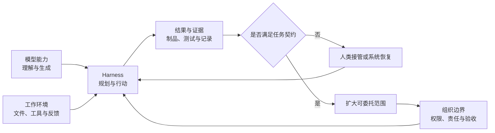

> 系列：[1. 三条赛道](/writing/ai-agent-landscape-2026/)｜[2. 比较方法](/writing/agent-landscape-comparison-methods/)｜[3. 工程产品](/writing/coding-agent-harness-showdown/)｜[4. 开源路线](/writing/open-source-agent-harness-routes/)｜[5. 工程验证](/writing/coding-agent-harness-poc/)｜[6. 办公产品](/writing/china-work-agent-showdown/)｜[7. 组织落地](/writing/china-work-agent-adoption/)｜[8. 整体思考](/writing/agent-work-system-synthesis/)

前七篇从三条赛道出发，依次比较了评价方法、工程产品、开源路线、PoC 和办公落地。现在可以把厂商名字暂时放下，重新追问：当我们选择一个 Agent，究竟选择了什么？

## 把一款 Agent 重新拆成四层

在界面上，我们看到的是一个输入框；在执行中，真正协作的是四个系统：

*图 1｜Agent 不是单向生成器，而是一个由证据校准授权范围的工作闭环。*

这张图解释了为什么同一个模型进入不同 Harness 后表现不同，也解释了为什么公开基准领先的模型进入企业流程后仍可能频繁需要人类救场。产品交付的不是孤立能力，而是一整套约束关系。

## 功能不是最稳定的比较单位

功能会被迅速复制，模型排名也会变化。今天独有的多 Agent、记忆或浏览器操作，明天可能成为标准配置。更稳定的差异是系统如何回答四个问题：上下文从哪里来，行动可以走多远，完成由什么证明，失败之后如何恢复。

这也是为什么前文没有给所有产品压成一张总分表。研究报告、代码修改、企业审批和多模态创作拥有不同的完成条件。用同一组权重评价它们，得到的不是客观，而是把自己的任务偏好藏进了数字。

真正可迁移的比较单位应是“任务契约”：输入材料是什么，允许哪些行动，必须留下哪些证据，何时必须交还给人。产品变了，契约仍能复用；团队也能知道一次改进究竟来自模型、Harness，还是环境集成。

## Agent 选型其实是责任分配

传统软件选型常问功能、价格和集成。Agent 还要多问三件事：谁定义完成，谁批准不可逆动作，谁在证据不足时接管。因为 Agent 不只展示信息，它开始代表人行动。

| 系统选择 | 组织得到什么 | 同时接过什么责任 |
| --- | --- | --- |
| 产品化 Coding Agent | 成熟默认值、代码闭环与审查入口 | 接受平台边界，并管理账号、数据和配额 |
| 开源 Harness | 模型、Loop 与工具的可塑性 | 自建安全基线、版本治理和运行保障 |
| 办公 Agent | 更低门槛的跨文档与多模态执行 | 定义业务验收、数据流与外部发送边界 |
| 自研 Agent 平台 | 与内部系统深度结合 | 长期承担评测、运维和责任追踪 |

如果系统默认自治，却把验证成本全部留给使用者，它只是把操作负担换成监督负担。如果系统层层确认，却没有提供足够证据，确认也只是把责任推回给人。成熟的工作系统应让权限、证据和恢复能力一起增长。

## 开源与商业产品，不是一条成熟度直线

商业产品通常把更多策略做成默认值，降低首次使用成本；开源 Harness 把更多决策暴露出来，换取可研究性和控制权。两者不是“封闭对开放”的简单对立，而是复杂度由谁吸收。

团队拥有平台工程、安全和评测能力时，可塑性会成为优势：可以替换模型、修改 Loop、接入内部工具，并把失败变成自己的系统知识。缺少这些能力时，同样的自由会变成维护债务。反过来，商业产品节省了装配成本，却可能限制深度定制、数据位置和退出路径。

所以选型之前，不应先问“哪个最强”，而应先盘点：哪些复杂度适合交给供应商，哪些能力必须掌握在自己手里，哪些责任团队能够连续承担两年。这个答案比一次模型榜单更接近真实边界。

## 局部能力更强，系统成本未必更低

Agent 最容易制造的错觉，是把生成速度当成工作速度。并行 Agent 可以在十分钟内产出五份变更，也可能让人花两个小时消除冲突；一个报告可以一次生成，也可能需要逐条核验来源。只测执行时间，会把审查、恢复和返工藏起来。

因此，总成本至少要同时包含四项：机器执行成本、人工监督时间、失败恢复成本，以及为了让系统长期可用而承担的治理成本。前文 PoC 中的“一次完成率、人工接管次数、权限例外和恢复时间”，本质上都在测量这些隐藏部分。

真正值得追踪的北极星指标不是下一次发布增加多少功能，而是：**人类把一项工作交出去之后，需要回来救场几次；每次救场时，系统又留下了多少可用于修正的证据。**

## 从一次采购，变成持续校准

选型不应以静态排行榜结束。团队应维护一组来自真实工作的任务样本和失败分类，持续记录合格完成率、人工接管、验证时间、权限例外、恢复时间和单次总成本。

模型、Harness 或业务流程更新时，不必重新举行一次大型选型，只需重跑受影响的样本。失败样本进入回归集，新的安全边界进入任务契约，稳定通过的低风险任务才逐步扩大授权。这样，采购结论会随证据更新，而不是被一次演示永久冻结。

这也给出了三个比“选择冠军”更可靠的决策原则：

1. **先选任务，再选产品。** 没有完成条件的场景，不值得比较 Agent。
2. **先验证闭环，再扩大自治。** 能行动不等于能交付，能交付一次也不等于可以长期授权。
3. **优先选择可纠正的系统。** 失败不可怕；看不见失败原因、无法接管和无法回归，才是规模化的真正障碍。

## 最后的判断：选择一种能够被修正的工作方式

Claude Code 与 Codex 当前的优势，在于较早把工程行动、隔离、Diff、测试和审查连成闭环；Kimi、WorkBuddy 与豆包工作的机会，在于把中文知识工作、企业协作与多模态入口变成可持续操作的环境；Hermes、Pi 与 DeepSeek Harness 的价值，则是让组织重新决定默认行为和复杂度归属。

它们最终都要接受同一项检验：系统能否说明自己为什么成功、在哪里失败、何时需要人类介入，并让这一次经验改变下一次执行。

所以，Agent 竞争的终点不是聊天框，也不是功能最多的工具箱，而是一套可被验证、接管和持续改进的工作系统。前面所有产品比较最终都服务于这个判断：**选择 Agent，就是选择人、模型与环境如何共同完成工作，也是在选择谁对结果负责。**

---

本文基于截至 2026-09-04 可访问的官方产品页、文档与开源仓库整理。产品变化很快；涉及厂商公布的并发规模、用户量或效率数据时，应视为产品口径，而非跨产品统一基准。

---

上一篇：[组织落地](/writing/china-work-agent-adoption/)。

本系列到此完成。带着“责任如何分配”这个问题回到[第一篇的三条赛道](/writing/ai-agent-landscape-2026/)，现在可以把它们理解为三种不同的责任承载方式，而不只是三类产品。
