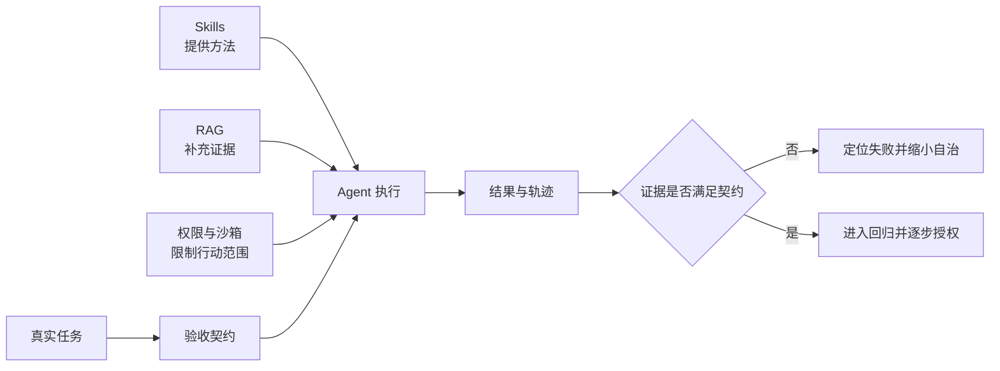

> 系列：[1. 可靠性地图](/writing/ai-agent-reliability-boundaries/)｜[2. 自治落地](/writing/agent-reliability-adoption/)｜[3. Harness 原理](/writing/anthropic-harness/)｜[4. Harness 实践](/writing/anthropic-harness-practice/)｜[5. TRACE 模型](/writing/trace-framework-deep-dive/)｜[6. TRACE 落地](/writing/trace-lite-production/)｜[7. 整体思考](/writing/trustworthy-agent-engineering-synthesis/)

**AI Agent 已经能承担大量实际工作，但能否放心交付，取决于它能否在明确边界内持续做对，并在做错时被发现、被恢复。**

这也是理解 Claude Code、Codex、Kimi、WorkBuddy 的起点。它们通过模型、工具、上下文管理和执行环境扩大了可自动化的范围，但没有消除事实错误、长任务偏航和授权范围内的误操作。

面对这些问题，可以先建立三个判断：

1. **能力增加需要配套管理。** 更多 Skills、更长上下文和更多检索结果，只有在相关、清晰、可验证时才有价值。
2. **产品提供执行基础，业务仍需定义正确。** 工具能帮助 Agent 读资料、改文件、运行程序，却不能自动补齐企业隐含的规则和验收标准。
3. **自动化应随证据逐步扩大。** 优先交付边界清楚、结果可检查、失败可恢复的任务，再根据实际运行记录增加权限和自治范围。

这个系列围绕三个判断展开：先解释瓶颈，再把可靠性写进 Harness，最后用轨迹评测持续验证。本篇先建立高层地图，不急着进入产品和指标细节。

> [!NOTE]
> 产品能力依据 2026 年 9 月 4 日查阅的官方文档整理。文中的产品定位和落地建议属于分析判断，不是四款产品的横向实测排名；历史研究和厂商评测也不能直接换算成当前产品的任务成功率。

*图 1｜Skills、RAG 与权限分别作用于方法、证据和行动边界，可靠性仍由验收闭环完成。*

如果已经明确任务与指标，可以直接进入 [Agent 评测系列](/writing/agent-system-evaluation-research/)设计样本和回归；本系列关注的是这些评测要求如何继续约束 Harness、权限与组织授权。

## 先把可靠性拆成四个问题

一次任务要经过理解目标、获取信息、采取行动和验收结果。为了不让“更可靠”变成一句空话，可以先按失败位置拆成四层；同一个事故可能同时涉及多层。

| 层次 | 核心问题 | 典型失败 | 主要缓解方式 |
| --- | --- | --- | --- |
| 上下文 | 当前决策看到了什么 | 技能选错、约束遗忘 | 按需加载、清晰触发、结构化状态 |
| 证据 | 判断依据是否充分可信 | 检索遗漏、资料过期、口径冲突 | 来源追溯、版本管理、精确查询、信息不足时停止下结论 |
| 执行 | 操作是否达成目标 | 长任务偏航、重复写入、过早宣布完成 | 分阶段验收、状态回读、检查点和失败恢复 |
| 治理 | 行为是否处于可接受边界 | 越权访问、误发送、提示注入、无法追责 | 最小权限、执行隔离、操作审批和审计 |

## Skills 管方法，不替任务背书

Skill 由说明、脚本、模板和参考资料组成。它适合把稳定做法渐进加载给 Agent，却不会自动提高模型能力，也不会证明结果正确。目录描述过于相似会导致路由错误；正文过长会挤占上下文；稳定操作没有落到脚本与验收，则只是在复用一段建议。

Claude Code 与 Codex 都采用按需加载 Skill 正文的思路。[Claude Code Skills](https://code.claude.com/docs/en/skills)、[Codex Skills](https://learn.chatgpt.com/docs/build-skills) 因此，检查 Skill 时先问三件事：能否被准确发现，是否只加载当前需要的材料，输出有没有独立验收。

## RAG 管证据，不替代完整数据与推理

RAG 改善“找到资料”，但可靠交付还要经过资料充分、正确理解、正确行动和结果验证。检索到几段销售分析，不代表覆盖了全部退款记录；找到两个变量共同变化，也不等于已经证明因果。

《Sufficient Context》区分了“上下文本来不足”和“模型没有用好充分上下文”两类错误。[研究原文](https://arxiv.org/abs/2411.06037) 这提醒我们：RAG 需要来源、版本、权限和充分性判断；精确统计仍应查询完整数据并程序化计算。

## 长任务管反馈，不靠一次性计划

Agent 会完成每个局部步骤，不代表整条流程能够稳定收敛。接口重试可能重复写入，页面变化可能让动作落错位置，测试通过也可能是验收覆盖不全。

长任务更需要阶段状态、外部反馈和恢复点。Anthropic 的实践也记录了过度推进和过早宣布完成等问题，并用增量工作、进度记录和 Git 历史改善交接。[长任务工程实践](https://www.anthropic.com/engineering/effective-harnesses-for-long-running-agents) 工具返回“成功”只是过程证据，最终仍要回读业务状态。

## 权限管影响范围，不证明业务正确

读取客户资料、生成邮件草稿、向全部客户发送邮件，是三种不同授权。一个完整边界至少要回答：Agent 代表谁、能访问什么、能执行什么、运行在哪里、出错后怎样审计和恢复。

Codex 将沙箱与审批分开，Claude Code 也分别提供权限与安全机制。[Codex 权限与安全](https://learn.chatgpt.com/docs/agent-approvals-security)、[Claude Code 安全](https://code.claude.com/docs/en/security) 它们能限制技术影响面，却不能保证授权范围内的金额、对象和业务判断正确。提示注入还要求系统把外部内容当数据处理，不能让同一个模型独自承担识别、阻止和验收全部责任。

## 用同一个问题检查所有机制

面对任何可靠性功能，都问：**它改变的是方法、证据、执行反馈，还是影响范围？剩下的完成条件由谁验证？** 这样，Skills、RAG、长任务机制和权限就不会被误写成四个彼此替代的“可靠性开关”。

---

四类机制的边界已经明确，但技术清单还不能直接变成业务授权。下一篇把问题放回真实产品与验收流程，看自治范围怎样随证据增长。

下一篇：[自治落地](/writing/agent-reliability-adoption/)。
