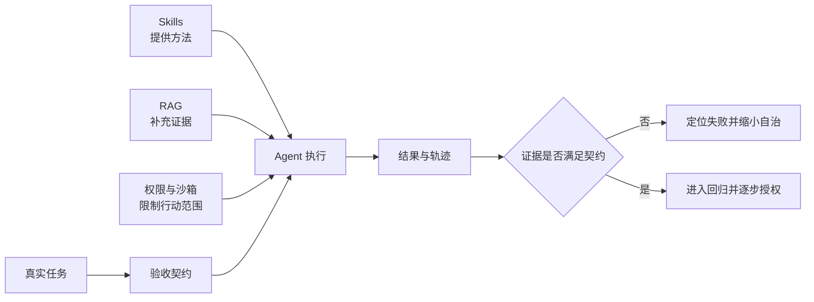

**AI Agent 已经能承担大量实际工作，但能否放心交付，取决于它能否在明确边界内持续做对，并在做错时被发现、被恢复。**

这也是理解 Claude Code、Codex、Kimi、WorkBuddy 的起点。它们通过模型、工具、上下文管理和执行环境扩大了可自动化的范围，但没有消除事实错误、长任务偏航和授权范围内的误操作。

面对这些问题，可以先建立三个判断：

1. **能力增加需要配套管理。** 更多 Skills、更长上下文和更多检索结果，只有在相关、清晰、可验证时才有价值。
2. **产品提供执行基础，业务仍需定义正确。** 工具能帮助 Agent 读资料、改文件、运行程序，却不能自动补齐企业隐含的规则和验收标准。
3. **自动化应随证据逐步扩大。** 优先交付边界清楚、结果可检查、失败可恢复的任务，再根据实际运行记录增加权限和自治范围。

本文先区分能力瓶颈，再把可靠性要求落实到任务、权限和验收，最后讨论扩大自动化范围的条件。

> [!NOTE]
> 产品能力依据 2026 年 9 月 4 日查阅的官方文档整理。文中的产品定位和落地建议属于分析判断，不是四款产品的横向实测排名；历史研究和厂商评测也不能直接换算成当前产品的任务成功率。

*图 1｜Skills、RAG 与权限分别作用于方法、证据和行动边界，可靠性仍由验收闭环完成。*

如果已经明确任务与指标，可以直接进入 [评测体系设计](/writing/agent-system-evaluation-research/)设计样本和回归；本文关注的是这些评测要求如何继续约束 Harness、权限与组织授权。

## 先把可靠性拆成四个问题

一次任务要经过理解目标、获取信息、采取行动和验收结果。为了不让“更可靠”变成一句空话，可以先按失败位置拆成四层；同一个事故可能同时涉及多层。

| 层次 | 核心问题 | 典型失败 | 主要缓解方式 |
| --- | --- | --- | --- |
| 上下文 | 当前决策看到了什么 | 技能选错、约束遗忘 | 按需加载、清晰触发、结构化状态 |
| 证据 | 判断依据是否充分可信 | 检索遗漏、资料过期、口径冲突 | 来源追溯、版本管理、精确查询、信息不足时停止下结论 |
| 执行 | 操作是否达成目标 | 长任务偏航、重复写入、过早宣布完成 | 分阶段验收、状态回读、检查点和失败恢复 |
| 治理 | 行为是否处于可接受边界 | 越权访问、误发送、提示注入、无法追责 | 最小权限、执行隔离、操作审批和审计 |

## Skills 管方法，不替任务背书

Skill 由说明、脚本、模板和参考资料组成。它适合把稳定做法渐进加载给 Agent，却不会自动提高模型能力，也不会证明结果正确。目录描述过于相似会导致路由错误；正文过长会挤占上下文；稳定操作没有落到脚本与验收，则只是在复用一段建议。

Claude Code 与 Codex 都采用按需加载 Skill 正文的思路。[Claude Code Skills](https://code.claude.com/docs/en/skills)、[Codex Skills](https://learn.chatgpt.com/docs/build-skills) 因此，检查 Skill 时先问三件事：能否被准确发现，是否只加载当前需要的材料，输出有没有独立验收。

## RAG 管证据，不替代完整数据与推理

RAG 改善“找到资料”，但可靠交付还要经过资料充分、正确理解、正确行动和结果验证。检索到几段销售分析，不代表覆盖了全部退款记录；找到两个变量共同变化，也不等于已经证明因果。

《Sufficient Context》区分了“上下文本来不足”和“模型没有用好充分上下文”两类错误。[研究原文](https://arxiv.org/abs/2411.06037) 这提醒我们：RAG 需要来源、版本、权限和充分性判断；精确统计仍应查询完整数据并程序化计算。

## 长任务管反馈，不靠一次性计划

Agent 会完成每个局部步骤，不代表整条流程能够稳定收敛。接口重试可能重复写入，页面变化可能让动作落错位置，测试通过也可能是验收覆盖不全。

长任务更需要阶段状态、外部反馈和恢复点。Anthropic 的实践也记录了过度推进和过早宣布完成等问题，并用增量工作、进度记录和 Git 历史改善交接。[长任务工程实践](https://www.anthropic.com/engineering/effective-harnesses-for-long-running-agents) 工具返回“成功”只是过程证据，最终仍要回读业务状态。

## 权限管影响范围，不证明业务正确

读取客户资料、生成邮件草稿、向全部客户发送邮件，是三种不同授权。一个完整边界至少要回答：Agent 代表谁、能访问什么、能执行什么、运行在哪里、出错后怎样审计和恢复。

Codex 将沙箱与审批分开，Claude Code 也分别提供权限与安全机制。[Codex 权限与安全](https://learn.chatgpt.com/docs/agent-approvals-security)、[Claude Code 安全](https://code.claude.com/docs/en/security) 它们能限制技术影响面，却不能保证授权范围内的金额、对象和业务判断正确。提示注入还要求系统把外部内容当数据处理，不能让同一个模型独自承担识别、阻止和验收全部责任。

## 用同一个问题检查所有机制

面对任何可靠性功能，都问：**它改变的是方法、证据、执行反馈，还是影响范围？剩下的完成条件由谁验证？** 这样，Skills、RAG、长任务机制和权限就不会被误写成四个彼此替代的“可靠性开关”。

## 可靠落地应从验收出发，再逐步扩大自治范围

如果一开始就把目标设成“全自动完成整个岗位”，系统很难知道哪里算成功，也难以判断下一步应该改模型、工具还是流程。

更有效的路径是：把工作拆成可验收的任务，建立基线，定位失败，再逐步扩大自动化范围。

### 1. 先写清交付条件，再让 Agent 制订计划

“做一份经营报告”不是充分的任务定义。至少还应明确统计时间、数据源、指标口径、输出要求和遇到异常时的处理方式。

以周报为例，可以定义下面的工作链路：

| 阶段 | Agent 可以承担的工作 | 验收证据 |
| --- | --- | --- |
| 收集 | 读取指定来源和时间范围的数据 | 来源清单、更新时间、记录数量 |
| 清洗 | 处理重复项、缺失值和格式 | 异常清单、处理规则、前后数量 |
| 计算 | 按固定定义计算指标 | 可复算代码、对账结果 |
| 分析 | 解释变化，提出待验证原因 | 事实与假设分开，结论对应证据 |
| 制作 | 生成文档、图表或演示材料 | 文件可打开，内容与统计一致 |
| 发布 | 按授权交付或发送 | 发布对象、版本和操作记录 |

每个阶段都留下证据，后续失败就可以从最近的有效状态恢复。人也不必重新检查所有原始材料，能够把注意力放在异常与关键判断上。

### 2. 用对照实验判断 Skills 是否真的造成退化

“最近感觉变笨了”可能来自技能变化，也可能来自模型版本、输入长度、工具故障或任务难度变化。诊断时应尽量固定其他条件。

可以在同一批代表性任务上比较三种配置：

| 配置 | 设置 | 主要观察什么 |
| --- | --- | --- |
| A：相关技能集 | 只提供任务需要的技能 | 精简配置的表现基线 |
| B：完整技能集 | 提供全部技能，允许自动选择 | 目录扩大会不会造成误选或漏选 |
| C：完整技能集，指定技能 | 保留完整目录，显式指定相关技能 | 减少自动选择后能否恢复表现 |

各组应固定模型版本、任务输入、工具权限、运行环境和资源预算，并进行多次重复运行。初期可以先选少量真实任务定位问题；要估计总体成功率，需要足够且有代表性的样本，并报告不确定性。

如果 B 比 A 差、C 又有所恢复，路由可能是重要因素，但不能仅凭这个对照就证明全部原因。如果 A 与 C 都表现不佳，应继续检查技能正文、证据充分性和工具执行。若要专门测量上下文负担，还需要另设正文加载量的对照。

评估时至少记录：

- **验收通过率：**满足事先约定标准的任务占比。
- **遗漏率：**应完成的要求中，有多少未完成。
- **人工接管率：**有多少任务需要人介入才能继续。
- **副作用：**是否出现误写、重复操作或越权尝试。
- **交付成本：**耗时、调用费用、审核和返工时间。

“Agent 说已完成”只能算一个状态信号，不能直接计入验收成功。

### 3. 将失败映射到负责的机制

选错能力，检查[能力路由](/writing/capability-routing-evaluation/)；遗漏必要资料，检查[上下文装配](/writing/harness-operations-context/)；重复写入，检查[稳定操作与恢复](/writing/harness-engineering-recovery/)；结果无法判定，补充[独立评委](/writing/agent-evaluation-datasets/)。

只有确认哪类失败需要解决，才决定增加 Skill、记忆或多个 Agent。它们各自需要任务对照与成本记录。

### 4. 让自治范围随验证结果增长

对边界清楚、低风险、可恢复的任务，可以给 Agent 较大的自主空间，例如按固定规则转换文件、计算指标，或完成有明确验收条件的代码修改。

对需要解释证据、处理例外和跨系统协调的工作，更适合让 Agent 生成方案、执行授权部分，并把不确定处交给人判断。

对目标模糊、缺少可靠数据、结果难验证，同时又有高代价或不可逆后果的任务，目前不宜默认无人监督。这里需要的是更清楚的业务边界、更可靠的执行机制和更充分的运行证据。

采用 Agent 时，可以先从一条真实工作流开始：写下交付标准，授权必要工具，让它运行，检查结果，记录失败。下一次改进应能回答一个具体问题——减少了哪一种失败，节省了多少人工成本，是否引入了新的副作用。
