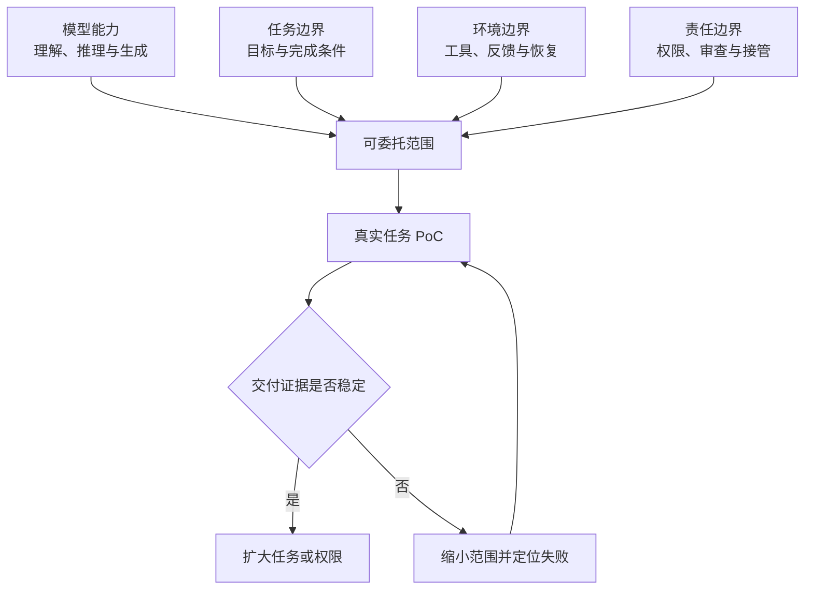

> 系列：[1. 能力地图](/writing/llm-agent-capability-landscape-2026/)｜[2. 证据与行动](/writing/ai-capability-evidence-action/)｜[3. 整体思考](/writing/ai-capability-boundary-synthesis/)

前两篇先区分“能完成一次”与“能够交付”，再把公开评测、模型差异和真实任务放到同一张决策表。最后需要回答的不是哪款模型是冠军，而是：**今天有哪些工作值得委托，委托到什么程度，又由什么证据决定下一步？**

## 能力地图不是功能库存

一张功能表会随着模型发布迅速过期。能力地图更应该描述任务结构：目标是否清楚，环境反馈是否及时，结果是否可验证，错误是否可撤回。模型名字变化后，这四个问题仍然有效。

例如，“能够生成代码”只是功能描述；“能在给定仓库中修改一个模块，通过指定测试，并以 Diff 供人审查”才是可委托任务。后者同时限定了环境、证据与责任，因此可以进入真实工作。

这也是公开基准的正确位置。它们帮助识别模型可能擅长的能力，却不能替团队完成最后一公里的任务定义。基准应该缩小候选范围，真实样本才决定生产选择。

## 三条边界共同决定可委托范围

*图 1｜模型能力只是可委托范围的一部分，任务、环境和责任边界共同决定它能否进入生产。*

模型能力回答“理论上可能做到什么”；任务边界回答“什么算完成”；环境边界回答“系统如何获得事实并发现错误”；责任边界回答“谁允许行动、谁验收、谁在失败时接管”。缺少其中任何一条，委托都会退化成一次没有明确责任的尝试。

## 更便宜的模型会改变系统，而不只是账单

当推理成本下降，团队可能增加候选方案、重复运行与自动验证。便宜模型不一定直接替代强模型，却可以承担分类、提取、预检查和失败诊断，让强模型只处理高不确定决策。

因此，模型价格不能脱离 Harness 观察。一次调用更便宜但需要更多重试和人工复核，总成本可能更高；单次价格更高但能稳定使用工具、减少接管，也可能降低交付成本。真正应该比较的是一项合格任务的完整成本，而不是百万 Token 的孤立价格。

这与 [AI 产品价值系列](/writing/ai-capability-product-metrics/)的结论一致：能力进步只有穿过验证、审核与下游交付，才会变成用户价值。

## 模型选择本质上是一种动态路由

团队没有必要为所有任务选择同一个模型。不同任务可以按风险、复杂度、延迟和材料类型路由：低风险批处理使用便宜模型，高不确定规划使用强模型，敏感数据进入受控部署，需要浏览或代码执行的任务再选择相应 Harness。

但动态路由不意味着每次追逐最新榜单。更稳定的做法是维护一小组代表性任务，记录合格完成率、成本、P95 延迟、人工接管与失败类型。新模型进入时先跑这组样本，只有在某类任务上提供清晰增益，才修改默认路由。

模型选择因此从一次采购变成持续校准。更完整的路由、执行和评测方法，可继续阅读 [万级能力路由系列](/writing/capability-routing-at-scale/)与 [Agent 评测系列](/writing/agent-system-evaluation-research/)。

## 最后的判断：能力增长应该兑换为有证据的委托

AI 能力会继续快速增长，但组织不应在“完全不信任”和“全部自动化”之间跳跃。更合理的路径是先委托目标清楚、结果可查、失败可恢复的任务，再依据运行证据增加任务长度、工具范围和行动权限。

能力地图最终不是告诉我们 AI 有多强，而是帮助我们把能力转换成一组有边界的承诺：这项工作可以交给它，那项工作只能让它辅助；这里可以自动执行，那里必须由人批准；这些结果已经有足够证据，另一些仍然需要核验。

所以，“AI 到底能做什么”的长期答案不会是一张固定清单，而是一套持续更新的委托关系。能力提升提供新的可能，任务契约、环境反馈和责任边界决定这些可能何时成为真实交付。

---

上一篇：[证据与行动](/writing/ai-capability-evidence-action/)。

本系列到此完成。带着“什么值得委托”回到[第一篇的能力地图](/writing/llm-agent-capability-landscape-2026/)，模型排名会退到合适的位置：它是候选证据，而不是最终答案。
