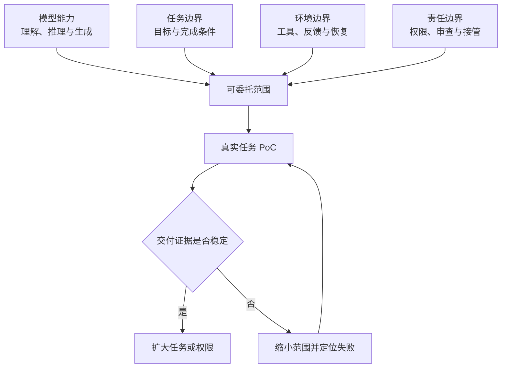

知道模型擅长什么，只完成了静态判断。真正的产品和采购决策，还要把任务成功率、人工审查、速度与价格放回同一个交付过程。

## 下一阶段看什么：少看“能做”，多看“交付是否划算”

从上述证据，我更看好三个方向。**以下是技术与产品推断，不是已经证实的市场规模、收益或岗位替代预测。**

**第一，AI 会更善于检查和恢复，而不只是生成。** 检查器，也叫 verifier，是用测试、数据对账等方式确认工作是否完成的机制。任务状态的保存与恢复，则让 AI 出错后能从合适的位置继续。判断进步时，应看它是否减少返工、是否更早发现错误，而不只看一次演示是否漂亮。

**第二，系统会按任务调配模型，而非始终使用最贵档位。** 这种按难度选择模型的方式叫“模型路由”。它的价值需要用总账验证：调用费用降低了多少，额外判断、切换和人工纠错又花掉多少。多模型协作是一个选项，不是天然优于单模型。

**第三，客户会更关心合格结果的成本。** Token 是模型处理文字等内容的计量单位，不是工作成果。即使单价不变或降低，如果模型思考更久、重试更多，完成任务也可能更贵。Gemini 3.8 Flash 的独立评测就记录了单价不变、每题费用上升的情况。[成本分析](https://artificialanalysis.ai/articles/gemini-3-8-flash)

这三个方向能否成为持续的商业价值，要看实际使用中的人工返工、稳定复用和付费意愿。**本篇的公开评测不足以证明企业已经普遍获得回报，更不足以推出某个岗位何时消失。**

更值得观察的临界点是：在某类任务上，AI 能否持续达到约定的验收标准，并让包含人工复核在内的总成本下降。

## 现在怎样行动：用一小组真实任务代替一次演示

不必先学完所有评测。先选一组自己最近做过、能够判断对错的任务，让候选系统在相同资料和权限下完成，再回答三个问题：

1. **做对了吗？** 不只看成品是否好看，要查关键事实、计算和操作记录。
2. **多做几次还可靠吗？** 记录哪些任务稳定成功，哪些任务偶尔成功，哪些总要人接管。
3. **算上复核，真的更省吗？** 把等待、失败重试、人工检查与修正一起计入。

例如，一份报表的验收条件应是“数据与原表一致、公式可复算、异常值有说明”，而不只是“生成了一个文件”。先让 AI 做只读分析和未发布草稿；确认效果之后，再开放范围有限、可撤销的操作。

**最终判断只有一句：AI 可以先接走可验收的任务；是否交出更大的责任，要由它在你的工作中积累的证据决定。**

---

## 证据与评测：需要时再展开

以下八类评测用于支持前面的判断，不要求逐项记忆。它们考不同的能力，不能平均成“AI 总分”。

> **修订说明（2026-09-04）**：本版替换了 Senior SWE-Bench 的过时镜像数据，撤回跨模型、跨任务集的成功率跌幅解释，并修正了任务成功率与步骤成功率混用的问题。原有榜单细节改为按需展开；模型画像补充至 9 月 3 日发布的评测。榜单页面会继续变化，文中结果均应连同日期与运行条件阅读。

## 三条边界共同决定可委托范围

*图 1｜模型能力只是可委托范围的一部分，任务、环境和责任边界共同决定它能否进入生产。*

模型能力回答“理论上可能做到什么”；任务边界回答“什么算完成”；环境边界回答“系统如何获得事实并发现错误”；责任边界回答“谁允许行动、谁验收、谁在失败时接管”。缺少其中任何一条，委托都会退化成一次没有明确责任的尝试。

## 模型选择本质上是一种动态路由

团队没有必要为所有任务选择同一个模型。不同任务可以按风险、复杂度、延迟和材料类型路由：低风险批处理使用便宜模型，高不确定规划使用强模型，敏感数据进入受控部署，需要浏览或代码执行的任务再选择相应 Harness。

但动态路由不意味着每次追逐最新榜单。更稳定的做法是维护一小组代表性任务，记录合格完成率、成本、P95 延迟、人工接管与失败类型。新模型进入时先跑这组样本，只有在某类任务上提供清晰增益，才修改默认路由。

模型选择因此从一次采购变成持续校准。更完整的路由、执行和评测方法，可继续阅读 [万级能力路由](/writing/capability-routing-at-scale/)与 [评测体系设计](/writing/agent-system-evaluation-research/)。

八类评测分别测什么？有哪些关键限制？

| 评测 | 用普通话解释 | 读分数时要注意 |
|---|---|---|
| [LiveCodeBench](https://livecodebench.github.io/) | 用持续收集的新编程题测代码生成、修正与推理 | 要标明题目时间范围；算法题成绩不等于真实项目维护能力 |
| [SWE-bench Verified](https://www.swebench.com/index.html) | 修复真实 Python 项目里的一个问题 | 500 个经人工筛选的任务；默认 Bash Only 视图固定执行环境，不要与任意自定义系统混排 |
| [SWE-bench Pro](https://labs.scale.com/papers/swe_bench_pro) | 处理更复杂、涉及更多文件的软件任务 | 包含公开、留出和商业私有部分；公开榜不代表私有部分，原始论文成绩也不是当前上限 |
| [SWE-EVO](https://arxiv.org/abs/2512.18470) | 按版本更新要求持续修改一个项目 | v6 论文只有 48 个任务；用于观察长程困难，不用于给所有软件工作定级 |
| [Senior SWE-Bench](https://senior-swe-bench.snorkel.ai/blog/2026-07-30-refresh) | 不只把功能做出来，还要符合项目质量标准 | 7 月更新采用多次运行与模型评委组合，默认计分排除 5 个任务；不能与 6 月旧榜直接计算进步幅度 |
| [Terminal-Bench 2.0／2.1](https://www.tbench.ai/news/terminal-bench-2-1) | 在命令行中操作软件、处理数据、生成可检查的结果 | 2.1 修订了 89 题中的 28 题；后续 [4.0](https://www.tbench.ai/news/terminal-bench-4-0) 也更改任务与资源，必须重新运行，不能跨版本混比 |
| [τ-bench](https://taubench.com/) | 一边和用户沟通，一边查询资料、按规则操作系统 | 不同版本和业务领域要分开；本文 55.2% 来自 τ³ Banking 官方页，不是所有业务的平均值 |
| [GAIA](https://gaia-benchmark-leaderboard.hf.space/) | 搜索、阅读文件并用工具解决多步骤问题 | 公开测试榜展示最佳一次运行；高分属于指定系统和任务集，不代表所有通用助手工作的可靠性 |

**两个容易误读的数字。** SWE-EVO v6 报告 GPT-5.4 + OpenHands 为 25%，同时引用 GPT-5.2 在 Verified 的 72.8%。模型与考题不同，不能把差值解释为同一系统进入长任务后的能力损失。[论文](https://arxiv.org/abs/2512.18470)

GAIA 测试榜的领先分数达到 93.36%，对应具体的工具与模型组合，而且榜单采用最佳一次运行。这说明在那套任务上的高水平系统表现已经出现；没有单模型与多模型的受控实验，不能把高分全部归因于多模型协作，也不能外推成通用办公成功率。[官方榜说明](https://gaia-benchmark-leaderboard.hf.space/)

想进一步选型：怎样区分“偶尔成功”和“稳定成功”？

**单次成功率（pass@1）**：每项任务尝试一次，平均有多少能够完成。

**至少成功一次（pass@3）**：同一任务给三次机会，至少一次完成。它更接近“多试几次，能不能做出来”。

**三次全部成功（pass^3）**：同一任务运行三次，三次都完成。它更接近“重复交给它，是否稳定”。后二者不是同一个指标。[τ-bench 论文](https://arxiv.org/abs/2406.12045)、[Senior SWE-Bench 指标说明](https://senior-swe-bench.snorkel.ai/blog/2026-07-30-refresh)

平均单次成功率不能直接连乘，算出多次或多步骤成功率。比如，假设 90% 的任务始终成功，10% 始终失败，那么三次全部成功的比例仍是 90%。真实系统还会检查、重试与恢复，应直接测量完整流程，而非用简化公式代替实验。

团队需要更严谨的比较时，再拆成五层：

| 层次 | 核心问题 |
|---|---|
| 模型 | 同样的工具和预算，换模型有多大变化？ |
| 执行框架 | 同样的模型，换任务拆分、工具或检查方式有多大变化？ |
| 运行环境 | 失败是模型不会，还是网络、资源或超时造成的？ |
| 考题与验收 | 任务说明是否充分，测试是否漏检或误判？ |
| 真实工作 | 算上人工复核和失败损失，质量、时间与成本是否改善？ |

“每个合格结果的成本”应包括失败任务的费用和人工返工；本文引用的评测机构“平均每题成本”不是这个指标，也不是企业上线后的完整成本。更详细的设计见[《Agent 体系评测深度研究报告》](/writing/agent-system-evaluation-research/)。

