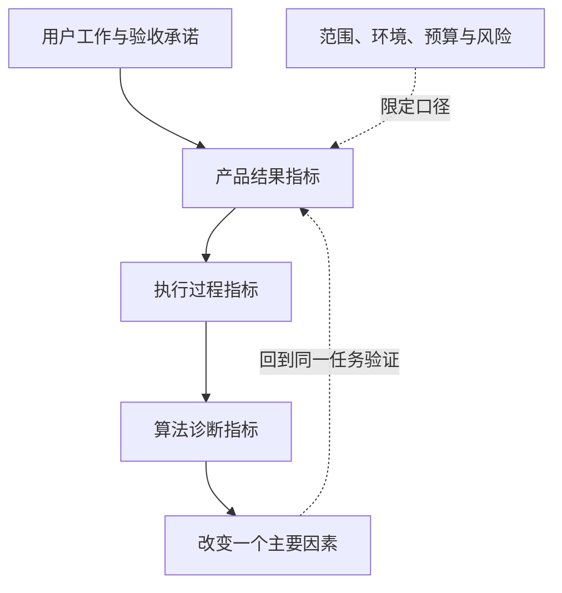

> AI 产品价值系列：[1 · 统一框架](/writing/ai-capability-product-metrics/) · [2 · 编程实战](/writing/ai-value-coding/) · [3 · 终端实战](/writing/ai-value-voice/) · [4 · 办公实战](/writing/ai-value-office/) · [5 · 深入思考](/writing/ai-value-synthesis/)

> 阅读时间为估计，包含图表理解；动手实验另计。

> 本系列是作者提出的产品验收方法，不是厂商内部 KPI 或统一实测排名。案例数据均为假设；已有产品能力以链接的官方文档及具体版本为准。

一个模型能识字、听懂声音、生成代码，也能调用工具。这些能力组合起来，不等于一个能稳定交付结果的产品。

编程助手需要交付可验证变更，终端助手需要改变正确设备的状态，办公助手需要生成来源可靠、能够继续使用的成果。三者使用的算法可以不同，但都必须回答：在约定时间、费用和人工投入内，是否完成了用户的工作？

本系列先搭统一框架，再分别走通编程、终端和办公三个案例，最后讨论：**局部能力变强，为什么未必让每个合格交付更便宜？**

## 一张图先看清指标之间的关系

*图 1｜由产品结果定位算法问题，再返回任务验收。矩形表示模块或步骤，圆柱表示存储，菱形表示判断；实线表示主路径，虚线表示约束、信息支撑或反馈。图为教学抽象，不代表全部实现细节。*

从上往下定位问题，从下往上验证改进。算法指标不能跳过工作流，直接宣称产品更有价值。

## 分类要分层，指标才有明确的归属

### 领域、任务、模型与系统回答不同问题

“我们需要 CV、OCR，还是大模型？”是一个常见但不完整的问题。CV 描述处理视觉信息的领域，OCR 描述识别文字的任务，而大模型描述一种模型形态。它们完全可能出现在同一条业务链上。

| 分类维度 | 它回答的问题 | 代表概念 |
| --- | --- | --- |
| 数据与领域 | 处理什么信息？ | 计算机视觉 CV、语音与音频、自然语言 NLP、结构化数据、图数据、多模态 |
| 任务与能力 | 需要完成什么变换？ | OCR、ASR、TTS、意图识别、实体抽取、检索、生成、预测、规划 |
| 模型与技术路线 | 用什么机制实现？ | 规则、传统机器学习、CNN、Transformer、扩散模型、基础模型 |
| 系统与产品 | 如何组织能力完成工作？ | RAG 系统、编程 Agent、语音助手、办公 Agent、机器人 |

几个容易混淆的概念，可以进一步拆开：

- **OCR** 把图像中的文字转为机器可处理的文本；完整文档理解还涉及版面、表格、阅读顺序与语义。
- **ASR** 把语音转为文字；**TTS** 把文字转为语音。语音交互还需要唤醒、端点检测、打断处理与设备执行。
- **NLU** 是语言理解，包括意图识别、实体抽取、语义匹配等任务。
- **LLM** 是大语言模型，可以承担多种理解、生成与推理任务；它不等于完整的业务系统。
- **VLM** 联合理解视觉和语言。传统视觉算法、深度视觉模型、视觉基础模型与 VLM 应分别描述，“传统视觉大模型”容易掩盖它们的区别。
- **Agent** 组织模型、上下文、工具、执行状态与验证机制，把单次模型输出变成持续的任务执行。

因此，同一个“票据录入”任务，可以采用专门的 OCR 加规则，也可以采用文档模型或 VLM。产品验收仍然是同一件事：金额、日期、主体和行项目是否被正确写进目标系统。

### 产品评测按能力模块组织，算法研究按技术路线细分

完整的 AI 版图还包括推荐与搜索、时间序列预测、异常检测、图学习、强化学习、运筹优化、具身智能和科学智能。它们适用的任务不同，不应硬套同一个“准确率”。

| 能力类别 | 基础诊断指标示例 | 在产品中进一步要验证的结果 |
| --- | --- | --- |
| 视觉分类、检测、分割 | Precision、Recall、mAP、IoU | 目标是否被正确识别，后续业务判断是否成立 |
| OCR 与文档理解 | 字错误率、字段匹配率、表格结构正确率 | 关键字段及其归属是否正确录入 |
| 语音与音频 | CER／WER、误唤醒率、听感评分 | 指令是否被正确执行，对话是否顺畅 |
| 语言理解与信息抽取 | 意图 F1、实体 F1、语义匹配准确率 | 需求、对象和参数是否理解正确 |
| 检索与知识问答 | Recall@K、排序质量、证据支持率 | 是否找到足以回答问题的可靠材料 |
| 语言、代码与多模态生成 | 测试通过率、约束满足率、人工质量评分 | 输出是否可以按约定标准交付 |
| 推荐与排序 | 排序指标、点击或转化相关指标 | 是否改善用户任务与长期体验 |
| 预测与异常检测 | MAE、WAPE、Precision／Recall | 预测或告警是否改善实际决策 |
| 规划、控制与 Agent 执行 | 动作正确率、轨迹成功率、恢复率 | 最终目标状态是否达成 |

这些指标是诊断入口，不是通用总分。例如，推荐系统的点击率可能受标题吸引力影响；异常检测的准确率可能被大量正常样本抬高；文档全文识字率很高，也可能恰好识错最重要的金额。

**算法选择可以改变，产品验收对象应当保持稳定。** 只有这样，才能公平比较传统方法、专用小模型和大模型。

## 三层指标如何共同支持决策

| 指标层级 | 核心问题 | 代表指标 | 对应决策 |
| --- | --- | --- | --- |
| 顶层：产品结果 | 用户的事情是否办成，代价是否可接受？ | 验收通过率、人工投入、单位成功任务成本、交付后缺陷 | 是否采用、是否扩大使用范围 |
| 中层：执行过程 | 工作在哪一步失败或消耗最多？ | 工具动作正确率、恢复成功率、重试次数、分阶段时延 | 改工作流、工具、上下文或交互 |
| 底层：算法能力 | 具体哪个能力不足？ | CER／WER、字段匹配率、召回率、意图 F1、代码测试表现 | 改模型、数据、提示或算法 |

指标的使用顺序是从上往下，优化验证则要再从下往上。即使 ASR 的 CER 下降了，也要重新检查任务成功率是否改善；即使工具调用错误减少了，也要确认人工返工时间是否下降。

当一项能力承担多个业务任务时，不能凭总体成绩反推单一模型好坏。最终结果还受输入质量、工具权限、网络、执行环境与验收覆盖影响。

## 本系列的实战交付

| 场景 | 固定案例 | 应拿到的验收产物 |
|---|---|---|
| 编程 | 修复登录超时 | 独立复现、回归检查、Diff 与审查记录 |
| 终端 | 把明天七点闹钟改为七点半 | 操作前后状态、语音过程与异常样本 |
| 办公 | 三份销售表生成月报 | 独立复算、引用映射与成品检查 |
| 整体 | 比较两种交付方案 | 成功率、总费用、人工投入与适用范围 |

这里的框架是一套工作方法，不要求使用某一个模型或平台。先把完成证据定义稳定，后续换算法、换工具或换产品才有可比性。

---

分类和指标层级已经清楚。下一篇先从证据最具体的编程任务开始：代码通过测试，怎样才算真正交付？

下一篇：[测试通过之后，还需要哪些交付证据](/writing/ai-value-coding/)。
