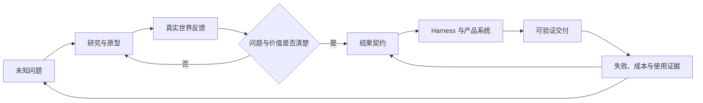

> 系列：[1. 工作系统](/writing/product-work-methodology/)｜[2. 结果契约](/writing/agent-product-contracts-context/)｜[3. 产品节奏](/writing/agent-product-evaluation-rhythm/)｜[4. 组织未知](/writing/lu-qi-researcher-founder/)｜[5. 思维与行动](/writing/researcher-founder-thinking/)｜[6. 学习边界](/writing/learning-organization-boundaries/)｜[7. 整体思考](/writing/ai-product-work-synthesis/)

这个系列看似有两条线：前三篇讨论 Agent 产品怎样从功能走向结果契约，后三篇讨论 Researcher Founder 怎样组织未知。它们最终会合在同一个问题上：当技术、需求和竞争都在快速变化，产品团队如何比变化本身学得更快？

## 产品工作同时面对已知与未知

面对已知问题，团队可以写出目标、边界和验收方式，通过 Harness 把模型能力组织成稳定交付。面对未知问题，用户、场景甚至技术路径都还不清楚，团队必须通过研究、原型与真实反馈不断修改问题本身。

两类工作不能混为一谈。把探索任务写成确定性路线图，会制造虚假承诺；把已知交付长期当作实验，又会逃避质量和责任。AI 时代的产品经理需要判断当前处于哪一种状态，并让工作在证据足够时从探索转向交付。

*图 1｜产品组织需要同时运行探索循环与交付循环，并让真实证据决定问题何时进入稳定系统。*

Researcher Founder 强调从 -1 到 0 的可能性发现，Agent 产品方法强调从 0 到 1 的交付闭环。前者扩大问题空间，后者收敛责任边界；真正有竞争力的组织需要让两条循环持续连接。

## 结果契约不是更重的需求文档

传统需求常描述界面、流程和功能。结果契约则说明用户要完成什么、系统可以怎样行动、结果由什么证明、风险动作由谁批准、失败后怎样恢复。它并不要求产品经理提前规定 Agent 的每一步，而是定义不能丢失的责任。

这让产品、工程、评测和运营拥有共同语言。工程知道哪些环境反馈必须接入，评测知道什么算通过，运营知道何时需要接管，用户也知道系统承诺的是草稿、建议还是可直接使用的结果。

在不确定系统里，这种契约反而比详细流程更轻。流程可以随模型和工具变化，完成条件与禁止线保持稳定；团队不必在每次模型升级后重写整套产品逻辑。

## 产品经理开始设计反馈质量

Agent 能够更快地产生方案、代码和内容，但产出速度不是学习速度。只有当结果接触真实环境、获得可解释反馈，并修改下一轮任务和系统，组织才真正学到东西。

因此，产品工作的新对象包括三种反馈：

- **环境反馈**：测试、数据、工具返回和下游系统是否接受结果；
- **用户反馈**：结果是否减少了真实工作，而不是只让演示更流畅；
- **组织反馈**：失败是否进入样本、规则和优先级，还是每次靠人临时救场。

过程可见也因此不是装饰。用户需要知道系统在做什么，团队更需要知道为什么失败。没有轨迹、证据和接管原因，失败只能成为抱怨，无法成为可复用知识。

## 组织壁垒可能来自更短的可信反馈周期

当模型和基础能力快速扩散，单次功能领先很难长期维持。组织更稳定的优势，是能否更快找到重要问题、更早接触真实反馈、更准确地判断结果，并把认识写回产品系统。

这里的“快”不能牺牲证据。未经验证的输出可以缩短生成时间，却会增加审核和返工；盲目追逐新技术可以增加实验数量，却未必提高选题质量。真正的学习速度，是单位时间内形成多少经过现实校准、能够改变下一步决策的认识。

这也是陆奇所说的研究、创新和斜率思维能够与产品方法连接的地方：研究帮助选择值得回答的问题，创新把技术可能性放回真实需求，斜率关注个人与组织能否持续更新能力。三者都依赖高质量反馈，而不是抽象乐观。

## AI 不会让产品判断自动消失

模型可以整理材料、生成原型、分析数据，Agent 可以执行更长流程，但“为谁解决什么问题”“什么证据足以投入”“哪些风险不能接受”仍然是责任判断。

AI 甚至会放大判断的重要性。生成和执行变便宜后，团队可以同时尝试更多方向；如果没有清晰选择和退出条件，资源会被更快分散。产品经理的稀缺价值不再主要是生产文档，而是维持目标、证据和责任的一致性。

需要具体决策工具时，可以进入 [产品分析框架系列](/writing/product-analysis-frameworks/)；需要把能力映射到交付指标时，可以继续阅读 [AI 产品价值系列](/writing/ai-capability-product-metrics/)。框架和指标都服务于判断，不能替代判断。

## 一套能够持续学习的工作节奏

一个实用的节奏可以很简单：每轮只选择少量真实问题，为它们写出结果契约，快速建立最小闭环；记录成功、失败、人工接管和用户实际采用；周期结束时，不只评审完成了什么，还要说明哪些假设被修改、哪些任务应该扩大、停止或回到探索。

稳定任务进入自动化和回归，未知问题进入研究与原型；两者都保留证据和负责人。这样，团队不会把所有工作都塞进一份 Roadmap，也不会让所有探索永远停留在灵感阶段。

随着 Agent 参与更多执行，产品经理还需要维护上下文供应链：哪些事实可长期使用，哪些必须现场查询，哪些规则有版本和所有者。组织学习只有进入可更新、可撤销的系统资产，才能从个人经验变成共同能力。

## 最后的判断：产品是在设计组织怎样认识世界

AI 时代的产品工作，表面上从页面和功能扩展到模型、工具、权限和评测；更深的变化，是产品系统开始参与组织如何提出问题、采取行动、接收反馈和修正认识。

结果契约让已知任务可以被可靠委托，研究型思维让未知问题保持开放；Harness 把行动连接到环境，评测把结果变成证据，复盘再把证据送回下一轮选择。产品经理设计的不只是一次体验，而是一条组织学习链。

因此，产品工作的终点不是写出更完整的需求，也不是让 Agent 自动完成更多步骤，而是让组织更快、更真实地理解什么值得做、什么已经有效、什么必须停止。能持续完成这件事的团队，才真正把 AI 的生成速度转化成了成长速度。

---

上一篇：[学习边界](/writing/learning-organization-boundaries/)。

本系列到此完成。带着“组织如何学习”回到[第一篇的工作系统](/writing/product-work-methodology/)，结果契约会不再只是交付工具，而成为探索与执行之间的共同接口。
