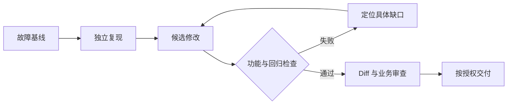

> AI 产品价值系列：[1 · 统一框架](/writing/ai-capability-product-metrics/) · [2 · 编程实战](/writing/ai-value-coding/) · [3 · 终端实战](/writing/ai-value-voice/) · [4 · 办公实战](/writing/ai-value-office/) · [5 · 深入思考](/writing/ai-value-synthesis/)

> 阅读时间为估计，包含图表理解；动手实验另计。

> 本系列是作者提出的产品验收方法，不是厂商内部 KPI 或统一实测排名。案例数据均为假设；已有产品能力以链接的官方文档及具体版本为准。

用户要求“修复登录超时，补上回归测试，不推送代码”。一次成功的交付至少包含两种行为：改变应该改变的部分，保留不应该改变的部分。

我们不比较哪个助手生成代码更多，而比较同一任务契约下的完成证据。

## 编程助手：先证明修改有效，再衡量生成效率

用户提交一个需求：“修复登录超时，并补上回归测试。”产品必须理解约束、检索代码、定位根因、修改实现、运行验证，最终交付可以审查的改动。

Claude Code 官方文档将其执行过程描述为收集上下文、采取行动、验证结果；OpenAI 的官方仓库将 Codex CLI 定义为在本地计算机上运行的编程智能体。本文以代码理解、修改和验证任务为两类产品建立共同验收框架，不作性能排序。[Claude Code 工作机制](https://code.claude.com/docs/en/how-claude-code-works)、[Codex 官方仓库](https://github.com/openai/codex)

| 能力模块 | 用户可感知的表现 | 主指标与验收口径 |
| --- | --- | --- |
| NLU／需求理解 | 要改的行为和必须保留的行为都理解对 | **需求约束满足率**：通过的验收条款数／全部条款数 |
| 语义与代码检索 | 找到真正相关的函数、配置、测试 | **关键代码召回率**：找到的必要位置数／人工标注的必要位置数 |
| 长上下文理解 | 跨文件修改后接口和依赖仍一致 | **跨文件一致性通过率**：预设一致性检查通过比例 |
| LLM／代码生成 | 功能能按要求工作 | **首轮交付验收通过率**：首次提交结果即可通过独立验收的任务比例 |
| 推理与故障定位 | 修好根因，未引入相关回归 | **有效修复率**：原问题消失且相关回归检查通过的任务比例 |
| 测试生成 | 测试能发现真实错误 | **缺陷检出率**：检出的已知或有效注入缺陷数／缺陷总数 |
| 代码审查 | 报告的问题真实、具体且可行动 | **有效发现精确率**：确认有效的问题数／报告问题总数；同时记录漏检率 |
| 工具调用 | 选对命令、参数、工作目录与操作对象 | **工具动作正确率**：动作和实际结果均符合预期的调用比例 |
| Agent 规划与恢复 | 多步骤执行中遇到失败还能推进 | **无人工补救完成率**：无需用户纠错或代操作即可验收的任务比例 |
| CV／OCR／VLM | 从截图理解界面、报错或设计要求 | **视觉需求通过率**：预设布局、文案、状态和交互验收项的通过比例 |

这里有两个容易影响结论的口径问题。

第一，**首轮交付可以包含 Agent 自主测试和修复，但不能悄悄包含用户追加的纠错指导**。自主迭代和人工补救是两种不同能力，需要分别记录。

第二，验收必须独立于生成过程。模型写出的实现和测试可能共享同一个错误理解，因此不能仅凭“它自己写的测试全部通过”认定任务成功。应结合预设验收测试、既有回归检查和必要的人工审查。SWE-bench 的任务解决比例提供了一种外部参考，但公司自己的仓库、依赖和任务分布仍需要独立验证。[SWE-bench](https://www.swebench.com/)

在总体层面，应同时记录任务验收通过率、人工审查与返工时间、单位成功任务成本，以及约定观察期内的交付后缺陷率。生成更多代码、调用更多工具，都不天然意味着创造了更多价值。

## 实践：准备三个版本，而不只是一份正确答案

在隔离的测试仓库里保留故障基线、候选修复，以及用于检验测试有效性的错误实现。先确认复现用例在基线上失败，再检查候选是否通过，并检查测试能否抓住已知错误。

| 验收项 | 检查方法 | 反例 |
|---|---|---|
| 原问题消失 | 相同输入触发登录流程 | 只把超时阈值无限调大 |
| 正常路径未退化 | 已有认证回归 | 修复超时却跳过认证 |
| 测试独立有效 | 在已知错误版本上确认会失败 | 测试只断言函数被调用 |
| 范围符合要求 | 检查 Diff 与工作区 | 顺便升级无关依赖 |
| 禁止推送 | 独立操作记录与远端状态 | 生成通过后自行发布 |

这是一份验收设计，不提供真实认证系统的通用修复补丁。安全相关代码必须由熟悉业务的维护者审查。

## 用失败证据选择下一次改动

找不到关键调用位置，先检查检索与仓库理解；工具选对但工作目录错，先改执行上下文；测试无效，先改验收；环境缺少依赖，先修环境。不要所有问题都归结为“换更强模型”。

*图 1｜独立复现、候选修改与业务审查的验证链。矩形表示模块或步骤，圆柱表示存储，菱形表示判断；实线表示主路径，虚线表示约束、信息支撑或反馈。图为教学抽象，不代表全部实现细节。*

## 每次试验保留同一张记录卡

记录模型与工具版本、代码快照、任务说明、权限、测试日志、人工追加指导、审查和返工时间。机器自修复属于一次预算内的执行过程，用户提示它“应该改另一个函数”则属于人工补救。

配套 `docs/editorial-labs/evaluation_lab.py` 演示了结果、约束与独立证据如何合并判断；它不是 Coding Agent 基准。真正落到代码任务，应将其中的确定性检查替换成你的独立测试和状态采集。

本篇的产物不是一句“生成质量提升”，而是一组能重新运行、能够解释通过原因的证据。

---

上一篇：[统一框架](/writing/ai-capability-product-metrics/)。

编程任务的结果留在代码和测试中。下一篇把视角移到终端设备：系统说“已经改好了”，实际状态是否真的变化？

下一篇：[听懂一句话，不等于改对一个闹钟](/writing/ai-value-voice/)。
