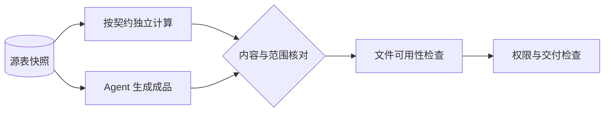

> 本文是作者提出的产品验收方法，不是厂商内部 KPI 或统一实测排名。案例数据均为假设；已有产品能力以链接的官方文档及具体版本为准。

办公 Agent 很容易交付一个看起来完整的文件。但月报的价值不在于有几页、几张图，而在于数字正确、论据可靠、范围完整，并能继续编辑和使用。

## 办公助手：先证明成果可用，再看生成是否丰富

办公任务的难点在于，输出文件容易，验收成果更复杂。一份月报可能排版漂亮，却混用了月份；一份 PPT 可以顺利打开，却把图表做成无法编辑的图片；一篇调研报告可以有许多引用，却没有一条真正支持结论。

WorkBuddy 的官方介绍强调任务执行、办公连接和自动化；豆包桌面端介绍了共享文档、表格辅助问答和内容处理等使用方式；千问办公帮助中心强调文件处理、数据分析和 Word、Excel、PPT 等成果交付。下表以这些典型用途设计评测，不代表各产品功能互斥，也不假定所有版本均支持全部任务。[WorkBuddy](https://www.workbuddy.cn/)、[豆包桌面端](https://www.doubao.com/download/desktop?ug_utm_source=225)、[千问办公帮助中心](https://qwenwork.cn/docs/web)

| 能力模块 | 办公任务 | 主指标与验收口径 |
| --- | --- | --- |
| NLU／任务理解 | 按受众和范围组织月报 | **任务要求满足率**：受众、范围、格式、时间口径等要求的满足比例 |
| OCR／版面理解 | 提取扫描件、票据和 PDF 表格 | **关键字段精确匹配率**：字段值与所属行列、主体均符合原文的比例 |
| ASR 与说话人区分 | 转写会议录音 | **内容与说话人联合正确率**：预设关键发言同时满足内容和归属正确的比例 |
| 信息抽取与摘要 | 提取会议决定和待办 | **待办抽取 F1**：按事项、负责人和期限规则匹配，统计遗漏与误报 |
| 检索／RAG | 从知识库回答制度或项目问题 | **有据正确回答率**：回答正确、证据支持结论且引用可定位的比例 |
| 长文档理解 | 比对多份材料，回答跨章节问题 | **关键问题回答正确率**：预设跨章节、跨文件问题的答对比例 |
| LLM 写作 | 周报、方案、邮件、研究报告 | **首稿可用率**：按明确规则判定无需实质性改写即可交付的比例 |
| 代码生成与数据分析 | 清洗表格、计算指标、生成图表 | **数据核验通过率**：数字、公式、筛选口径和单位通过独立复算的比例 |
| 预测，涉及预测任务时 | 销量或库存预测 | **约定预测误差**：在时间上留出的真实未来数据上计算 MAE、WAPE 等指标 |
| VLM／图表理解 | 读取趋势、解释经营变化 | **图表结论正确率**：正确处理坐标轴、单位、图例和数值关系的比例 |
| 文档生成与排版 | 交付 Word、PPT 和报告 | **可编辑成品验收率**：内容、格式和可编辑性同时通过的成品比例 |
| 图像生成 | 制作配图、海报和营销素材 | **素材可用率**：满足主题、品牌和文字要求且无需重做的比例 |
| 工具调用／GUI 操作 | 修改文件、表格和业务系统 | **目标操作正确率**：在正确对象上完成预期变更的比例 |
| Agent 工作流 | 搜资料、分析、写报告并保存 | **端到端交付成功率**：在预算内完成必要步骤并通过成果验收的任务比例 |

其中，“可用”“自然”“实质性改写”都需要评分规则。例如，首稿可用可以允许修正标点和个别措辞，但不允许重建论证、重算数据或补回遗漏章节。没有评分规则的“可用率”，会随着评审人的宽严程度变化。

按使用方式，可以给三类产品设置不同的评测权重：

| 使用方式 | 代表评测对象 | 优先指标 | 配套观察 |
| --- | --- | --- | --- |
| 任务委托与自动化 | WorkBuddy 的跨工具、批量、定时任务 | 无人工补救交付成功率 | 失败恢复、重试成本、定时执行稳定性 |
| 办公过程中的即时辅助 | 豆包的文档问答、总结和改写任务 | 回答或内容直接可用率 | 事实错误、修改轮次、有效响应时延 |
| 办公成果交付 | 千问办公的文档、表格和演示稿任务 | 成品首次验收通过率 | 数字正确、文件可编辑、人工返工时间 |

这张表表达的是评测任务的侧重点。任何一个产品进入其他使用方式，都应采用对应的验收标准。

以“根据三份销售表生成月度汇报 PPT”为例，交付成功至少需要五类证据：数据经过独立复算；结论得到源表支持；关键数字可以回溯；文件可打开、可编辑且没有明显版式错误；用户要求的地区、产品线和月份全部覆盖。下载按钮可用，只证明文件生成成功。

## 实践：给月报建立五条独立证据链

| 条款 | 应保存的证据 | 不能接受的替代 |
|---|---|---|
| 月份与地区完整 | 输入清单、筛选规则与覆盖表 | “已经全面总结” |
| 金额正确 | 独立聚合结果和单位 | 模型再次复述同一数字 |
| 结论有来源 | 结论到表格行列或文档位置的映射 | 链接数量很多 |
| 成品可使用 | 打开、编辑和必要版式检查 | 只生成下载链接 |
| 未越权 | 源文件保护、输出目录与外发记录 | 报告里声明没有外发 |

配套实验使用最小结构化报告而非真实 PPT，运行 `python3 docs/editorial-labs/evaluation_lab.py` 可以观察正常与错误候选的检查结果。它覆盖数值与契约示例，不包含真实文件格式、视觉质量或模型调用评测。

*图 1｜独立计算与成品生成汇合到交付检查。*

## 别让精美图表覆盖关键错误

先验数字与来源，再看版式。若发现报告混用了八月和九月，即使设计评分很高，也应回到数据步骤；不能通过修改文案掩盖计算口径错误。

图表还需要核对坐标、单位和图例：万元与元、累计值与当月值、同比与环比都可能被漂亮的外观遮住。发现异常时应回到原始行列，而不是再让同一个模型“确认一下”。
