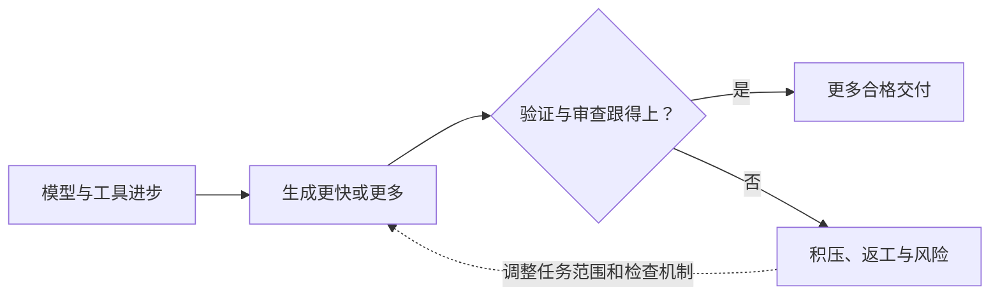

> AI 产品价值系列：[1 · 统一框架](/writing/ai-capability-product-metrics/) · [2 · 编程实战](/writing/ai-value-coding/) · [3 · 终端实战](/writing/ai-value-voice/) · [4 · 办公实战](/writing/ai-value-office/) · [5 · 深入思考](/writing/ai-value-synthesis/)

> 阅读时间为估计，包含图表理解；动手实验另计。

> 本系列是作者提出的产品验收方法，不是厂商内部 KPI 或统一实测排名。案例数据均为假设；已有产品能力以链接的官方文档及具体版本为准。

编程篇的测试、终端篇的设备状态、办公篇的数字与成品，看起来属于不同世界，却指向同一个规律：用户需要的是完成的工作，而不是某个中间能力的高分。

因此，本系列最后要追问的不是“AI 是否越来越强”，而是“哪种进步真正减少了合格交付的代价”。

## 四个口径，把失败留在账上

**任务验收通过率 = 预算内通过验收的任务数 ÷ 全部纳入评测的任务数。**

评测范围需要事先声明。超时、失败和耗尽预算的任务留在分母中；若排除不支持的任务，要同时披露支持覆盖率。否则，只接简单任务的产品可能获得虚高成功率。

**单位成功任务成本 = 所有评测任务的模型及工具费用 ÷ 成功任务数。**

失败和重试也产生真实成本。如果没有任何成功任务，应报告“无成功任务”，不能将成本记为零。若把人工成本纳入货币口径，需要公开采用的工时单价。

**每个成功任务的人工投入 = 所有任务的指导、审查和返工时间 ÷ 成功任务数。**

这个口径用于呈现整个使用过程的人工负担，包括失败任务。还可以补充“成功任务自身的平均人工投入”，但两者应明确区分。

**净人工节省 = 同等质量下人工基线耗时 − 使用 AI 后的人工投入。**

人工投入包括准备材料、指导、审查、返工和失败后接手完成的时间；用户必须等待且无法做其他工作的时间也要计入。可并行处理其他工作的机器等待时间单独作为交付周期记录。不能只计算生成阶段省下的时间。

## 假设案例：便宜的请求，不一定带来便宜的交付

以下数字仅用于说明计算方法，不代表任何真实产品。

同一组 100 项办公任务，方案 A 总共花费 100 元，成功 50 项；方案 B 总共花费 160 元，成功 80 项。两者的单位成功任务成本都是 2 元。

| 假设方案 | 总任务数 | 成功任务数 | 总费用 | 每个成功任务成本 |
| --- | ---: | ---: | ---: | ---: |
| A | 100 | 50 | 100 元 | 2 元 |
| B | 100 | 80 | 160 元 | 2 元 |

如果 A 还消耗 500 分钟人工指导和补救，B 消耗 240 分钟，那么每个成功任务的人工投入分别为 10 分钟与 3 分钟。此时，仅比较单次请求费用会漏掉真正影响用户的差异。

这个案例也说明，成功率、费用和人工时间需要并列呈现。把它们随意加权为一个总分，会隐藏用户本来应该看见的取舍。

## 把指标重新接回改进流程

**第一步，固定任务和完成证据。** 从真实工作中选取任务，覆盖常见、高价值和容易失败的情况。为每项任务写明输入、目标、约束、预算、支持范围与验收规则。任务失败后不能临时降低标准。

**第二步，固定环境并记录差异。** 记录产品和模型版本、工具权限、连接器、硬件、网络、上下文与人工干预规则。产品能力不支持时应单列为覆盖缺口，不应静默删除样本。语言、任务难度和数据规模也要分层报告。

**第三步，按证据评分并保存过程。** 编程看代码、测试和审查；终端看实际设备状态；办公看源数据、引用与成品。保留分阶段耗时、调用、重试与人工补救记录。主观质量尽量采用匿名评审和明确量表；重要结果由第二位评审复核。

**第四步，针对瓶颈做对照验证。** 如果主要失败来自金额抽取，优先改善 OCR 或文档结构处理；如果来自参数错误，先检查意图与槽位；如果来自断网后的重复执行，先修复工作流状态和恢复机制。改变一个主要因素后，在同一任务集上重新评测，并检查其他质量是否退化。

生成式系统存在随机性，关键任务需要重复运行，报告样本量、波动和失败类型。随着真实用户任务变化，更新评测集，同时保留稳定的对照集，避免把任务变简单误当成产品变强。

## 局部最优为什么可能破坏整体

语音系统响应更快，可能因为端点判断更激进，却截断用户；代码助手生成更多测试，可能增加阅读成本却没提高缺陷检出；月报排版更丰富，可能让用户花更多时间找到核心数字。

局部指标不是无用，而是必须在同一任务范围内回到顶层验证。CER、工具正确率和生成速度是诊断工具，不是价值承诺。

## 真正的瓶颈可能转移到人

当生成成本下降，审核和协调可能成为新的瓶颈。并行生产十份报告，不代表团队能并行核对十份数字；自动处理更多代码，也可能让审查队列增长。

*图 1｜生成加速之后，验证可能成为新瓶颈。矩形表示模块或步骤，圆柱表示存储，菱形表示判断；实线表示主路径，虚线表示约束、信息支撑或反馈。图为教学抽象，不代表全部实现细节。*

这不是反对提高自动化，而是要求产出能力与验证能力共同增长。对难以审查的大任务，先缩小交付单元，有时比增加模型预算更有效。

## 如何比较，而不制造一个虚假的总分

同时给出范围、通过率、费用、人工投入、时延和失败后果，再由使用方做取舍。不要用未解释的权重把它们揉成一个“能力指数”。

如果方案 B 更贵但更少返工，采购判断还取决于人工成本、任务时效和错误代价；如果方案 A 只支持简单任务，就把覆盖率放在旁边，不能只展示高通过率。

面对极少发生但代价很高的错误，平均值也不够。需要单独的硬约束和恢复策略，而不是让大量低风险成功把它冲淡。

## 最终判断：产品承诺应比技术路线更稳定

前四篇把能力分层，再用三个场景验证结果；这一篇说明为什么费用和人工投入必须跟着完整工作流计算。它们共同引出一个可用于产品定义的句式：

> 面向哪类用户，在什么任务与环境范围内，以多少时间、费用和人工投入，交付什么结果，由什么证据证明完成？

算法可以换，模型可以升级，工具可以重组。这句话不应随着供应商的宣传口径漂移。只有它保持稳定，技术进步才有共同的验收坐标。

AI 产品价值不是把所有能力展示出来，而是把一项承诺兑现，并能解释成功、失败和代价。

---

上一篇：[办公实战](/writing/ai-value-office/)。

本系列到此完成。进一步建设可运行评测闭环，可从 [Agent 评测系列](/writing/agent-system-evaluation-research/) 继续。
