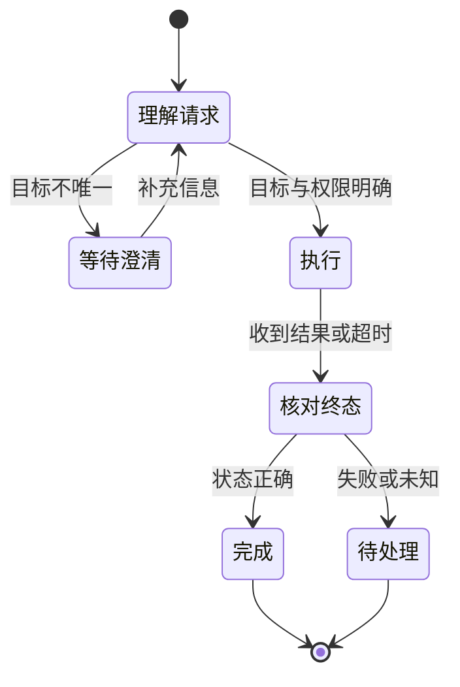

> 本文是作者提出的产品验收方法，不是厂商内部 KPI 或统一实测排名。案例数据均为假设；已有产品能力以链接的官方文档及具体版本为准。

上一页用代码和测试核对结果。这一页换成一句日常指令：“把明天早上七点的闹钟改成七点半。”语音识别只差一个字，也可能改错对象或时间。

## 终端语音助手：先证明执行正确，再看听得多准、说得多快

用户说：“把明天早上七点的闹钟改成七点半。”一条看似简单的指令，实际上跨越了多个环节：

**唤醒 → 收音 → 端点判断 → 语音识别 → 意图与参数理解 → 设备执行 → 语音反馈。**

端到端语音模型可能合并其中若干模型模块，但用户仍然会感知到叫不醒、被抢话、听错时间、改错对象或迟迟没有反馈。评测仍可按这些可观察的失败类型拆分。

| 能力模块 | 用户体验 | 主指标与验收口径 |
| --- | --- | --- |
| KWS 唤醒 | 叫它时能醒，没叫时不乱醒 | **固定误唤醒水平下的唤醒成功率**：在相同误唤醒次数／小时约束下比较 |
| 降噪与回声消除 | 播放音乐、开车或远距离也能听懂 | **噪声场景指令成功率**：固定噪声、距离和播放音量后的完成比例 |
| VAD／语音端点检测 | 停顿不被截断，说完及时处理 | **提前截断率**：尚未说完就结束收音的话轮比例；另记录结束判定时延 |
| ASR | 人名、时间、地点和数字被听对 | **关键实体识别正确率**：关键内容按预定匹配规则判为正确的比例 |
| NLU 意图识别 | 区分新建、修改、查询和删除 | **意图宏平均 F1**：逐类计算后平均，避免高频指令掩盖低频失败 |
| 槽位／参数抽取 | 对象、日期和新旧时间均正确 | **整句参数全对率**：一条指令中全部必要参数均正确的比例 |
| 多轮语义理解 | “再晚半小时”能指向同一个闹钟 | **上下文指代正确率**：正确继承对象和参数的多轮样本比例 |
| 声纹识别 | 找到正确的个人账户和设置 | **固定误接受率下的误拒绝率**：在相同冒认接受水平下比较本人被拒绝的比例 |
| LLM 对话问答 | 回答正确且切题 | **回答验收通过率**：同时满足事实、相关性及任务要求的回答比例 |
| 工具调用与设备控制 | 闹钟真的改到七点半 | **目标状态达成率**：读取实际状态，确认与指令一致的任务比例 |
| TTS | 播报可懂、读音正确、听感自然 | **听感验收通过率**：按统一评分规则盲听验收的通过比例 |
| 全双工与打断 | 用户插话后能停止播报并继续听 | **有效打断成功率**：在约定时限内停播且正确处理插话的比例 |
| VLM，带摄像头时 | 看物体、读屏幕、回答视觉问题 | **视觉任务正确完成率**：针对真实拍摄样本的任务验收比例 |

ASR 的 CER／WER 仍有诊断价值。WER 统计替换、删除和插入等转录错误；中文评测可以选用 CER，但需要统一文本规范化规则。产品指标则要进一步关注关键实体，因为“明天七点半”与“明天七点”可能只有少量字符差异，却对应完全不同的执行结果。[Google 语音准确率说明](https://docs.cloud.google.com/speech-to-text/docs/v1/speech-accuracy)

唤醒成功率也不能脱离误唤醒率单独比较。提高灵敏度可能同时提高正确唤醒和错误触发，因此应固定一个运行点再比较，并说明噪声条件。[Picovoice 唤醒评测方法](https://picovoice.ai/blog/benchmarking-a-wake-word-detection-engine/)

终端还有软件助手较少直接面对的资源限制：常驻功耗、峰值内存、模型存储、弱网可用性和离线覆盖率。所有指标都应按设备型号、距离、噪声、口音等条件切片，而不能只给一个实验室平均值。

核心指标可以定义为：**在已声明支持的任务范围内，用户单次表达后，系统无需重说或纠错即可达到正确状态的比例。** 正常的权限确认与失败后的补救要分开记录。系统还应准确承认失败，避免把“口头说完成，实际没执行”计为成功。

时延至少记录两个终点：用户说完到首次有效反馈，以及用户说完到操作真正完成。P50 描述典型体验，P95 暴露慢请求；一句很快出现的“正在处理”不能替代实际完成时间。

## 实践：把前后状态写进验收

```json
{
  "before": [
    {"id": "alarm-a", "date": "2026-09-06", "time": "07:00"},
    {"id": "alarm-b", "date": "2026-09-07", "time": "07:00"}
  ],
  "expected_change": {"id": "alarm-a", "time": "07:30"},
  "must_preserve": ["alarm-b"],
  "on_ambiguity": "澄清，不猜测目标"
}
```

这是固定日期的教学样本；真实系统要按设备时区和请求发生时间解释“明天”。只看界面出现一个 07:30 闹钟还不够，还要检查旧闹钟是否被正确修改、另一条是否保持不变。

## 异常样本比平均识别率更能揭示工作流问题

| 变化 | 应验收的行为 |
|---|---|
| 同一天有两个七点闹钟 | 识别歧义并澄清对象 |
| 用户说到一半停顿 | 不提前截断指令 |
| 设备已修改，回包丢失 | 先查询状态，不重复创建 |
| 用户追加“取消刚才修改” | 明确撤销对象与是否可恢复 |
| 网络不可用 | 准确说明失败，不口头宣称完成 |



*图 1｜超时进入终态核对，而非默认重做。终态不代表外部副作用已撤销。*

这个状态图是验收参考，不对应某个设备 SDK。重点是超时先进入状态核对，而不是直接把请求当作未执行。

本篇结束后，读者应能把语音模型的误差映射到实际失败类型，并明确“说完到首次反馈”和“说完到真正完成”是两个不同的延迟终点。
