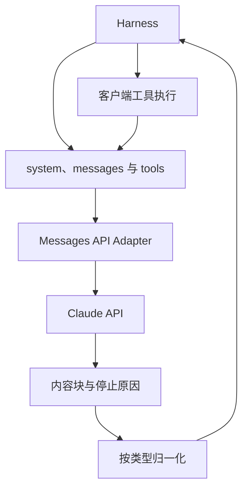
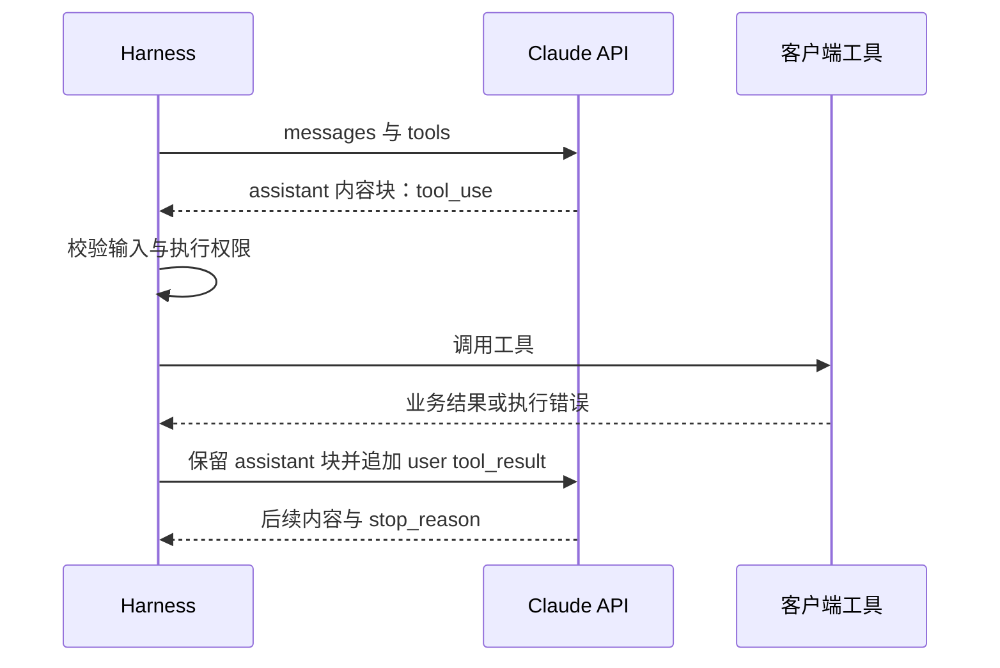
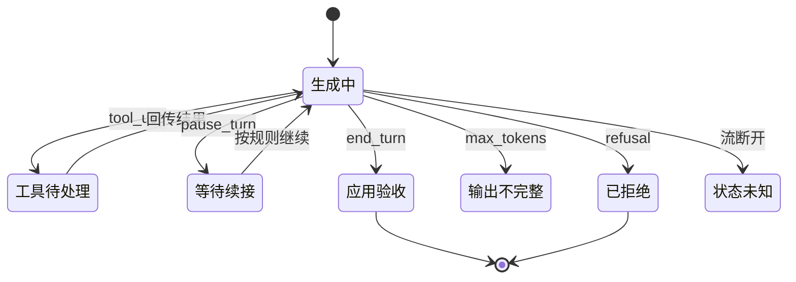
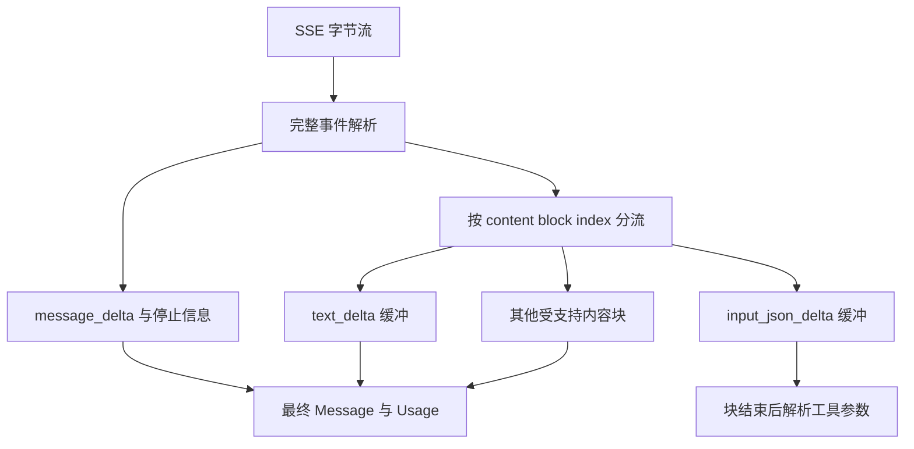

Anthropic API 的 Messages 接口把一轮模型响应表示为内容块组成的 Message。对 Harness 来说，关键不只是拿到一段回答，而是判断内容块属于文本、工具请求还是其他类型，并据停止原因决定执行、续接、验收或失败处理。

本文核对 **2026-09-07 Claude 官方文档**，重点讨论直接调用 Messages API。传统请求使用 `anthropic-version: 2023-06-01`；这个 API 版本头不等于模型版本，也不代表所有新功能无需额外配置。示例采用待配置模型 ID，未发送真实模型请求。[API 概览](https://platform.claude.com/docs/en/api/overview)

## 架构：内容块适配器连接模型与 Runtime



API 的 Message 是模型交互对象；Runtime 的 Task 是用户工作对象。一次 `end_turn` 可以结束模型回答，但任务可能还需要验证文件、等待用户审查或运行测试。

直接 API 使用其认证方式与版本头；经云平台接入时，认证、端点和功能支持需要单独核验。不要把直接 API 的请求头机械搬到所有托管渠道。

## 请求的组成：指令、消息和工具

| 字段 | 责任 | 容易混淆的地方 |
| --- | --- | --- |
| `model` | 选择模型 | 不是 API 协议版本 |
| `max_tokens` | 限制响应生成预算 | 不是整个 Agent 的预算 |
| `system` | 从会话开始生效的系统指令 | 不等于用户消息前加一句提示 |
| `messages` | 当前轮次所需的交互历史 | 不自动代表服务器保存了业务会话 |
| `tools` | 描述可用工具 | 声明工具不等于执行工具 |

起始系统指令放在顶层 `system`。当前官方文档也为部分模型定义了会话中途的 system 消息及位置规则，因此不能再笼统断言“所有 Messages 都只允许 user 和 assistant”。具体模型和模式需按文档检查。[消息组织](https://platform.claude.com/docs/en/build-with-claude/working-with-messages)

下面是作者构造的请求形状，`MODEL_ID` 需替换为实际可用模型：

```json
{
  "model":"MODEL_ID",
  "max_tokens":800,
  "system":"查询工单状态，不能修改工单。",
  "messages":[{"role":"user","content":"查询 T-17。"}],
  "tools":[{
    "name":"get_ticket",
    "description":"查询指定工单的状态。",
    "input_schema":{
      "type":"object",
      "properties":{"ticket_id":{"type":"string"}},
      "required":["ticket_id"]
    }
  }]
}
```

工具参数契约放在 `input_schema`，不能直接复制 OpenAI Responses 的 `parameters` 包装。工具是否支持 strict、特定流式参数等，还要核对模型与功能的支持范围。[工具定义](https://platform.claude.com/docs/en/agents-and-tools/tool-use/define-tools)

直接 HTTP 接口的主要路径是 `POST https://api.anthropic.com/v1/messages`，JSON 请求体配合 `content-type`、`anthropic-version` 及选定认证方式。常见 API Key 方式使用 `x-api-key`；不要把用户 Token、MCP Server Token 和模型服务凭据混作同一个头。

版本兼容应同时记录端点、API 版本头、模型标识和启用的 beta 功能。只记录一个 SDK 版本，无法解释为什么同一工具定义在两个部署中被不同地接受。

## 内容块与工具结果形成连续历史

模型可能返回一个包含文本和 `tool_use` 的 assistant Message。客户端工具调用块包含 ID、名称和结构化 input；应用执行后，把对应的 `tool_result` 放入下一条 user Message，用 `tool_use_id` 关联原调用。[工具回传](https://platform.claude.com/docs/en/agents-and-tools/tool-use/handle-tool-calls)



普通客户端工具闭环要求结果紧随对应的工具调用消息；同一 user 消息中，工具结果块应放在普通文字前。多个工具调用要逐一对应结果，不能只回传最先完成的一个后就遗失其他调用。

工具执行失败可以用 `is_error` 表达，和 HTTP/API 请求失败不是同一层错误。涉及服务端工具、混合工具或较新的异步机制时，应遵守对应功能的专门规则，不把普通客户端工具的简化顺序泛化到所有模式。

下面是单个客户端工具调用及其结果的消息片段，假定请求所需的其他历史仍完整保留：

```json
[
  {"role":"assistant","content":[{"type":"tool_use","id":"toolu_7","name":"get_ticket","input":{"ticket_id":"T-17"}}]},
  {"role":"user","content":[{"type":"tool_result","tool_use_id":"toolu_7","content":"工单状态为 open。"}]}
]
```

与 OpenAI Responses 的差异不是单纯重命名 ID：这里的工具请求和结果位于不同角色的 Message 内容块中。适配器需要保留块顺序和原 assistant 消息，而不是将每个工具块独立转换成一条任意角色的文本。

## stop_reason 决定下一步

| 常见停止原因 | 含义 | Runtime 后续动作 |
| --- | --- | --- |
| `end_turn` | 模型本轮自然结束 | 检查业务完成条件 |
| `tool_use` | 需要处理客户端工具调用 | 校验、执行并回传 |
| `max_tokens` | 输出达到限制 | 标记未完整，决定续接或调整预算 |
| `stop_sequence` | 命中配置的停止序列 | 检查是否符合应用预期 |
| `pause_turn` | 服务端长运行工具等场景暂停 | 按该功能的续接规则处理 |
| `refusal` | 模型拒绝 | 向产品层传达明确结果 |

这张表覆盖常见情形，不是永不变化的完整枚举。未知停止原因应保留原值并按保守策略处理，不能默认归为成功。[停止原因](https://platform.claude.com/docs/en/build-with-claude/handling-stop-reasons)



图是 Runtime 决策模型，不是新增 API 状态。一次工具成功后模型仍可能拒绝后续工作；整体任务记录应保存已经发生的操作，而不能因最后一句拒绝就把整个任务标记为“未执行”。

## 流式协议按内容块归并

标准消息流包含 `message_start`，随后是按 index 关联的 `content_block_start / delta / stop`，再接顶层更新及 `message_stop`。流中还可能出现 ping 或 error；HTTP 已返回 200 并不能排除后续流内错误。[Streaming Messages](https://platform.claude.com/docs/en/build-with-claude/streaming)



工具参数增量是部分 JSON 字符串，而最终 `tool_use.input` 是对象。不能把每个分片单独解析失败当作模型错误，也不能提前运行只收到一半参数的命令。

Usage 增量中的部分统计是累计值；实现需按具体字段语义更新，不能把每条事件的累计数再相加。流中途失败时，界面已展示的文字也应保留“未完整”状态，而不是伪造一个 `end_turn`。

## Thinking 与缓存不是普通文本优化

涉及 Thinking 的内容块可能带有签名或不可直接展示的状态。在需要续接的工具循环中，应按具体模型要求保留相关块，不能把用户可见摘要当作可替换的完整状态。[Thinking 文档](https://platform.claude.com/docs/en/build-with-claude/extended-thinking)

Prompt Caching 利用可复用前缀减少重复处理成本，但缓存命中不代表服务端替应用保存了全部会话，也不是长期记忆。工具定义、系统指令或前缀变更会影响缓存复用；写入和读取缓存的 Usage 需要单独观察。[Prompt Caching](https://platform.claude.com/docs/en/build-with-claude/prompt-caching)

跨模型降级时尤其容易丢失语义：某个模型接受的 Thinking 块、系统消息位置或工具配置，目标模型未必接受。适配器应先判断能否安全转换；不能静默删掉陌生块之后仍宣称完整保留上下文。

## 与 OpenAI API 的映射边界

| 语义 | Anthropic Messages | OpenAI Responses |
| --- | --- | --- |
| 普通输出 | Message 的 content blocks | 类型化 output Items |
| 函数定义参数 | `input_schema` | `parameters` |
| 客户端工具请求 | `tool_use` 块 | `function_call` Item |
| 工具结果关联 | `tool_use_id` | `call_id` |
| 结果回传位置 | user Message 的 `tool_result` | `function_call_output` Item |
| 继续决策依据 | `stop_reason` 与内容块 | Response 状态与输出项 |

OpenAI 一侧的对象和工具形状见其[迁移文档](https://developers.openai.com/api/docs/guides/migrate-to-responses)。字段映射只是开始：停止原因、服务器工具、会话续接、Thinking 和缓存都需要行为测试。

错误处理应分别考虑参数错误、认证失败、限流、服务过载以及流内失败；重试必须受总截止时间和预算约束。自动重试不能代替工具副作用对账。[API 错误](https://platform.claude.com/docs/en/api/errors)

实际验收至少覆盖：多个 tool_use、工具执行错误、参数分片、输出截断、拒绝、断流、缓存计量和模型切换。本文解释协议与适配设计，不报告真实模型质量或网关兼容率。模型接入整体取舍见[OpenAI API](/writing/openai-api-protocol/)和[LLM Gateway](/writing/harness-operations-model-gateway/)。
