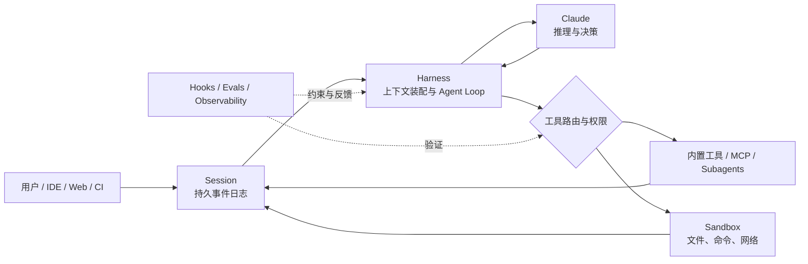

如果把 Claude 模型视为“大脑”，那么 Harness 就是让大脑能够持续工作的身体、神经系统与制度环境。它决定模型能看到什么、可以调用什么、何时需要停下来、怎样确认工作完成，以及任务中断后能否继续。

从 Anthropic 的产品和工程实践看，Harness 并不是模型外面的一层提示词，也不等同于某个 Agent 框架。它是一套围绕模型建立的运行系统：**用 Agent Loop 组织行动，用上下文工程分配注意力，用工具与环境扩展能力，用权限和沙箱限制影响范围，再用评估与反馈闭环推动系统演进。**

Claude Code 是这套思想最完整的产品化表达。它表面上是一个能读代码、改文件、运行命令的编程工具，实质上则是 Anthropic 对通用 Agent Harness 的参考实现：同一个核心循环被放进终端、IDE、桌面端、Web、CI/CD 和 Agent SDK，并通过 `CLAUDE.md`、Skills、Hooks、MCP、Subagents、Permissions、Sandbox 与 Checkpoints 形成完整的扩展和治理体系。

> [!IMPORTANT]
> Anthropic Harness 建设的核心，不是尽可能替模型规定每一步，而是建立一个对模型清晰、对人透明、对风险有硬边界、对失败可恢复的工作环境。

## 一、先定义 Harness：模型与真实世界之间的运行系统

Anthropic 在 Agent 评估文档中给出过一个实用定义：Agent Harness，也称 scaffold，是让模型能够作为 Agent 行动的系统；它处理输入、编排工具调用并返回结果。评价一个 Agent，实际评价的是模型与 Harness 的组合，而不是孤立的模型。参见 [Demystifying evals for AI agents](https://www.anthropic.com/engineering/demystifying-evals-for-ai-agents)。

在 Managed Agents 的架构中，Anthropic 又把一个长时间运行的 Agent 拆成三个可以独立演化的组件：

- **Session**：追加写入的持久事件日志，记录发生过什么；
- **Harness**：调用 Claude、整理上下文并把工具调用路由到执行环境的循环；
- **Sandbox**：Claude 运行代码、修改文件和访问外部资源的环境。

这个定义非常重要，因为它把“思考”“记忆”和“行动”解耦了。模型不需要承担持久化，沙箱也不应该成为唯一状态源；Harness 可以改变上下文策略，而不会破坏历史记录或执行环境。Anthropic 将这种思路概括为把“脑”“手”和“会话”分开。参见 [Scaling Managed Agents: Decoupling the brain from the hands](https://www.anthropic.com/engineering/managed-agents)。



从这张图可以得到整篇文章的结论：**Claude 决定下一步做什么，Harness 决定它基于什么信息做决定、可以把决定执行到什么程度，以及系统如何知道结果可信。**

## 二、Anthropic 的六条核心设计原理

### 1. 从最简单的可组合结构开始，让复杂度证明自己

Anthropic 在 [Building effective agents](https://www.anthropic.com/engineering/building-effective-agents) 中区分了 Workflow 与 Agent：Workflow 通过预定义代码路径编排模型和工具，Agent 则由模型动态决定过程与工具使用。

这不是“低级”和“高级”的关系。确定性任务使用 Workflow 往往更便宜、更稳定；只有当路径无法预先穷举、环境反馈会持续改变下一步时，Agent Loop 才值得承担额外的成本和延迟。

Anthropic 的建议可以概括为三点：

1. 保持设计简单；
2. 让计划与状态对人透明；
3. 像设计人机界面一样设计 Agent-Computer Interface，也就是模型与工具之间的接口。

因此，Harness 的第一原则不是“多 Agent 优先”，而是**复杂度按效果逐级增加**：单次模型调用不够，再使用串联或路由；固定流程不够，再引入自主循环；单 Agent 的上下文或吞吐成为瓶颈，再引入 Subagent 或 Agent Team。每一次升级都要由评估结果证明价值。

### 2. 从提示词工程转向上下文工程

Agent 在循环中会不断产生新信息：文件内容、搜索结果、工具返回、错误日志、计划进度和用户反馈。全部塞进上下文会稀释注意力，只依靠最初的 System Prompt 又无法支撑长任务。

Anthropic 将上下文工程定义为：在有限注意力预算内，持续选择最小但高信号的信息集合，使模型更可能产生目标行为。参见 [Effective context engineering for AI agents](https://www.anthropic.com/engineering/effective-context-engineering-for-ai-agents)。

Claude Code 将这个原理拆成了不同加载时机的产品机制：

| 上下文机制 | 作用 | 适合放什么 |
| --- | --- | --- |
| `CLAUDE.md` | 每次会话自动加载的持久说明 | 架构地图、构建命令、通用约定 |
| `.claude/rules/` | 按路径加载的局部规则 | 特定目录、语言或模块规范 |
| Auto memory | Claude 根据工作过程积累的经验 | 调试发现、常用命令、用户偏好 |
| Skills | 按需加载的知识和工作流 | 发布流程、代码审查、领域手册 |
| Subagents | 在独立上下文中完成聚焦任务 | 大规模搜索、专项审查、并行研究 |
| Compaction | 压缩长会话，保留关键进度 | 长任务历史与阶段性交接 |

[Claude Code 的扩展指南](https://code.claude.com/docs/en/features-overview)特别强调：`CLAUDE.md` 应保持短小，只保存每次任务都需要的信息；较长的参考资料和偶发工作流应放入按需加载的 Skill。这里体现的是渐进式披露，而不是“给模型越多信息越好”。

好的项目上下文更像地图而不是百科全书：入口足够清晰，细节可以现场发现，规则拥有明确作用域，历史可以被压缩或更新。

### 3. 工具是给非确定性使用者设计的产品接口

没有工具，Claude 只能输出文本；拥有文件、搜索、Shell、Web 和 MCP 工具后，它才能改变真实环境。Claude Code 的基本循环因此不是“提问—回答”，而是：

```text
收集上下文 → 采取行动 → 验证结果 → 根据反馈继续循环
```

例如一句“修复认证模块的失败测试”，可能触发运行测试、读取错误、搜索实现、编辑文件和再次运行测试。每个工具结果都会成为下一步决策的新证据。参见 [How Claude Code works](https://code.claude.com/docs/en/how-claude-code-works)。

但传统 API 文档主要服务确定性程序，Agent 工具则服务一个会选择、误解和组合工具的非确定性使用者。Anthropic 在 [Writing effective tools for agents](https://www.anthropic.com/engineering/writing-tools-for-agents) 中给出了几条关键经验：

- 不要把所有底层 API 原样暴露为工具；
- 使用清楚的命名空间划分能力边界；
- 工具描述要说明何时使用、输入含义和限制；
- 返回足以支持下一步的信息，而不是倾倒全部数据；
- 用真实任务评估工具，再让 Claude Code 协助优化工具定义。

MCP 在 Claude Code 体系中的位置也由此变得清晰：MCP 负责连接，Skill 负责教会 Claude 如何有效使用连接，两者并不互相替代。

### 4. 将验证写进循环，而不是相信完成声明

Agent 最危险的失败并不是报错，而是“看起来已经完成”。它可能修改了代码却没有通过测试，可能返回操作成功但外部系统状态没有变化，也可能满足表面要求却偏离真实目标。

Claude Code 把验证作为 Agent Loop 的第三阶段：运行测试、查看诊断、检查 Git diff、操作真实界面或读取环境最终状态。Checkpoint 则在每次文件编辑前保存状态，让用户能够分别回退代码、对话或两者，参见 [Checkpointing](https://code.claude.com/docs/en/checkpointing)。

对于生产 Harness，验证至少应该包含三层：

- **结果验证**：目标文件、数据库记录或外部资源是否真的存在；
- **过程验证**：是否调用了禁止工具、跳过了必要步骤或发生异常重试；
- **回归验证**：新模型、新提示和新工具是否破坏过去已经通过的任务。

Hooks 为这套循环提供确定性的反馈入口。例如每次编辑后运行格式化和测试，在提交前执行安全扫描，在高风险工具调用前检查策略。提示词表达期望，Hook 才负责保证事件发生。

### 5. 自治来自边界，而不是取消确认

高频权限弹窗看似安全，实际上容易造成批准疲劳。Anthropic 披露，Claude Code 用户会批准 93% 的权限请求；当确认变成肌肉记忆，它就失去了风险判断的意义。参见 [How we built Claude Code auto mode](https://www.anthropic.com/engineering/claude-code-auto-mode)。

Anthropic 的解决方向不是简单移除权限，而是把控制分成互补层次：

| 控制层 | 机制 | 性质 |
| --- | --- | --- |
| 指导 | `CLAUDE.md`、Rules、Skills | 模型可能遵循的软约束 |
| 决策 | Permission modes、Allow / Ask / Deny | 工具调用前的访问策略 |
| 拦截 | `PreToolUse` 等 Hooks | 确定性策略与组织规则 |
| 隔离 | 文件系统与网络 Sandbox | 操作系统级影响范围 |
| 恢复 | Checkpoints、Git、Session log | 出错后的回退与续跑 |

Claude Code 的 Sandbox 同时限制文件系统和网络。只有文件隔离，攻击者仍可能利用网络窃取可读信息；只有网络隔离，恶意命令仍可能破坏本地文件。两者必须组合使用。[Anthropic 的沙箱实践](https://www.anthropic.com/engineering/claude-code-sandboxing)显示，在内部使用中，预先定义安全边界后，权限提示减少了 84%。

这揭示了一条反直觉原则：**更硬的边界可以带来更高的自治。** 当系统明确限定可写目录、可访问域名、凭证作用域和资源预算后，Claude 才能在边界内连续行动，而不必为每个低风险步骤中断用户。

### 6. Harness 必须随模型能力一起“减负”

Harness 会编码设计者对模型缺陷的假设，但模型升级后，这些假设可能变成负担。

Anthropic 的长任务实验曾为 Sonnet 4.5 增加上下文重置，以避免模型接近上下文上限时过早收尾；当 Opus 4.5 不再出现同样行为，这套重置机制就成了多余成本。到了 Opus 4.6，一些原本需要独立评估 Agent 的任务，也已经能够由生成 Agent 稳定完成。[Harness design for long-running application development](https://www.anthropic.com/engineering/harness-design-long-running-apps)因此提出一个很实际的判断：评估器不是固定必需品，它只应被部署在当前模型尚不能可靠独立完成的能力边界上。

所以 Harness 不是一次设计完成的静态框架，而是一组需要持续做消融实验的假设：删除某个规划步骤、角色、提示或上下文重置后，结果是否变差？如果没有，就应该移除它。

## 三、Claude Code 产品体系如何承载这些原理

Claude Code 的价值不只在某个客户端功能，而在于它把同一个 Agent Harness 分布到不同层面：

| 产品层 | Claude Code 机制 | Harness 责任 |
| --- | --- | --- |
| 交互入口 | Terminal、IDE、Desktop、Web、Remote Control、CI/CD | 接收目标、展示状态、允许人随时介入 |
| 核心运行时 | Gather—Act—Verify Agent Loop | 规划下一步、调用工具、根据反馈纠偏 |
| 项目知识 | `CLAUDE.md`、Rules、Auto memory | 跨会话保留项目规则与经验 |
| 能力封装 | Skills、Plugins | 渐进加载可复用知识与工作流 |
| 外部连接 | MCP、内置工具 | 把数据库、浏览器、GitHub 等变成可调用能力 |
| 任务编排 | Subagents、Agent Teams、Background Agents | 隔离上下文、并行执行、汇总结果 |
| 确定性控制 | Hooks、Permissions | 执行策略、自动检查、人工批准 |
| 环境安全 | Sandbox、Worktrees、Cloud VM | 限制文件、网络、凭证和并发修改范围 |
| 状态与恢复 | Session、Compaction、Checkpoints、Git | 长任务续跑、回退、审计与交接 |
| 开发者平台 | Claude Agent SDK | 将 Claude Code 的工具和循环嵌入自定义产品 |

这套体系中最值得借鉴的不是功能数量，而是职责分离：

- 经常需要的事实放进 `CLAUDE.md`，偶尔需要的知识放进 Skill；
- 连接外部系统交给 MCP，使用方法交给 Skill；
- 需要推理的流程由 Agent 处理，必须执行的检查交给 Hook；
- 低风险操作通过权限规则放行，高风险影响通过 Sandbox 和审批限制；
- 大量探索放入 Subagent，主 Agent 只接收高信号结果。

这正是一个成熟 Harness 应有的结构：模型负责判断，系统负责提供清晰选择，并把不可妥协的规则做成硬约束。

## 四、三个案例：Harness 如何改变模型的有效能力

### 案例一：从“一次生成”到 Planner—Generator—Evaluator

Anthropic 在长时间应用开发实验中，最初使用初始化 Agent 拆解任务，再让编码 Agent 每次完成一个功能，并通过文件为下一次会话留下交接物。它解决了跨上下文持续推进，却仍容易生成缺乏原创性或存在真实交互缺陷的应用。

后续 Harness 引入了三个角色：

1. **Planner**：把简短需求扩展为产品规格，但避免过早限定实现；
2. **Generator**：按功能推进实现并做自检；
3. **Evaluator**：通过 Playwright MCP 操作真实页面，检查 UI、API 和数据库状态。

Generator 与 Evaluator 会在开发前协商 Sprint Contract，先明确“完成是什么、如何验证”，再进入编码。设计实验通常循环 5—15 次，完整运行可持续数小时。

这个案例说明，Harness 的增益并不来自“再叫一个模型评审”，而来自四个结构化机制：任务拆解、完成契约、真实环境验证和可持续反馈。模型没有改变，工作制度改变后，有效能力边界被推远了。

### 案例二：16 个 Claude 并行构建 C 编译器

Anthropic 使用 16 个并行 Claude Agent，从零开始编写 Rust 实现的 C 编译器。近 2,000 个 Claude Code 会话、约 2 万美元 API 成本后，系统产生约 10 万行代码，并能够在 x86、ARM 与 RISC-V 上编译 Linux 6.9。参见 [Building a C compiler with a team of parallel Claudes](https://www.anthropic.com/engineering/building-c-compiler)。

真正支撑规模的不是“16 倍智能”，而是测试 Harness：任务必须能够拆分，不同 Agent 的修改要被隔离，失败需要被可重复地定位，测试结果要能自动形成下一轮工作。实验后期还通过随机选择文件分别交给 GCC 和 Claude 的编译器编译，逐步缩小失败范围。

它同时暴露了多 Agent 的成本：并行会引入重复工作、冲突和协调开销。如果没有强测试、共享任务状态与隔离工作区，增加 Agent 数量只会更快地产生混乱。

### 案例三：Managed Agents 将“脑”与“手”解耦

Managed Agents 的早期实现把 Session、Harness 和 Sandbox 放进同一个容器。结构简单，却导致容器故障等同于会话丢失，连接客户 VPC 困难，而且每个会话都必须等待容器、仓库和进程完成初始化。

Anthropic 后来把 Harness 移出容器，把执行环境抽象成统一工具接口，只有任务需要行动时才创建或连接 Sandbox。Session 则成为独立、持久的事件流，Harness 可以按需读取、切片和转换历史。

根据 Anthropic 公布的数据，解耦后 p50 首 Token 延迟下降约 60%，p95 下降超过 90%。更重要的是，模型、上下文策略与执行环境可以分别扩展和失败，系统不再依赖一台不可替换的“宠物服务器”。

这是一条超越 Claude Code 的通用架构原则：**不要让 Agent 的记忆依附于执行容器，也不要让 Harness 假设工具一定与自己运行在同一台机器。**

## 五、一套可落地的 Anthropic Harness 建设路径

### 第一阶段：单 Agent 的可靠闭环

先选一个边界明确、结果可验证的任务，建立最小 Harness：

- 一个 Gather—Act—Verify 循环；
- 少量高质量工具，而不是完整 API 镜像；
- 明确的结束条件、超时与 Token 预算；
- 可独立检查的环境结果；
- 全量会话和工具轨迹；
- Git 或等价 Checkpoint 恢复机制。

此时不急于引入记忆和多 Agent。先回答最基础的问题：一次失败发生在哪里，系统能否解释、重现和恢复？

### 第二阶段：把项目变成 Agent 可理解的环境

参照 Claude Code 的方式组织上下文：

- 用短小的入口文档提供架构地图与常用命令；
- 用路径规则限定局部规范；
- 用 Skill 封装按需知识和高频工作流；
- 用 MCP 暴露外部能力，但延迟加载详细工具定义；
- 用结构化计划、进度文件和决策日志跨会话交接；
- 定期删除已经过期或模型已不再需要的指令。

衡量标准不是文档覆盖率，而是新会话能否在较少上下文下正确找到事实并继续工作。

### 第三阶段：用硬边界换取有界自治

建立分层控制面：

1. 默认只读；
2. 对低风险工具设置窄范围 Allow；
3. 对外部写入、生产操作和凭证访问设置 Ask 或 Deny；
4. 用 Hook 执行不可省略的格式化、测试、策略与审计；
5. 同时启用文件系统和网络隔离；
6. 将凭证留在 Sandbox 外，通过代理签发短期、限域凭证；
7. 为长任务提供暂停、接管、恢复和紧急终止。

自治程度应由“错误影响范围 × 可检测性 × 可恢复性”决定，而不是由模型基准分数决定。

### 第四阶段：评估驱动扩展

评估集应来自真实失败，并同时观察：

- 最终环境是否达到目标；
- Agent 走过怎样的轨迹；
- 是否违反权限和业务策略；
- 需要多少模型调用、时间与人工介入；
- 重复运行的成功率和方差；
- 模型或 Harness 更新后是否回归。

只有当单 Agent 出现明确瓶颈时，再增加 Planner、Evaluator、Subagent 或 Agent Team。每引入一个组件，都做一次消融测试：没有它是否明显变差？若答案是否定的，就让 Harness 回到更简单的状态。

## 六、结论：Harness 建设是一门环境工程

Anthropic 对 Agent 的长期判断可以浓缩成一句话：**模型能力只有通过合适的环境才能转化为可靠工作。**

Claude Code 展示了这套环境应如何构成：Agent Loop 让 Claude 持续行动，`CLAUDE.md` 与 Skills 组织上下文，工具与 MCP 连接世界，Subagents 扩展并行能力，Hooks 和 Evals 提供反馈，Permissions 与 Sandbox 控制影响范围，Session、Compaction、Checkpoints 和 Git 保证任务可以延续与恢复。

其中最关键的建设顺序是：

```text
简单循环
  → 高质量上下文与工具
  → 可验证反馈
  → 权限、隔离与恢复
  → 长任务与多 Agent
  → 持续删除已经过时的脚手架
```

未来 Claude 模型会更聪明，今天某些必要的提示、角色和补偿机制会逐渐失去价值。但 Session、工具边界、环境状态、验证证据与安全隔离不会因此消失。一个好的 Harness 不应把当前模型的缺陷永久固化，而应让模型、上下文策略和执行环境能够独立升级。

模型决定系统在某一步可能想到什么；Harness 决定它能否把正确的想法，安全、持续、可验证地变成结果。

## 参考资料

本文主要参考以下 Anthropic 官方资料，产品能力以 2026 年 9 月可访问文档为准：

1. [Building effective agents](https://www.anthropic.com/engineering/building-effective-agents)
2. [Effective context engineering for AI agents](https://www.anthropic.com/engineering/effective-context-engineering-for-ai-agents)
3. [Writing effective tools for agents](https://www.anthropic.com/engineering/writing-tools-for-agents)
4. [Effective harnesses for long-running agents](https://www.anthropic.com/engineering/effective-harnesses-for-long-running-agents)
5. [Harness design for long-running application development](https://www.anthropic.com/engineering/harness-design-long-running-apps)
6. [Demystifying evals for AI agents](https://www.anthropic.com/engineering/demystifying-evals-for-ai-agents)
7. [Scaling Managed Agents: Decoupling the brain from the hands](https://www.anthropic.com/engineering/managed-agents)
8. [Beyond permission prompts: making Claude Code more secure and autonomous](https://www.anthropic.com/engineering/claude-code-sandboxing)
9. [Building a C compiler with a team of parallel Claudes](https://www.anthropic.com/engineering/building-c-compiler)
10. [Claude Code overview](https://code.claude.com/docs/en/overview)
11. [How Claude Code works](https://code.claude.com/docs/en/how-claude-code-works)
12. [Extend Claude Code](https://code.claude.com/docs/en/features-overview)
13. [Claude Code permissions](https://code.claude.com/docs/en/permissions)
14. [Claude Code sandboxing](https://code.claude.com/docs/en/sandboxing)
15. [Claude Code checkpointing](https://code.claude.com/docs/en/checkpointing)
