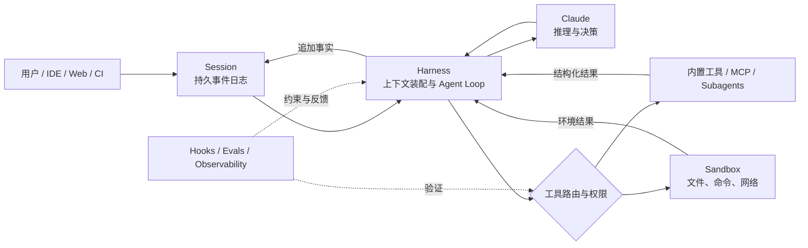

> 系列：[1. 可靠性地图](/writing/ai-agent-reliability-boundaries/)｜[2. 自治落地](/writing/agent-reliability-adoption/)｜[3. Harness 原理](/writing/anthropic-harness/)｜[4. Harness 实践](/writing/anthropic-harness-practice/)｜[5. TRACE 模型](/writing/trace-framework-deep-dive/)｜[6. TRACE 落地](/writing/trace-lite-production/)｜[7. 整体思考](/writing/trustworthy-agent-engineering-synthesis/)

如果把 Claude 模型视为“大脑”，那么 Harness 就是让大脑能够持续工作的身体、神经系统与制度环境。它决定模型能看到什么、可以调用什么、何时需要停下来、怎样确认工作完成，以及任务中断后能否继续。

从 Anthropic 的产品和工程实践看，Harness 并不是模型外面的一层提示词，也不等同于某个 Agent 框架。它是一套围绕模型建立的运行系统：**用 Agent Loop 组织行动，用上下文工程分配注意力，用工具与环境扩展能力，用权限和沙箱限制影响范围，再用评估与反馈闭环推动系统演进。**

Claude Code 是这套思想最完整的产品化表达：同一个核心循环进入终端、IDE、Web、CI/CD 与 Agent SDK，再由项目知识、工具、权限、隔离和恢复机制共同约束。

> [!IMPORTANT]
> Anthropic Harness 建设的核心，不是尽可能替模型规定每一步，而是建立一个对模型清晰、对人透明、对风险有硬边界、对失败可恢复的工作环境。

## 先定义 Harness：模型与真实世界之间的运行系统

Anthropic 在 Agent 评估文档中给出过一个实用定义：Agent Harness，也称 scaffold，是让模型能够作为 Agent 行动的系统；它处理输入、编排工具调用并返回结果。评价一个 Agent，实际评价的是模型与 Harness 的组合，而不是孤立的模型。参见 [Demystifying evals for AI agents](https://www.anthropic.com/engineering/demystifying-evals-for-ai-agents)。

在 Managed Agents 架构中，Anthropic 又把长任务拆成三个可独立演化的组件：Session 保存追加写入的事实，Harness 组织模型与工具循环，Sandbox 承担真实执行。这样，上下文策略可以变化，历史记录与执行环境不必跟着重写。参见 [Scaling Managed Agents](https://www.anthropic.com/engineering/managed-agents)。



*图 1｜模型、Session、Harness 与 Sandbox 分工：执行结果先由 Harness 收敛，再进入事实日志；评测和 Hook 持续约束行动。*

如果希望比较商业默认值与开源可塑性的边界，可以结合 [可塑 Agent Harness 系列](/writing/composable-agent-harness-architecture/)阅读；这里则聚焦可靠性怎样成为一条产品化运行链。

从这张图可以得到整篇文章的结论：**Claude 决定下一步做什么，Harness 决定它基于什么信息做决定、可以把决定执行到什么程度，以及系统如何知道结果可信。**

## 原理一：让复杂度证明自己

Anthropic 在 [Building effective agents](https://www.anthropic.com/engineering/building-effective-agents) 中区分了 Workflow 与 Agent：Workflow 通过预定义代码路径编排模型和工具，Agent 则由模型动态决定过程与工具使用。

这不是“低级”和“高级”的关系。确定性任务使用 Workflow 往往更便宜、更稳定；只有当路径无法预先穷举、环境反馈会持续改变下一步时，Agent Loop 才值得承担额外的成本和延迟。

Harness 的第一原则不是“多 Agent 优先”，而是保持结构简单、让状态对人透明，并把模型—工具接口当作真正的产品界面。单次调用不够，再引入串联或路由；固定流程不够，再使用自主循环；上下文或吞吐成为瓶颈，再增加 Subagent。每一次升级都要由评测证明价值。

## 原理二：从提示词工程转向上下文工程

Agent 在循环中会不断产生新信息：文件内容、搜索结果、工具返回、错误日志、计划进度和用户反馈。全部塞进上下文会稀释注意力，只依靠最初的 System Prompt 又无法支撑长任务。

Anthropic 将上下文工程定义为：在有限注意力预算内，持续选择最小但高信号的信息集合，使模型更可能产生目标行为。参见 [Effective context engineering for AI agents](https://www.anthropic.com/engineering/effective-context-engineering-for-ai-agents)。

Claude Code 用不同加载时机实现渐进披露：`CLAUDE.md` 保存每次都需要的短地图，Rules 按路径生效，Skills 承载偶发工作流，Subagents 隔离大规模探索，Compaction 负责长任务交接。[扩展指南](https://code.claude.com/docs/en/features-overview)强调常驻说明应保持短小。好的上下文更像地图而不是百科全书：规则有作用域，细节按需发现，历史可以压缩但事实仍可追溯。

## 原理三：把工具当作非确定性使用者的接口

拥有文件、搜索、Shell、Web 和 MCP 工具后，Claude 才能改变真实环境。Claude Code 的基本循环因此不是“提问—回答”，而是：

```text
收集上下文 → 采取行动 → 验证结果 → 根据反馈继续循环
```

工具结果会成为下一步决策的新证据。参见 [How Claude Code works](https://code.claude.com/docs/en/how-claude-code-works)。

传统 API 服务确定性程序，Agent 工具则服务一个会选择、误解和组合能力的非确定性使用者。Anthropic 的 [工具设计经验](https://www.anthropic.com/engineering/writing-tools-for-agents)可以压缩成三条：不要原样暴露全部底层 API；名称、输入和限制要清楚；结果只返回足以支持下一步的信息。工具定义仍需在真实任务中评测。

MCP 在 Claude Code 体系中的位置也由此变得清晰：MCP 负责连接，Skill 负责教会 Claude 如何有效使用连接，两者并不互相替代。

## 原理四：把验证写进循环

Agent 最危险的失败并不是报错，而是“看起来已经完成”。它可能修改了代码却没有通过测试，可能返回操作成功但外部系统状态没有变化，也可能满足表面要求却偏离真实目标。

Claude Code 把验证作为 Agent Loop 的第三阶段：运行测试、查看诊断、检查 Git diff、操作真实界面或读取环境最终状态。Checkpoint 则在每次文件编辑前保存状态，让用户能够分别回退代码、对话或两者，参见 [Checkpointing](https://code.claude.com/docs/en/checkpointing)。

对于生产 Harness，验证至少应该包含三层：

- **结果验证**：目标文件、数据库记录或外部资源是否真的存在；
- **过程验证**：是否调用了禁止工具、跳过了必要步骤或发生异常重试；
- **回归验证**：新模型、新提示和新工具是否破坏过去已经通过的任务。

Hooks 为这套循环提供确定性的反馈入口。例如每次编辑后运行格式化和测试，在提交前执行安全扫描，在高风险工具调用前检查策略。提示词表达期望，Hook 在匹配的事件上触发检查；是否阻断取决于事件类型、同步或异步配置、退出码及失败处理。事后检查不等于执行前授权，Hook 也不能替代系统隔离。

## 原理五：用硬边界换取连续自治

高频权限弹窗看似安全，实际上容易造成批准疲劳。Anthropic 披露，Claude Code 用户会批准 93% 的权限请求；当确认变成肌肉记忆，它就失去了风险判断的意义。参见 [How we built Claude Code auto mode](https://www.anthropic.com/engineering/claude-code-auto-mode)。

Anthropic 的解决方向不是简单移除权限，而是把控制分成互补层次：

| 控制层 | 机制 | 性质 |
| --- | --- | --- |
| 指导 | `CLAUDE.md`、Rules、Skills | 模型可能遵循的软约束 |
| 决策 | Permission modes、Allow / Ask / Deny | 工具调用前的访问策略 |
| 拦截 | `PreToolUse` 等 Hooks | 确定性策略与组织规则 |
| 隔离 | 文件系统与网络 Sandbox | 操作系统级影响范围 |
| 恢复 | Checkpoints、Git、Session log | 出错后的回退与续跑 |

Claude Code 的 Sandbox 同时限制文件系统和网络。只有文件隔离，攻击者仍可能利用网络窃取可读信息；只有网络隔离，恶意命令仍可能破坏本地文件。两者必须组合使用。[Anthropic 的沙箱实践](https://www.anthropic.com/engineering/claude-code-sandboxing)显示，在内部使用中，预先定义安全边界后，权限提示减少了 84%。

这揭示了一条反直觉原则：**更硬的边界可以带来更高的自治。** 当系统明确限定可写目录、可访问域名、凭证作用域和资源预算后，Claude 才能在边界内连续行动，而不必为每个低风险步骤中断用户。

## 原理六：Harness 必须随模型能力一起减负

Harness 会编码设计者对模型缺陷的假设，但模型升级后，这些假设可能变成负担。

Anthropic 的长任务实验曾为 Sonnet 4.5 增加上下文重置，以避免模型接近上下文上限时过早收尾；当 Opus 4.5 不再出现同样行为，这套重置机制就成了多余成本。到了 Opus 4.6，一些原本需要独立评估 Agent 的任务，也已经能够由生成 Agent 稳定完成。[Harness design for long-running application development](https://www.anthropic.com/engineering/harness-design-long-running-apps)因此提出一个很实际的判断：评估器不是固定必需品，它只应被部署在当前模型尚不能可靠独立完成的能力边界上。

所以 Harness 不是一次设计完成的静态框架，而是一组需要持续做消融实验的假设：删除某个规划步骤、角色、提示或上下文重置后，结果是否变差？如果没有，就应该移除它。

## 把六条原理映射回产品责任

Claude Code 的功能很多，但可以收束为五项 Harness 责任：

| Harness 责任 | Claude Code 机制 | 需要守住的边界 |
| --- | --- | --- |
| 组织上下文 | `CLAUDE.md`、Rules、Skills、Memory | 常驻事实与按需方法分开，保留作用域和来源 |
| 连接与执行 | 内置工具、MCP、Agent Loop | 工具接口清楚，执行结果回到环境验证 |
| 编排与隔离 | Subagents、Worktrees、Cloud VM | 并行任务不共享隐含状态和高风险权限 |
| 确定性控制 | Hooks、Permissions、Sandbox | 软指导、策略判断与操作系统边界不能混用 |
| 状态与恢复 | Session、Compaction、Checkpoints、Git | 历史可追溯，当前上下文可压缩，失败可回退 |

最值得借鉴的不是功能数量，而是职责分离：模型负责判断，系统提供清晰选择；连接由 MCP 承担，方法由 Skill 承担；需要推理的流程交给 Agent，事件检查交给配置匹配的 Hook；高风险影响则由权限、隔离和审批共同限制。

---

上一篇：[自治落地](/writing/agent-reliability-adoption/)。

六条原理定义了 Harness 应该承担什么。下一篇通过并行编译器、Managed Agents 等案例，把原则变成一条可以逐步实施的建设路径。

下一篇：[Harness 实践](/writing/anthropic-harness-practice/)。
