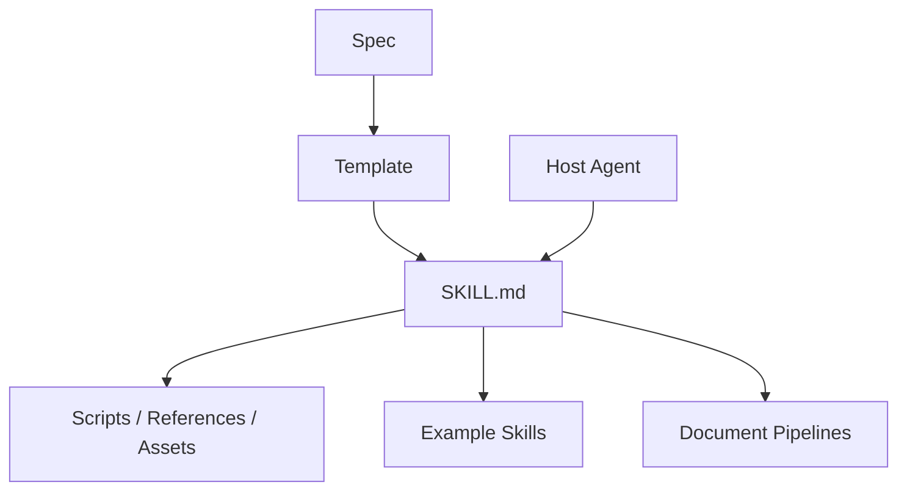

> 系列：[1. 全景](/writing/anthropic-skills-overview/)｜[2. 渐进加载](/writing/anthropic-skills-progressive-disclosure/)｜[3. 复杂产物](/writing/anthropic-skills-document-pipelines/)｜[4. 整体判断](/writing/anthropic-skills-synthesis/)

[`anthropics/skills`](https://github.com/anthropics/skills)同时包含 Agent Skills 规范、基础模板、示例 Skills 和用于文档生产的复杂能力。研究时必须区分这些层次，也要注意仓库明确说明：部分示例采用 Apache 2.0，而 docx、pdf、pptx、xlsx 等生产参考是 source-available，并非同一开源许可。

*图 1｜标准定义能力单元，宿主负责发现和运行，复杂 Skill 通过资源目录继续展开。*

第二篇研究渐进披露和触发描述，第三篇进入复杂文档工作流与验证。终篇判断一个 Markdown 目录何时具有真正的可移植性。

---

下一篇：[渐进加载](/writing/anthropic-skills-progressive-disclosure/)。

下一篇先回答万级 Skills 最关键的问题：模型在不加载全部正文时，怎样知道该选哪一个。
