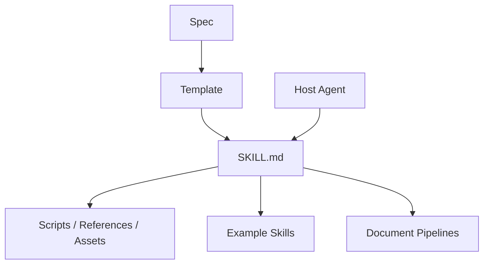
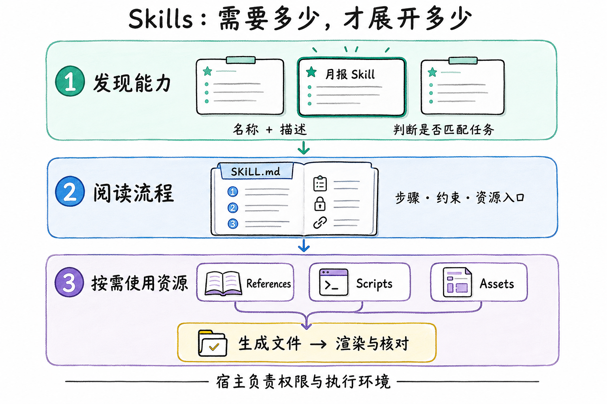

[`anthropics/skills`](https://github.com/anthropics/skills)同时包含 Agent Skills 规范、基础模板、示例 Skills 和用于文档生产的复杂能力。研究时必须区分这些层次，也要注意仓库明确说明：部分示例采用 Apache 2.0，而 docx、pdf、pptx、xlsx 等生产参考是 source-available，并非同一开源许可。

*图 1｜标准定义能力单元，宿主负责发现和运行，复杂 Skill 通过资源目录继续展开。*

## 从文档资源到执行管线

复杂 Skill 不能只告诉模型“生成一个文档”。它需要识别输入、选择工具、调用脚本、复用模板、生成文件、渲染预览并检查产物。SKILL.md 在这里更像工作流控制面，真正的确定性工作由脚本和格式库承担。

| 层 | 责任 |
| --- | --- |
| Instructions | 选择路径、说明约束 |
| References | 保存格式知识和检查清单 |
| Scripts | 执行可重复转换 |
| Assets | 模板、字体和示例资源 |
| Verification | 渲染、解析和视觉复核 |

对于文档生产类 Skill，验收对象是经过验证的文件产物。模型负责在不确定输入中做判断，脚本负责可重复操作，渲染检查负责把文件存在与文件可用区分开。

许可证同样属于能力边界。仓库公开可读不代表所有目录都可以任意再分发；Skill Marketplace 和团队安装器需要把来源、许可和第三方依赖纳入清单。

例如，用户要求把销售表生成可编辑的月报。Skill 说明先核对月份与字段，脚本生成文档，再渲染检查表格是否溢出；若总额不符，就回到原始数据核对。这个教学例子说明：说明文件负责组织步骤，脚本与产物检查提供执行证据，单独生成一份文件不足以验收。

## 渐进加载与上下文预算

Agent Skills 的关键不是 Markdown 格式，而是渐进披露。宿主先读取名称和描述参与能力发现；匹配任务后才加载 SKILL.md 正文；脚本、参考和资产又在正文指引下按需读取。这避免每次加载全部正文；名称与描述仍随目录规模增长，能力较多时还需要检索或分组路由。

描述因此是路由接口，不是营销文案。它需要同时写清“做什么”和“何时使用”，并与邻近 Skill 保持可区分。正文则应保存流程、边界和资源入口，避免把所有背景知识塞在第一层。

标准只定义可携带的能力单元，宿主仍决定发现目录、权限、脚本环境和递归规则。所谓可移植，首先是资产结构可理解，其次才是不同宿主行为完全一致。
