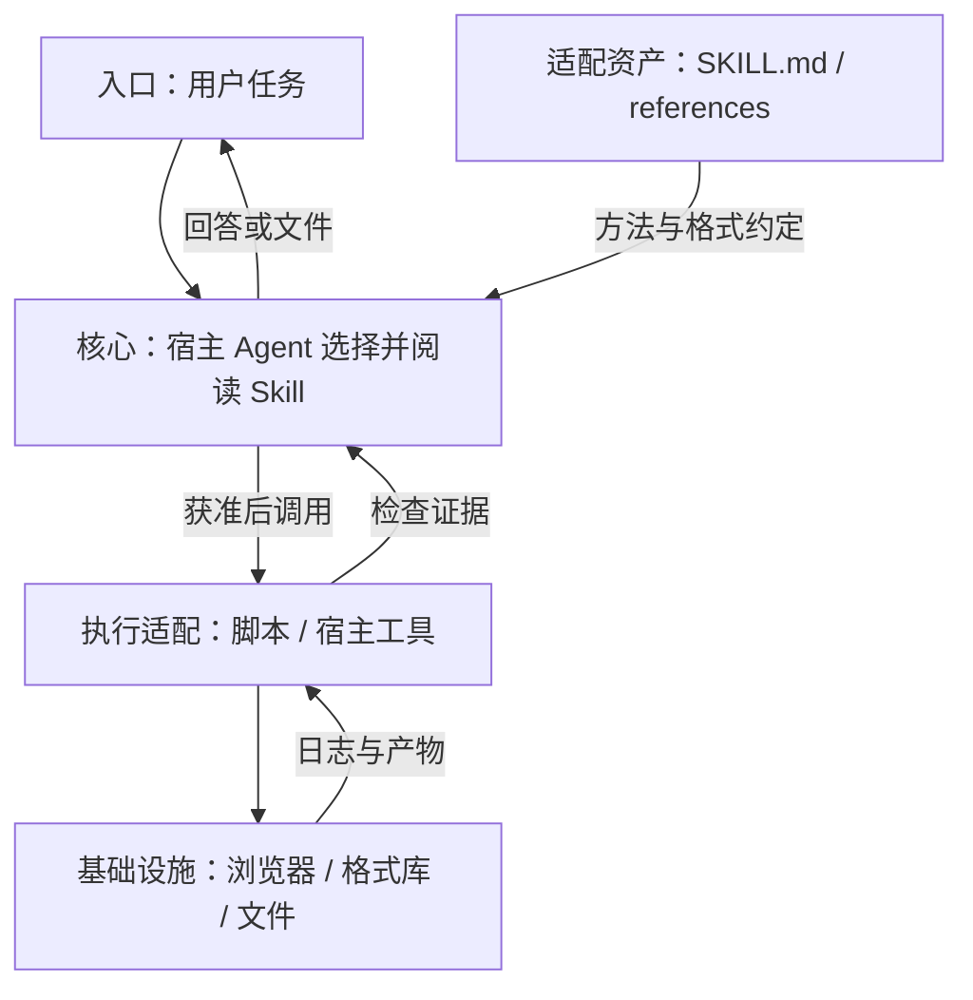
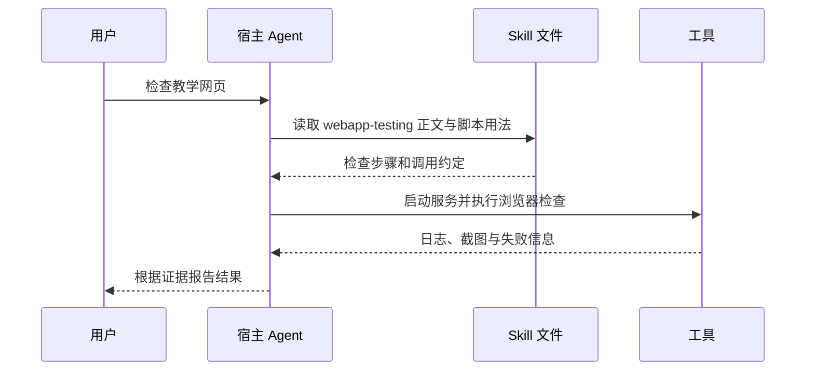

## 定位与价值

Anthropic Skills 是按需加载的任务方法与脚本资源库；相较把整份文档塞进系统提示词，宿主先读描述，选中后再读正文和所需资源。

适合复用文档制作、开发与检查方法；它不是独立 Agent Runtime，也不保证提示中的约束一定被执行。

研究基线：[anthropics/skills @ 41bbe19](https://github.com/anthropics/skills/blob/41bbe19d1a1a7eaab5e7bb9050a417e5c6cffc8f/README.md)；源码与社区核对日期为 2026-09-06。

## 技术架构



*图 1｜职责与数据流；逻辑分层不要求分开部署。*

## 核心机制



*图 2｜宿主读取 Skill 后执行工具；Skill 文件提供方法，不会自行发起工具调用。*

### 方法如何连接工具资源

复杂 Skill 不能只告诉模型“生成一个文档”。它需要识别输入、选择工具、调用脚本、复用模板、生成文件、渲染预览并检查产物。SKILL.md 在这里更像工作流控制面，真正的确定性工作由脚本和格式库承担。

| 层 | 责任 |
| --- | --- |
| Instructions | 选择路径、说明约束 |
| References | 保存格式知识和检查清单 |
| Scripts | 执行可重复转换 |
| Assets | 模板、字体和示例资源 |
| Verification | 渲染、解析和视觉复核 |

对于文档生产类 Skill，验收对象是经过验证的文件产物。模型负责在不确定输入中做判断，脚本负责可重复操作，渲染检查负责把文件存在与文件可用区分开。

许可证同样属于能力边界。仓库公开可读不代表所有目录都可以任意再分发；Skill Marketplace 和团队安装器需要把来源、许可和第三方依赖纳入清单。

例如，用户要求把销售表生成可编辑的月报。Skill 说明先核对月份与字段，脚本生成文档，再渲染检查表格是否溢出；若总额不符，就回到原始数据核对。这个教学例子说明：说明文件负责组织步骤，脚本与产物检查提供执行证据，单独生成一份文件不足以验收。


### 渐进加载怎样控制上下文

Agent Skills 的关键不是 Markdown 格式，而是渐进披露。宿主先读取名称和描述参与能力发现；匹配任务后才加载 SKILL.md 正文；脚本、参考和资产又在正文指引下按需读取。这避免每次加载全部正文；名称与描述仍随目录规模增长，能力较多时还需要检索或分组路由。


描述因此是路由接口，不是营销文案。它需要同时写清“做什么”和“何时使用”，并与邻近 Skill 保持可区分。正文则应保存流程、边界和资源入口，避免把所有背景知识塞在第一层。

标准只定义可携带的能力单元，宿主仍决定发现目录、权限、脚本环境和递归规则。所谓可移植，首先是资产结构可理解，其次才是不同宿主行为完全一致。

## 快速上手

需要已安装并登录的 Claude Code。这里运行的是技能安装流程；仓库本身没有独立模型循环。

```text
/plugin marketplace add anthropics/skills
/plugin install example-skills@anthropic-agent-skills
```

三个常用配置：

| 配置或安装选项 | 作用 |
| --- | --- |
| `name` | 技能标识，避免与已安装技能重名 |
| `description` | 描述适用任务，影响宿主发现与选择 |
| `license` | 声明该技能适用许可，不能只看仓库名称 |

其余选项见 [配置参考](https://github.com/anthropics/skills/blob/41bbe19d1a1a7eaab5e7bb9050a417e5c6cffc8f/README.md)。

常见坑：命令输入 Claude Code 会话而不是系统 Shell；安装后尝试“使用 webapp-testing 检查本地教学网页”，网页服务和浏览器依赖需先准备好。

验证范围：已核对固定源码的入口、参数与依赖；未以本文示例调用真实模型或部署外部服务。

## 生态与社区

截至 2026-09-06，2026-08-08 至 09-06 UTC 的抽样取得 7 条默认分支提交（上限 30 条）。见 [提交记录](https://github.com/anthropics/skills/commits/main/)。

Issue 取 08-08 至 08-30 UTC 创建的最近最多 3 条非 PR 条目，排除机器人和提问者自答；3 条中 0 条观察到维护者文字回复。 样本：[#1692](https://github.com/anthropics/skills/issues/1692)、[#1691](https://github.com/anthropics/skills/issues/1691)、[#1689](https://github.com/anthropics/skills/issues/1689)。小样本不代表 SLA，“未观察到”也不代表其他渠道无人处理。

许可按技能分别核对：[webapp-testing 的 Apache-2.0](https://github.com/anthropics/skills/blob/41bbe19d1a1a7eaab5e7bb9050a417e5c6cffc8f/skills/webapp-testing/LICENSE.txt) 与 [docx 的 source-available 条款](https://github.com/anthropics/skills/blob/41bbe19d1a1a7eaab5e7bb9050a417e5c6cffc8f/skills/docx/LICENSE.txt) 不同，不能给整个仓库统一贴 MIT 标签。

这是 Anthropic 维护的示例与文档技能库；能被其他宿主发现不等于每个脚本和权限约定都跨宿主兼容。

## 源码阅读路径

阅读顺序：入口 → 核心抽象 → 具体实现 → 测试。

| 顺序 | 目录 → 文件 | 函数、对象或检查重点 |
| --- | --- | --- |
| 1 | [.claude-plugin/marketplace.json](https://github.com/anthropics/skills/blob/41bbe19d1a1a7eaab5e7bb9050a417e5c6cffc8f/.claude-plugin/marketplace.json) | 市场声明：插件包含哪些资产 |
| 2 | [skills/webapp-testing/SKILL.md](https://github.com/anthropics/skills/blob/41bbe19d1a1a7eaab5e7bb9050a417e5c6cffc8f/skills/webapp-testing/SKILL.md) | 从任务说明进入测试方法 |
| 3 | [skills/webapp-testing/scripts/with_server.py](https://github.com/anthropics/skills/blob/41bbe19d1a1a7eaab5e7bb9050a417e5c6cffc8f/skills/webapp-testing/scripts/with_server.py) | main：带服务启动的命令执行 |
| 4 | [skills/skill-creator/scripts/quick_validate.py](https://github.com/anthropics/skills/blob/41bbe19d1a1a7eaab5e7bb9050a417e5c6cffc8f/skills/skill-creator/scripts/quick_validate.py) | validate_skill：结构校验，不是任务质量评测 |
