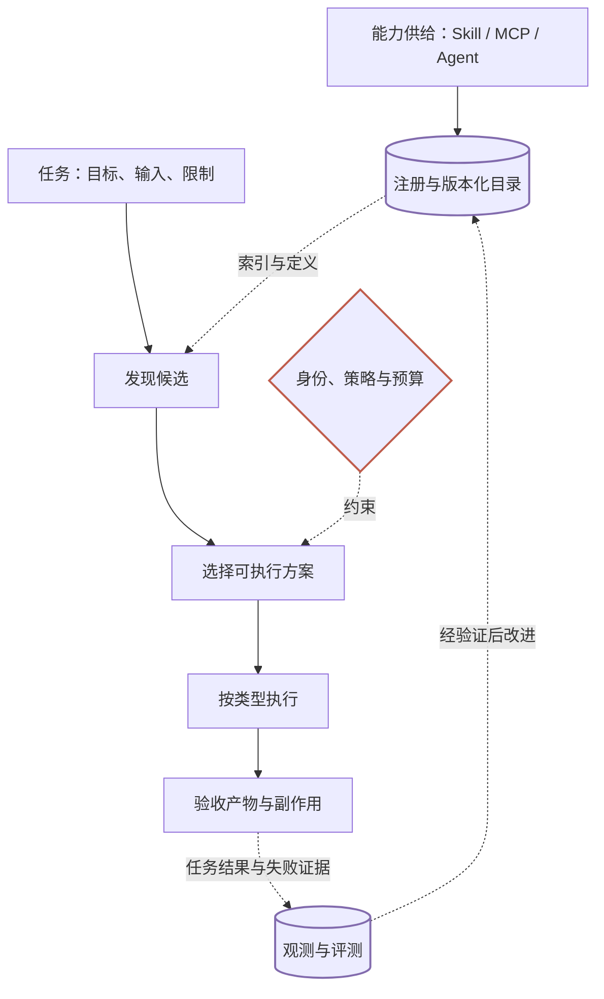

假设你给 Agent 接入了一万个能力，然后提出一个请求：

> 把上周的客户会议整理成飞书文档，先不要发群。

目录里有会议总结 Skill、飞书 MCP 工具，也有可以独立接手任务的会议助理 Agent。它应该如何选择？如果一个能力名字很相关，却要求上传客户资料或自动发群，系统又应在哪里拦住它？

这不是一个仅靠“更好的搜索”就能回答的问题。下面按发现、选择、执行和验证四项职责拆解架构：**能力路由究竟是在选工具，还是在决定如何完成任务？**

## 先辨认能力，再讨论路由

| 对象 | 本质 | 选中后的动作 |
| --- | --- | --- |
| Skill | 任务方法、说明和配套资源 | 当前 Agent 读取说明，按步骤做 |
| MCP Server | 通过 MCP 提供工具等能力的服务 | 连接并发现具体能力 |
| MCP Tool | 有参数定义的具体操作 | 校验参数并调用 |
| Agent | 可以接受委派的执行主体 | 交付任务，跟踪并验收结果 |

找到飞书 MCP Server，不等于已经选对“创建文档”工具；加载会议总结 Skill，也不等于把任务交给另一个 Agent。

因此，系统可以统一回答“有什么能力”，却必须分别处理“怎么使用”。发现、执行和评测都需要保留这条边界。

## 为什么需要一层能力路由？

小目录可以直接放进模型上下文。随着能力增长，目录成本、相似描述和执行差异会一起增加。

Agent Skills 规范已有渐进式披露：先展示名称和描述，匹配后再读取 `SKILL.md`，最后按需访问资源。[Agent Skills 规范](https://agentskills.io/specification)

但假设每个摘要平均 100 tokens，一万个摘要仍约需 100 万 tokens。这个容量估算说明：**到了大目录场景，连目录也需要先检索。**

于是，模型保留“搜索能力”“读取详情”等少量稳定入口；完整目录留在外部系统中。注意，万级条目不等于万级连接，更不等于万级并发任务。这三种规模需要分别验证。

## 先看一张全景图

*图 1｜圆柱表示目录或证据存储，菱形表示约束，矩形表示处理模块；实线表示主要推进关系，虚线表示信息支撑或反馈。策略同时适用于发现与执行，图中省略重复连线。这是参考架构，不是某个项目的部署拓扑。*

读图时先沿任务主路径从上往下走：

**任务理解**保留目标、输入和限制。“不要发群”与“创建文档”同样重要；客户范围未知时，应保留未知状态。

**发现候选**在允许发现的目录中检索。它负责找出可能合适的能力，不负责承诺任务一定能完成。

**选择方案**比较输入条件、依赖和预算。它可能选一个 Agent，也可能选 Skill 与多个工具的组合。

**执行与验收**读取说明、调用接口或委派任务，再检查实际产物。返回“成功”不等于文档内容和访问权限都正确。

目录和策略不只是旁边的两个盒子。前者提供版本化能力信息；后者贯穿检索可见性与执行授权。图中只保留一条策略连线，避免把所有跨层关系挤在一起。观测记录也应覆盖整条链路，而不是只在终点收集一个成功标记。

## 系统有两个不同的工作时机

理解这一区别，可以避免“每次请求都扫描一万个服务”的误区。

| 时机 | 主要工作 | 产物 |
| --- | --- | --- |
| 能力注册或更新时 | 验证来源、整理描述、保存版本、构建索引 | 可查询的能力目录与定义 |
| 用户请求到来时 | 过滤、检索、比较、加载、授权、执行 | 一次任务的方案与结果 |

前者是能力供给的准备过程，后者是运行时决策。已经批准的 MCP 服务可以缓存工具目录，不必每次重新连接全部服务；执行时仍要确认定义和权限有效。

统一目录也不意味着必须使用一个数据库。多个团队可以维护各自目录，通过受控同步或联邦发现提供统一入口。对外搜索本身也可能传出客户信息，因此不能默认向所有公共目录广播原始请求。

## 把开源项目放回架构里

看项目时，先问它补哪一层，而不是看它是否宣称“支持海量工具”。

| 职责 | 参考项目 | 不应混淆的边界 |
| --- | --- | --- |
| 能力格式与执行框架 | [Agent Skills](https://github.com/agentskills/agentskills)、[Deep Agents](https://github.com/langchain-ai/deepagents) | 定义与加载 Skill，不自动证明万级路由质量 |
| 注册与发现 | [MCP Registry](https://github.com/modelcontextprotocol/registry)、[ARD](https://github.com/ards-project/ard-spec) | 服务器目录或跨类型发现，不等于任务决策器 |
| 动态工具集合 | [BigTool](https://github.com/langchain-ai/langgraph-bigtool)、[FastMCP](https://gofastmcp.com/servers/transforms/tool-search) | 减少模型可见工具，不替代最终授权 |
| 运行与治理 | [ToolHive](https://github.com/stacklok/toolhive) | 托管、注册与网关能力，不是相关性算法 |

这些是不同层的实现线索，不是必须一起部署的套餐。本文按官方资料梳理逻辑职责，不声称它们已被联合部署或通过万级生产压测。

## 同一个任务，可能有两条合理路径

会议整理任务可以由当前 Agent 加载 Skill，配合会议读取和文档创建工具完成；也可以委派给具备必要能力的会议助理 Agent。

如果已有逐字稿、现有工具也齐备，第一条路径可能更直接。如果另一 Agent 有专长，位于允许的数据域，并能按要求交付，第二条也可能成立。一个无法关闭群发的工作流，则不满足任务限制。

此时，我们还不需要决定用哪种向量数据库。更重要的是看清：**相关性、可执行性、授权和结果质量，分别属于不同问题。**

配套提供[离线实验与阅读路线](https://github.com/MarkingYang/aidea-lab/tree/main/docs/capability-routing)。发现、执行与评测文章使用它验证局部机制；实验不连接飞书，不把模拟调用包装成真实业务效果。

能力描述和检索策略的实现见[发现与检索](/writing/capability-routing-discovery/)。
